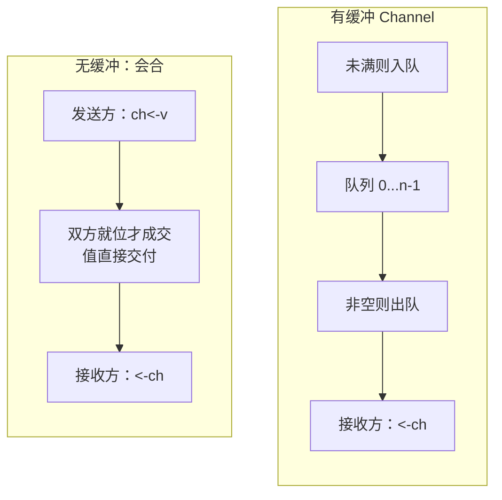

## 10.1 通道与CSP的工程化

CSP给了Go一个主张：进程之间不共享状态，只靠传递消息来协调（1.3）。这一节关心的是另一个问题：一门功能语言把这个主张落地，需要把通信做成什么样子，才能让普通程序员顺手用对。Go的答案是channel,
一个一等的同步兼通信原语。本节先把它在语言层面的模型讲清楚，它的类型，首发语法，有无缓冲两种语义，方向限定与nil行为，为后续各节升入运行时实现（10.2-10.7）铺好直觉。

### 10.1.1 把通信做成一等原语

不要以共享内存的方式通信，而是以通信的方式共享内存。这句格言常被引用，但是它在Go里面不是一句口号，而是由channel这个具体的语言构造兑现的。CSP的根源，它与1978年原始论文的异同，已在1.3交代，
这里不再重复，只接着说Go在工程上做了什么取舍。

把CSP的通信搬进一门通用语言，至少要回答三件事：通信经由什么载体，这个载体是否向普通值一样使用，它如何与类型系统咬合。Go给出的载体是channel,并且把它做成了一等（first-class）的：channel时
由类型的值，可以由make创建，用变量持有，作为参数传递给函数，作为返回值传出，存进结构体字段，放进slice或者map。这一点与Hoare原始CSP按进程名通信的设计不同（1.3.2）,也正是Go把抽象主张变为
可组合工具的关键：既然channel是值，把一个通信端口交给另一段代码就退化成了普通的传递参数，无任何特殊机制。

channel同时承担两件常被分开的事，同步与数据传递。一次收发既搬运了一个值，又在收发之间建立了一个发生序（happens-before）关系，后者保证了发送放在发送前写下的内存，接收方在接受后一定看得见。
换句话说，channel不仅是一根传值的管子，它还是同步原语。这条发生序保证channel能替代显式加锁的根基，其精确条文留待10.6与11.9展开，本节只需要记住：收发自带同步。

### 10.1.3 标层模型：从make到select

先用一组最小的代码把channel的表层API过一遍，建立操作直觉，细节在后续小结展开。

创建用make。无缓冲与有缓冲只差一个容量参数：

```go
ch := make(chan int) // 无缓冲：容量为0
buf := make(chan int, 8) // 有缓冲：容量为8
```

发送与接收都用箭头符号`<-`，箭头指向数据流动的方向：

```go
ch <- 42        // 发送：把42发送ch
v := <- 42      // 接收：从ch取一个值
```

接收还有一个双返回值形式，第二个布尔值ok用来区分收到一个真实的值与channel已关闭且缓冲已空，收到的是零值：

```go
v, ok := <-ch // ok == false 表示ch已经关闭且无更多数据
```

close关闭一个channel,宣告不会再有发送。关闭之后，已在缓冲中的值仍然可被接收，缓冲取空以后继续接收则立即返回零值与`ok == false`。关闭的完整语义（谁该关闭，向已关闭的channel发送或者重复
关闭会panic）留在10.4，这里值取其表层行为。

range在channel上迭代，返回接收直到关闭并取空，是消费一条数据流的惯用写法：

```go
for v := range ch { // 循环到ch关闭且缓存取空以后自动结束
    use(v)
}
```

select在多路通信间择一而行。它同时盯住若干收发操作，挑一个就绪的执行；若多个同事就绪，就随机选一个；若都不就绪，则阻塞，除非写了default分支：

```go
select {
case v:= <- int: // in可读则走这里
handle(v)
case out <- x: // out可写则走这里
x = next()
default:    // 上面都不就绪时立即返回，避免阻塞
    idle()
}
```

select是把CSP的守卫与选择指令的工程化产物，它的随机选择一，公平性与两轮加锁式线是10.5的主题。至此，channel的全部表层算符就是这几样：`make`,`<-`,`close`, `range`, `select`。接下来这几
节，逐一把其中容易用错的语义讲透。

### 10.1.3 无缓冲与有缓冲：会合还是排队

容量参数把channel分成语义迥异的两类，理解这条分界是用对channel的前提。

无缓冲channel(容量0)是一次会合（rendezvous）。发送方执行`ch <- v`时，若此刻没有接收方在等，发送方就地阻塞直到某个接收方执行`<- ch`与之配对；配对成功的那一刻，值直接从发送方交接到接收方，
两者才各自继续。接收先到也对称地阻塞等发送。于是无缓冲channel的一次成功收发，意味着收发双方在那一刻确实碰过头：发送返回时，便可确保值已被某个接收方收走。

```go
done := make(chan struct{})
go func() {
    work()
    done <- struct{}{} // 通知：我做完了
}()
<-done // 阻塞到上面那行执行，二者在此会合
```

有缓冲channel（容量n>0）是一个容量为n的有界队列。发送方执行`ch <- v`时，只要队列未满就直接把值放进队列，立即返回，不必等接收方到场；队列满了才阻塞。接收方从队头取值，队列空了才阻塞。这里关键
的差别在于：有缓冲发送返回时，值可能还躺在队列里面，接收方尚未取走。换来的是接收与发送在时间上解耦，代价是失去了发送返回即对方已收到这条会合保证。



何时用哪种，可以归到几条朴素的判断上。需要我做完，对方确认收到这类同步信号时候，用无缓冲，它的会合语义恰好就是握手，需要让生产者与消费者在节奏上解耦，削平突发，或者想给在途数据设置一个明确的上限，
用有缓冲，队列荣列就是这个上限。容量还相当一把信号用：`make(chan struct{}, k)`配合发送占位，接收释放，就限制了同时进行的并发数不超过k(10.7)。

需要警惕的是一种常见的误解，把缓冲当作免费的提速按钮。缓冲解耦的是时机，不是计算本身；它不会让工作量变少，反而引入新的问题：缓冲多大才合适，满了之后的背压如何处理，在途数据在崩溃如何交代。一个拍脑
袋设置成很大的缓冲，往往只是把何时阻塞推后，并把队列堆积的风险藏起来。容量是一个需要论证的设计参数，不是默认就该往大力调整的型号开关。

### 10.1.4 方向限定：让类型代为守约

channel类型可以带方向，把一个双向channel收窄为只发或只收：

```go
chan<- int // 只能发送
<-chan int // 只能接受
```

方向写在函数签名里面，是一种廉价而有力的API卫生手段。考虑一个生产者函数，它只该往channel里写，绝不该读，把参数声明称只发，编译器就能拦住任何误读：

```go
func produce(out chan<- int) { // out 只能发送
    for i ：= 0； i < 10; i++{
        out <- i
    }
    close(out) // 由生产者关闭，符合发送方负责关闭的约定
}

func consume(in <-chan int) { // in只能接收
    for v := range in {
        use(v)
    }
}
```

双向channel可以隐式赋值给单向类型，反之不行。于是惯用写法是：在一处用make造出双向channel，再把它分别只发，只收两种受限试图传给生产或者消费者。方向不改变运行时行为，它纯粹是编译期的约束，把
这一端只该发那一端只该收的意图写进类型，让违约再编译期而非运行时暴露。这也顺手把谁负责close这件容易出错的事情钉在了类型上：只有持有发送端的一方才有资格调用close，因为它对只收试图调用close根本
无法通过编译。

### 10.1.5 nil channel:永久阻塞的妙用

一个尚未make,值为nil的channel，对它收或者发都会永久阻塞：

```go
var ch chan int // nil channel
ch <- 1 // 永久阻塞
<-ch
```

孤立地看，这像是一个只会制造死锁的陷阱。但是放进select，他就成了一个干净的开关。select会忽略那些永远不会就绪的分支，而一个nil channel分支是永远不就绪。于是把某个case的channel设置为nil就
等于在运行时动态关掉这个分支，无需改动select结构。

这个技巧在读完一路输入后不在监听它的场景尤其顺手。下面的循环同时消费两路输入，莫一路关闭后，就把对应的channel变量设置为nil，从此select不在选中那条已经耗尽的分支，避免对已关闭的channel返回收到
零值的忙转：

```go
for in1 != nil || in2 != nil {
    select {
    case v, ok := <-in1:
        if !ok {
            in1 = nil // in1 耗尽，关掉这条分支
            continue
        }
        handle(v)

    case v, ok := <-in2:
        if !ok {
            in2 = nil // in2耗尽，关掉这条分支
            continue
        }
        handle(v)
    }
}
```

把nil channel的永久阻塞与select的忽略不就绪分支两条规则合起来，就得到一个表达力很强的惯用法。这也提示我们，channel的几条表层规则并非孤立，它们彼此组合才构成真正好用的工具，后续讲实现会返回见到
运行时如何精确兑现这些组合。
