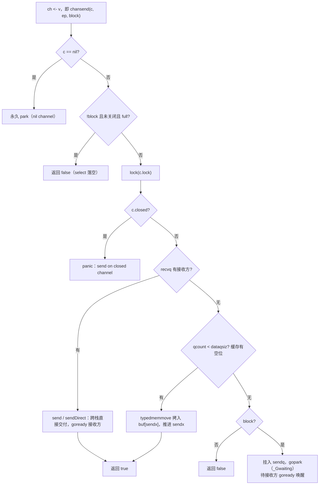

## 10.3 收发与直接传递

10.2把hchan这副骨架摆了出来：一把锁，一个环形缓存buf，外加发送方队列sendq与接收方队列recvq。这一节让骨架动起来，回答一次`ch <- v`与`v := <-ch`在运行时里面究竟发生了什么。读懂这条收发路
径，channel的两条最常被追问的性质，无缓冲channel为何是一次会合（rendezvous），为何对它而言接收发送在发送完成之前（11.9）,都会落到同一处机制上：直接传递（direct send/receive）。

收发的设计要同时满足三个约束。其一，正确：不能丢数据，不能让已关闭的channel吞下新值。其二，快：无竞争时收发应当只是拿锁，拷贝一次，放锁，热路径上连锁都尽量不碰。其三，公平：多个发送方或者接收方
阻塞在同一个channel上时，唤醒次序应当可预期（10.3.5）。下文先走通发送，再以对称的笔法带过接收，最后落到那处把二者统一起来的优化。

### 10.3.1 chansend的三分叉

先用一张可交互的图鉴里直觉：有缓冲channel是一条定长队列，发送方把值放进缓冲，接收从缓冲取走；缓冲满则发送方阻塞，缓冲空则接收方阻塞。可调用cap,或者手动收发。

编译器把 ch <- v翻译成chansend1，后者转调更通用的chansend。chansend的第三个参数block区分阻塞收发与selct里面的非阻塞分支（10.5）。剥去竞态检测，synctest气泡与统计代码，它的主干时一道
清晰的三叉决策：

```go
// chansend:向channnel发送ep指向的值（裁剪后速写）
func chansend(c *hchan, ep unsafe.Pointer, block bool) bool {
    if c == nil { // 向nil channel发送，永久阻塞
        if !block { return false }
        gopark(nil, nil, waitReasonChanSendNilChan, ...) // 不再返回
        throw("unreachable")
    }

    // 非阻塞快路径：不加锁就能判定的失败（详细见10.3.4)
    if !block && c.closed == 0 && full(c) {
        return false
    }

    lock(&c.lock)
    if c.closed != 0 { // 向已关闭channel发送： panic
        unlock(&c.lock)
        panic(plainError("send on closed channel"))
    }


    // 岔路一：recvq里面有等待的接收方 -> 直接传递，绕过buf
    if sg := c.recvq.dequeue(); sg != nil {
        send(c,sg,ep, func() { unlock(&c.lock) })
        return true
    }

    // 岔路二：缓存还有空位 -> 把值拷贝进环形buf
    if c.qcount < c.dataqsiz {
        qp := chanbuf(c, c.sendx)
        typedmemmove(c.elemtype,qp, ep) // 拷入buf的sendx槽
        c.sendx++
        if c.sendx == c.dataqsiz { c.sendx = 0 } // 环形回绕
        c.qcount++
        unlock(&c.lock)
        return true
    }

    //岔路三：无接收方。buf也满了 -> 把自己挂进去sendq并park
    //...见10.3.3
}
```

三岔的优先级本身就是设计：有等待的接收方时，永远优先直接交给它，哪怕是这个带缓存且缓存里面还有空位的channel。直觉上似乎该先填缓存，但只要recvq非空，就说明缓存此刻必然为空（否则接收方早就从缓存
取走了，不会阻塞）。于是绕过缓存直接交给不仅合法，还省下一次拷贝。这处优先级是下一节那个优化的前提。

岔路二是带缓存channel的常态：缓存未满时，发送退化为往`buf[sendx]`拷一份，推进sendx。sendx与接收侧de recvx一同把定长数组buf用作环形队列，sendx == dataqsiz时候绕回到0,这便是环形的全部
含义。

### 10.3.2 直接传递：省掉一进一出的那次拷贝

岔路一调用的send，是channel实现里面最值得细看的一段。它的核心是sendDirect:

```go
func send(c *hchan, sg *sudog, ep unsafe.Pointer, unlockf func()) {
    if sg.elem != nil {
        sendDirect(c.elemtype, sg, ep) // 直接拷贝到接收方栈上的槽
        sg.elem = nil
    }
    gp := sg.g
    unlockf()
    gp.param = unsafe.Pointer(sg)
    sg.success = true
    goready(gp, ...) // 再唤醒接收方（见9.4）
}

func sendDirect(t *_type, sg *sudog, src unsafe.Pointer) {
    // src在我的栈上，dst是另外一个Goroutine栈上的槽位
    dst := sg.elem
    typebitsBulkBarrier(t, uintptr(dst), uintptr(src), t.Siz_) // 写屏障
    memmove(dst, src, t.Size_) // 一次memmove，跨栈直达
}
```

阻塞在recvq里面的接收方，早先在自己的sudog上记下了请把值放到这个地址(sg.elem，指向它栈上的接收变量的槽)。发送方于是不经过buf,用一次memmove把数据从自己的栈槽直接搬到接收方的栈槽。这就是
direct handoff。

它省下了什么？对照经缓存的笨办法：发送方先把值拷进buf（进）,接收方醒来再从buf拷到自己的变量（出）,一进一出两次拷贝，外加缓存槽的占用与回收。direct handoff把这两次合成一次跨栈memmove。
代价是它必须在持有channel锁，且接收方处于`_Gwaiting`(9.3)尚未运行时进行，正因为接收方此刻没有在跑，没有用户态代码与这次跨栈写入竞争，直接写到别人的栈才是安全的。这里的typeBitsBulkBarrier
是必须的：跨栈写入含指针的值，要让垃圾回收器看见这次指针的转移。

一个容易忽略的次序：send先unlockf()解锁，再goready唤醒接收方。数据再解锁前就已拷贝完毕，因此被唤醒的接收方一睁眼，值就已经躺在他的变量里了，它无需再碰channel，直接返回即可。注意这里只是
把接收方标记为可运行并放回运行队列（9.4）,并不立即切换过去。

### 10.3.3 阻塞路径：挂进队列，等人代为完成

若即无等待的接收方，缓存也满（无缓存则是永远满，见下节full），发送方只能阻塞。它把自己包装成一个sudog挂进sendq，然后gopark让出CPU:

```go
// chansend岔路三：阻塞
gp := getg()
mysg := acquireSudog()
mysg.elem.set(ep) // 记下我要发送的值的这个地址
mysq.g = gp
mysq.c.set(c)
gp.waiting = mysq
c.sendq.enqueue(mysq) // 挂入发送等待队列
gp.parkingOnChan.Store(true)
// 让出，状态为_Gwaiting;chanparkcommit会在park后方式channel锁
gopark(chanparkcommit, unsafe.Pointer(&c.lock), waitReasonChanSend, ...)

// == 被某个接收方唤醒以后，这里继续==
KeepAlive(ep) // 确保值活到接收方拷贝为止
closed := !mysg.success // 醒来时若为success为假，说明被close唤醒
gp.waiting = nil
releaseSudog(mysg)
if closed {
    panic(plainError("send on closed channel"))
}
return true
```

注意这条路径的对偶之美：阻塞的发送方在mysg.elem里留下值在哪里。将来某个接收方走到自己的岔路一，会调用recv从这个sudog里把值取走（recvDirect），再goready把发送方唤醒。park与goready严格
配对：发送方因满而park再sendq，由接收方goready；接收方因空而park再recvq,由发送方goready。两端谁先到都行，后到的那个负责完成整桩交易并唤醒先到者。这正是9.4那套park/ready机制再cahnnel上
的具体落地。

gopark传入的chanparkcommit是一处关键的细节。Goroutine不能在持锁的状态下park（否则锁永不释放）,但又不能在park之前解锁（否则刚解锁，还没真正进入`_Gwaiting`时候被唤醒，会错乱）。解法是把
解锁推迟到已park成功之后由chanparkcommit执行，这是gopark的unlockf回调约定（9.4）。mysg.success这个布尔是发送方与唤醒方之间的暗号：正常被接收方完成时置真，被close唤醒时候为假，发送方
据此决定是正常返回还是panic。

把这条阻塞路径与前两条岔路合起来，chansend的全貌如下：



### 10.3.4 chanrecv与无缓冲channel的会合

接收`v := <-ch`(编译为chanrecv1)与`v,ok := <-ch`(chanrecv2)都转调chanrecv，它与chansend几乎是镜像的三岔，只多了已关闭且无数据则返回零值这一支：

```go
// chanrecv:从channel接收一个值（裁剪后的速写）
func chanrecv(c *hchan, ep unsafe.Pointer, block bool) (selected, received bool) {
    if c == nil { /* 同send：nil channel 永久阻塞*/ }

    // 非阻塞快路径：为就绪且未关闭，直接落空
    if !block && empty(c) {
        if atomic.Load(&c.closed) == 0 { return }
        if empty(c) { /* 已关闭且空：返回零值 */ }
    }

    lock(&c.lock)
    if c.closed != 0 && c.qcount == 0 { // 已关闭且无数据
        unlock(&c.lock)
        if ep != nil { typedmemclr(c.elemtype, ep) } // 写入零值
        return true, false // received == false
    }

    if sg := c.sendq.dequeue(); sg != nil { // 有等待的发送方
        recv(c, sg, ep, func() { unlock(&c.lock) })
        return true, true
    }
    if c.qcount > 0 { // 岔路二：缓存里面有数据
        qp := chanbuf(c, c.recvx)
        typedmemmove(c.elemtype, ep, qp) // 从buf[recvx]拷出
        typedmemclr(c.elemtype,qp) // 清空该槽，便于GC
        c.recvx++
        if c.recvx == c.dataqsiz { c.recvx = 0 }
        c.qcount--
        unlock(&c.lock)
        return true, true
    }
}
```

接收侧的recv把直接传递的对称性补全了。它要区分有无缓存：

```go
func recv(c *hchan, sg *sudog, ep unsafe.Pointer, unlockf func()) {
    if c.dataqsiz == 0 {
        // 无缓冲channel:直接从发送方栈拷贝到接收方
        if ep != nil {
            recvDirect(c.elemtype, sg, ep)
        }
    } else {
        // 有缓冲且缓冲满：对头出给接收方，发送方的值补充道队尾
        qp := chanbuf(c, c.recvx)
        if ep != nil { typedmemmove(c.elemtype, ep, qp) } // buf -> 接收方
        typedmemmove(c.elemtype, qp, sg.elem.get()) // 发送方 -> buf
        c.recvx++
        if c.recvx == c.dataqsize { c.recvx = 0 }
        c.sendx = c.recvx
    }
    sg.elem.set(nil)
    gp := sg.g
    unlockf()
    gp.param = unsafe.Pointer(sg)
    sg.success = true
    goready(gp, ...) // 唤醒被阻塞的发送方
}
```

无缓冲channel（dataqsiz == 0）走的是recvDirect，从发送方的栈槽一次memmove到接收方。它和发送侧的sendDirect是用一手法的两个方向，取决于收发双方谁先到达，谁阻塞在队列里面。带缓冲channel
在缓存满且有发送方排队时则上演一处巧思：把队头的值交给接收方，腾出的那个槽恰好用来收下排队发送方的值，一次出队顺带一次入队，环形队列严丝合缝地往前转了一格，没有任何空转。

无缓冲channel的本质至此清楚了：它的buf容量为零，full与empty都退化为对面队列是否有人。于是一次成功的收发必须有收发双方同时在场，要么发送方撞见排队的接收方（send/sendDirect），要么接收方
撞见排队的发送方（recv/recvDirect），先到的一方一律park等待。这就是会合：无缓冲channel不存储任何东西，它只在收发双方相遇的那一刻完成一次跨栈的值传递。

这也正面解释了内存模型（11.9）那条处看费解的规则：对无缓冲channel，一次接收发生在对应发送之前完成。原因就在代码里面，当接收方走recvDirect，或发送方走send/sendDirect时，值的拷贝与goready
都发生在先到的一方被唤醒，得以从chansend/chanrecv返回之前。换言之，阻塞的发送方要等到接收方把值取走，并将它goready之后才能继续往下走。代码里那个先后，正是内存模型那条happens-before的来源。

### 10.3.5 非阻塞快路径与一处内存序的讲究

select的default分支，以及带ok的非阻塞用法。都以block == false进入收发。它们有一条不加锁的提前退出：发送侧是`!block && c.closed == 0 && full(c)`，接收侧是`!block && empty(c)`。
full与empty各自只读一两个字：

```go
func full(c *chan) bool {
    if c.dataqsiz == 0 {
        return c.recvq.first == nil // 无缓冲：没有等待的接收方即为满
    }
    return c.qcount == c.datasiz // 有缓冲：缓存填满即为满
}
```

这条快路径上有一处对内存序的讲究，源码注释专门交代过。发送侧先读c.closed，再full(c)，先确认未关闭，再确认未就绪。关键论证是：一个已关闭的channel不可能再从不可发送变回可发送。因此两次
读之间的cahnnel恰好被关闭，也必然存在两次读之间的某一时刻，channel即未关闭，又不可发送，运行时就当作在那一刻观察到了channel，据此报告发送无法进行。正因为有这个单调性兜底，两次普通
读即便被处理器或编译器重排，结论依旧成立，于是这里不需要原子操作，省下热路径上的开销。前向进展不靠这两次读保证，而是依赖chanrecv,closechan在释放琐时产生的副作用，把本线程对c.closed与full
的视图刷新。这种用一处单调性换掉一个原子操作，是无锁快路径里面很典型的笔法（对照11.9对内存序的展开）

### 10.3.6 FIFO公平与一处历史教训

收发队列sendq/recvq时FIFO的：阻塞者从队尾入队，从队头出队，于是多个等待者按照到达次序被唤醒。这一点并非可有可无的实现细节。Go团队曾在issue#11506里面就channel是否应当保证FOFO唤醒展开过
讨论，结论是运行时实现却是维持先进先出，尽管语言规范本身并未把它写成强制承诺。对依赖唤醒次序的程序，这是一个需要留意的边界：可观察的FIFO是当前实现的行为，而非规范的保证。

把收发两侧合起来看，channel的运行时是一套相当紧凑的对称设计：一把锁串起来三岔决策，热路径上要么命中直接传递，要么命中环形缓存，冷路径才挂队列park：direct handoff用接收方未运行这一前提
换来省掉一进一出的拷贝；无缓冲channel不多时缓存容量为零的退化形态，会合语义与内存模型的那条happens-before都由此而来。性能的便宜从不白得：direct handoff的快，建立在park/ready
这套调度机制（9.4）已替换它把让谁先到一方等待，由厚道的一方完成安排妥当上。10.4接着讲关闭如何叫醒所有等待者，10.5的select则把这套单channel的收发，扩展到在多个channel同时守望的更难一层。
