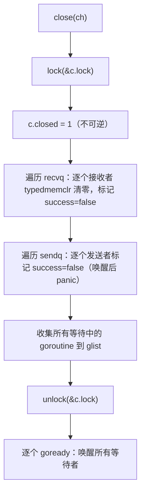

## 10.4 关闭的语义

前面几节里面，发送与接收都是一对一的会合：一次发送对上一次接收，多余的一方便阻塞等待。关闭时channel上唯一的一对多操作。close(ch)有一个Goroutine发出，却能在一瞬间唤醒所有正阻塞的这条channel
上的接收方，并让所有阻塞的发送方就地panic。这种一次广播，众人皆醒的能力，使关闭从一个看似不起眼的清理动作，变成了Go并发里最常用的取消与收尾机制。done channel模式，context的取消，根子都在这
里。

这一节回答三个问题：close在运行时究竟做了什么，为什么它能成为广播原语；从一条已经关闭的channel上接收会读取到什么，for range因何而终止；以及语言为关闭划下的三条panic红线，为什么它们宁可
当场崩溃，也不肯慢慢容错。

### 10.4.1 close做了什么：一次加锁广播

关闭的实现集中在runtime.closechan一个函数里面。它的骨架可以裁剪成三段：现在锁内置位closed，再把recvq与sendq上所有等待者一次摘下，装进一个本地链表，最后解锁，统一唤醒。下面是只保留设计
要点的速写：

```go
// closechan:关闭一条channel（速写，去掉竞态检测与synctext分支）
func closechan(c *hchan) {
    if c == nil {
        panic(plainError("close of nil channel")) // 红线一：close(nil)
    }
    lock(&c.lock)
    if c.closed != 0 {
        unlock(&c.lock)
        panic(plainError("close of closed channel")) // 红线二：重复关闭
    }
    c.closed = 1 // 置位，且不可逆
    var glist gList // 先收集，后唤醒：唤醒要在锁外面做

    // 唤醒所有接收者：每个都将拿到零值，ok == false
    for {
        sg := c.recvq.dequeue()
        if sg == nil {
            break
        }
        if sg.elem != nil {
            typedememclr(c.elemtype, sg.elem) // 把接收方的目标内存清零,即零值
            sg.elem = nil
        }
        gp := sg.g
        gp.param = unsafe.Pointer(sg)
        sg.success = false // 关闭标志：本次接收并非来自一次真正的发送
        glist.push(gp)
    }

    // 唤醒所有发送者：它们醒来后会panic
    for {
        sg := c.sendq.dequeue()
        if sg == nil {
            break
        }
        sq.elem = nil
        gp := sg.g
        gp.param = unsafe.Pointer(sg)
        sg.success = false
        glist.push(gp)
    }

    unlock(&c.lock)

    // 锁已释放， 再把整张表逐一交给调度器
    for !glist.empty() {
        gp := glist.pop()
        goready(gp, 3)
    }
}
```

有三处设计值得点出：

其一，closed时一次性的，不可逆的状态：一旦置为1，再无任何路径把它改回0。后文冲已关闭channel接收的快路径（10.3）正是建立在这个不变量之上，观察到已关闭便是一个永久成立的事实，无需担心它中途
又变会开放。

其二，recvq与sendq上的等待者被全部取出，而非像发送，接收那样只唤醒队首一个。这正是关闭的广播性所在：一条channel上可以同时阻塞成百上千个接收方，close一次把它们尽数唤醒。每个接收方的目标
内存被typedmemclr清零，这就是它们读到的零值，而sg.success = false标记这次唤醒并非源于一次配对的发送，接收方据此把第二个返回值置为false。

其三，先收集进glist,解锁，再统一goready。唤醒一个Goroutine要触及调度器，若在持有channel锁时候去goready，被唤醒者可能立刻在两一个P上跑起来，回头再争这把锁，徒增争用与持锁时长。把唤醒推
到锁外，是运行时里面反复出现的笔法。



发送方被唤醒后并不会真的发送数据。它在chansend阻塞点（10.3）醒来，检查到c.closed != 0而本次又非真正的发送（gp.param指示的sg.success为假），于是执行panic(plainError("send on
closed channel"))。换言之，向已关闭channel发送会panic这条规则，对正阻塞的发送方，是由closechan唤醒，再由发送方自己在醒来处兑现的。

### 10.4.2 关闭作为广播：done channel与取消

理解了closechan一次唤醒全部接收者，就理解了Go最惯用的取消模式。考虑一个done channel：它从不承载有意义的数据，只承载关闭这一事件。

```go
done := make(chan struct{})
// 多个worker同时阻塞在同一条done上
for i := 0; i < n; i++ {
    go func() {
        select {
        case <-done: // 收到关闭信号，收尾退出
            return
        case task := <-tasks:
            handle(task)
        }
    }()
}

// 主Goroutine一次close，n个worker同时被唤醒
close(done)
```

这里的chan struct{}的元素类型零宽，不占缓存，它纯粹被当作信号线使用。close(done)触发closechan的广播：所有阻塞在<-done上的workder被一并唤醒，各自读到零值后退出。若改用发送来通知，发一次
只能叫醒一个worker，要唤醒n个就得发n次，且必须知道n。关闭把这件事变成了O(1)的一次广播，且无需知道接收方的数量。

这正是context取消（11.8）的底层机制。context.WithCancel内部持有一个done channel,cancel()的核心动作就是close(done),一次关闭，整棵context树上所有监听ctx.Done()的Goroutine同时收到
取消信号。可以说，context时给donw channel模式加上数形传播与原因记录的一层封装，而广播的能力，完全来此close本身。

### 10.4.3 从已关闭channel接收：先排空，再零值

广播之外，关闭对接收还有一层语义，它与缓冲数据的处理顺序密切相关：关闭并不丢失尚未被取走的缓冲数据。接收方从一条关闭channel读取时，先把缓冲区里面剩下的值依次取完，之后才可以反复返回零值。

接收的处理顺序（10.3）保证了这一点。chanrecv在锁内的第一道判断时已关闭且缓冲为空，只有两者同时成立才立刻返回零值；若缓冲里面还有数据，控制流便落到后面缓冲非空则出队的分支，照常把数据取走。于是
关闭后的接收呈现两个阶段：

```go
ch := make(chan int, 3)
ch <- 1
ch <- 2
close(ch)

fmt.Println(<-ch) // 1 缓冲仍有数据，照常取出
fmt.Println(<-ch) // 2 取出第二个
v, ok := <-ch // 0, false 缓冲排空，此后恒为零
v, ok := <-ch // 0, false 可反复读取，永不阻塞
```

两个语义合在一起，for range的种植条件就清楚了。for v := range ch由编译器（10.3）翻译为一个循环，每轮以v, ok := <-ch取值，ok为false时退出。对照上面两个阶段：channel关闭前，循环照常
取值并在无数据时候阻塞；关闭后，循环先读取所有缓冲数据，待排空空后次接收返回 ok == false，循环随即结束。关闭是for range唯一干净的终止信号，不关闭的channel上的range会在数据耗尽以后永久
阻塞。

第二个返回值ok的意义在这里也彻底明确：他回答的不是有没有读取到的值，而是这个值是否来自一次真正的发送。ok == true表示值来自配对的发送或者缓冲；ok == false表示channel已关闭且无更多数据，
读到的是零值。

从内存模型（11.9）的角度，关闭还提供一条happens-before保证：close(ch)发生在因channel关闭而返回零值的接收之前。因此done channel不仅传递取消这一信号，还能安全地发布信号之前写入共享
数据，关闭前的写入，对收到关闭信号后的读取可见。这是done channel能用作同步点的根据。

### 10.4.4 三条panic红线与fail-fast

关闭是channel操作里面panic最密集的一处。语言为它画下了三条红线，任意一条被触碰，程序当场崩溃：

| 误用                  | 触发点                       | panic信息               |
| --------------------- | ---------------------------- | ----------------------- |
| 向已关闭的channel发送 | chansend检测到c.closed != 0  | send on closed channel  |
| 重复关闭              | closechan检测到c.closed != 0 | close of closed channel |
| 关闭nil channel       | closechan入口 c == nil       | close of nil channel    |

这三条都选择了fail-fast，立刻panic,而非返回错误或者静默忽略。这是一个值得说清的设计取舍。把它们做成可恢复的错误，初看更友好，时则会把一个本质上的逻辑错误埋得更深。

向已关闭channel发送，以及重复关闭，几乎总以为这所有权的混乱：发送方与关闭方对这条channel此刻是否还该被写，该由谁收尾产生了分歧。这列错误若被吞掉，数据可能悄无声息地丢失，或留下一条已死
却仍然被写入的channel，故障现场会漂移到远离根因的地方，徒增调试成本。当前panic则把错误订在第一案发现场，栈回溯直指那次非法的close或者send。

关闭nil channel同理。一条nil channel的发送与接收都将永久阻塞（10.3）,对它调用close多半是变量忘了初始化。这种错误没有任何合理的容错语义可言。唯一正确的处置就是尽早暴露。

至于这三条为何不能用recover干净地兜住：send on closed channel的panic发生在数据已经准备好，却发现无处可送的半途，channel的内部状态此刻并不适合调用方假装无事发生地继续。Go的立场一以贯之，
channel的误用就是程序员的逻辑错误，应在开发期被-race与测试逼出来，而非在生产期靠recover续命。

### 10.4.5 所有权规则：发送方关闭，接收方不关

三条红线落到工程实践，凝结成一条朴素却极有效的约定：由发送方关闭channel，接收方永远不关闭；当存在多个发送方时候，没有任何一个发送方可以独自关闭。这条规则不是运行时强制的，而是从上面的语义里面
自然推导出来的纪律。

为什么发送方关闭？因为不再有数据要发这件事。只有发送方知道。接收方无从判断对端是否已经发完，它若贸然关闭，正在发送的一方就会撞上send on closed channel而崩溃（红线一）。反过来，发送方关闭
则恰好向接收方广播了到此为止，与for range的终止语义严丝合缝。

多发送方的情形更棘手。此时无论那个发送方来关闭，都可能在别的发送方仍在写时触发红线一，或者与另一个发送方的关闭撞上红线二。正确的做法是不让任何发送方关闭数据channel,转而引入一条独立的done
channel由协调者关闭，发送方在每次发送之前select检查done是否已经关闭，据此决定停手。这恰好回到10.4.2的广播模式：数据channel负责传值，done channel负责传停，两者各司其职。

把这几条纪律和前面几节连起来：发送（10.3），接收（10.3）刻画的是一对一的会合，select(10.3)让一个Goroutine同时守望多条channel，而关闭，是吧我这边结束了这件事情，一次广播给所有还在等待的人。
三者合起来，才凑齐了Go以channel编织并发的全部基本词汇。
