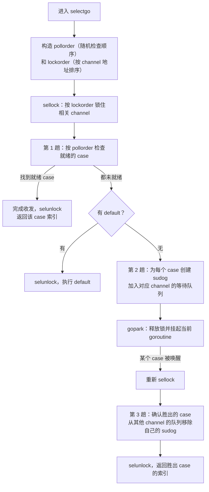

## 10.5 select的实现

前几节把单个channel的收发（10.3）讲清楚了。可现实里的Goroutine往往不盯着一条channel：它要在多个收发操作中，先对就绪的那个作出反应，还要能在一个都没就绪时不被阻塞。select正是为此而生。它的语
义看似简单，落实到实现上却要同时解决两个棘手的问题：多个就绪分支时如何公平地选择一个，以及为执行一次select而锁住多条channel时如何不死锁。这两点决定了selectgo的全部结构，本节就围绕它们展开。

```go
select {
case v := <-ch1: // ch1可接收时执行
    use(v)
case ch2 <- v: // ch2可发送时执行
    sent()
default:
    nonblocking()
}
```

约定摆在前面。每个case描述一个channel操作（收或发）,select求值后至多执行一个case通信。若有多个case同时就绪，从中等概率随机挑一个；若都未就绪，有default则执行default(这条整条select变成阻
塞)，无default则阻塞，知道某个case就绪。语言规范(Select statements)把这套语义钉死，运行时负责兑现，编译器负责把source形态翻译成运行时消化的数据。

### 10.5.1 编译器的下沉：把简单情形挑出去

并非每条select都值得走那套完整的机制。编译器walk阶段（cmd/compile/internal/walk/select.go）先按规模把几类别退化情形单独翻译，剩下的才交给通用selectgo:

- 零case(select{}):永久阻塞。直接翻译成runtime.block()，它gopark当前Goroutine且永不唤醒。
- 单case（select {case ...},无default）：等价于把那个channel操作裸写一遍。直接下沉为一次普通的发送或者接收,不进selectgo。
- 单case加default（恰两个case，其一为default）：这是非阻塞收发的惯用法。翻译一次if,调用selectnbsend或selectnbrecv，二者不过是把chansend/chanrecv的block参数置为false的薄封装。

```go
// 编译器对"select { case ch<-v:...；default: ...}"的下沉(示意)
if selectnbsend(ch, &v) { /* case 体 */ } else { /* default 体 */ }

// runtime/chan.go：非阻塞发送只是 block = false的chansend
func selectnbsend(c *hchan, elem unsafe.Pointer) (selected bool) {
    return chansend(c, elem, false)
}
```

这层下沉的意义在于：日常代码出现最多的select，恰是单case加default这类非阻塞探测，把它们挡在了selectgo之外，省去了构造case数组，计算两套次序，加锁全部channel开销。只有两个以上真实通信分支
select，才真正进入下一节的机制。需要补充一句：即便源码里面写了很多case,若运行时大多channel被置为nil(nil channel的case永不就绪，等同于不存在),通用代码也照样正确处理，因此编译器不再为碰巧
只剩下一两个有效case另设路径。

### 10.5.2 两套次序：selectgo的数据结构

```go
type scase struct {
    c *hchan // 本case操作channel
    elem unsafe.Pointer // 发送的数据地址，或者接收的落点地址
}
```

发送还是接收，不再用字段标记，而是用位置编码：编译器把所有发送case排在数组前段，接收case排在后段，`selectgo(cas0,order0,pc0,nsends,nrecvs,block)`用nsends/nrecvs即发送，否则即接收。
这省掉了每个case的一个kind字段。

真正的机关在那个order0数组，它长2\*ncases，被切成两段，承载select的两条核心不变量：

```go
ncases := nsends + nrecvs
scases := cas1[:ncases:ncases]
pollorder := order1[:ncases:ncases] // 轮训次序：决定“先看哪个case是否就绪”
lockorder := order1[ncases:][:ncases:ncases] // 加锁次序：决定”按什么顺序锁channel“
```

pollorder服务公平性,lockorder服务无死锁。它们解决的是两个正交的问题，因此用两套独立的次序。下面分别看它们如何构造。

### 10.5.3 pollorder:随机轮询带来公平

若selecto总按源码书写顺序检查各case,那么当多个case持续就绪时，靠前的case会被长期偏袒,考后的可能饿死。规范要求的等概率随机选择一个，正是为杜绝这种偏袒。实现的办法是：在检查就绪之前，先把case
的检查顺序随机打乱，于是第一个被发现就绪的case对所有case是均匀的。

打乱用的是原地Fisher-Yates洗牌，随机源是cheaprandn(每M自带，无锁的廉价随机数)：

```go
// 构造pollorder：Fisher-Yates原地洗牌（裁剪）
norder := 0
for i := range scases {
    cas := &scases[i]
    if cas.c == nil { // nil channel的case永不就绪，踢出轮询
        cas.elem = nil
        continue
    }
    j := cheaprandn(uint32(norder + 1)) // [0, norder]内均匀取一个位置
    pollorder[norder] = pollerder[j]
    pollorder[j] = uint16(i)
    norder++
}
pollorder = pollorder[:norder]
```

Fisher-Yates的正确性是经典结论：它产出全部n!中排列且每种等概率，单趟O(n)，无需额外空间。把它接在cheaprandn上，select的公平性便有了底，每个就绪case被选中的概率相等。这里有一处工程细节值得
点出：随机源用的是cheaprandn而非加密级随机，因为此处处要的是统计意义上的均匀，不需要抗预测，廉价才是对它的取舍。

> 一段历史。select的公平性并非凭空写就，而是被一个真实的工程问题逼出来。早年issue golang/go#21806讨论过：在某些负载下，用户观察到select的分支选择呈现可感知的偏斜，进而推进社区把随机化轮询
> 这一点即写进规范描述，也固化进实现。今天我们读取到的cheaprandn加Fisher-Yates，是这条公平性的约束落地。

### 10.5.4 lockorder:全局一致的加锁次序避免死锁

执行一次select，运行时要同时持有所有涉及channel的锁：要逐个检查它们是否就绪,又可能要把自己挂到每条channel的等待队列上，这些都要在持锁下进行。多把锁一旦涉及，死锁的幽灵就来了。设Goroutine A
执行`select {case <- x: ; case <- y:}`，B执行`select {case <-y:; case <-x:}`,若各自按照书写顺序加锁，A锁住x等y,B锁住y等x,便是教科书的交叉死锁。

破解之道是并发编程的老办法：为所有锁规定一个全局统一的获取顺序，谁都按照这个顺序加锁。只要所有Goroutine锁x,y的先后一致，环形等待就不可能成立。selectgo选channel的地址做这个全局键(sortkey
即指针值)，把case按照channel地址排序，得到lockorder:

```go
func (c *hchan) sortkey() uintptr {
    return uintptr(unsafe.Pointer(c)) // 用channel的地址做全局序的键
}
```

排序用堆排序而非sort包，理由很实在：select的所有数据都在Goroutine栈上，堆排序保证O(nlogn)时间且栈空间占用恒定，不会因递归或者额外让这条应该轻量的路径变重。排序从pollorder出发（这样同一条
channel上的多个case顺带被稳定地聚集到一起）,堆化后落进lockorder:

```go
// 以channel地址为键,对case做原地堆排序，得到全局一致的加锁顺序（裁剪)
for i := range lockorder {
    j := i
    c := scases[pollorder[i]].c
    for j > 0 && scases[lockorder[(j-1)/2]].c.cortkey() < s.sortkey() {
        k := (j - 1)/2
        lockorder[j] = lockorder[k]
        j = k
    }
    lockorder[j] = pollorder[i]
}
for i := len(lockorder) -1; i >= 0; i-- { // 逐个弹出栈顶，得到有序序列
    // ... 标准堆下沉，按照dortkey比较 ...
}
```

加锁与解锁就照着lockorder走，sellock顺序加，selunlock逆序解,且对同一条channel（多个case可能用一条）只加解一次：

```go
func sellock(scases []scase, lockorder []uint16) {
    var c *hchan
    for _, o := range lockorder {
        c0 := scases[o].c
        if c0 != c { c = c0; lock(&c.lock) } // 相邻同channel不重复加锁
    }
}
```

至此两套次序的分工清楚了：pollorder决定看的顺序（求公平）,lockorder决定锁的顺序(求无死锁)。两者互不干扰，这正是用两个数组而非一个的原因。

### 10.5.5 完整扫描：三次扫描

数据备齐全,selectgo的主体是对case的三趟处理。先看全景：



第一趟：找现成的就绪case。持锁以后按照pollorder逐个检查。接收case看对端发送队列有无等待者，缓冲区有无数据，是否已关闭；发送case看是否已关闭（向关闭的channel发送要panic），对端接收队列
有无等待者，缓冲区有无空位。一旦命中，跳到对应分支完成收发（直接配对，走缓冲，或者关闭的零值），解锁返回。这一趟命中,select就以一次同步收发收场，没有任何阻塞。

```go
// pass 1 - 按照随机的pollorder找一个已就绪的case(裁剪)
for _, casei := range pollorer {
    casi = int(casei); cas = &cases[casi]; c = cas.c
    if casi >= nsends {
        if sg := c.sendq.dequeue(); sg != nil { goto recv }
        if c.qcount > 0 { goto bufrecv }
        if c.closed != 0 { goto rclose }
    } else { // 发送case
        if c.closed != 0 { goto sclose }
        if sg := c.recvq.dequeue(); sg != nil { goto send }
        if c.qcount < c.dataqsiz { goto bufsend }
    }
}

if !block { // 没有就绪，且带default（block == false)
    selunlock(scases, lockorder)
    casi = -1, goto retc
}
```

default在这里以block == false的形式出现：编译器把default的存在编码为block参数。第一让无人就绪的时，若block为假，立即解锁返回-1（调用方据此走default体），select由此成为非阻塞操作。

第二趟：挂在每一条channel上。无case就绪又必须阻塞，此时不能只等一条channel，要在每条channel上都留一个我在等的凭据，这样任何一条线就绪都能把本Goroutine唤醒。做法是为每个case取一个sudog,
置isSelect = true，按lockorder串成本Goroutine的waiting链条，并分别入队到各channel的收发等待队列。

```go
// pass 2 - 在所有channel上入队sudog（裁剪）
nextp = &gp.waiting
for _, casei := range lockorder {
    casi = int(casei); cas = &cases[casi]; c = cas.c
    sg := acquireSudog()
    sg.g = gp
    sg.isSelet = true // 标记：这是select挂出等待者
    sg.elem.set(cas.elem)
    sg.c.set(c)
    *nextp = sg; nextp = &sg.waitlink // 按lockorder串成gp.waiting链
    if casi < nsends { c.sendq.enqueue(sg) } else { c.recvq.enqueue(sg) }
}
gp.param = nil
gopark(selparkcommit, nil, waitReason, traceBlockSelect, 1)
```

isSelect这个标记不可省。一个普通收发sudog只挂在一条channel上，唤醒它的一方可以直接把它摘走；而select的sudog同时挂在多条channel上，唤醒方必须知道这个等待者属于哪一个select,它可能正被别的
channel同时争取，从而用CAS的方式去认领（通过gp.selectDone），保证一场select只被唯一一条channel成功唤醒。gopark交出的selparkcommit,会沿着已按lockorder排好的gp.waiting链把所有
channel锁逐一解开，再让Goroutine真正休眠。这里顺序与lockorder一致，正是为了和别处的加锁次序对齐，不在解锁路径上引入新的环。

第三趟：醒来后清理战场。某条channel就绪并唤醒本Goroutine。它重新sellock锁回全部channel，然后沿着lockorder遍历：唤醒自己的那条channel上，自己的sudog已被堆上摘除（认出它，记为命中case）；
其余每条channel上，自己的sudog还赖着，必须用dequeueSudoG一一摘除，否则会污染那些安静channel的等待队列。逐个releaseSudog归还，解锁，返回命中case索引。

```go
// pass 3 - 醒来后，从未命中的channel队列里面摘除自己（裁剪）
sg = (*sudog)(gp.param) // 唤醒方通过gp.param告知哪个是sudog
sglist = gp.waiting; gp.waiting = nil
for _, casei := range lockorder {
    if sg == sglist { // 这就是唤醒我的那个case
        casi = int(casei); cas = &scases[casi]
    } else {
        c. = scases[casei].c
        if int(casei) < nsends { c.sendq.dequeueSudoG(sglist)} else { c.recvq.dequeueSudoG(sglist) }
    }
    sgnext = sglist.waitlink; sglist.waitlink = nil
    releaseSudog(sglist); sglist = sgnext
}
```

三趟合起来，就是select阻塞语义的全部：第一趟抓现成的，没有第二趟就全挂上去睡，醒来第三趟把多挂的撤干净，只认领唤醒自己的那一个。reflect.Select(reflect_rselect)走的是同一个selectgo，
只是在外面把反射描述的case翻成数组而已。

### 10.5.6 设计取舍与谱系

把selectgo的几处选择并排看，每一处都是一笔明账。

- 两套次序而非一套。公平（轮询随机）与安全（加锁有序）时正交诉求，强行合一只会相互牵制。用pollorder与lockorder两个数组分担，代价是多一段ncases的栈空间，换来的是两个问题各自最干净的解法。
- 地址作全局锁序。拿指针当排序键，简单到几乎取巧，恰好满足全局一致这唯一要求。他不要channel之间有任何语义上的先后，只要所有Goroutine看到的是同一个序。这与按照固定顺序获取多把锁的经典防止
  死锁的手法同源，在数据库的两阶段锁，内核的锁排序里面都能见到它的影子。
- 堆排序而非通用排序。为的是恒定栈与确定的O(nlogn)，是热路径上对分配与栈深度斤斤计较的又一例，与分配器里对缓存的计较（12.2）是同一种工程性格。
- isSelect加CAS认领。select的sudog一对多，引入了同一等待者被多方争抢的新竞争，靠isSelect标记与gp.selectDone的原子认领化解，保证一场select只成交一次。这点复杂度，是等待多条channel
  这个能力本身的必要成本。

放进谱系看，select是CSP理论里守护命令（guarded command）的直系后裔。Hoare 1978年的CSP（10.1）里，进程用一组带守卫的通信构成选择，由选择指令在就绪的守卫中挑一个推进，Dijkstra更早的
收尾命令（1975）则把这种多个候选，择一执行的不确定性抽象成了语言构造，被Go明确为等概率随机，并用cheaprandn加Fisher-Yates兑现。Occam.Newsqueak(Go并发模型的近亲)等语言里面的同类构造，
选的也是这条路。可见select不是凭空设计，而是把一把四十余年的理论线，按工程的尺度收束车成今天这几百行select.go。
