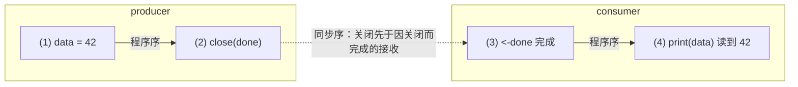

## 10.6 内存模型与无锁演进

前面几节把channel拆到了零件：10.3的直接交付（direct handoff）让收发两端绕不过环形缓冲直接传值，10.5的select在多个就绪分支间做随机选择。这些机制解释了channel怎么跑。本节回答两个更上
层的问题：channel给并发程序提供了什么可见性承诺，以及一个常被追问的工程疑案，channel为什么至今仍是一把锁加一个队列，而不是传说中更快的无锁结构。前者把channel接回11.9的内存模型，后者则
是一则关于正确性与可维护性如何压过峰值性能的真实取舍。

### 10.6.1 channel的内存模型承诺

channel不只是穿数据的管子，它同时是建立happens-before的同步点。11.9给出了Go内存模型的全貌，这里把其中与channel相关的四条规则单独拎出，逐条读懂它们的含义。Go内存模型对channel的规定如下，
我们沿用1.19修订后的术语snchronized before(同步优先，记作<)：

1. 一次同步先于对应接收的完成。对任意channel（无论是否带缓冲）均成立。
2. close(ch)同步先于一个因channel关闭而返回零值的接收。
3. 对无缓冲channel，一次接收同步先于对应发送完成。
4. 对容量为C的缓冲channel，第k次接收同步先于先于k+C次发送完成。

第一条最朴素的直觉：把数据放进channel之前的所有写入，接收方在拿到这份数据之后都能看见。这正是不要共享内存来通信，而要用通信来共享内存这句格言的形式化基础。一段最小的例子：

```go
var data int
var done = make(chan struct{})
func producer() {
    data = 42 // （1）普通写
    close(done) // (2)关闭即一次同步
}

func consumer() {
    <-done      // (3)接收完成
    print(data) // (4)保证读到42
}
```

(1)sequenced before(2),由规则2，（2）synchronized before(3),(3)sequenced before(4)，三段拼接的传递闭包给出(1)<(4),于是（4）必然读到(4)必然读到42。这条链画出来，跨goroutine
的那一步（close同步先于接收）正是把两条程序粘起来的关键边：



没有这条channel规则，（1）与（4）之间只剩下数据竞争，11.9.1那段会打印0的程序是反例。

### 10.6.2 无缓冲收发的倒置：发送即回执

第3条规则容易被忽略，确实无缓冲channel语义的精髓。注意它把方向倒了过来：对带缓冲channel，是发送先于接收完成的；对无缓冲channel，接收先于发送的完成。

这条倒置直接对应10.3讲的直接交付。无缓冲channel没有缓冲槽，发送方必须等到一个接收方就绪，把值直接交到它手上，发送操作才算完成。因此发送返回这一件事，恰恰证明已经有人收到了。无缓冲发送由此具备了
回执（acknowledgement）的语义：

```go
ch := make(chan struct{}) // 无缓冲

go func() {
    doWork()
    ch <- struct{}{} // 发送：要等对面收下才返回
}()

<-ch // 接收：此刻可断定doWrok已经完成且其写入可见
useResult()
```

规则3保证<-ch（接收）同步先于`ch <- struct{}{}`的完成，而后者又sequenced after doWork()。读者由此得到一个比数据已经送达更强的结论：发送方走到了发送点之后。带缓冲channel给不了这个
保证，发送可能只是把值塞进缓冲就返回，接收方未必已经动作。无缓冲于带缓冲的真正分野不在能不能缓冲一个值，而在这条可见性方向的倒置。

### 10.6.3 缓冲channel作为信号量

第4条规则，第k次接收同步先于k+c次发送的完成，处看抽象，它其实是缓冲channel计数信号量这一惯用法的形式根据。把规则反过来读：第k+C次发送要想完成，必须等到第k次接收先发生。也就是说，缓冲里面最多
容纳C个未接收的值，第C+1个发送会阻塞，直到有人取走腾出一个位置。容量C恰好是同时在途的上限。

这正是用一个chan struct{}把并发度限制在C的经典写法：

```go
func bounded(tasks []Task, C int) {
    sem := make(chan struct{}, C) // 容量为C的缓冲channel充当信号量
    var wg syncWaitGroup
    for _, t := range tasks {
        sem <- struct{}{} // 获取令牌：第C+1个发送会在此阻塞
        wg.Add(1)
        go func(t Task) {
            defer wg.Done()
            defer func() { <-sem }() // 释放令牌:一次接收欧，方形一个等待的发送
            t.Run()
        }(t)
    }
    wg.Wait()
}
```

`sem <- struct{}{}`是P操作（acquire），<-sem时V操作（release）。任意时刻在t.Run()中的goroutine数目不超过C:当已有C个令牌被占用，第C+1次sem <- 阻塞,知道某个worker完成后的<-sem
接收腾出名额。规则4把这件事钉成了内存模型层面的保证，而不只是碰巧能跑的经验。元素类型选struct{}是因为它零字节，缓冲只用来计数，不存数据。

### 10.6.4 为什么channel不是无锁的

读完10.1的hchan结构，细心的读者会注意那把lock mutex。在追求高并发的Go运行时里，连分配器快路径（12.2）,调度器本地队列都做成了无锁，channel为何单独留一把互斥锁？这不是没人尝试过。

2014年，Dmitry Vyukov踢提案golang/go#8899 runtime:lock channels，附带设计文档于实现。提案报告：在一个曾因channel性能而改用其他同步原语的真实应用上，无锁channel带来了23%的端到
端的提速。数字可观，方向诱人。然而到go1.26，hchan依旧是一把lock mutex保护环形缓冲于收发等待队列，该提案长期挂在Open/Unplanned状态，并未落地。

```go
// hchan:用go1.26仍由一把互斥锁保护全部字段（速写,对照10.1)
type hchan struct {
    qcount uint // 缓冲中现存元素
    dataqsiz uint // 环形缓冲容量C
    sendx uint // 发送游标
    recvx uint // 接收游标
    recvq waitq // 阻塞的接收队列（FIFO)
    sendq waitq // 阻塞的发送者队列（FIFO)
    // lock保护hchan全部字段，以及阻塞在本channel上的sudog的若干字段
    lock mutex
}
```

为什么一个又数据支撑的提案会被搁置？这里需要谨慎，官方并未给出一份拒绝理由，下面是基于channel语义的，可推断的困难，而非已被确认的单一原因。channel不是一个普通的并发队列，它在一把锁之下同时
维护着几个必须联动的不变量：收发等待队列的FIFO次序（10.6.5）,select跨多个channel的原子选择于公平性（10.5），以及close时对所有等待者的广播唤醒（一次性把recvq与sendq全部ready）。把这三件
事情同时做成无锁，且仍保证线形一致，高度远高于一个纯粹的MPMC队列。互斥锁的代价是争用，换来的是这些不变量的实现与验证都简单的多。Go团队在这里的取向，与它在内存模型上只暴露顺序一致原子（11.9.10）
时同一种性格：当峰值性能与正确性，可维护性相抵时，向后者倾斜。

### 10.6.5 FIFO，公平与select公平的工程账

那把锁守护的两项不变量，FIFO与公平，本身也经过演进。值得各记一笔。

阻塞队列的FIFO。提案golang/go#11506 runtime:make sure blocked channels run operations in FIFO order(Russ Cox提出,Go 1.6早期修复)指出一个隐患：当多个goroutine阻塞在某个
channel上，该channel变为可用时候，恰好路过的运行中goroutine有可能抢在已阻塞者之前完成操作，是阻塞者承受任意延迟。修复的机制正是10.3的直接交付：channel变为可用时候，唤醒动作直接把值
交给recvq队头的那个等待者，而recvq是按照到达顺序入队的先进先出队列（enqueue入队尾,dequeue出队头）。先到先服务由此成为保证，而非概率。

select的公平。select面对多个同时就绪的分支时，必须随机挑选一个，否则在书写在前的分支会长期饿死后面的分支。提案golang/go#21806 runtime:selct is not fair报告Go 1.9在某些配置下随机
失效。今天的实现（10.5）用一次洗牌解决：

```go
// select执行前打乱分支的轮询顺序（pollorder），实现公平（速写，对照src/runtime/select.go)
for i := 1; i < ncases;i++ {
    j := cheaprandn(uint32(i+1)) // 廉价随机数
    pollorder[i] = pollorder[j] // Fisher-Yates洗牌
    pollorder[j] = uint16(i)
}
```

pollorder决定按什么次序检查个分支是否就绪，洗牌让每个就绪分支被选中的概率均等。注意它lockorder是两套次序：lockorder按照channel地址排序，保证多select之间一致次序加锁，避免死锁；pollorder
才负责公平。两者都在那把锁的协议之内，这也从侧面印证了10.6.4的判断，FIFO与select公平这类跨多个等待者，跨多个channel的不变量，是把channel留在锁内的实打实理由。

### 10.6.6 小结：一把锁背后的取舍

channel的内存模型承诺与它的实现形态，是同一个取舍的两面。四条synchronized-before规则给了用户一份强而清晰的可见性契约：发送建立happens-before，无缓冲发送是回执，缓冲容量是信号量。要稳妥实现
这份契约，外加FIFO，select公平，close广播这些联动不变量，最直接的办法就是一把锁。无锁channel在某些负载上确能更快，却要以重写这些不变量的正确性证明为代价，这笔帐Go团队至今没有签。性能的提升
从不白来，这一出，它换来的是一份能被读懂，能被维护，能被信任的并发语义。下一章11.9会把这份channel契约放回完整的Go内存模型里面，与mutex，atomic的规则并置而观。
