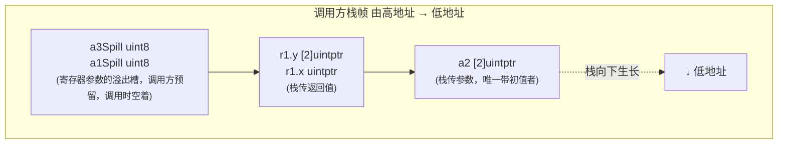
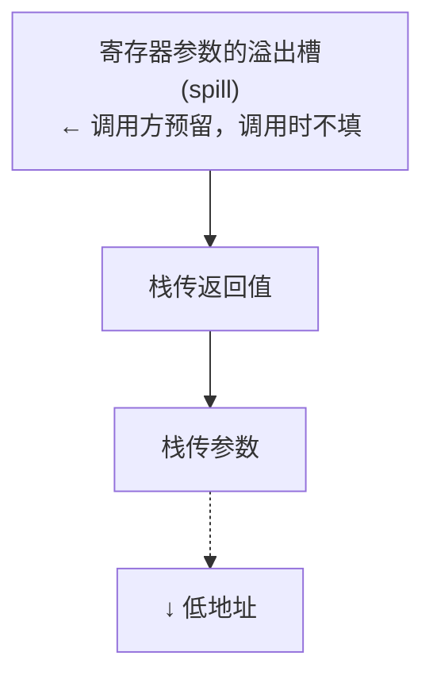

<!--
 * @Date: 2026-08-14 22:25:14
 * @LastEditTime: 2026-08-18 23:29:31
 * @Description:
-->

# 2 汇编与调用的约定

源码迟早要落到机器上，而机器并不理解goroutine, 接口或者闭包， 它只认识寄存器，栈和一串地址。Go没有借用某种CPU原生汇编，而是维护了一套Plan 9风格，
跨架构统一的汇编语言，又在其上自定义了一套不予任何平台兼容的调用规范。

## 2.1 Plan 9汇编语言

### 2.1.1 为什么Go要有自己的汇编

Go的汇编来自Plan 9操作系统的汇编器传统。它不是某一种CPU的原生汇编，而是**一种半抽象，跨架构的中间汇编**

Go为什么要下到汇编？

- **栈切换**。 gogo与mcall要直接把SP，PC从一个goroutine的现场切换到另外一个，这是高级语言里面没有的操作。
- **栈增长序言**。morestack在栈不够时被调用，它要在切到g0栈之前确保当前函数的现场。
- **原子操作**。CAS，原子加等要发特定的CPU指令，编译器不会凭空生成。
- **信号与系统调用入口**。信号处理时候现场保存与恢复，syscall的进出，都需要绕过编译器精确摆布寄存器。

### 2.1.2 四个伪寄存器

Plan 9汇编最让人困惑，也是最该弄懂的，是它的伪寄存器。

1. **FP(Frame Point,帧指针)**: 访问函数的输入参数与返回值，以符号加偏移给出，如ptr+0(FP), ret+16(FP). 参数位于调用方帧栈
   中，FP指向他们的基址。

2. **SP(Stack Point,栈指针)**: 访问当前函数的局部变量， 如x-8(SP). 注意这是伪寄存器SP,和硬件SP含义不同。

3. **PC(Program Counter,程序计数器）**:当前指令地址，用于跳转分支。

4. **SB(Static Base,静态基址)**:访问全局符号， 如runtime.gogo(SB)。所有函数名，全局变量名都是作为SB的偏移给出，可以把SB理
   解为整个地址空间的起点。

栈在多数架构上都是低地址生长：参数与返回值由调用方备好，落在较高的地址，用FP加正偏移访问；被调用函数的变量落在较低的地址，用SP加负
偏移访问。

## 2.2 汇编中的栈帧与符号

2.1给出了Plan 9汇编的伪寄存器与寻址语法，那是怎么写一行汇编。本节把视线抬高到一段完整例程：一个手写汇编函数如何用TEXT .name(SB)声明自己的符号，如何
用$framesize-argsize申明栈帧大小，NOSPLIT又意味着什么。我们运用运行时三段真实例程（Cas,gogo,morestack)把这些约定逐定逐处对上号，读完之后，调度
器月栈管理章节那些汇编符号就从天书变成了可读的现场操作。

### 2.2.1 从Go源码到Plan 9汇编：CAS的逐槽对应

从抽象落到实处。运行时的原子比较交换Cas在amd64上时手写汇编，它的Go原型与汇编实体逐字段对得上，是观察Go源码如何映射到Plan 9汇编的好样本。Go这一侧只声明
(函数体在.s文件里面):

```
// internal/runtime/atomic:仅声明,实现在atomic_amd64.s
//
// if *ptr == old { *ptr = new; reuturn true} else { return false }
func Cas(ptr *uint32, old, new uint32) bool
```

对饮的amd64上的实现：

```
// internal/runtime/atomic/atomic_amd64.s
TEXT .CAS, NOSPLIT, $0-17
   MOVQ  ptr+0(FP), BX  // BX = ptr  (指针8字节，偏移0)
   MOVL  old+8(FP), AX  // AX = old  (int32 4字节，偏移8)
   MOVL  new+12(FP), CX // CX = new  (int32 4字节，偏移12)
   LOCK
   CMPXCHGL CX, 0(BX)   // 原子：若*ptr==AX 则 *ptr=CX
   SETEQ ret+16(FP)     // 想等则把1写回返回值槽（偏移16）
   RET
```

- TEXT .Cas(SB)用SB声明全局符号Cas,.是包名分隔符，工具链会补全为internal/runtime/atomic.Cas。函数名以SB偏移给出，正是2.1.2里面SB的职责。
- $0-17是帧大小说明：局部帧0字节，参数加返回值共17个字节。17=8+4+4+1，恰是\*uint32(8),两个uint32(各4)， bool返回值（1）之和。NOSPLIT表示这段代码不插入
  栈增长检查，本身不会触发morestack。
- 三条MOVx...(FP)把三个参数从调用方栈帧搬进寄存器，偏移0，8，12与Go签名里参数的排布一一对应。MOVQ搬8个字节（指针），MOVL搬4个字节（int32），后缀编码了操作
  宽度。
- Lock不是一条指令，而是修饰符下一条指令的前缀，它令CMPXCHGL在多核原子地独占目标缓存行。CMPXCHGL隐式以AX为比较基准：若\*ptr == AX则写入CX,并设置标志位。
- SETEQ ret+16(FP)根据标志位把1或者0写回返回值槽，偏移16紧接17字节区的末尾

值得记住的是这份汇编只写一遍语法，却为多架构各有一份后端实现：386，arm64,riscv64各自的atomic\_\*.s用同样的.Cas(SB)，同样的ptr+0(FP)写法，落到真实的原子指令
上。这就是说的一套语法，多个后端在最小尺度上的样子。

### 2.2.2 运行时下到汇编的两处现场：gogo与morestack

CAS展示了调用约定一条特殊指令。调度器里面的栈切换则展示了汇编唯一能做的事：把执行现场整体搬走。Go用一个gobuf结构保存goroutine的现场（SP,PC,g指针等）,gogo的职责
就是把某个gobuf恢复进真实寄存器，从而跳进哪个goroutine.

```
// runtime/asm_amd64.s
TEXT gogo<>(SB), NOSPLIT, $0
   get_tls(CX)
   MOVQ     DX,g(CX) // 把目标g写会TLS
   MOVQ     DX,R14   // R14为当前g(regabi约定)
   MOVQ     gobuf_sp(BX), SP     // 恢复栈指针：换栈在此一句完成
   MOVQ     gobuf_bp(BX), BP     // 恢复帧基址
   MOVQ     gobuf_pc(BX), BX     // 取出目标PC
   JMP      BX                   // 跳过去，从此CPU在新的goroutine上执行
```

关键就在MOVQ gobuf_sp(BX), SP与末尾的 JMP BX:一句换掉栈指针，一句换掉程序计数器，CPU的执行现场便从一个goroutine整体迁移到另一个。这种把SP/PC当作
普通数据来读写的操作，高级语言里面根本没有对应物，只能下到汇编。顺带一提，R14恒等于当前g是<ABIInternal>寄存器调用约定的一部分，调用约定本身由2.3详述，
这里只需要知道它解释了汇编为何能直接用R14取当前goroutine.

另一处是栈增长的序言morestack。Go的栈是按增长的，编译器在函数入口插入检查，发现栈不够就跳来这里。morestack必须在g0系统栈之前，把当前函数的现场存进g.sched，
否则栈一搬走现场就丢了：

```
// runtime/asm_amd64.s
TEXT runtime.morestack(SB), NOSPLIT|NOFRAME, $0-0
   get_tls(CX)
   MOVQ     g(CX), DI         // DI = 当前g
   MOVQ     g_m(DI), BX       // BX = m
   MOVQ     0(SP), AX         // 取被增长函数的PC（裸 0(PC):硬件 SP)
   MOVQ     AX, (g_sched+gobuf_pc)(DI)    // 存进g.sched.pc
   LEAQ     8(SP), AX         // 算出其 SP
   MOVQ     AX, (g_sched+gobuf_sp)(DI)    // 存进g.sched.sp
   // ...切到m.g0栈，最终CALL runtime.newstack(SB)完成扩容与重新调度
```

注意这里0(SP)，8(SP)都是裸偏移，用的是硬件SP(2.1.2的陷阱):morestack直接在机器上读会返回地址，所以必须用真实栈帧指针而非伪指针SP。它常以morestack_noctxt
的形式出现，那不过是先把上下文寄存器清零，在跳进morestack的两行薄包装：

```
TEXT runtime.morestack_noctxt(SB), NOSPLIT, $0
   MOVL     $0, DX
   JMP      runtime.morestack(SB)

```

读懂这两段，调度与栈管理章节反复出现的保存/恢复现场就不再神秘：它们都是在汇编中精确摆布PC，SP与少数约定寄存器。

### 2.2.3 它在本书中的角色与取舍

2.1与本节合起来是一份阅读词汇表，不是汇编教程。Go选择维护自己的Plan 9风格的跨架构汇编器，而不是复用GNU as这类现成工具，这是一处清晰的工程取舍：成本是又多养了一套汇编器，
链接器与目标文件格式，没加一个架构都要补充一个后端；收益时对代码生成，调用约定，栈布局，与运行时的协同握有完全控制权，并让一套工具链交叉编译到所有架构成为可能。性能与可控从
不白来。它们的对价正是这套自有基础设施的长期维护负担。这与2.3调用约定选择自定义的API，6.1自管函数调用取舍同出一辙，三这是同一种为掌控而自造的设计姿态。

## 2.3 调用约定与寄存器ABI

一次函数调用，在机器层面要回答一系列问题：参数放哪里，返回值放哪里，谁负责保存哪些寄存器，栈帧怎么布局，返回地址在何处。把这些问题的答案固定下来，就是调用规范（calling convention）,
它也被称做ABI(application binary interface)。ABI不是一段代码，而是一份契约：编译器生成的代码，手写Plan 9汇编，运行时里面的底层例程序，三方各自独立编写，却要在调用那一刻严丝合缝
地对接。契约一旦写定，三方就要按照它来摆数据，谁也不必知道对方的内部细节。

6.1已经从语言角度讲过函数调用从栈到寄存器的演进，那里关心的是一次f(a, b)在Go语义上发生了什么。本节与2.4参数传递与栈帧布局补齐它在汇编与运行时的另一半：同一次调用，落到机器指令上是如何
约定的，两者合起来，函数调用这件事情才算完整。

### 2.3.1 两台ABI: ABI0与ABIInternal

Go同时维护着两套调用规范，理解他们的分工是读懂运行时里那些奇怪符号标注的钥匙。

ABI0是早期的，基于栈的规范：所有参数与返回值一律通过栈内存传奇，调用方在自己的栈帧里面按照顺序摆好参数，被调用方从固定偏移处取用。它的好处是布局稳定，可预测，人脑能算清每个参数的偏移。
手写汇编因此一律遵循ABI0,go.dev/docs.asm描述的就是这套稳定的ABI。ABI0还有一个常被忽略的性质：它是Go唯一承诺的ABI，是汇编与Go之间唯一可靠的接缝。

ABIInternal是Go 1.17引入的，基于寄存器内部规范：尽量把参数与返回值放进寄存器，省去大量栈内存的读写。所有由Go源码编译出的函数都是走ABIInternal。它的名字里面的Internal二字就是郑重
警告：这套ABI不稳定，会随着Go版本变化，任何外部代码都不应该依赖它的细节。换来的是5%的整体提速，且这份提速对用户代码完全透明，源码一字不改，重新编译即享。

在amd64上，ABIInternal用如下9个整数寄存器顺序传递整型参数与返回值，浮点用X0-X14:

RAX,RBX,RCX,RDI,RSI,R8,R9,R10,R11

参数的分配是递归的：一个值按照其类型拆分为基础部件。每个部件占用一个寄存器。一个string拆分称指针与长度两个寄存器。一个[]T拆分成三个，一个小结构体按照字段逐步铺开。装不下的整个回退到栈上
传递。这条规则有一个值得记住的边界：含数组的参数一律走栈，因为按下标访问数组要算偏移，而偏移没法落到寄存器里面；Go1.15标准库里面只有0.7%的函数签名含数组，为这极少数破例不值得，于是干脆全
栈传递。

分配是全有或者全无的，一个值若有任何部件放不进寄存器，已经是探测占用的寄存器全部退还，整个值改走栈，决不允许一半在寄存器一半在栈上。这正是为了应对被调用方对参数取地址的情形，若值被劈成两半，
取地址还得在内存里面把它重新拼接回去，代价与值的大小成正比，得不偿失。返回值走同一套算法，只是分配前把寄存器计数从头重置，故入参与返回值可以复用同一批寄存器而互不干涉。

两套并存，意味着边界处需要做桥接。当ABIInternal的Go代码调用ABI0的汇编函数，或者反过来，两边对参数在哪里理解不一致，链接器会自动插入一段包装代码（ABI Wrapper）做参数的搬运：把寄存器里
的实参摆到对应位置，或者反向搬回。这层桥接有内部ABI提案规定，对调用双方透明。它在符号里面露出马脚，运行时里同一个名字常带ABI标注后缀：

runtime.morestack_noctxt.abi0 // ABI0版本
runtime.systemstack<ABIInternal> // ABInternal版本

读运行时反汇编时，看到.f<ABIInternal>与.g.abi0这类标注，便知道链接器在此处可能架了一座桥。多数情况下你不必关心桥的存在；只有在手写汇编里面直接调用Go函数，或者反过来被Go调用的时候，才需要
清楚自己站在那一侧ABI。

讲清楚了两套ABI与参数分配的算法，接下来参数传递与栈帧布局用一个混合例子把它落到具体的栈帧上，并补足溢出槽，序言i面的栈增长检查，以及为何自定义ABI这个总账。

## 2.4 参数传递与栈帧布局

2.3给出了两套ABI的分工与参数分配的递归算法，那是规则。本节把规则落到一个具体的例子上面：一个同时含有标量与数组的签名，参数究竟在栈帧上怎样摆放，寄存器参数为何还要在栈上留出一格溢出槽，序言
里面那条人人都付的栈增长检查又是怎么搭上抢占的便车。最后我们回到为何自定义ABI这个总账，把这两节合成一个完成的回答。

### 2.4.1 一个参杂栈传递与寄存器传的例子

抽象规则不如一个例子来的清晰。取ABI规范里面那个精心设计的签名。它故意同时含有能进寄存器与必须走栈的数组：

```
func f(a1 uint8, a2 [2]uintptr, a3 uint8) (
   r1 struct{x uintptr, y [2]uintptr}, r2 string)
```

按照2.3.1的递归分配，在amd64（整数寄存器RAX,RBX,...）上的结果是：

- a1和a3是能进寄存器的标量，分别是RAX，RBX;
- a2是平凡数组，整个退回到栈上；
- 返回值r1含数组，也走栈；r2是string,拆分出base和len两部分，回填RAX,RBX

于是入口时候只有a2在栈上有初始值，栈帧布局如下，其余区域调用时候一律不初始化：



这个例子把三件事一次说清楚：标量优先进寄存器，函数族的值整体走栈，而每个寄存器参数仍然在栈上留下一格溢出槽待命。把它和2.3.1那条全栈传的ABI0对照，差别一目了然：ABI0
下的a1,a3连同a2全在栈上按序排开，没有寄存器，也没有溢出槽；ABIInternal把能搬进来的都搬到了寄存器，省下的正是那几次进出栈内存的读写。

### 2.4.2 栈帧，溢出槽与寄存器的约定

一次调用压入一个栈帧，自高地址到低地址，依次容纳：调用方被调用方预留的栈传递参数区与栈传返回值区，被调用方的局部变量，需要保存的寄存器，以及返回地址。amd64上以低地址在下的惯例
画出。一个含寄存器传参的调用，其栈帧大概是这样的：



这里的溢出槽（spill space）是寄存器ABI特有的设计，也是一处精巧的取舍。寄存器传参省下栈读写，但是寄存器会被后面指令覆写，一旦函数中途需要扩栈，就得有地方把这些
寄存器的实参先溢出来咱暂存。关键在于：这块暂存空间由调用方在自己的栈帧里面预留，而非被调用方。原因是被调用方扩栈时，它自己的栈帧可能根本腾不出来空间，让调用方提前
准备好，扩栈路径才有落脚点。这块槽位同时充当实参的家，trackback打印参数，reflect调用规约参数都借它，是一处一举多得的安排。

寄存器还分为两类约定。amd64上R14恒定指向当前goroutine(即g)，RSP/RBP是栈指针与帧指针，RDX在调用闭包的时候传递闭包上下文。值得点出的是：Go的ABIInternal没有调
用方保存/被调用方保存（callee-save）的寄存器之分，一次调用可以覆盖任何没有固定含义的寄存器，包括参数寄存器。这简化了实现，代价是调用前后调用方若还要用某个寄存器
里面的值，的自己负责保存。
