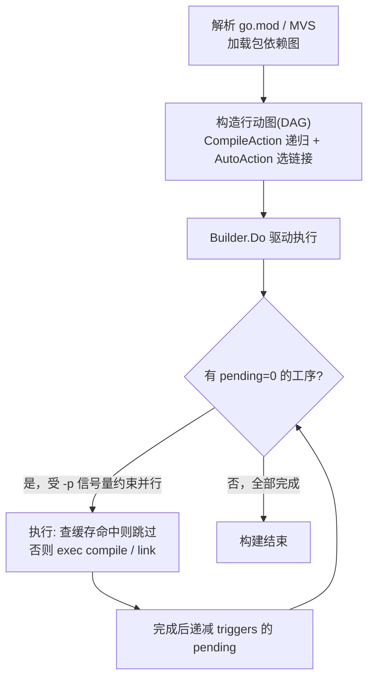
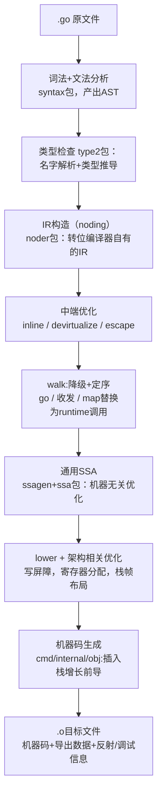
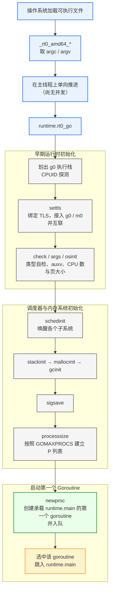

# 3 程序的生命周期

读者敲下的main函数，从来不是程序真正的起点。一行源码要成为跑起来的一个进程，先的穿过一条很长的链：go命令把构建拆成
行动图并交给编译器和链接器，编译器自己又得由上一版Go自举而来，链接器把整个运行时一并并进二进制，操作系统加载后由汇编
入口铺出第一个goroutine,最终才轮到main.main执行，又在他返回的那一刻带走整个进程。

## 3.1 从go命令谈起

Go程序生命周期要从执行go命令开始谈起。读者每天敲一下的go build,go test,go run,看上去只是把源码变成二进制，背后却藏着
一个被误解的事实：go 本身并不是编译器。它是个构造编排器（build orchestrator）, 负责把一次构建分解成多道工序，安排他们
的先后与并行，在逐道调用真正工具，编译器compile,汇编器asm,链接器link。本节先把这层关系讲清楚，最后是后续几节的总纲：读懂了
go如何把一次构建拆分出一张图，如何利用内容寻址缓存避免重复劳动，再去看编译与链接的细节，就有了落脚的框架。

### 3.1.1 go构建编排器，不是编译器

把一个最小程序的构建过程摊开，最直接的办法就是go build -x，它会打印出go实际执行的每一条子命令。对一个只有一行`fmt.Println`
的main包，输出的骨架是这样的：

```
$ go build -x -o /dev/null .
WORK=/tmp/go-build1449454186
mkdir -p $WORK/b001/
cat >$WORK/b001/importcfg << 'EOF' # internal
# import config
packagefile fmt=/Users/.../go-build/7d/7d74...-d
packagefile runtime=/Users/.../go-build/60/60cb...-d
EOF
# 调用编译器，把 main.go 编成归档 _pkg_.a
.../pkg/tool/darwin_arm64/compile -o $WORK/b001/_pkg_.a -p main -lang=go1.26 \
    -complete -buildid ... -importcfg $WORK/b001/importcfg -pack ./main.go
.../pkg/tool/darwin_arm64/buildid -w $WORK/b001/_pkg_.a # internal
cp $WORK/b001/_pkg_.a /Users/.../go-build/82/8256...-d # internal
# 写出链接配置，再调用链接器
cat >$WORK/b001/importcfg.link << 'EOF' # internal
packagefile demo=$WORK/b001/_pkg_.a
packagefile fmt=/Users/.../go-build/7d/7d74...-d
...
EOF
.../pkg/tool/darwin_arm64/link -o $WORK/b001/exe/a.out -importcfg ... $WORK/b001/_pkg_.a
```

go自己做的事，是建立一个临时工作目录，写出一份importcfg（告诉编译器与链接器每个依赖包的归档在磁盘处），然后exec出
compile与link这两个独立的可执行文件。原文件到目标代码的真正翻译，发生在go之外的工具里面。这种主程序只负责编排，把脏活交给独立工具的结构，在go命令的内部用两个数据
结构类型承载：Builder持有整次构建的共享状态（工作目录，各类缓存，并行度控制）,Action则是构建图上的一个点，描述一道要做的工序。

```
// Action: 构建图上的一道工序
type Action struct {
  Mode    string       // 这道工序做什么："build"/"link"...
  Actor   Actor        // 真正执行它的函数（调用compile,link等）
  Deps    []*Action    // 必须先于本工序完成的工序
  Package *load.Package // 本工序处理的包

  actionID cache.ActionID // 由全部输入算出缓存键
  buildID string        // 输出的内容标识：actionID + 输出内容的哈希
  triggers []*Action    // Deps的逆向边：本工序完成以后可以解锁谁
  pending int           // 还有多少个Dep未完成，归零忌就绪
  priority int          // 执行优先级，供就绪队列排序

}
```

Action的Mode,Deps,Actor三者结合起来回答了这道工序是什么，依赖谁，由谁执行。一次go build不是一条直线，而是把这些节点连成一张图，再去动它运转。下一节来看
这张图如何从go.mod与源码长出来。

### 3.1.2 从go.mod到行动图

构建第一步搞清楚要编译哪些包，它们之间谁依赖谁。这由模块系统回答：go解析go.mod,按照最小版本选择(**MVS**)算法定下每个依赖确切版本，加载出一张包依赖图，
包依赖图是输入，go要把它翻译成一张**行动图**，即由Action节点构成的有向无环图。

翻译的规则朴素得近乎机械。对每个待构建的包，递归地为它的每个导入建一个编译工序，作为本包工序的依赖；遇到main包则改建链接工序。

```
// 为包P建立一个编译工序，并递归地把它的导入也建成依赖
func (b *Builder) CompileAction(mode, depMode BuildMode, p *load.Package) *Action {
  a := &Action{Mode: "build", Package: p, Action: &BuildActor{}}
  for _, p1 := range p.Internal.Imports {
    a.Deps = append(a.Deps, b.CompileAction(depMode,depMode, p1))
  }
  return a
}

//顶层入口：main包要链接成可执行文件，其余包只需要编译成归档
func (b *Builder) AutoAction(mode, depMode BuildMore, p *load.Package) *Action {
  if p.Name == "main" {
    return b.LinkAction(mode, depMode, p) // 链接工序，依赖编译工序
  }
  return b.CompileAction(mode, depMode, p)
}
```

递归一展开，整张行动图便形成:叶子是无依赖的包（编译他们只需要源码）,根是链接工序，链接依赖main包的编译，main包的编译又依赖它导入的每个包的编译，层层向下。AutoAction里面
那个对main的判断，正是3.2编译与3.4链接两节在构建图上的分界。

图建好以后，由Builder.Do驱动执行。这里的核心约束时拓扑序：一道工序只有在他的全部依赖都完成以后才能开始。go没有完成的拓扑排序，而是每个Action记一个pending计数，依赖一旦完成就递减对应
triggers的pending,归零的工序进入一个按priority排序的就绪队列。多个互不依赖的工序可以并行，并行度由-p（默认取GOMAXPROCS）进过一个信号量readySema控制。整个调度可以这样勾勒：



值得点出的是图中查缓存命中则跳过这一步：行动图的大多数节点，在多数构建里面其实并不是真的去调用编译器。它们先会去问构建缓存，这道工序的输入和上次一模一样吗，
一样就直接取回上次的产物。这套缓存是go命令快得不像是编译的根本原因，也是下一节的主题。

### 3.1.3 内存寻址构建缓存

一次干净的go build要编译成百上千的包，第二次却往往一秒返回，秘密在于内容寻址（content-addressed)的构建缓存：每道工序的产物，用算出这件产物的全部输入的哈希
作为键存进缓存（默认在$GOCACHE,即go env GOCACHE）。下次构建的时候，若同一道工序的输入哈希不变，就断定产物必然相同，直接复用，链编译器都不必启动。

关键全在输入哈希如何构成。go用buildActionID把一道编译工序的所有输入喂进一个SHA-256:

```
//计算一道编译工序的缓存键(速写，省略cgo等分支)
func (b *Builder) BuildActionID(a *Action) cache.ActionID {
  p := a.Package
  h := cache.NewHash("build" + p.ImportPath) // 起手即混入 Go 版本作为salt
  fmt.Fprintf(h, "compile\n")
  fmt.Fprintf(h, "goos %s goarch %s\n", cfg.Goos, cfg.Goarch) // 目标平台
  fmt.Fprintf(h, "import %q\n", p.ImportPath)
  // 编译器本身的ID（编译器换了，缓存即失效）与编译参数
  fmt.Fprintf(h, "compile %s %q\n", b.toolID("compile"), forcedGcflags, p.Internal.Gcflags)
  // 每个源文件的内容哈希
  for _, file := range inputFiles {
    fmt.Fprintf(h, "file %s %s\n", file, b.fileHash(filepath.Join(p.Dir, file)))
  }
  // 每个依赖包buildID（即依赖产物的内容标识）
  for _, a1 := range a.Deps {
    fmt.Fprintf(h, "import %s %s\n", a2.Package.ImportPath, contentID(a1.buildID))
  }
  return h.Sum()
}
```

把`GODEBUG=gocachehash=1`打开，就能看到这些输入被逐条喂进哈希的真实过程。对面那个demo包，末行那串十六进制就是最终的actionID:

```
$ GODEBUG=gocachehash=1 go build -o /dev/null .
HASH[build demo]
HASH[build demo]: "go1.26.1"                                   # salt：Go 版本号
HASH[build demo]: "compile\n"
HASH[build demo]: "goos darwin goarch arm64\n"                 # 目标平台
HASH[build demo]: "import \"demo\"\n"
HASH[build demo]: "compile compile version go1.26.1 [...] []\n" # 编译器 ID + 参数
HASH[build demo]: "file main.go KUKxlydUIi2I-10EjTIw\n"        # 源文件内容哈希
HASH[build demo]: "import fmt a-nQ4YX2Z0xMeqSMWW55\n"          # 依赖 fmt 的产物标识
HASH[build demo]: "import runtime 8asGqFcOH5UKoaTdthA0\n"      # 依赖 runtime 的产物标识
HASH[build demo]: e783bda8414d9313a775eb0d5a6eb354559cb647a628acb64782f2359965759b

```

注意倒数几行：依赖fmt,runtime是他们各自的`buildID`（产物内容标识）参与本包哈希的，而buildID又是他们自己的`actionID`加上其他产物内容算出来的。于是整个缓存键沿着行动图
层层嵌套。构成一颗Merkle哈希树：任何一处源文件，编译参数，依赖产物，乃至编译器版本发生变化，其上方所有工序的键都随之改变，缓存自然失效；反过来，一颗未被触碰的子树，键恒定不变，
整片复用。这是内容寻址较按时间戳判断新旧（如传统make）的根本优势，他判断的是内容而非时间，因此 `git checkout`来回切换分支，文件mtime乱跳，都不会误判。

这套设计要正确，依赖一条不变式：凡是会影响产物的输入，必须无一遗漏地进入buildActionID。源码对此有铭文戒律，exec.go中那道工序的执行函数旁边写着任何对本逻辑的新影响，都必须同样
在上面的`buildID`中登记。遗漏一项，意味着输入变了而键没变，构建会错误的复用陈旧产物，这是缓存类系统最隐蔽的一类bug。为了给不变式上一道保险,go提供了`GODEBUG=gocacheverify=1`:
它令缓存形同失效，强制每道工序重新执行，再把新产物与缓存中的旧产物逐字节对比，一旦不符就报错，等于在运行时候核对相同的键是否真的对应相同的产物。

1. 起手即混入Go版本号座位salt
2. 目标平台
3. 编译器本身的ID
4. 每个原文件的内容哈希
5. 每个依赖包的buildID

### 3.1.4 可复现构建

内容寻址缓存能成立，前提是构建可以复现（reproducible）: 同样的输入，必须逐字节相同的输出。若编译产物里面掺入了构建时候的绝对路径，时间戳和随机数，
同一份源码在两个机器上会产出不同的二进制，缓存命中率崩塌，更谈不上让第三方独立核验这个二进制确实由这份源码编出的。Go在工具链层面为此做了多处约束。

最直接的一处是缓存键里面的Go版本salt: cache.NewHash起手就混入`runtime.Version()`，是不用版本的go命令绝对不共用一批缓存条目，一个版本的bug不会污染另一个版本的构建。另外
一处是-trimpath：默认情况下，调试信息会嵌入源码的绝对目录（前面哈希轨迹中省略的dir/tmp...类输入正源于此）,换一台机器，换一个目录，产物就不同；加上-trimpath后，路径被改写为模块
的路径加版本，构建便不再依赖它咋文件系统中的具体位置。再加上Go编译器本身不刻意引入构建时间戳，对map遍历等不确定做了消除，最终使同源同版本同参-〉同二进制成为可达目标。模块校验(go.sum，
校验和数据库)则从依赖一侧封住了输入，相关机制件17章。可复现即服务于缓存的正确，也服务于供应链的可验证，这正是Reproducible Builds项目多年倡导的方向。

### 3.1.5 统一工具链和碎片化对照

go远不止build一个子命令。解析，构建，测试，格式化，静态检查，文档，性能剖析，再Go里面全部收束于同一个命令之下：

```
go build
go test
go run
go fmt
go doc
go tool pprof
go mod
```

把这一面与C/C++世界并置，差异便显现出来了。在C/C++那边，编译靠gcc/clang，构建编排靠make或CMake，autoools，ninja，跨版本与跨平台还要pkg-config周旋，为了不每次都全量重编，
社区另外构造了ccache这一类编译器外挂缓存；格式化是clang-format，静态检查时clang-tidy，依赖管理则长期没有公认的答案，这些工具各自为政，配置彼此独立，一个项目要他们凑齐，调通，在团队
里面保持一致，本身就是一门手艺。Go把它们做进一个二进制，缓存，依赖解析，跨平台交叉编译都内建且零配置：换台机器git clone后go build即可，无需先理解一套构建脚本。

这种统一并非没有代价。go的构建模型时固定的，它假定包即目录，导入即依赖，不像make那样表达任意的，跨语言的，带自定义的规则的构建逻辑；需要在构建的时候生成代码，嵌入资源，串接非Go工具链
的时候，go generate与//go:embed只能覆盖常见的情形，更复杂的场景仍然要外部脚本兜底。这是一次灵活性换取一致性的取舍：放弃能描述任何构建的表达力，换来无需描述构建的一致性。对绝大多数
Go项目，后者比前者值得，这也与Go在语言设计上一贯的取舍结合，把选择收窄，让多数人无需选择。

至此，go命令作为编排器的全貌已经清楚：它从 go.mod与源码长出来一张行动图，按照拓扑序并行驱动，用内容寻址的缓存挡掉了重复劳动，再把每个节点真正的工作交给compile与link。

## 3.2 Go程序编译流程

3.1说`go build`背后真正干活的是compile与link这两支程序。这一节把镜头推进到compile,给出一份.go源文件到一个.o目标文件走过的全程：每个阶段拿到什么，吐出什么，为什么
这么切分。本节是编译流水线的全景图，每个阶段的内部机制（文法如何设计，类型检查用什么算法，SSA优化规则）留给15长逐一展开，这里只负责把它们串成一条线，并指出两条贯穿始终的
暗线。

为了避免落回逐字翻译编译器目录结构，下文用一个贯穿全程的小例来串起来所有阶段。请记这段函数，它会被流水线反复揉捏，直到变成机器码：

```
func send(ch chan int) {
  go work() // 启动一个新goroutine
  ch <- 1
}
```

它只有两行，却恰恰藏着本节要强调的第二天暗线：go 与 <-这样语言关键字，最终都不是靠CPU指令直接实现的，而是被编译器翻译成对运行时的函数调用。先把流水线看完，再回头剖析这两行。

### 3.2.1 两条暗线：为何要先讲他们

第一条暗线是**编译速度**是一等约束。Go从设计之初就把编译要快当作语言目标而非事后优化。这个目标渗透了语法，依赖管理与编译器结构的每一层：文法被设计成可以不回溯地快速解析，依赖
以编译产出的紧凑导出数据而非源码传递，且不存在C/C++那种会层层传染的`#include`。

第二条线是**编译器和运行时合谋**。Go的许多语言特性并非编译器独立实现，而是编译器生成一段调用运行时的代码，由运行时再程序运行时兜底。`go f()` 被降级为`runtime.newproc`，<-ch
被降级为`runtime.chanrecv`，每个函数入口被插入一段栈增长的前导，含指针类型被配上GC指针图和类型描述符，写指针的地方被插入写屏障。可以说，编译器为运行时埋下了一个一个约定的接口，
二者合起来才构成完整的语义。

### 3.2.2 流水线全景

go1.26的compile在逻辑上分为前端，中断，后端三段，数据形态变化：源码 -> 语法树 -> 类型化语法树 -> 编译器自有的IR -> SSA
-> 机器相关的SSA -> 机器码



横在前端与后端之间的那段（中端walk）常被称作middle-end,是优化最密集，也最能体现Go取舍的地方。下面顺着这条线，看send再每一站都发生了什么。

### 3.2.3 前端：从字符流到类型化的语法数

- 词法和文法分析（cmd/compile/internal/syntax）是第一站。源码线切分成token流，再按照文法规则组装成一颗抽象语法树（AST,语法分析）.send的函数体被解析成两个语句节点：
  一个go语句，一个发送语句，每个节点都挂着精确的源码位置，供后续报错与生成调试信息。Go的文法是为速度而设计的，可以单独，不回溯地解析，这正是3.2.6要细节说的一笔。

- 类型检查（cmd/compile/internal/type2）随后接手。type2是go/types的一个移植版，改用syntax包的AST。它做两件事情：名字解析（每个标识符指向哪个声明）与类型推导（每个
  表达式是什么类型，并在此基础上加额外检查。例如声明却未使用。泛型的类型推导与约束求解也在这一阶段完成，是全编译器最精巧的部分之一。对于send而言，这一步确认ch是chan int,
  ch <- 1中的1可以赋值给int,work是个无参函数。检查通过以后，AST上每个表达式都带上了一个确定的类型。

值得一提的是，go/parser, go/types这套公开并不被编译器所使用。编译器最初用C写成，go/\*系列是后来为gofmt,vet等工具单独发展出来的，二者同源而分流。

### 3.2.4 中端：IR,内联与逃逸分析

类型检查后的表示还不便于优化，于是有IR构造（noding, cmd/compile/internal/noder）：把syntax加type2的表示转换成编译器自有的IR(ir包)与类型系统（types包）。
这套IR是编译器还用C写的时候留下的血脉，中端和后端的全部代码都以它为基础。go1.26的noding走的是Unified IR:它把类型检查后的代码序列化一份中间产物，再据此重建IR,这份产
物同时也是包导入/导出的内联的载体。这一点对暗线一至关重要。

IR就位以后，中端在其上跑几趟优化：死代码消除，（早期的）去虚化，函数内联（inline包）,逃逸分析(escape包)。逃逸分析尤其关键，它判定每个变量能否安全地放在栈上，还是必须
分配到堆上。这一步直接决定了对象由谁来接管：留在栈上的对象随着函数返回自动回收，逃逸到堆上的对象才进入垃圾回收的视野。在send中，传给go work()的函数与任何新的goroutine
捕获的变量都会被判为逃逸，因为新的goroutine的生命周期超出了send的栈帧。

### 3.2.5 walk与后端：降级，SSA机器码

- 中端之后时walk（cmd/compile/internal/walk）,它是IR上的最后一趟，做两件事情。其一是定序：把复合语句拆分为带临时变量的简单语句，固定求值次序。其二是降级：
  把高级语言构造翻译更原始的形式。本节的第二条暗线正是在这里的显形，switch被改写成二分查找或者跳表，而对map与channel的操作，go语句，被替换成对运行时的调用。send
  的两行到这一步变成大致这样。

```
func send(ch chan int) {
  newproc(work)   // go work() -> runtime.newproc
  var tmp int = 1
  chansend1(ch, &tmp) // ch <- 1 -> runtime.chansend1
}
```

- 接着进入通用SSA(ssagen把IR转换成SSA）。 SSA(静态单赋值)是一种低级别表示，每个值赋值一次，这个性质让数据流分析与优化变得
  简洁。转换中会应用内建函数intrinsic(编译器对某些函数硬编码了高度优化实现），并把更多构造继续降级（例如copy换成内存移动，range
  循环改为for).随后跑一串机器无关的优化：死代码消除，去掉多余的nil检查，常量折叠，把乘法和浮点运算符重写的更高效。这些规则不涉及
  任何架构，在所有的`GOARCH`上一致运行。

- 最后是机器相关的后端。它以lower开篇，把通用SSA值重写成目标结构的专用变体（例如在amd64上把多个load-store合并进一条带内存操作
  的指令）。lower之后再跑一轮优化与几项关键工作：寄存器分配，栈帧布局，指针活性分析以及插入写屏障。至此函数被转成obj.Prog指令，
  交给汇编器。汇编器把它们变成真正的机器码，并在每个函数入口插入栈增长前导。写出最终目标文件。目标文件里面除了机器码，还有导出数据，
  反射数据与调试信息。

### 3.2.6 暗线一：编译速度作为一等约束

Go把快做进了流水线的三个层面，每一层都对应上文中的某一站。

- 文法层。Go的文法可不回朔地单边扫描，词法分析甚至简单到接近正则。

- 依赖层。这是最见功力的一笔。编译包P时，3.2.4提到的Unified IR会顺带写出一份导出数据：把P中所有导入声明的类型信息，可内连的
  函数体，泛型函数的函数体，以及逃逸分析的结论，序列化目标文件。

- 结构层：Go以包为编译单元并行编译，包之间值通过导出数据这一摘接口耦合，会使整个构建可以高度并行。

代价并非没有。深导出数据有随依赖图上行而膨胀的倾向：一组被广泛使用，API庞大的类型，会让几乎每个包的导出数据都带一份它的拷贝。真实这个问题催生了indexed与shallow等更省
的导出格式。性能的取舍从不白来，这里用一点冗余，换来构建系统的简单与单遍可读。

### 3.2.7 暗线二： 编译器与运行时合谋

第二条暗线就是理解Go运行时的钥匙。许多读者会以为goroutine,channel,GC是运行时的事情，与编译器无关，其实二者是合谋的：运行时定义
了一组约定的接口，编译器再恰当的时候生成对它们的调用或者配套的元数据，缺了任何一方，语义都不完整。

| 语言特性           | 编译器做的事情                                 | 发生的阶段              | 运行时一侧                    |
| :----------------- | :--------------------------------------------- | :---------------------- | :---------------------------- |
| `go f()`           | 降级为 `runtime.newproc(f)`                    | `walk`                  | 调度器创建并排入 goroutine    |
| `ch <- v` / `<-ch` | 降级为 `runtime.chansend` / `runtime.chanrecv` | `walk`                  | Channel 收发与阻塞唤醒        |
| 函数入口           | 插入栈增长前导                                 | `obj` 汇编              | `morestack` 触发栈扩容        |
| 写指针 `*p = q`    | 插入写屏障                                     | `SSA writebarrier` 阶段 | GC 根据屏障记录维持三色不变式 |
| 含指针的类型       | 生成类型描述符 + GC 指针位图                   | 后端 / 反射数据         | GC 据位图精确扫描对象         |

## 3.3 语言的自举（bootstrapping)

一个问题听起来像悖论：Go的编译器，汇编器，链接器与运行时如今都用Go写成，那么第一个能编译Go的程序是从哪里来？没有编译出编译器，这就是自举。它既是先有鸡还是先有蛋的经典困局，
也是Go工具链演化历史上一段可被精确复述的工程。本节回答三件事情：这只蛋最初是怎么孵化出来的；自举以后，构建一个新版本的链条如何运转，以及它对引导版本的要求为何逐年提升；最后，
为什么一门语言用自己实现自己值得郑重对待。

### 3.3.1 先有蛋：从C写的工具链到Go写的工具链

自举的前提是，是先有一个不依赖自身的起点。Go工具链最初（到Go1.4，2014年）的编译器，汇编器，链接器与cmd/dist都是用C写的，编译器沿用了Plan9的命令（5c,6c,8c,9c等，数字对应
不同的目标架构）。这套C程序由系统自带的gcc或者clang编译，于是构建Go不需要任何已经存在的Go,这便是那只蛋。

从Go1.5起，Go完成了一次里程碑式的转变：编译器与运行时被整体用Go重写，C工具链被删除了，工具链从此可以自我引导。这步棋的代码和收益都很实在。收益是，编译器开发者从此用Go这门内存安全，
并发友好，自带测试与剖析工具的语言来维护工具链，编译器里面的bug可以用Go自己的调试手法去查；运行时与编译器共用一套语言，跨边界的协作（如逃逸分析或者栈管理）也更顺。代价是，构建Go
不再像编译一段C那样自给自足，它现在需要另外一个能用的Go。

### 3.3.2 自举链：用旧Go编译新Go

自举之后，构建新版Go的起点变成一个较旧的，已经能运行的Go工具链，记在环境变量`$GOROOT_BOOTSTRAP`中。整个引导过程由cmd/dist驱动，它本身是一段可以写得克制的Go程序，只用得起引导版本
就有得语言特性，从而被那么旧Go直接编译出来。

引导不是编译一次就完事，而是连续编译三轮，每一轮都有它非编不可的理由。

三轮的分工由这套设计的核心，值得逐级说清楚：

1. toolchain1，cmd/dist先把编译器，汇编器，链接器等新的源码，用引导版就Go的go命令编译出来。这一版工具链行为上已是新版。但是它由旧go命令构建，二进制里面没有build ID.
2. go_bootstrap，再用toolchain1编出来一个临时的go命令。从这一步起，构建的主导权从cmd/dist交给go命令本身。
3. toolchain2，用toolchain1加go_bootstrap，把同一套工具链再编一边。它与toolchain1语义等价，但是因为用新编译出来的编译器（而非旧引导编译器）构建，跑的更快，且这一版带上了buildID。
4. toolchain3，再用toolchain2编出最终一版。到这里，工具链已是由从头构建的新编译器编译出来的新编译器。其buildID准确稳定，适合喂给构建缓存。

为什么不止一轮？关键在buildID可复现性。toolchain1是新源码+旧编译器的产物，足以自举，但是带着就引导环境的痕迹（无buildID）。多走两轮，让最终工具链完全脱离引导版Go的影响，
toolchain3使用新工具链构建的新工具链，与构建它的旧Go再无瓜葛。这也顺带是一道自检：若新编译器自身有缺陷，往往toolchain2或者toolchain3这一轮就会暴露。

这里藏着一个微妙但是要紧的判断：toolchain2与toolchain3在源码层面完全相同，理想情况下两者应该逐字节一致。他们之所以分作两版，是因为toolchain2是旧的编译器编出的新的编译器
又编了一遍，而toolchain3是新编译器编它自己，只有当后两版趋于一致的时候。才能确信新编译器没有把某种依赖于是谁编译了它的隐性差异带进来产物。这正是经典的编译不动点：一个正确的
自举编译器，从某一轮之后再编自己，输出应该稳定下来。Go用buildID与发布构建里面的版本标识来逼近这个不动点，让最终的二进制可被缓存，可被复现。

一个容易被忽略的实现细节：cmd/dist并不直接在原地编译，而是把引导所需要的源码（cmd/compile,cmd/asm, cmd/link以及其依赖）拷贝进$GOROOT/pkg/bootstrap工作区，并把他们的导入
路径统一写成bootstrap/...前缀。这样旧Go编译的是一份与最终标准库隔离的副本，新旧两套同名包不悔在引导期间彼此污染。

整条链的入口是make.bash(all.bash在它之外多一轮测试)。粗略地看，一次make.bash依次做的是：检查并定位$GOROOT_BOOTSTRAP,用它编译出的cmd/dist，由cmd/dist走完上面的toolchain1
至toolchain3三轮。最后用最终工具链编译出标准库与命令。这几步在中断上肉眼可见。

每一行对应链上的一环：先用引导版就Go编出cmd/dist，再由它顺次抬出toolchain1,临时go命令（go_bootstrap）,toolchain2，toolchain3,最后用站稳的最终工具链铺开标准库与命令。读这段
输出，自举就不再是抽象概念，它是中端里面几行可被复述的状态迁移。

### 3.3.3 不断抬升的引导版本

自举给工具链开发者送了绑：他们可以用越来越新的Go特性来写自己。代价随之而来，工具链源码一旦用上一个某个新版才有的特性（典型入泛型），能引导它的最低Go版本就要跟着往上抬。这条引导版本一
路走高，本身就是Go语言自我演化的一份侧写：

从Go1.20（2023年）起，引导基准正式告别了沿用近八年的Go1.4，背后的取舍记录在issue 44505与54265里面：继续钉死在Go 1.4,意味着工具链永远不能用Go 1.5之后的任何语言的特性来写自己，这个
束缚越来越不划算。从Go 1.24起来，要求不在逐版本手写，而是收敛成一条规则。构建Go 1.N需要Go 1.M，其中M = N - 2向下再取到偶数。于是Go 1.24与1.25都要在Go 1.22,go 1.26与Go 1.27都要
Go 1.24。这条公式正是cmd/dist里面的requiredBootstrapVersion"

```
requiredMinor := minor - 2 - minor%2
```

落到1.26，最低引导版本就进一步订到补丁号go1.24.6。若有人拿到更旧的Go去跑make.bash，构建会在编译cmd/dist时就失败，源码树里面专门放了一个文件，仅在 //go:build !go1.24时候参与编译，
包名是building_Go_requires_Go_1_24_6_or_later,用一条找不到合法main包的报错，把版本不足这件事情尽早的，显眼的告诉构建者。

### 3.3.4 自举为何重要

自举不止是一段技术趣闻，它有三成实在意义。

它是语言成熟的信号。
它开发了开发体验。
它压上了一份责任。

## 3.4 模块链接

### 3.4.1 链接器做的事

链接器做的事是一个main包的目标文件，加上它递归依赖的所有包（含整个运行时）的目标文件；输出是一个可被操作系统加载执行的二进制。

- 符号解析（symbol resolution): 把每一个对符号的引用，绑定到它在某个目标文件的唯一定义。

- 布局（layout）:把所有符号的机器码与数据，按照种类安排进可执行文件的各个段，代码进text,可读写数据
  进data,只读数据（字符串字面量，类型信息）进rodata等。布局一旦设定，每个符号的最终地址旧确定了。

- 重定位（relocation）: 地址定下后，回头修正所有引用处填写的临时地址。

- 死代码消除（dead-code elimination）: 从入口出发不可达的函数和变量，根本不写进二进制。

## 3.5 程序的启动引导

读者写下的main函数，并不是程序真正的第一条指令。当操作系统把控制权交给一个Go可执行文件的时候，跑起来的是运行时（runtime）:
它要在主线程上铺好执行栈，绑定线程本地存储。量出CPU核心数与内存物理页大小，把内存分配器，垃圾回收器，调度器逐个唤醒，最后才创建
哪个承载main的goroutine,交由调度循环去执行。

引导链的脉络可以记住三段：汇编入口在主线程上手工搭出来g0与m0,scheinit按照依赖次序点亮各个子系统，随后newproc造出来第一个
goroutine,mstart进入调度循环把它跑起来。

### 3.5.1 汇编入口 g0 m0与TLS

rt0是runtime0的缩写，意指运行时的创生，此后所有派生出来的同类对象都以1为后缀，g0和m0即得名于此。

rt0_go是整段引导的主干。它先把参数搬到对齐后的栈上，随后做引导的第一件实事：在主线程当前这段操作系统栈上认领出g0执行栈。
g0是每个操作系统的调度栈，运行时自身的代码（调度，栈增长，垃圾回收的部分阶段）都跑到它上面，而非用户goroutine的栈上。

### 3.5.2 schedinit:按照此序唤醒运行时

schedinit名为调度器初始化，实则是整个运行时的总装车间：内存，栈，垃圾回收，信号，调度几乎所有子系统都在此点亮。他们之间存在
硬性先后依赖，次序不能乱。裁剪掉锁初始化与诊断分支后，主干此序如下：

1. 栈分配器
2. 随机源
3. 内存分配器
4. 初始化m0公共字段
5. 模块，类型链接信息
6. 信号掩码
7. 垃圾回收器

### 3.5.3 第一个goroutine与调度循环

schedinit返回后，**rt0_go**只剩下三步，却完成了从运行时就序到用户代码运行的惊险一跃。

mainPC是一个数据段符号，存放**runtime.main**的入口地址，由它充当第一个goroutine的起点。

注意第一个goroutine的入口不是用户的**main.main**,而是**runtine.main**， 而是runtime.main.这层简介是有意为之：
runtime.main只要做一批只有在goroutine上下文里面才方便做的收尾工作（启动系统监控线程sysmon,执行包的init,
开放GC等），再去调用用户的main.main.

newproc1申请一个g结构，为他分配执行栈，填写好程序计数器与栈帧，置为\_Grunable, 再由runqout投放进当前P的本地运行队列。
此刻他只是可运行，尚未真正运行。

最后一步mstart把主线程交给调度器。mstart切换到g0栈，进入schedule调度循环：循环从本地或者全局运行队列中挑出来一个可
运行的goroutine,execute之，把控制权交给栈与程序计数器。队列里此刻唯一的成员，这是刚入队列的goroutine,execute的那个
goroutine.于是调度器选中它，跳入runtime.main，用户的世界序幕由此拉开。mstart正常情况下用不返回，这条主线程从此长居
调度循环中。



## 3.6 主Goroutine的生死

3.5 schedinit把运行时的家底配齐之后并不知节调用runtime.main, 而是把它的入口地址压栈，交给newproc造出来的一个
Goroutine,再由mstart启动调度循环，把这个goroutine挑出来执行。

这只Goroutine与众不同。它是程序里面诞生的第一个，承载着用户的main.main,也独自掌握这整个进程的生杀大权：它一返回，
进程就结束了，哪怕别处由程前上万个Goroutine正忙。理解它做了什么，以及它何时收手，是理解一个Go程序如何开始，又如何
整体退出的最后一快拼图。

### 3.6.1 runtime.main：用户代码之前的铺垫

运行时包里面的main函数（即runtime.main)与用户的main.main跑在同一个Goroutine上，但是在把控制权交给用户之前，
它先料理了几桩只能由第一个Goroutine来做的事情。

runtimeInitTime = nanotime()是个运行时的第一个时间戳，世界从此开始。后续GC的触发节奏，调度统计，init追踪都以
它为零点。

newm(sysmon, nil, -1)在系统栈上拉起来了一个不绑定P的监控线程sysmon.它是运行时的后台管家，周期性地抢占长跑的
Goroutine,回收闲置资源，按需触发GC.

gcenable()之前，垃圾回收器是关的，初始化期间不希望它来打扰。这一步把GC真正接上，之后栈增长才会按照GC步调回收。

至于lockOSThread()/unlockOSThread()这对，是因为某些平台要求初始化期间某些调用必须发生在主OS线程上；用户若在
init里面runtime.LockOSThread,便可让main.main也跑在主线程上。

铺垫完成，真正的主角登场分为两步：先doInit跑遍所有init, 在main_main跑用户的main.main。这意味着一个被忽视的事实：
用户的所有init函数与main.main都在同一个Goroutine上，严格先后执行。init里面若起了别人的Goroutin,他们可以与后续
的init并发，但是init之间，以及init到main.main的次序，始终是串行的。

### 3.6.2 包初始化的顺序：doInit与依赖图

包与包执勤啊按照依赖图定序，包之内按照变量依赖和源码顺序定序。

若有一个包导入，则被导入的包先于它初始化；多个包导入同一个包的时候，那个包只初始化一次。

包之内：变量依赖在前,init按照源码顺序

3.6.3 关键的不对称，主Goroutine一死，进程即终
