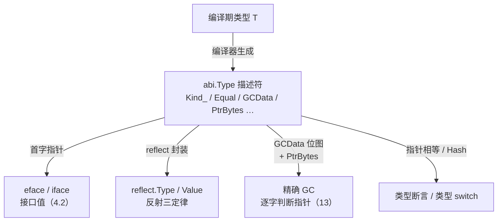

# 4 类型系统

语言的语法是给别人看的，而语法背后的数据布局才是写给机器执行的。本部分追问的正是这层落差：当我们写下一个接口，一段切片，一次defer或者一个类型参数的时候，编译器与运行时究竟
为我们准备了怎样的内存与执行机制。我们从类型系统这一全局骨架谈起，逐层进入字符串，切片，map等数据结构的内部表示，再到函数调用，演示与恐慌恢复控制流，错误作为普通值的处理范式，
以及泛型如何在不牺牲性能的前提下被实现。理解了这些实现，语言特性便不在是孤立的语法糖，而是一套彼此咬合，各有代价的工程决策。

## 4.1 运行时类型系统

Go是**静态类型系统**，类型检查发生在编译期。但是Go又保留了相当一部分运行时类型信息runtime type information, RTT1),正是撑起了接口，类型断言，类型switch,反射，以及
垃圾回收对指针的精确识别。这一节回答一个看似简单的问题：编译器那套类型，到运行时还剩下什么，以什么形式留存，又撑到哪些能力。读懂这一节里那个叫**类型描述符**的小接口，后面的接口，
反射与精确GC就都有了共同的落脚点。

下文给出的街头体是裁剪后的速写：只保留了设计相关字段，并在注释里面说明它为何存在。完整定义可对照go1.26的`internal/abi/type.go`与`reflect`包。

### 4.1.1 每个类型都有一个描述符

编译器为程序里面用到的每个类型都生成一份类型描述符。再go1.26的源码里面它叫`abi.Type`，运行时内部还沿用旧名`_type`。描述符被编进了只读数据段，整个程序运行期间常住不变。
同一个类型在一个程序里面通常只有一份描述符，这一点后面判断类型是否相同时会用到。

```
// abi.Type:一个类型在运行时的表示
type Type struct {
	Size_		uintptr	// 该类型一个值多少字节，分配和拷贝都要它
	PtrBytes	uintptr // 值的前若干个字节里面可能含有指针，GC只扫描到这里
	Hash		unit32	// 类型的哈希，类型switch,接口表查找的时候避免重算
	TFlag		TFlag	// 标志位：是否具名，是否带UncommonType, GC位图按需生成
	Align_		uint8	// 该类型变量的对齐
	FieldAlign_	uint8	// 作为结构体字段的对齐
	Kind_		Kind	// 种类：int struct slice chan...决定如何解释这块内存
	// 比较该类型是否相等:(指向A,指向B) -> == ?
	// 编译器按照类型结构合成map,接口比较==运算都落它身上
	Equal func(unsafe.Pointer, unsafe.Pointer) bool
	// GC 指针位图：标出该类型哪些字（word)是指针，精确 GC据此扫描
	GCData 		*byte
	Str 		NameOff // 类型名在名字表里的偏移
	PtrToThis	TypeOff	// 指向*T描述符的偏移，构造指针类型时候复用
}
```

每个字段都为某种运行时能力而存在。Size*是分配器和值拷贝的依据。Kind*是一个枚举，告诉行时这块内存那种类型解析。

```
    type Kind uint8
    const (
    	Invalid Kind = iota
    	Bool
    	Int
    	Int8
    	// ...
    	Array
    	Chan
    	Func
    	Interface
    	Map
    	Pointer
    	Slice
    	String
    	Struct
    	UnsafePointer
	)
```

Kind只区分到种类，并不区分具体类型： type Celsius float64 于 float64的Kind都是Float64,但是他们是不同的类型描述符。Equal是编译器为该类型合成相等函数，map的键比较，
接口值比较，== 运算都落到它身上；当TFlagRegularMemory置位时，整个值是一段无内容填充的连续内存，比较退化成一次memequal,无需逐字段递归。

带方法的具体类型还在描述符后面紧跟一段UncommonType(由TFlagUncommon标记），记录方法表：而struct, slice, map, func 等各自还有把Type内嵌在首部扩展描述符号（如
StructType, SliceType), 多出元素类型，字段列表等信息。换言之，abi.Type是所有类型描述符的公共前缀，运行时先读Kind\_判断种类，再把指针强制转换成对应的扩展类型去读取更多字段。

### 4.1.2 从编译期到运行时的桥

类型描述符的意义，在于它是把编译期的类型搬运到运行时的唯一载体。最直接的用处时空接口。any(即interface{})再运行时就是一对：

```
    // 空接口运行时（abi.EmptyInterface速写）
    type EmptyInterface struct {
    	Type *Type	// 指向动态类型的描述符
    	Data unsafe.Pointer //指向实际数据
    }
```

把一个具体值装进any,编译器要做的事是：把该类型的描述符地址填进Type,把数据地址填进Data.于是这个接口里面装的到底是什么类型这个运行时问题，化简为读出Type指针，看它指向哪份类型描述符。
类型断言x.(T)，类型switch都建立在这次读取之上：拿Type指针（或者它的Hash）去和目标类型对比。带方法的非空接口多一层ITab(接口方法表),其分发机制预留到4.2详谈，这里需要记住的是：无论
空接口还是非空接口，第一个字最终都通向一份abi.Type.

这条桥是单向收窄的。编译期，类型是一套丰富的，可推导可以检查的静态信息；过桥之后，运行时手里只剩下这些描述符，外加接口值里面的一个数据指针。Go能在运行时做的一切类型相关的动作，
类型断言，反射，GC扫描，本质上都是这有限的两样东西上做文章。

### 4.1.3 名义类型与类型标识

Go的具体类型时名义的(nominal): 类型的身份由它的声名决定，而非它的结构决定。

```
type Celsius float64
type Fahrenheit float64

var c Celsius = 100
var f Fahrenheit = c	// 编译错误：不能把Celsius赋值给Fahrenheit
var x float64 = c		// 同样错误： Celsius不是float64
```

Celsius与Fahrenheit底层都是float64,三折kind也都是Float64，却是三分不同的描述符，互相不能赋值。这道屏障不是运行时检查出来的，而是编译期拒绝的；它的价值在于让温度这个语义
无法被悄悄当成另外一种温度或者裸浮点误用。类型标识的精确规则，何时两个类型相同，可赋值，可转换，由语言的Types与Type identity两节定义。

名义身份在运行的时候兑现方式格外简洁:因为同一个类型在程序里面只有一份描述符，判断两个值是否是同一个类型，只需要比较他们描述符指针是否相等，一次指针比较即可。类型switch
为加速还先比较Hash,哈希不等则比不相同，省去指针结引用。

把这一点和接口对照，能看出来Go在类型系统上的一处可以分工。具体类型用名义身份，Celsius不会被误认为float64; 而接口的满足是结构化的，一个类型只要具备接口要求的方法集，就自
动满足该接口，无需显式声名它。名义保证了具体类型的边界清晰，结构化保证了接口的解耦和组合。两种身份规则各管一段，是Go类型系统简单而够用的由来之一。

### 4.1.4 反射:建立在描述符上的自省

reflect包让程序在运行时检视，操作任何类型的值。他不是魔法，而是对4.1.2那两个字的一层包装：reflect.Type封装了\*abi.Type,reflect.Value同时握住了类型描述符与数据指针。

```
    var x float64  = 3.4

    // 定律一：反射对象由接口值得来
    // TypeOf/ValueOf的入参数是any,本质上读取EmptyInterface的Type与Data
    t := reflect.TypeOf(x)	// t.Kind == reflect.Float64,读的是描述符的Kind
    v := reflect.ValueOf(x)	// v同时有*abi.Type与指向数据的指针

    // 定律二：反射对象还可以还原接口值
    var i any = v.Interface{}	// 把Type与Data重新拼回一个接口

    // 定律三：需要修改反射对象，它必须可设置
    p := reflect.ValueOf(&x).Elem() // 经由指针拿到可寻址的Value
    p.SetFloat(7.1)
```

第三条定律的可设置并非额外规则，而是接口布局的必然：reflect.ValueOf(x)装进接口的是x的副本，改变它不会改动原变量，于是反射拒绝设置：只有先设取&，再Elem解引用，Value
里握住才是原变量的地址，设置才有意义。理解了接口两个字，三定律便从需要记忆的规则变回布局推论。

反射强大，代价也实在：它饶过编译期类型检查，慢于直接代码，写错只有在运行时才暴露。Go的态度是能不用就不用，把它留给序列化（encoding/json）,ORM等需要泛化处理任意类型的库。Go1.18
引入泛型正是要让一大类过去只能靠反射的泛化代码，重新获得编译期类型安全与零反射开销。

### 4.1.5 GC指针位图：描述符如何驱动精确扫描

描述符里面GCData与PtrBytes是垃圾回收的命脉。Go用的是精确GC：扫描一块对应时，回收器必须确切知道哪些字是指针，哪些是普通数据，绝不能把一个碰巧像地址的证书误当指针去追。这份哪些字是
指针的信息，正是由类型描述符提供。

GCData通常指向一张指针位图（ptrmask）：每一位对应类型的一个字，1标识指针，0标识非指针，位图长度至少覆盖到PtrBytes。回收器扫描某个对象，就是按照它的描述符取出这张位图。逐位决定要不要
跟进。PtrBytes给出一个上限：给类型的指针只可能出现在前PtrBytes个字节内，其后纯是数据，扫描到此即可收手，无需走完整个值。一个尾部全是大数组的结构因此可能省下可观的扫描。



go1.26在这里有一处值得记下的演进：TFlagGCMaskOnDemand标志。早先每个类型的指针位图都在编译期算好，编进二进制，对与含大量类型的程序只会让只读代码膨胀。设置标志以后，GCData不止直接
指向位图，而是一个`byte`,真正的位图由运行时首次需要时按需生成并缓存，以一点运行时的计算换取更小的二进制。这是描述符这一设计在被持续打磨的一个缩影：接口文档，背后的存储策略随着版本演化。

这张位图前面几节收束到一处：编译器的类型T收窄到一份abi.Type，而这份描述符同时也是接口，反射，GC，类型断言四条线的路共同源头。一个小小的只读结构，撑起了Go全部运行时类型能力。

### 4.1.6 跨语言对照：RTT1的浓淡

运行时还保留了多少类型信息，各语言的取舍差异很大，沿着这条轴排开，能看清楚Go站在何处。

Java和C#在浓的一端。每个对象在堆上都带一个指向元数据的头，运行时可经Class/Type取得字段，方法，注释乃至泛型签名，反射几乎无所不能，这是其框架生态（依赖注入，序列化，ORM,动态代理）的
根基。代价是每个对象的元数据指针开销，以及反射调用的运行时成本。

C++在淡的一端，恪守不为不用的东西付费。默认几乎不带运行时信息，唯有开启RTT1后，typeid与dynamic_cast才有限可用，且仅对带虚函数的多态类型有效；非多态类型在运行时根本无从查询其真实类型。

Rust走的更远，没有通用的运行时反射。 std::any::Any只能借一个TypeId做有限的向下转型，拿不到字段与方法的结构。Rust把泛型彻底交给编译期的泛型与trait,信奉零运行时成本，序列化这类需由serde
在编译期用过程宏生成代码，而非运行时反射。

Go落在中间偏够用的一侧：保留足以支撑接口，类型断言，类型switch，反射与精确GC的运行时类型信息，但是不像Java那样为每个对象挂一份富元数据。它把信息集中按照类型唯一的描述符里面，对象本身不背负
类型头，普通值在内存里面就是裸数据，类型信息经有接口或者描述符指针间接获得。这份取舍呼应Go的一贯的性格：要简单，要够用，要为运行时几样实在的能力（精确GC,接口分发，反射）留下恰好够用的元数据，
不多不少。

## 4.2 接口

接口是Go类型系统的灵魂。它让行为与实现解耦，由用一种与众不同的方式做这件事情：结构化，隐式满足，区别于大多数主流语言。这一节看接口在运行时怎么表示，方法怎么动态分发，类型断言怎么落地，以及这套
设计放进堕胎的谱系里处在哪个位置。沿用前面几节的做法，下文给出的结构体都是裁剪后的速写：只留下与设计相关的字段，注释说明它为何存在。完整定义可对照`runtime/runtime2.go`，i`nternal/abi/iface.go`与`runtime/iface.go`.

### 4.2.1 两种表示：iface与eface

接口值在运行时一律是两个字宽，但是分为两种。带方法的接口用iface:一个指向itab的指针，加一个指向具体数据的指针。空接口interface{}(即any)用eface:一个指向类型信息\_type的指针，
加一个数据指针。空接口没有方法，于是直接存类型即可，省下一层间接：

```
    // 非空接口：带方法，故需要方法表
    type iface struct {
    	tab *itab	// 接口类型 x 具体类型的方法表
    	data unsafe.Pointer	// 指向具体值
    }

    // 空接口any:无方法，直接挂类型信息
    type eface sturct {
    	_type *_type
    	data unsafe.Pointer
    }
```

data存的是指针而非值本身。把一个int放进接口，运行时会把它装箱（boxing）到一处可寻址的内存，再让data指过去，这也是接口会引入一次分配这一个性能直觉的来源。两字表示理解
后续的一切地基：动态分发，类型断言，乃至下面的nil陷阱，都是它的直接推论。

### 4.2.2 带类型的nil:一个两字表示的直接推论

接口值等于nil,当且仅当类型与数据两个字都为nil。只要动态类型那个字被填上，哪怕数据指针为nil，接口也不等于nil。这条规则单看抽象，落到代码上就是著名的带类型的nil陷阱：

```
    type MyErr struct{}

    func (*MyErr) Error() string { return "boom" }

    func do() error {
    	var p *MyErr = nil	// 一个值为nil的具体指针
    	return p
    }

    func main() {
    	if err := do(); err != nil {
    		// 会进来 err的类型非nil,故err != nil
    		fmt.Println("non-nil", err)
    	}
    }
```

do返回的error里面，tab指向的itab(非nil), data才是那个nil指针。接口于是非nil。函数签名返回error时尤其经常踩这个坑：正确的做法是显式 return nil, 而不是一个恰好为nil的具体指针。

### 4.2.3 itab: 方法表与动态分发

itab(interface table)是非空接口的核心。它为**每一对接口类型x具体类型**缓存一份，记录接口类型，具体类型，一个类型哈希以及最关键的Fun方法地址表。

```
    // itab:一对接口x具体类型的方法表
    type ITab struct {
    	Inter *InterfaceType	// 接口类型（要求哪些方法，按照什么顺序）
    	Type *Type	// 具体类型（动态类型）
    	Hash uint32	// Type.Hash的副本，供类型switch用
    	Fun [1]uintptr	// 变长：具体类型实现接口各方法的地址; Fun[0] == 0
    }
```

Fun表的排序是由接口固定的（按照接口声明的方法字典序）,与具体的类型怎么写无关。这正是动态分发的机关：编译器在编译期间就知道某个方法在接口中的序号，调用的时候只需要按照需要去Fun取地址，间
接跳转。

```

    var v I = concrete{}
    v.Method2(args)

    // 大致等级于
    // fn := v.tab.Fun[2]
    // call fc(v.data, args)
```

序号是静态的，地址是动态的，这就是动态分发：统一个调用点，v装的具体类型不同，跳转的代码就不同。itab的构造（getitab)并不便宜，要逐一核对具体类型是否实现了接口要求的方法，并填写好整
张Fun表。所以运行时用一个全局哈希表itabTable把构造好的itab缓存起来，相同的接口x类型对只算一次。getitab的快路径是无锁的：先用inter.Type.Hash ^ typ.Hash做哈希去itabTable.find,
命中即返回；找不到才加锁，构造，itabAdd写回。另外一类itab由编译器静态生成，在itabsinint时就预先填写进表里面。

### 4.2.4 机构化满足：解耦的代码与收益

通过方法表做间接调用，本质上就是C++函数数表（vtable）那套机制。Go真正与众不同的，是**接口的满足是结构化**，隐式的：一个类型只要拥有接口要求的方法集，就自动满足该接口，无需像Java/C#那样
显式implements。这就是结构化类型(struct typing)对名义类型(nominal typing)的选择。

它的收益是解耦。你可以为别人的类型，甚至标准库的类型，定义出来它们恰好满足的接口，而不必改动哪些类型一行代码`io.Reader`/`io.Writer`这种小接口普普遍适配的生态，正源于此：bytes.BUffer, os.File,
net.Conn谁都没声明自己实现`io.Reader`，却能在任何时候接口`io.Reader`的函数接住。接口与实现再两端各自演化，中间靠方法集自然对齐。

代价有两面。其一，隐式满足让谁实现了什么不在一目了然，得靠工具或者阅读才能确认（这也是`var _ io.Reader = (\*T)(nil)`这种编译断言惯用法存在的原因）。其二，接口是间接的：4.2.3那次Fun[n]取地址
加间接跳转，编译器通常无法跨接口边界内联，于是失去了内联本可带来的优化。热路径上一个平凡调用的小方法，走接口和走具体类型，性能可能差出可观的一截。抽象从不白来，它把灵活性买到手，付出的是这点运行时的间接成本。

### 4.2.5 类型断言与类型switch

x.(T)断言接口的动态类型。它的实现取决于T是什么：

- T是具体类型时，断言退化成比较接口里面的动态类型字于T是否同一个\_type,一次指针比较即可。
- T是另外一个接口(x.(SomeInterface))时，要的是x的动态类型是否满足SomeInterface，这需要现算或者查一个itab,正是4.2.3的getitab那条路。

类型switch `switch v := x.(type)`借助itab.Hash（即动态类型哈希的副本）做快速分支：先按照哈希粗筛选case,再精确对比类型。这里要分清楚两个不同的哈希：itab.Hash是Type.Hash副本，服务于类型switch，由编译器为程序中出现的switch的静态生成的itab携带；而itabTable自己查表用的是另外一个哈希inter.Type.Hash ^ typ.hash。运行期间动态构造的itab其Hash的字段被置为0，因为他们从不参数类
型switch。这点解析了一个性能直觉：频繁的接口断言，尤其是断言到接口的那一类，以及大型type switch，都不是零成本，热路径上值得留意。

### 4.2.6 方法集：值还是指针

接口持有的是值还是指针，由方法集规则决定，这也是4.2.1两字表示的延伸：指针接收者的方法不在值的方法集合里面。

```
    type T struct{}

    func (t T) read() {}	// 值接收者：T和*T都有
    func (t *T) Write() {}	// 指针接收者：只有*T有

    type ReadWriter interface { Read(); Write() }

    var _ ReadWriter = &T{}	// 可以：*T同时拥有 Read与Write
    var _ ReadWriter = T{} 	// 编译错误：T的方法集缺少Write
```

原因并不难想:调用指针接收者的方法要拿接收者的地址，而接口里面装的若是一份值的副本，它未必可寻址，于是语言所行把这类方法排除在值的方法集之外。

### 4.2.7 设计取舍：小接口与接受接口，返回结构体

Go的接口哲学浓缩成几条社区箴言，它们都不是风格偏好，而是上看这套机制的工程结论。

**接口越小越好**：简单方法接口等最容易被满足，最易组合。Rob Pike的说法是：The bigger the interface, the weather the abstraction, 接口越大，能够满足他的类型就越少，解耦收益越薄。
接收接口，返回结构体：函数参数用接口以求通用，让调用方自由替换实现，返回值用具体类型，避免过早抽象，也让调用方拿到完成能力而非被夹口裁剪过的实图。再加上4.2.2的类型nil，4.2.6的值域指针方法
集，这几条凑在一起，构成了写Go接口时绕不开的常识。他们共同的底色是：接口是用来解耦的轻量级别抽象，能小就小，能抽象就晚抽象。

### 4.2.8 跨语言对照

Haskell这条线值得单独点出：类型类用字典传递实现，一个实例就是一张方法字典，在调用处隐式传入。这正是接口itab的编译器版本，也是Go泛型实现里面用的同一思想，类型类域字典是同一个概念的两端，一端
再运行期（接口itab）,一端是编译期（泛型字典）。Go的独特之处，是把vtable式的高效动态分发与结构化，隐式满足的松耦合结合在一块：既要运行时的实在表示，又要写代码是的轻量解耦。理解了iface/itab，就
理解了这份结合是如何落地的。

## 4.3类型别名

type A = B（类型别名）与 type A B（定义新类型）只差一个符号，语义却根本不同。前者只是给了一个已存在的类型取了个新名字，后者回造出一个全新的，有独立表示的类型。这个区别看似细微，却牵动着类型
相等，方法集，可赋值性这一整套规则，也牵动着Go一贯关心的工程问题：当一份代码不在由原作者维护，却仍要在不破坏兼容的前提下演化时，类型该如何在包之间迁移。这一节先把别名与类型定义的语义讲清，再交代
别名为何在Go1.9被引入，最后看它在Go 1.24迎来泛型能力。

### 4.3.1 别名vs类型定义

按照语言规范，类型声明分为两种：别名声明（alias declaration）与类型定义（type definition）。两者分界就是那个等号。

type Celsius float64 是类型定义，它创建出来一个新的不同类型，与给定类型又形同的底层类型与操作。Celsius与float64从此是两个不同的名义类型：各自自己的标识，可以挂自己的方法，
彼此直接不能赋值，只能显式转换。

type byte = uint8是别名声明，它只是把一个标识符绑定到给定类型。在给标识符的作用域内，byte就充当uint8的别名。二者是同一个类型的两个名字，完全可以互换。标准库里面byte(=uint8),
rune(=int32),以及Go 1.18起any（= interface{}）。正是这样定义的预声明别名。

别名与定义类型最容易混淆，也最能体现差别的地方，是方法集。

```

    import "bytes"

    type AliasBuf = bytes.Buffer 	// 别名：就是bytes.Buffer本身
    type DefBuf	bytes.Buffer	// 类型定义：底层相同，但是方法集合为空

    func demo() {
    	var a AliasBuf
    	a.WriteString("x")	// OK: AliasBuf与byte.Buffer是同一类型，方法集完全相同

    	var d DefBuf
    	d.WriteString("x")	// 编译错误：DefBuf未继承bytes.Buffer的任何方法
    	_ = bytes.Buffer(d)	// 但是可以显式转换回去：二者底层类型相同

    }
```

DefBuf与bytes.Buffer底层类型相同，因此可以互换显式转换。但是DefBuf是一个新类型，它不继承bytes.Buffer的方法集，d.WriteString找不到接收者。AliasBuf压根就不是新类型，它就是bytes.Buffer,
方法集自然一模一样。一句话：定义新类型造出来新东西（新标识，空方法集，需要自行定义方法）,别名是给旧东西取个新名（同一个标识，同一个方法集合）。

### 4.3.3 别名为何被引入：大规模渐进式重构

别名是Go 1.9(2017)才加入的，提案自Russ Cox与Robet Griesemer，动机写的很直白：支持大规模重构期间渐进公式代码修复，尤其是一个类型从一个包搬到另外一个包。这正是Go的工程取向。

设想一份大代码库要把`oldpkg.T`搬到`newpkg.T`。在没有别名的年代,这是一次全有或者全无的破坏性改动：所有引用`oldpkg.T`的地方都必须在同一次提交里面全部改成`newpkg.T`，否则编译不过。这对大代码
库几乎无法操作。Go早已用`const`, `var`, `func`的转发声明搭起来了这种过渡桥，维度类型没有对应手段，别名补的就是这个缺口。

有了别名，迁移就能拆成几步。现在新包里面安家，再在旧包里面流一个别名做转发垫片：

```
// newpkg/t.go：类型的新家
package newpkg

type T struct { /* ... */}
// oldpkg/t.go:旧包只留一个别名，转发到新包
package oldpkg

import "path/to/newpkg"

type T = newpkg.T   // okdpkg.T与newpkg.T是同一个类型
```

关键在于oldpkg.T与newpkg.T此刻是同一个类型，而非两个仅仅底层类型相同的类型。于是旧代码可以混用，互相传值而毫无摩擦：

```
package caller

import (
    "path/to/oldpkg"
    "path/to/newpkg"
)
func use() {
    var a oldpkg.T  // 老代码：仍引用旧名，照常编译
    var b newpkg.T  // 新代码：已改用新名
    a = b   // OK:通一个类型，可直接赋值
}
```

调用方法得以分批，逐步地把 `oldpkg.T`改成`newpkg.T`，没改一处都能独立提交，独立通过CI，不必等所有引用一起就位。等到再无代码用旧名，删除掉那行代码即可。整个迁移过程，代码库始终处于可编译，可
发布状态。

别名解决的，本质上是一个软件工程问题，而非一个类型论问题。这是本书反复强调的软件工程发生在代码被非原作者维护之时一脉相承。真是因为如此，别名被刻意定位成重构脚手架，而不是日常建模手段：它不引入新
类型，不改类型标识，只在命名层面做文章，安全，可预测，却不该被滥用成给类型起一堆花名。

### 4.3.4 Go 1.24:泛型类型别名

别名落地以后，有一个缺口悬置了很久：不能带类型参数。泛型在Go1.18落地时，出于类型推断与实现复杂度的考量，刻意把泛型别名推迟了。

```

    type Set[T comparable] = map[T]bool	// 带类型参数的别名

    func demo() {
    	s := Set[string]{"a": true} 	// 使用前必须实例化
    	_ = s
    }
```

与非泛型别名一样，Set[string]与map[string]bool是同一个类型，可以互换。规范规定泛型别名使用时必须实例化：写Set而不带类型，实参是不允许的，只能写Set[string]这样具体形态。
这让别名能在泛型代码里面发送取个简短新名与渐进重构的作用，把别名机制与泛型这两条Go后期演进的主线联到了一起。

泛型别名也带来一处需要留意的边界：它不能作为方法的接收者。规范明确，若按照接收者类型是一个别名，改别名不得是泛型的，也不得指向某个已实例化的泛型类型，无论经由多少层别名或者指针。

```
type GPoint[P any] = Point
type HPoint = *GPoint[int]

func (*GPoint[P]) Draw(P) { /* ... */ } // 非法：接收者别名不得是泛型的
func (HPoint) Draw() { /* ... */ } // 非法：接收者别名不得指向已实例化的泛型类型
```

道理仍然在4.3.1那条线上：方法属于定义类型，而别名只是别名，它本身没有自己的方法集可挂。泛型别名扩展了别名的表达力，却没有改变它只是别名的本质。从实现看，编译器与go/types为别名建立了一个独立
类型节点。其中tparams/targs承载着泛型别名的类型参数与实数，而Unalias则用于把一串别名解开，拿到背后的真正类型。这层间接性是别名能换名不换身的内部依据，但它对使用者是透明的。

### 4.3.5 取舍

别名是一件可以保持的小特性，理解别名是你别名，定义类型才是新类型这一条，就能避开许多关于类型相等，方法集，可复制的困惑，这些困惑的根，都在4.1的名义类型标识规则上。它的代价正是它的克制：别名不能
挂方法，不制造标识，因此无法用来给一个旧的类型加一层语义约束这类建模，那是定义类型的活。选择别名还是定义类型，问的始终是同一个问题：你要的是换个称呼，还是换个身份。Go1.24的泛型别名把这件小工具
的适用范围延伸进了泛型，却始终守着这条边界，没有让它越界去做定义类型该做的事情。
