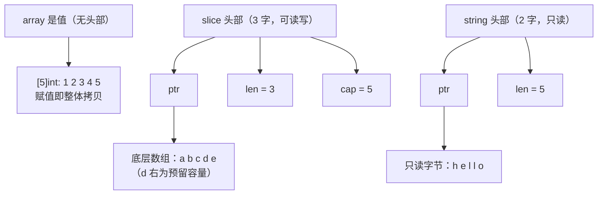
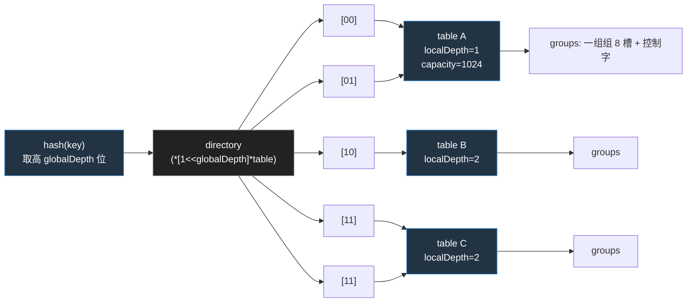

<!--
 * @Date: 2026-08-18 13:31:22
 * @LastEditTime: 2026-08-26 17:49:47
 * @Description:
-->

# 5 数据结构

切片与散列表是Go仅有的两种泛型容器，也是日常代码里面出现得最频繁的两种数据结构，它们把一段联系的内存如何被描述，被共享，被增长这一组看似朴素的问题，落成了具体的运行时布局与
长的策略。于是append的种种惊喜，切片别名的陷阱，map的随机遍历与并发即崩，都不再是需要死记硬背的规则，而是布局与权衡的必然推论。本章分四个主题展开：先把数组月切片的内存模型
与增长策略摆清楚，在单独看字符串不可变所代码的零拷贝转换与安全契约；随后讲透散列表的一般原理与哈希洪水攻防，最后落到Go 1.24基于Swiss Table彻底重写，看它如何在缓存，安全与渐进
扩容之间的取舍。一路看Go如何把这些复杂度藏进用户看不见的地方，只是在上层留下朴素的`s[i]`与`m[k]`。

## 5.1 数组与切片

数组是值。[5]int就是连续5个int，长度是类型的一部分：[5]int与[6]int是两个不同的类型。赋值，传参，作为struct字段，数组都是整份拷贝。正是因为如此，大数组在Go里面反而更少。传来传去更贵，要传通常
传它的切片或者指针。

切片是对某段底层数组的视图。运行时里面它就是三个字的头部，可对照`runtime/slice.go`：

```
// runtime：切片的运行时表示(slice.go)
type slice struct {
    array unsafe.Pointer        // 指向底层数组中本切片的首元素
    len int                     // 长度：可见元素个数
    cap int                     // 容量：从array起到底层数组的末尾元素的个数
}
```

len是你能索引到的范围，cap是在不重新分配的前提下还能涨到多大。两者分离正是切片能走视图的关键：s[1:3]只是改头部里面的三个字段，不碰底层数组。

字符串是只读的字节序列。它的头部更省，只有两字，没有cap:

```
// runtime:字符串的运行时表示(string.go)
type stringStruct sturct {
    str unsafe.Pointer  // 指向只读字节
    len int             // 字节数(不是rune数)
}
```

少掉的那个cap不是疏忽，而是设计：字符串不可变，长度一经确定就不再增长，自然无需容量。不可变换来三件好事：多个字符串可安全共享同一段底层字节，字节s[i:j]无需拷贝，字符串可直接做map键而不必防御性
复制。代价是任何修改都要生成新串。字符串的转换与拷贝见细节。



数组没有头部，它就是那段内存；切片和字符串都是头部+别处的内存。这一句话是后面所有行为的根。

### 5.1.2 动态数组与摊还分析

切片是动态数组（dynamic array）的Go化身：一个会按需要增长的连续数组。它给出的核心保证是，尽管偶尔需要重新分配并搬迁全部元素，连续n次append的摊还(amoritized)代价是均摊O(1)。

直觉来自成倍增长。设每次容量满了就乘以一个常数因子g > 1（最简单取g=2,翻倍）。把n次append看成整体，真正昂贵的只有触发搬迁的那几次，且搬迁规模呈几何级数递减。从空到n，各次搬迁移动的元素数约为
...,n/4,n/2,n，倒过来求和：

$$
\sum_{i=0}^{\infty} \frac{n}{2^i}=n+\frac{n}{2}+\frac{n}{4}+\cdots<2n
$$

总体搬迁成本被2n封顶，再加上n次写入新元素本身的O(n), n次append合计O(n),平摊到每次就是常数。这是<<算法导论>>里面摊还分析的范例，用聚合法（aggregate method）或者势能法（potintial
method）都能给出同样的界限。

关键在于因子必须是乘性的。若改成每次只多预留固定的c个槽，第k次扩容要搬迁约kc个元素，总成本$\sum_{k=1}^{n} k = \frac{n(n+1)}{2} = \Theta(n^2)$，平摊后每次退化成O(n)。一个常数因子，
区分了线性和平方。乘性增长带来了均摊常数，代价是平均约g/2倍的空间浪费，这正是增长因子与那场永恒的空间与时间之争。

### 5.1.3 append的正常策略

理论上乘个常数因子就够了，工程上Go做的更细。核心在`runtime.growslice`,它先用到`nextslicecap`算出来一个目标容量，再交给内存分配器对齐。先看容量这一步（对照go1.26的`runtime/slice.go`）：

```
// runtime:计算新容量(slice.go，节选注释)
func nextslicecap(newLen, oldCap int) int {
    newcap := oldCap
    doublecap := newcap + newcap
    if newLen > doublecap {
        return newLen   // 一次append太多，直接给到需要的长度
    }
    const threshold = 256
    if oldCap < threshold {
        return doublecap    // 小切片：翻倍
    }
    for {
        // 从2x平滑过渡到1.25x:大切片更看重省内存
        newcap += (newcap + 3 * threshold) >> 2
        if uint(newcap) >= uint(newLen) {
            break
        }
    }
    return newcap
}
```

策略以256为界。就容量小于256时候翻倍，小切片增长激进，图的是少搬几次。到达或者超过256后，改用`newcap += (newcap) + 3*256) >> 2`,即每轮增加1/4（newcap + 768）。当newcap还小的时候，
那个`3/4*256`的常数项占用大，倍率接近2；当newcap很大的时候常数项忽略，倍率趋于1+(1/4)=1.25。于是得到了一条从2倍连续滑向1.25倍率的曲线。比Go1.18之前那种1024从2倍硬跳到1.25倍更圆滑，避开
了零界点附近的容量浪费。

算出的`newcap`还没完。`growslice`接着把newcap x 元素大小交给了roundupsize向上取整到内存分配器的尺寸类(size class)，再按照对齐后的字节反推会元素个数：

```
// runtime: growslice中按照尺寸对齐（slice.go，以指针大小访问元素为例子）
capmem = roundupsize(uintptr(newcap)*goarch.PtrSize, noscan)
newcap = int(capmem / goarch.PtrSize) // cap按照被撑大到尺寸边界
```

所以一个切片实际的cap场略大于你心算的值。它是乘性增长+尺寸对齐两部合成的结果：前者保证摊还O(1),后者顺手把分配器就要浪费那点边角料坏给你。这解释了那个常见的困惑，append之后cap为什么偏偏是这
个数：不必去背，理解这两步即可。

### 5.1.4

切片是视图，多个切片可以共享一段底层数组。这是性能的来源，也是bug的来源。

`append`可能共享，也可能不共享底层数组。这是最常背踩的一处。若append后没有超出cap，返回的切片与原切片共享底层数组，对一方元素的写会穿透到另外一方；一旦超出cap触发重新分配，两者就此分家：

```
a := make([]int, 3, 5) // len = 3, cap = 5
b := append(a, 1)   // 没有超过cap: b与a共享底层数组
b[0] = 99       // a[0] 也变成了99
c := append(b, 2, 3, 4) // 超过 cap = 5: c重新分配，与a/b脱钩
c[0] = 7    // a/b不受影响
```

有时候共享，有时候不共享让函数边界变得危险：把一个切片传进函数，函数里面append它，外面的切片看不到它的改动，取决于当时的cap。完整切片表达式a[lo:hi:max]是治本的工具，它显式地把新切片cap限制
到max，于是下一次append必然超容，必然拷贝，必然切断别名：

```go
view := buf[off: off+n, off+n] // cap == len,调用方append即触发拷贝
```

子切片导致内存泄漏。切片头部只要活着，它指向的整段底层数组就回收不掉，哪怕你只用得着开头十个元素：

```
small := big[:10]   // small的cap仍然覆盖big的整段底层数组
// 只要small可达，big那块（可能很大）就一直被钉住
```

需要长期持有一小段时候，应该copy出独立副本，或者用标准库的slices.Clone切断引用。Go1.21起的slices包把这些操作做了显式，易读的形式，连删除元素后的把尾部清零以便GC回收，这种容易漏掉的细节都替你
照顾到了：

```
// slices.Delete删除[i,j）后，会把空出来的尾部清零，避免炫酷啊引用钉住对象
func Delete[S ~[]E, E any](s S, i, j int) S {
    // ...
    s = append(s[:i], s[j:]...)
    clear(s[len(s):oldlen]) // 关键：零/置空淘汰元素，利于GC
    return s
}
```

手写 `s = append(s[:i], s[i+1]...)`删除元素，少了这一句clear，被删除的指针的指针仍然留在底层数组的尾部，仍然被GC视为存活，是一处隐藏的泄漏。能用slices就别手写。

### 5.1.5跨语言对照

动态数组是普适抽象。C++的`std::vector`，Rust的`Vec<T>`，Python的`list`，Java的`ArrayList`，本质上都是摊还O(1)的成倍增长数组。差异集中在两点：增长因子和视图。

增长因子是对各家那场空间与时间之争的不同答案。多数C++标准库实现用2倍或者1.5倍，python的list用1.125倍，增长保守，稳态更省内存；Java的 ArrayList是1.5倍。Go用5.1.3那条从2
滑向1.25的曲线。因子越小，搬迁越频繁，越大越少搬，越费内存，没有普适最优，只有对各自典型的负载权衡。

视图维度上，Go的切片与Rust的`&[T]`（slice）是同一类东西：指向他人数组的胖指针，零拷贝引用子段，自己不拥有内存。而`std::vector`，`Vec`, `list`, `ArrayList`是拥有型容器，
他们持有并释放底层内存。C++知道C++20才把视图独立成`std::span`，Rust则一开始就把拥有的`Vec`与借用的`&[T]`在类型层面分清，借助借用检查器在编译期堵住别名写入。Go选了另外
一条路：把拥有的动态数组（底层数组）与视图（切片）统一成一个切片类型，换来语言的简洁，代价正是5.1.4那些别名陷阱。间接与安全之间，Go这次把砝码放在了简洁一侧，并把别名的纪律交给
了程序员。

## 5.2字符串与零拷贝转换

字符串与切片同源，运行时里面都是头部+别处的内存。但是它只读，不可变，自成一类。不可变换来共享与免拷贝的好处，也带来了直接代价: `string`与`[]byte`互换默认要拷贝一份字节。本节剖开这份拷贝，
看编译器在哪些场景下把它省略，再到Go 1.20给出手动零拷贝工具，以及由此带来的安全契约。

### 5.2.1 字符串与[]byte的转换

字符串不可变带来一个直接代价：`string`与`[]byte`互默认要拷贝一份字节。原因正是不可变，`[]byte`可写，若让它直接指向某个字符串的底层字节，改`[]byte`就等于改了那个不可变的字符串，破环了一段
共享假设。所以运行时老老实实`memmove一份`:

```go
// runtime: []byte -> (string.go)
func slicebytetostring(buf *tepBuf, ptr *byte, n int) string {
    // ...
    p := mallocgc(uintptr(n), nil, false) // 分配新内存
    memmove(p, unsafe.Pointer(ptr), intptr(n)) // 拷贝字节
    return unsafe.String((*byte)(p), n)
}
```

这份拷贝再热路径上可能可观。好再编译器认得几类转换后字节立刻被读，不可能被改的模式，把拷贝省略。最常见的两个是用`[]byte`当临时map键查询，与对`[]byte(s)`直接rang:

```go
var m map[string]int
_ = m[string(b)]
for i, c := range []byte(s) { // 编译器：仅遍历，不持久化，无需真正建切片
    _, _ = i, c
}
```

要在自己代码里面零拷贝转换，Go 1.20给了正式工具：`unsafe.String(*byte, len)`是一段把字节当字符串看，`unsafe.StringData(string) *byte`取字符串底层指针,`unsafe.Slice` / `unsafe.SliceData`是切片侧的对应物。它们取代了过去靠`reflect.StringHeader`/`reflect.SliceHeader`手工拼写的脆弱写法（那种写法在GC移动与字段对齐的时候并不可靠）。代价是你要自己担保转换之后那段
字节不再被修改，否则就把不可变契约捅破了：

```go
// 零拷贝,且你能保证b此后只读时，才可以这样转
s := unsafe.String(unsafe.SliceData(b), len(b))
```

## 5.3 散列表:原理与安全

> Go的map在2024年随着Go 1.24完成了一次罕见的切底重写，从沿用十四年的经典桶式散列表换成了基于Swiss Table的实现。本章讲清楚散列表的一般原理与攻防。重写的来龙去脉留到5.4专门交代。

map是Go仅有的两种泛型容器（另外一种是slice）。它由运行时实现，编译器辅助布局，本质上是一张散列表。读者写下`m[k]`时，编译器把它翻译成`runtime.mapaccess`，`runtime.mapassign`
一组函数的调用，真正的存储，查找，扩容都发生在`internal/runtime/maps`包里面。这一节先把散列表的一般原理与攻防讲清楚，为下一节落到Go自己的两代实现（1.0至1.23的经典桶式设计，以及1.24
起的Swiss Table设计）打底。理解这里的取舍，才能看清楚后者为何值的一次伤筋动骨的重写。

### 5.3.1 散列表的两条路线：链地址与开放定址

散列表要解决的核心矛盾，是把一个几乎无穷大的键值空间压缩进一段有限的连续内存。哈希函数h把键映射到`[0, m)`的槽位下标，理想情况下一次访问即可定位。但映射不可能单射，两个键算出同一个下标即是
碰撞，如何安置碰撞的键，分出了两条历史悠久的线路。

**链地址法**（chaining）让每个槽位挂一条链表，碰撞的键依次串到链上。它实现简单，删除干净，对哈希质量不敏感，代价是每个元素多一个指针，缓存局部性差（链表节点散落到堆上）。设装填因子 a = n/m
(元素数/槽位数),在均匀哈希假设下，一次不成功查找平均要比较约等于a个元素，成功查找约等于1+a/z个。链地址法允许a > 1, 性能随着a线性退化。

**开放定址法**（open addressing）反其道而行：所有元素都存在槽位数组本身，碰撞的时候按照某种探测序列去找下一个空槽。它没有指针开销，数据连续排列，缓存友好，但要求a < 1且随着a->1性能极具恶化。
均匀探测假设下，一次不成功查找平均探测

$$
\frac{1}{1-\alpha}
$$

次。这条曲线在a = 0.9时候已是10，在a = 0.99时候是100。开放定地址放的全部工程努力，都在对抗这条发散曲线。

探测序列的选择又分了几支。线性探测(linear probing)走h, h+1, h+2，...,实现简单，缓存命中最好，但是相邻被占槽会连成长块（primary clustering），不成功查找代价升至：

$$
\frac12\left(1+\frac{1}{(1-\alpha)^2}\right)
$$

退化比较均匀探测更快。二次探测(auadrtic probing)走h, h+1, h+3, h+6,...这类步长递增的序列，打散聚集；双重哈希（double hasing）利用第二个哈希函数定长，逼近均匀探测的理论曲线，但是每次探测
多一次哈希。还有Robin Hood哈希(Celis 1985)：插入哈希时候发现自己离理想槽位的距离已经超过了当前占据者，把对方挤走，自己入住，从而压低了探测距离的方差，使查找代价可预测。这些技巧的共同目标，是
在不放弃开放定地址法连续内存优势的前提下，把那条发现曲线压平。Swiss Table真是这条线路上的集大成者。

5.3.2 哈希洪水：散列表的安全面

散列表的O(1)平均意义上的。最坏的情况下，若所有键值碰撞到同一个槽位，链地址法退化成一条链，开放定地址法退化成线性扫描，单次操作变成O(n),n次插入合计`O(n*n)`。在多数算法里面这是脚注，但是Crosby与
Wallach在2003年指出，它是一类可被远程触发的拒绝服务漏洞：当哈希函数固定且公开，攻击者可离线构造出一大批碰撞到同一个桶的键，再把它们作为HTTP头，JSON字段，POST参数喂给服务器。服务器端把这些键
塞进map，本应该O(1)的插入退化成O(n),少量请求即可耗尽CPU。这类攻击被称为哈希洪水（hash-flooding）。

防御的关键，是让攻击者无法预知哈希结果，办法是给哈希函数注入一个进程私有，运行时随机生成种子（seed）。通一个键再不同进程，甚至同一个程序的不同map里，哈希值都不同，离线构造碰撞失去靶子。Aumasson
与Bernstein在2012年提出的SipHash，是专门为此设计的带密钥短输入的伪随机函数，被Python, Rust，Ruby等广泛采用的默认字符串哈希。

Go走的是同一个思路选择不同。运行时启动的时候，alginit按照CPU指令挑选哈希算法：在支持AES指令的平台（amd64的AES/SSSE3/SSE4.1，arm64的AES）上启用基与AES论函数的aeshash，并从操作系统读取随
机数据填充密钥；否则回退到带随机种子的非加密哈希。

```go
// runtime/alg.go:启动按照CPU能力选择哈希算法
func alginit() {
    if (GOARCH == "amd64" || GOARCH == "386") && cpu.X86.HasAES && cpu.X86.HasSSSE3 && cpu.X86.HasSSE41 {
        initAlgAES()
        return
    }
    if GOARCH == "amd64" && cpu.ARM64.HasAES {
        initAlgAES()
        return
    }
    // 无AES:用辅助向量/ /dev/urandom 的随机数据初始化 haskey
    getRandomData(hashkey[:])
    hashkey[0] |= 1 // 保证为奇数，散列质量更好
}
```

随机性还不止进程级。新版map的每个实例在创建时候都会算出一个send uintptr，同一个进程内不同map的哈希也彼此独立。这一层随机化也正是Go规范不保证rang遍历顺序的原因：顺序本来就随种子浮动，运行时
索性在叠加一个随机起点，迫使使用者不要依赖任何遍历次序。哈希洪水的的防御与遍历顺序不确定，在这里是同一枚硬币的两面。

## 5.4 Swiss table与Go 1.24的实现

5.3讲清楚了一般原理与攻防：两天碰撞处理线路，以及哈希洪水的防御。本节落到Go自己的两代实现，先剖开Swiss Table这一现代开放定址设计，再看Go 1.24如何把它落地，为此取代了什么，以及由实现推倒
出的两条语言规则，最后把Go放进个假散列表的更大图景里面对照。

### 5.4.1 Swiss Table设计(abseil)

Swiss Table由Google的abseil图对提出，Kulukundis再CppCon 2017上公开。它是开放定址法的现代化身，核心创建是把哪个槽式空的，哪个槽该比较这件事情，从逐个试探变成了一次并行操作。

它把哈希值劈成两段：高57位H1决定从哪一组(group)开始探测，低7位H2作为该键的指纹。槽位以8个为一组排列，每组配一个8字节的控制字（control word），其中每个控制字节对应组内的一个槽：

```
空槽        empty       1000 0000   (0x80)
墓碑        deleted     1111 1110   (0xfe)
占用        full        0hhh hhhh   (最高位0,低7位即该键的H2指纹)
```

最高位区分空/墓碑与占用，占用槽的低7位直接存指纹。查找一个键时，先算H1定位到起始组，再拿到H2与整组8个控制字节并行比较；在支持SIMD的机器上，这是一条PCMPEQB指令，一步完成成本应8步骤
的探测。比较结实是一个为掩码，标出哪些槽位的指纹匹配；逐个核对这些候选槽的真实键即可。指纹只有7位，约1/128约等于0.7%的概率假阳性，但既然匹配后总要做一次完成键的比较，假阳性知识偶尔多
比一次，不影响正确性。

控制字让另外两个高频判断同样退化成一次运算：本组没有空槽，（matchEmpty, 决定探测何时停止），哪些槽空的或者被删除（matchEmptyOrDeleted,插入时找落脚点）。这些都是8字节控制字SWAR
(SIMD Within A register)技巧，即便在没有向量指令的平台上，也只是几条普通的整数加减与位运算。

### 5.4.2 Go 1.24的Swiss Table重写

经典桶式设计（1.0至1.23）

要理解重写，看它取代了什么。Go自1.0起用的是一种桶式(buckedted)链地址法。顶层是`hmap`，持有2的B次方个桶组成的数组；每个桶`bmap`存8个键值对，外加8个`tophash`(哈希高8位，充当指纹以加速
跳过不匹配槽);同一个桶装满以后挂一个溢出桶（overflow bucket），碰撞由移除链承接。

```go
// runtime/map.go(go 1.23):经典模式map的顶层结构
type hmap struct {
    count int       // 元素数,len()直接读取它
    B uint8         // 桶数 = 2的B次方
    hash0 uint32    // 哈希种子
    buckets unsafe.Pointer  // 2的B次方个桶数组
    oldbuckets unsafe.Pointer   // 扩容的时候的旧桶数组,渐进搬迁来源
    nevacuate uintptr   // 搬迁进度：下标小于它的旧桶已经迁完
    extra   *mapextra   // 溢出桶记录
}

type bmap struct {
    tophash [8]uint8        // 每个哈希高8位，兼作哈希搬迁标记
    // 随后紧跟是8个key,8个elem,最后是*overflow指针
}
```

它的装填因子上限是`6.5/8约等于0.81`，一般超过就翻倍扩容，并采用渐进式搬迁：不一次性重新排全部元素，而是把旧桶数组留在`okdbuckets`，每次写操作顺手迁移一两个桶，把扩容成本摊到后续操作里面，
避免单词插入长暂停。这套设计稳健服役了十四年，痛点也清楚：键值与指纹分离存放，比较时先扫描tophash再跳到键，访问不连续；溢出链再高负载下退化；以及链表式的溢出桶对缓存不友好。

Swiss Table的落地：从一张表导一个目录

Go 1.24的新实现位于`internal/runtime/maps`,照搬了abseil的控制字与并行探测，又针对Go的两条额外要求做了改动：一是要支持像旧版那样渐进式扩容，避免大map扩容时的长暂停；而是map本身要能被
GC精确扫描。难点在于，开放定址法的探测序列依赖组数，一旦数组翻倍，全表所有的元素都按照新序列重排，这与渐进天然冲突。abseil原版整表扩容，Go不能照抄。

Go的解法是可扩展哈希（extendible hashing）：把一个大的map拆分成多张独立的`table`,每张table是一张完整的小Swiss Table，只服务哈希空间的一个子段；顶层Map持有一个指向这些table的目录（
directory）。哈希的最高`globalDepth`位作为目录下标，选出该键所属的table。

```go
// internal/runtime/maps/map.go：顶层Map
type Map struct {
    used uint64     // 元素总数，len()直接读它
    seed uintptr    // 本map私有的哈希种子

    dirPtr  unsafe.Pointer  // 目录 *[1<<globalDepth]*table的数组
    dirLen int  // 目标长度；小map优化时为0，dirPtr直指单个group

    globalDepth uint8       // 目录下标用哈希高几位
    globalShift uint8       //  = 64 - globalDepth,移位取下标用

    writing uint8       // 写入中标志,并发写检测靠它
    tombstonePossible bool // 是否可能存在墓碑，无墓碑可走块路径
    clearSeq    uint64  // Clear计数，遍历中检测clear
}
```

每张table自带容量与装填上限。独立扩容：

```go
// internal/runtime/maps/table.go：单张Swiss表
type table struct {
    used uint16 // 本表的元素数
    capacity uint16 // 槽位总数,恒为2的N次方
    growthLeft uint16 // 还能填几个槽才需要rehash（含墓碑记入)
    locakDepth  uint8 // 本表再目录中占用的高位数，可小于globalDepth
    index int // 再目录中首个下标;-1表示已失效

    groups groupsReference // 一组组8槽 + 控制字的连续数组
}
```

关键常量：每组`MapGroupSlots = 8`个槽，装填上限 `maxAvgGroupLoad = 7`，即每组8个槽最多填写7个，留一个孔槽保障探测序列总能终止（开发定址法的不变量：表永远不100%填满）。单张table容量
上限`maxTableCapacity = 1024`，这正是渐进式的旋钮所在。

- table容量未达到1024的时候，扩容就是把这张表换成一张双倍容量的新表，整张表重新排，代价有界限。
- 一旦达到1024还需要扩容，便不再翻倍，而是把这张表分裂成两张，各承接原哈希子段的一半，分裂时候`globalDepth`视需要加一，目录翻倍，于是单词扩容触及的元素永远不会超过1024个，大map的扩容被自然
  摊开。

目录允许多个下标指向同一张table(当某表的`localDepth`小于`globalDepth`时),这样目录翻倍并不强制每张表都立即分裂，只有真正满了才表现分裂。这套结构可扩展哈希的弹性，换来了开放定址法所缺的
渐进扩容能力。把这三层画出来，目录共享与分裂的关系便清晰了。



A表的`localDepth = 1`小于`globalDepth = 2`，于是目录前两项`[00]`,`[01]`共享它，只有当A真正填满的需要分裂时候，才会拆分成两张把localDepth提到2.

探测序列：三角数与恰好覆盖

新版的探测序列写法极简，缺暗含一条要紧的数学不变量：

```go
// internal/runtime/maps/table.go:探测序列
func makeProbeSeq(hash uintptr, mask uint64) probeSeq {
    return probeSeq{mask: mask, offset: uint64(hash) & mask, index: 0}
}
func (s probeSeq)next() probeSeq {
    s.index++
    s.offset = (s.offset + s.index) & s.mask
}
```

每步把递增的index累加到offset，于是从起点算起的便偏移依次是0,1,3,6,10,15,...，即三角数

$$
T_k=\frac{k(k+1)}{2}
$$

源码与abseil都成为二次探测，因为Tk是k的二次多项式，两个名字指的都是同一个序列。它之所以可用，靠的是一条数论事实：当组数为2的n次方的时候，Tk mod 2的n次方在k=0,1,...2的n次方-1上恰好取出遍
全部余数，即探测序列不重不漏走遍每一组。这正是数组必须是2的幂这条探测不变量的由来，少了它。探测可能在还有空槽时候就绕圈，查找会错判为未命中。
