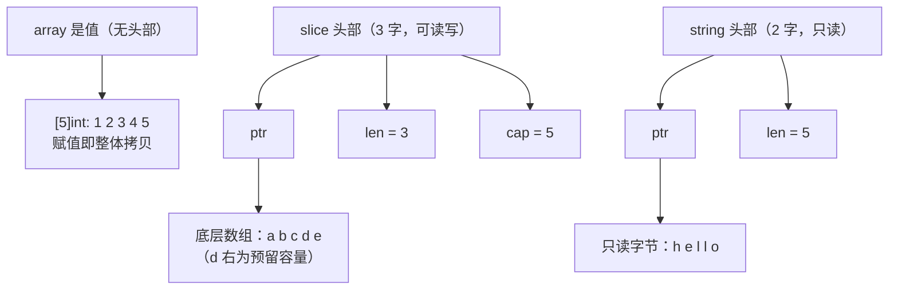

<!--
 * @Date: 2026-08-18 13:31:22
 * @LastEditTime: 2026-08-25 16:42:26
 * @Description:
-->

# 5 数据结构

切片与散列表是Go仅有的两种泛型容器，也是日常代码里面出现得最频繁的两种数据结构，它们把一段联系的内存如何被描述，被共享，被增长这一组看似朴素的问题，落成了具体的运行时布局与
长的策略。于是append的种种惊喜，切片别名的陷阱，map的随机遍历与并发即崩，都不再是需要死记硬背的规则，而是布局与权衡的必然推论。本章分四个主题展开：先把数组月切片的内存模型
与增长策略摆清楚，在单独看字符串不可变所代码的零拷贝转换与安全契约；随后讲透散列表的一般原理与哈希洪水攻防，最后落到Go 1.24基于Swiss Table彻底重写，看它如何在缓存，安全与渐进
扩容之间的取舍。一路看Go如何把这些复杂度藏进用户看不见的地方，只是在上层留下朴素的`s[i]`与`m[k]`。

## 5.1 数组与切片

数组是值。[5]int就是连续5个int，长度是类型的一部分：[5]int与[6]int是两个不同的类型。赋值，传参，作为struct字段，数组都是整份拷贝。正是因为如此，大数组在Go里面反而更少。传来传去更贵，要传通常
传它的切片或者指针。

切片是对某段底层数组的视图。运行时里面它就是三个字的头部，可对照`runtime/slice.go`：

```
// runtime：切片的运行时表示(slice.go)
type slice struct {
    array unsafe.Pointer        // 指向底层数组中本切片的首元素
    len int                     // 长度：可见元素个数
    cap int                     // 容量：从array起到底层数组的末尾元素的个数
}
```

len是你能索引到的范围，cap是在不重新分配的前提下还能涨到多大。两者分离正是切片能走视图的关键：s[1:3]只是改头部里面的三个字段，不碰底层数组。

字符串是只读的字节序列。它的头部更省，只有两字，没有cap:

```
// runtime:字符串的运行时表示(string.go)
type stringStruct sturct {
    str unsafe.Pointer  // 指向只读字节
    len int             // 字节数(不是rune数)
}
```

少掉的那个cap不是疏忽，而是设计：字符串不可变，长度一经确定就不再增长，自然无需容量。不可变换来三件好事：多个字符串可安全共享同一段底层字节，字节s[i:j]无需拷贝，字符串可直接做map键而不必防御性
复制。代价是任何修改都要生成新串。字符串的转换与拷贝见细节。



数组没有头部，它就是那段内存；切片和字符串都是头部+别处的内存。这一句话是后面所有行为的根。

### 5.1.2 动态数组与摊还分析

切片是动态数组（dynamic array）的Go化身：一个会按需要增长的连续数组。它给出的核心保证是，尽管偶尔需要重新分配并搬迁全部元素，连续n次append的摊还(amoritized)代价是均摊O(1)。

直觉来自成倍增长。设每次容量满了就乘以一个常数因子g > 1（最简单取g=2,翻倍）。把n次append看成整体，真正昂贵的只有触发搬迁的那几次，且搬迁规模呈几何级数递减。从空到n，各次搬迁移动的元素数约为
...,n/4,n/2,n，倒过来求和：

$$
\sum_{i=0}^{\infty} \frac{n}{2^i}=n+\frac{n}{2}+\frac{n}{4}+\cdots<2n
$$

总体搬迁成本被2n封顶，再加上n次写入新元素本身的O(n), n次append合计O(n),平摊到每次就是常数。这是<<算法导论>>里面摊还分析的范例，用聚合法（aggregate method）或者势能法（potintial
method）都能给出同样的界限。

关键在于因子必须是乘性的。若改成每次只多预留固定的c个槽，第k次扩容要搬迁约kc个元素，总成本$\sum_{k=1}^{n} k = \frac{n(n+1)}{2} = \Theta(n^2)$，平摊后每次退化成O(n)。一个常数因子，
区分了线性和平方。乘性增长带来了均摊常数，代价是平均约g/2倍的空间浪费，这正是增长因子与那场永恒的空间与时间之争。

### 5.1.3 append的正常策略

理论上乘个常数因子就够了，工程上Go做的更细。核心在`runtime.growslice`,它先用到`nextslicecap`算出来一个目标容量，再交给内存分配器对齐。先看容量这一步（对照go1.26的`runtime/slice.go`）：

```
// runtime:计算新容量(slice.go，节选注释)
func nextslicecap(newLen, oldCap int) int {
    newcap := oldCap
    doublecap := newcap + newcap
    if newLen > doublecap {
        return newLen   // 一次append太多，直接给到需要的长度
    }
    const threshold = 256
    if oldCap < threshold {
        return doublecap    // 小切片：翻倍
    }
    for {
        // 从2x平滑过渡到1.25x:大切片更看重省内存
        newcap += (newcap + 3 * threshold) >> 2
        if uint(newcap) >= uint(newLen) {
            break
        }
    }
    return newcap
}
```

策略以256为界。就容量小于256时候翻倍，小切片增长激进，图的是少搬几次。到达或者超过256后，改用`newcap += (newcap) + 3*256) >> 2`,即每轮增加1/4（newcap + 768）。当newcap还小的时候，
那个`3/4*256`的常数项占用大，倍率接近2；当newcap很大的时候常数项忽略，倍率趋于1+(1/4)=1.25。于是得到了一条从2倍连续滑向1.25倍率的曲线。比Go1.18之前那种1024从2倍硬跳到1.25倍更圆滑，避开
了零界点附近的容量浪费。

算出的`newcap`还没完。`growslice`接着把newcap x 元素大小交给了roundupsize向上取整到内存分配器的尺寸类(size class)，再按照对齐后的字节反推会元素个数：

```
// runtime: growslice中按照尺寸对齐（slice.go，以指针大小访问元素为例子）
capmem = roundupsize(uintptr(newcap)*goarch.PtrSize, noscan)
newcap = int(capmem / goarch.PtrSize) // cap按照被撑大到尺寸边界
```

所以一个切片实际的cap场略大于你心算的值。它是乘性增长+尺寸对齐两部合成的结果：前者保证摊还O(1),后者顺手把分配器就要浪费那点边角料坏给你。这解释了那个常见的困惑，append之后cap为什么偏偏是这
个数：不必去背，理解这两步即可。

### 5.1.4

切片是视图，多个切片可以共享一段底层数组。这是性能的来源，也是bug的来源。

`append`可能共享，也可能不共享底层数组。这是最常背踩的一处。若append后没有超出cap，返回的切片与原切片共享底层数组，对一方元素的写会穿透到另外一方；一旦超出cap触发重新分配，两者就此分家：

```
a := make([]int, 3, 5) // len = 3, cap = 5
b := append(a, 1)   // 没有超过cap: b与a共享底层数组
b[0] = 99       // a[0] 也变成了99
c := append(b, 2, 3, 4) // 超过 cap = 5: c重新分配，与a/b脱钩
c[0] = 7    // a/b不受影响
```

有时候共享，有时候不共享让函数边界变得危险：把一个切片传进函数，函数里面append它，外面的切片看不到它的改动，取决于当时的cap。完整切片表达式a[lo:hi:max]是治本的工具，它显式地把新切片cap限制
到max，于是下一次append必然超容，必然拷贝，必然切断别名：

```go
view := buf[off: off+n, off+n] // cap == len,调用方append即触发拷贝
```

子切片导致内存泄漏。切片头部只要活着，它指向的整段底层数组就回收不掉，哪怕你只用得着开头十个元素：

```
small := big[:10]   // small的cap仍然覆盖big的整段底层数组
// 只要small可达，big那块（可能很大）就一直被钉住
```

需要长期持有一小段时候，应该copy出独立副本，或者用标准库的slices.Clone切断引用。Go1.21起的slices包把这些操作做了显式，易读的形式，连删除元素后的把尾部清零以便GC回收，这种容易漏掉的细节都替你
照顾到了：

```
// slices.Delete删除[i,j）后，会把空出来的尾部清零，避免炫酷啊引用钉住对象
func Delete[S ~[]E, E any](s S, i, j int) S {
    // ...
    s = append(s[:i], s[j:]...)
    clear(s[len(s):oldlen]) // 关键：零/置空淘汰元素，利于GC
    return s
}
```

手写 `s = append(s[:i], s[i+1]...)`删除元素，少了这一句clear，被删除的指针的指针仍然留在底层数组的尾部，仍然被GC视为存活，是一处隐藏的泄漏。能用slices就别手写。

### 5.1.5跨语言对照

动态数组是普适抽象。C++的`std::vector`，Rust的`Vec<T>`，Python的`list`，Java的`ArrayList`，本质上都是摊还O(1)的成倍增长数组。差异集中在两点：增长因子和视图。

增长因子是对各家那场空间与时间之争的不同答案。多数C++标准库实现用2倍或者1.5倍，python的list用1.125倍，增长保守，稳态更省内存；Java的 ArrayList是1.5倍。Go用5.1.3那条从2
滑向1.25的曲线。因子越小，搬迁越频繁，越大越少搬，越费内存，没有普适最优，只有对各自典型的负载权衡。

视图维度上，Go的切片与Rust的`&[T]`（slice）是同一类东西：指向他人数组的胖指针，零拷贝引用子段，自己不拥有内存。而`std::vector`，`Vec`, `list`, `ArrayList`是拥有型容器，
他们持有并释放底层内存。C++知道C++20才把视图独立成`std::span`，Rust则一开始就把拥有的`Vec`与借用的`&[T]`在类型层面分清，借助借用检查器在编译期堵住别名写入。Go选了另外
一条路：把拥有的动态数组（底层数组）与视图（切片）统一成一个切片类型，换来语言的简洁，代价正是5.1.4那些别名陷阱。间接与安全之间，Go这次把砝码放在了简洁一侧，并把别名的纪律交给
了程序员。

## 5.2字符串与零拷贝转换

字符串与切片同源，运行时里面都是头部+别处的内存。但是它只读，不可变。
