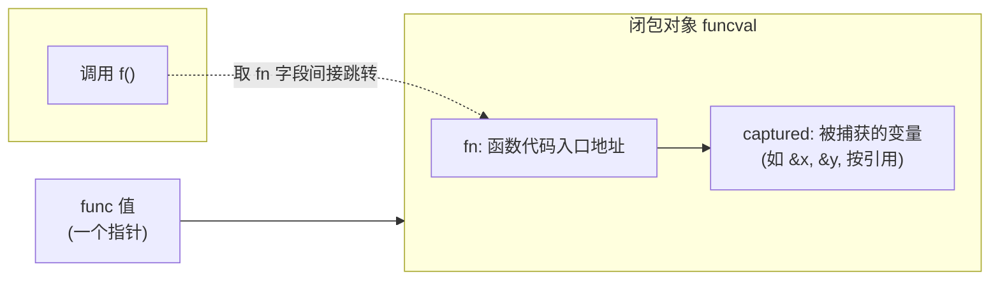
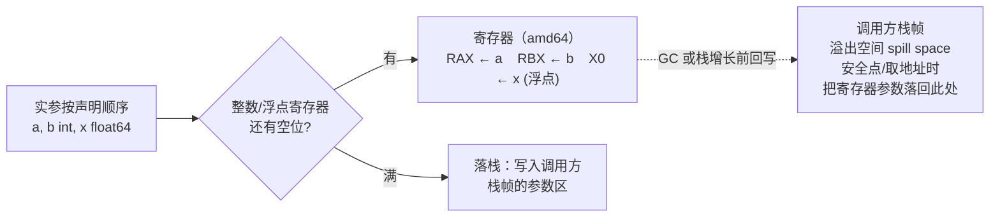

# 6函数延迟与恐慌

让函数成为**一等公民**,意味着它能像普通值那样被赋值，传递，返回,还能捕捉环境变量成为闭包。这份在Strarchey时代尚属奢侈的能力，正是本章要拆解的对象：函数值在内存里面如何表示，一次调用在底层如何传
参与返回，defer怎么保证无论从哪条路径上离开，清理都会发生。以及panic与recover如何在调用栈上展开又被截住。这些特征共享同一套运行机器，把它讲透，就能看清楚Go在便利，性能与显式控制流之间做的取舍。

## 6.1 函数调用

一个func类型的值,本质上是一个指向**闭包对象**的指针。运行时给这个对象起的名字是`funcval`，它在`runtime/runtime2.go`里面定义得出奇：

```
// funcval：函数值在运行时的表示(来自runtime2.go),已加注释
type funcval struct {
    fn uintptr
    // 后面紧跟变长的，与具体函数相关的数据，即捕获的环境
}
```

只有一个固定字段fn，函数代码的入口地址。注释里面那句 variable-size, fn-specific data here才是闭包的灵魂：紧跟fn之后，编译器排布着这个闭包捕获的外部变量。一个不捕获热虐变量的普通函数，它的
funcval只有fn一个字，全部唯一，只读;一旦它捕获了外部变量，编译器就要为在堆上构造一个带捕获数据的funcval。它可以画成这样：



调用同一个函数值，就是取出fn字段间接跳转过去，与接口的方法分发异曲同工。关键细节是捕获按照引用：闭包捕获的是变量本身，不是它当时的值。下面这段代码里面，counter返回的是两个闭包共享同一个n，因为
它们捕获的是n这个变量的地址，而非某个快照：

```go
func counter(inc,get func() int) {
    n := 0
    inc = func() int { n++; return n } // 捕获&n
    get = func() int { return n } // 捕获同一个&n
    return
}
// inc(); inc(); get() == 2,两个闭包看到同一个n
```

按照引用即是闭包的表达能力，也是那个经典的根源。在Go 1.21以及之前，循环变量是整个循环共用一个的,于是：

```go
// Go 1.21及之前:所有goroutine捕获同一个v
for _, v := range s {
    go func() { use(v)} ()  // 全部读到循环结束时候v的终值
}
```

所有goroutine捕获的是统一个v，它们启动的时候循环往往早已经结束，于是清一色的读到最后一个元素。十余年间，老练的Go程序员靠手写`v := v`在每一轮迭代里面造出一个全新的变量来回避它。Go 1.22把这条
惯用法升级为语言规则：for循环的循环变量改为每次迭代一个新实例，对三段式for与for range一律生效。修复的着眼点值得玩味，它没有改变捕获按照引用这一捕获方式，而是改变了捕获的对象：即然每轮都是新
变量，按照引用捕获到的自然就是各论独立的地址。一个困扰Go用户十余年的设计缺陷，最终以最小的语义改动落幕。

这次修改还示范了Go改动语言语义的一套审慎做法。它本是一处不往后兼容的语义变更，可能让依赖旧行为的代码悄悄改变结果，因此Go把它与go.mod里面声明的语言版本绑定：仅当模块声明go 1.22及以上时新语义
才生效，就模块的行为原样保留。在Go 1.21的过渡期，它先以 `GOEXPERIMENT=loopver` 的形式工人预览。对于行为的可能因此改变代码。官方还提供了 bisect工具，能在新旧语义之间二分搜索，精确定位是
哪个一处循受了影响。把语义变更与版本声明挂钩，辅以预览开关与定位工具，是Go在向前推进与不破坏既有代码之间找到的折中，这套机制本身，笔循环变量这一处修复影响更加深远。

### 6.1.2 调用约定的演进：从栈到寄存器

一次函数调用如何传递参数与返回值，由调用约定（calling convention/ABI）规定。Go 1.16及之前用的都是基于栈的约定（现称为ABI0）:所有参数与返回值都通过栈内存传递。调用方再从栈上读取出来，返回值
同理。按这套办法简单，可移植，易于让编译器与手写汇编对接，代价是每个参数都要经历一次写内存加一次读内存，在调用密集的程序里面相当可观。

Go 1.17引入基于寄存器的内部调用约定ABIInternal。它的核心规则是优先寄存器，放不下才落栈：每种架构定义一组整数寄存器和一组浮点寄存器，参数与返回值按照声明顺序一次占用。单个参数要么整个进寄存器，
要么整个落栈。在amd64上，可用于传递整数参数与返回值的这9个寄存器：

```
RAX, RBX, RCX, RDI, RSI, R8,R9,R10,R11 // amd64：9个整数参数，返回寄存器
```

arm64则用R0-R15公16个。分配规则可以用一个小例子说清：函数`func(a, b int, x float64)`在amd64上，a占RAX，b占RBX,x占用第一个浮点寄存器，三个参数都在寄存器里面，没有一次访存；而若参数足够
多，整数寄存器用满，第10个整数参数便落到了栈上。聚合类型（结构体，数组）按照其字段递归地展开参与分配，能整体进寄存器就进，否则整个落栈，这条要么全进，要么全落的规则避免了一个被被劈成寄存器加栈
两半的复杂账目。把这套按照占用寄存器，放不下才落栈的分配，联同寄存器参数在调用方栈帧里面那块溢出空间，画成一张图：



少了大量栈内存读写，这次改动带来了5%的整体性能提升与更小的二进制，且对用户完全透明：代码一行不改，重新编译就快了。值得一提的是，寄存器预定为何到Go 1.17才落地：早期Go选择基于栈的ABI0,是因为它
实现简单，跨架构一致，且与GC的精确栈扫描天然契合：参数都在栈上有固定位置，扫描器照常能找到其中的指针。寄存器约定要落地，前提是编译器现有成熟SSA后段来做寄存器分配，并解决一个随着而来的问题，GC与栈展开发生时，火灾寄存器里面的指针参数改如何被找到。Go的答案不是取扫描寄存器，而是依靠前面提到的溢出空间：在可能触发的GC或者栈增长的安全点上。寄存器里面的参数会落到调用方栈帧中的那块固定溢出空
间，于是扫描器仍然只需要扫栈。寄存器约定也非全无栈参与，调用方仍要在自己的栈帧里为每个寄存器预留一块溢出空间(spill space)，以便栈增长或者需要取参数地址时候把寄存器里面的值落回到内存，把溢出
空间放在调用方栈帧而非被调用方，是为了栈增长的代码路径有固定位置可写，简化实现。

这里要接住6.1.1留下的线头。闭包对象是一个指针，被调用方要先拿到这个指针，才能找到自己捕获的变量。ABI为此专门执行一个闭包上下文寄存器：调用闭包之前，调用方把funcval的地址放进这个寄存器，被调用
方从中取出捕获环境。在amd64上它是ROX，在amd64上是R26.读者或者已经注意到，RDX恰好不在上面9个整数寄存器之列，它被留作上下文专用，正是闭包腾出的位置。一句话：闭包之所以能带着环境被调用，靠的就是
ABI在普通传参数之外，额外约定的最后一个寄存器。

ABI0并未消失。它仍然是在Go与汇编的边界上，手写汇编遵循ABI0,因为汇编作者需要一套稳定，显式，不随着版本漂移的传递参数规则。两台ABI之间由编译器生成的桥接包装（ABI wrapper）互相调用：一个
ABIInter的函数调用到ABI0的汇编例程，中间会经过一层把寄存器的参数搬到栈上的包装，反之亦然。Go把内部的ABI与外（汇编）ABI分开，正是为了能自由演进前者而不惊动后者，从栈道寄存器这场变革
之所以能做到对用户透明，根子就在这道分界上。

### 6.1.3 栈帧与可增长栈

每次函数在goroutine的栈上压入一个栈帧，存放局部变量，溢出道栈的参数与溢出空间，返回地址等。Go的栈是可增长的连续栈：函数序言（prologue）里面有一段栈检查，比较当前栈指针与栈边界，发现剩余
空间不足的时候跳过去morestack,它分配一段更大的栈，把旧栈内容拷贝过去，在调整所有指向旧栈的指针。这段栈检查也是抢占搭便车的地方。栈的具体管理见14执行栈管理。

可增长栈对闭包有一个不容回避的后果。即然栈会移动，而6.1.1又说闭包是按照引用捕获，那么一旦某个局部变量的地址被闭包捕获，并且这个闭包可能活的比创建它的栈帧更久（比如被返回，被存入全局，被交给
一个goroutine）,这个变量就不能再待在会被回收或者搬迁的栈上。解决之道是逃逸分析：编译器在编译期判断一个变量的地址是否逃逸出当前函数的声明周期，若是，就把它从栈搬到堆上分配，让闭包捕获的那个
地址在栈搬迁后依然有效，前面的counter里面的n之所以能在counter返回后继续被inc/get读写，正是因为它逃逸到堆上。换言之，闭包的按照引用捕获与栈的可增长，可搬迁两个设计，是靠着逃逸分析这第三方
仲裁才得已共存的。

[Go ABI:闭包 funcval 上下文寄存器](./Go%20ABI:%20闭包%20funcval%20上下文寄存器.md)

### 6.1.4 方法值,方法表达式与变参

几个函数一等公民身份派生出来的特性，落到了funcval上都不神秘。

方法值t.M把接收者t绑进一个闭包，得到一个可单独传递的func。它的本质就是6.1.1的闭包，被捕获的变量真实接收者t。方法表达式T.M则不绑定任何接收者,得到的是一个把接收者作为第一个显式参数的普通函数：

```go
type T struct { x int }
func (t T) Add(d int) int { return t.x + d }

f := t.Add      // 方法值： func(int) int, t 被捕获到闭包
g := T.Add      // 方法表达式： func(T, int) int 接收者为显式首参
f(1) == t.x + 1
g(t, 1) == t.x + 1
```

两者形态不同：f是一个携带捕获环境的`funcval`（故t.Add这种写法会触发一次闭包分配，接收者被复制进闭包对象，若接收者是指针类型则复用改指针），g则是一个不捕获任何东西，签名里面多一个参数的普通
函数值。这解释了一个常被提起的现象:在热路径上反复写`t.M`取方法值会代码隐性的堆分配，而`T.M`不会。编译器对方法值的处理可以看作是一次自动闭包化，它合成一个以接收者为唯一的捕获变量的funcval，
本质上与6.1.1里面手写的闭包别无二致。

变参f(args ...int)，在调用方被打包成一个切片传入：

```go
func sum(xs ...int) (s int) { for _, x := range xs { s += x }; reutrn }
sum(1,2,3) // 编译器构架 []int{1, 2, 3} 再传入
sum(s...) // 已是切片，直接传，不在构造
```

变参的本质是语法糖加一个切片，理解5.1切片，就理解了变参的开销所在：以散列实参调用变参函数，调用方要构造一个底层数组并据此生成切片头；若实参数就是切片并以`s...`形式传入，则零额外构造。

### 6.1.5 跨语言对照

闭包如今几乎是现代语言的标配（C++ lamdba Java Python Rust的Fn/FnMut/FnOnce），差别在捕获语义。Go一律按引用捕获，简单但是把何时该复制的判断交给了逃逸分析与程序员的警觉；C++让那你在
捕获列表里面显式选值捕获`[=]`还是引用捕获`[&]`，控制力强但是容易写出悬垂引用；Rust用move关键字与Fn/FnMut/FnOnce三个trait同时区分捕获方式与可调用次数，把所有权与可变性检检查提前到了编译
期。简洁，控制力，安全，各家在这个三角里面站在不同的位置。

调用约定上，C/C++遵循平台的辨准ABI(如System V AMD64)，以便与系统库和其他人的目标文件直接互操作；这份契约一旦公开就难以更改。Go则自定义了内部ABI，牺牲与外部目标文件的直接互通。（CGO调用
要跨ABI边界，有成本），换来了自己需要演进调用约定的自由，从栈到寄存器的平滑切换，正得意于此。又一次，Go用一点互操作性的代码，换取了对自身实现掌握。

## 6.2 延迟语句

延迟语句`defer`在最早期的Go设计中并不存在。是后来才单独增补的特性，由Robert Geiesemer完成语言规范的编写【Griesemer,2009】。它的语义读起来很短：被`defer`的调用会在外层函数返回，返回
panic或者调用`runtime.Goexit`时候执行。直觉上像是一个纯编译期的特性，蕾丝C++的RAll(离开作用域的时候自动析构),编译器似乎只需要把延迟的调用搬到函数末尾即可，不该有运行时开销。

真实情况要复杂一层。Go的`defer`没有与某个资源的作用域绑定，还允许出现在条件，循环里面，于是它不再是一个静态的作用域概念，一段执行次数取决于运行时的循环，能产生多少个延迟调用在编译器无法确定：

```go
func randomDefers() {
    for rand.Intn(100) > 42 {
        defer println("golang-design/under-the-hood") // 次数在运行时才定
    }
}
```

因为存在这种不确定性，defer不是免费的午餐。本节先讲清楚它的语义，在沿着一条贯穿十余年的性能演进主线，看它如何从最慢被劝退热路径一路优化到几乎零成本。这条主线的终点，也是理解6.3恐慌与恢复的
钥匙：在今天的运行时里面，正常返回跑defer与panic展开时跑defer，走的都是同一套机制。

### 6.2.1 LIFO,返回与panic都触发，参数在defer处求值

`defer`的可观察语义有三条，记住他们就能解释绝大多数为什么时这个结果的疑惑。

- 第一，后进先出。同一个函数内多个`defer`以逆序执行，这让打开A,打开B与关闭B，关闭A天然对称，正是资源清理想要的顺序。
- 第二，返回路径和异常路径都会触发。无论函数是正常`return`，还是中途panic在向上展开，登记过的 defer都会被执行。这是defer能用来做无论如何都要释放清理，以及在6.3里面用recover拦截panic的根基。
- 第三，参数在`defer`语句处求值，**调用被推迟**。被延迟的函数及其实参在写下`defer`的那一刻就确定下来了。真正的调用退出函数末尾。这条最容易踩坑。

```go
func trace() {
    i := 0
    defer fmt.Println(i)    // 此刻i == 0,打印0,而非后来的1
    i++
}
```

这不是显示的妥协，而是有意为之的语义。设想`f, _ := os.Open(...)`后立刻`defer f.Close()`，若参数延后到末尾才求值，中途对f的重新赋值会让你关错文件。在求值时机上就地，才符合读者写下这行时的
意图。

值得点出的是这条语义的实现机制在近年来发生了变化，但是语义本身是中不变。早期实现把实参`memove`进一条延迟记录里面保存；自go1.18起，编译器被延迟的调用连同它当时的参数一起打包进一个无参闭包
`func()`,求值发生在闭包被构造瞬间，运行时只需要在末尾调用这个闭包。语义没有动，记录里面却从此不需要保存参数。这位后文的结构简化埋下了伏笔。
