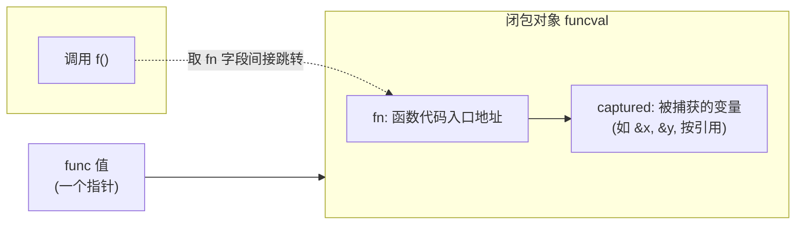
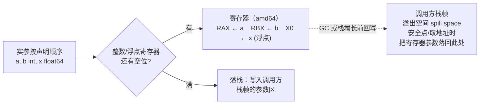
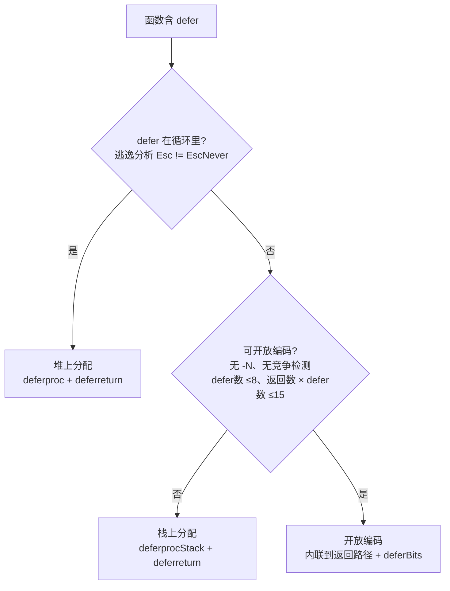
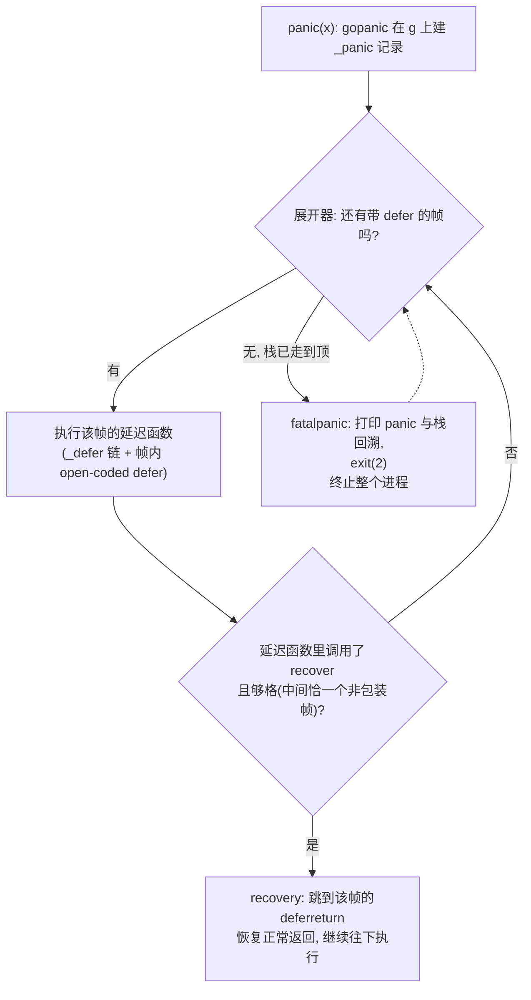

# 6函数延迟与恐慌

让函数成为**一等公民**,意味着它能像普通值那样被赋值，传递，返回,还能捕捉环境变量成为闭包。这份在Strarchey时代尚属奢侈的能力，正是本章要拆解的对象：函数值在内存里面如何表示，一次调用在底层如何传
参与返回，defer怎么保证无论从哪条路径上离开，清理都会发生。以及panic与recover如何在调用栈上展开又被截住。这些特征共享同一套运行机器，把它讲透，就能看清楚Go在便利，性能与显式控制流之间做的取舍。

## 6.1 函数调用

一个func类型的值,本质上是一个指向**闭包对象**的指针。运行时给这个对象起的名字是`funcval`，它在`runtime/runtime2.go`里面定义得出奇：

```
// funcval：函数值在运行时的表示(来自runtime2.go),已加注释
type funcval struct {
    fn uintptr
    // 后面紧跟变长的，与具体函数相关的数据，即捕获的环境
}
```

只有一个固定字段fn，函数代码的入口地址。注释里面那句 variable-size, fn-specific data here才是闭包的灵魂：紧跟fn之后，编译器排布着这个闭包捕获的外部变量。一个不捕获热虐变量的普通函数，它的
funcval只有fn一个字，全部唯一，只读;一旦它捕获了外部变量，编译器就要为在堆上构造一个带捕获数据的funcval。它可以画成这样：



调用同一个函数值，就是取出fn字段间接跳转过去，与接口的方法分发异曲同工。关键细节是捕获按照引用：闭包捕获的是变量本身，不是它当时的值。下面这段代码里面，counter返回的是两个闭包共享同一个n，因为
它们捕获的是n这个变量的地址，而非某个快照：

```go
func counter(inc,get func() int) {
    n := 0
    inc = func() int { n++; return n } // 捕获&n
    get = func() int { return n } // 捕获同一个&n
    return
}
// inc(); inc(); get() == 2,两个闭包看到同一个n
```

按照引用即是闭包的表达能力，也是那个经典的根源。在Go 1.21以及之前，循环变量是整个循环共用一个的,于是：

```go
// Go 1.21及之前:所有goroutine捕获同一个v
for _, v := range s {
    go func() { use(v)} ()  // 全部读到循环结束时候v的终值
}
```

所有goroutine捕获的是统一个v，它们启动的时候循环往往早已经结束，于是清一色的读到最后一个元素。十余年间，老练的Go程序员靠手写`v := v`在每一轮迭代里面造出一个全新的变量来回避它。Go 1.22把这条
惯用法升级为语言规则：for循环的循环变量改为每次迭代一个新实例，对三段式for与for range一律生效。修复的着眼点值得玩味，它没有改变捕获按照引用这一捕获方式，而是改变了捕获的对象：即然每轮都是新
变量，按照引用捕获到的自然就是各论独立的地址。一个困扰Go用户十余年的设计缺陷，最终以最小的语义改动落幕。

这次修改还示范了Go改动语言语义的一套审慎做法。它本是一处不往后兼容的语义变更，可能让依赖旧行为的代码悄悄改变结果，因此Go把它与go.mod里面声明的语言版本绑定：仅当模块声明go 1.22及以上时新语义
才生效，就模块的行为原样保留。在Go 1.21的过渡期，它先以 `GOEXPERIMENT=loopver` 的形式工人预览。对于行为的可能因此改变代码。官方还提供了 bisect工具，能在新旧语义之间二分搜索，精确定位是
哪个一处循受了影响。把语义变更与版本声明挂钩，辅以预览开关与定位工具，是Go在向前推进与不破坏既有代码之间找到的折中，这套机制本身，笔循环变量这一处修复影响更加深远。

### 6.1.2 调用约定的演进：从栈到寄存器

一次函数调用如何传递参数与返回值，由调用约定（calling convention/ABI）规定。Go 1.16及之前用的都是基于栈的约定（现称为ABI0）:所有参数与返回值都通过栈内存传递。调用方再从栈上读取出来，返回值
同理。按这套办法简单，可移植，易于让编译器与手写汇编对接，代价是每个参数都要经历一次写内存加一次读内存，在调用密集的程序里面相当可观。

Go 1.17引入基于寄存器的内部调用约定ABIInternal。它的核心规则是优先寄存器，放不下才落栈：每种架构定义一组整数寄存器和一组浮点寄存器，参数与返回值按照声明顺序一次占用。单个参数要么整个进寄存器，
要么整个落栈。在amd64上，可用于传递整数参数与返回值的这9个寄存器：

```
RAX, RBX, RCX, RDI, RSI, R8,R9,R10,R11 // amd64：9个整数参数，返回寄存器
```

arm64则用R0-R15公16个。分配规则可以用一个小例子说清：函数`func(a, b int, x float64)`在amd64上，a占RAX，b占RBX,x占用第一个浮点寄存器，三个参数都在寄存器里面，没有一次访存；而若参数足够
多，整数寄存器用满，第10个整数参数便落到了栈上。聚合类型（结构体，数组）按照其字段递归地展开参与分配，能整体进寄存器就进，否则整个落栈，这条要么全进，要么全落的规则避免了一个被被劈成寄存器加栈
两半的复杂账目。把这套按照占用寄存器，放不下才落栈的分配，联同寄存器参数在调用方栈帧里面那块溢出空间，画成一张图：



少了大量栈内存读写，这次改动带来了5%的整体性能提升与更小的二进制，且对用户完全透明：代码一行不改，重新编译就快了。值得一提的是，寄存器预定为何到Go 1.17才落地：早期Go选择基于栈的ABI0,是因为它
实现简单，跨架构一致，且与GC的精确栈扫描天然契合：参数都在栈上有固定位置，扫描器照常能找到其中的指针。寄存器约定要落地，前提是编译器现有成熟SSA后段来做寄存器分配，并解决一个随着而来的问题，GC与栈展开发生时，火灾寄存器里面的指针参数改如何被找到。Go的答案不是取扫描寄存器，而是依靠前面提到的溢出空间：在可能触发的GC或者栈增长的安全点上。寄存器里面的参数会落到调用方栈帧中的那块固定溢出空
间，于是扫描器仍然只需要扫栈。寄存器约定也非全无栈参与，调用方仍要在自己的栈帧里为每个寄存器预留一块溢出空间(spill space)，以便栈增长或者需要取参数地址时候把寄存器里面的值落回到内存，把溢出
空间放在调用方栈帧而非被调用方，是为了栈增长的代码路径有固定位置可写，简化实现。

这里要接住6.1.1留下的线头。闭包对象是一个指针，被调用方要先拿到这个指针，才能找到自己捕获的变量。ABI为此专门执行一个闭包上下文寄存器：调用闭包之前，调用方把funcval的地址放进这个寄存器，被调用
方从中取出捕获环境。在amd64上它是ROX，在amd64上是R26.读者或者已经注意到，RDX恰好不在上面9个整数寄存器之列，它被留作上下文专用，正是闭包腾出的位置。一句话：闭包之所以能带着环境被调用，靠的就是
ABI在普通传参数之外，额外约定的最后一个寄存器。

ABI0并未消失。它仍然是在Go与汇编的边界上，手写汇编遵循ABI0,因为汇编作者需要一套稳定，显式，不随着版本漂移的传递参数规则。两台ABI之间由编译器生成的桥接包装（ABI wrapper）互相调用：一个
ABIInter的函数调用到ABI0的汇编例程，中间会经过一层把寄存器的参数搬到栈上的包装，反之亦然。Go把内部的ABI与外（汇编）ABI分开，正是为了能自由演进前者而不惊动后者，从栈道寄存器这场变革
之所以能做到对用户透明，根子就在这道分界上。

### 6.1.3 栈帧与可增长栈

每次函数在goroutine的栈上压入一个栈帧，存放局部变量，溢出道栈的参数与溢出空间，返回地址等。Go的栈是可增长的连续栈：函数序言（prologue）里面有一段栈检查，比较当前栈指针与栈边界，发现剩余
空间不足的时候跳过去morestack,它分配一段更大的栈，把旧栈内容拷贝过去，在调整所有指向旧栈的指针。这段栈检查也是抢占搭便车的地方。栈的具体管理见14执行栈管理。

可增长栈对闭包有一个不容回避的后果。即然栈会移动，而6.1.1又说闭包是按照引用捕获，那么一旦某个局部变量的地址被闭包捕获，并且这个闭包可能活的比创建它的栈帧更久（比如被返回，被存入全局，被交给
一个goroutine）,这个变量就不能再待在会被回收或者搬迁的栈上。解决之道是逃逸分析：编译器在编译期判断一个变量的地址是否逃逸出当前函数的声明周期，若是，就把它从栈搬到堆上分配，让闭包捕获的那个
地址在栈搬迁后依然有效，前面的counter里面的n之所以能在counter返回后继续被inc/get读写，正是因为它逃逸到堆上。换言之，闭包的按照引用捕获与栈的可增长，可搬迁两个设计，是靠着逃逸分析这第三方
仲裁才得已共存的。

[Go ABI:闭包 funcval 上下文寄存器](./Go%20ABI:%20闭包%20funcval%20上下文寄存器.md)

### 6.1.4 方法值,方法表达式与变参

几个函数一等公民身份派生出来的特性，落到了funcval上都不神秘。

方法值t.M把接收者t绑进一个闭包，得到一个可单独传递的func。它的本质就是6.1.1的闭包，被捕获的变量真实接收者t。方法表达式T.M则不绑定任何接收者,得到的是一个把接收者作为第一个显式参数的普通函数：

```go
type T struct { x int }
func (t T) Add(d int) int { return t.x + d }

f := t.Add      // 方法值： func(int) int, t 被捕获到闭包
g := T.Add      // 方法表达式： func(T, int) int 接收者为显式首参
f(1) == t.x + 1
g(t, 1) == t.x + 1
```

两者形态不同：f是一个携带捕获环境的`funcval`（故t.Add这种写法会触发一次闭包分配，接收者被复制进闭包对象，若接收者是指针类型则复用改指针），g则是一个不捕获任何东西，签名里面多一个参数的普通
函数值。这解释了一个常被提起的现象:在热路径上反复写`t.M`取方法值会代码隐性的堆分配，而`T.M`不会。编译器对方法值的处理可以看作是一次自动闭包化，它合成一个以接收者为唯一的捕获变量的funcval，
本质上与6.1.1里面手写的闭包别无二致。

变参f(args ...int)，在调用方被打包成一个切片传入：

```go
func sum(xs ...int) (s int) { for _, x := range xs { s += x }; reutrn }
sum(1,2,3) // 编译器构架 []int{1, 2, 3} 再传入
sum(s...) // 已是切片，直接传，不在构造
```

变参的本质是语法糖加一个切片，理解5.1切片，就理解了变参的开销所在：以散列实参调用变参函数，调用方要构造一个底层数组并据此生成切片头；若实参数就是切片并以`s...`形式传入，则零额外构造。

### 6.1.5 跨语言对照

闭包如今几乎是现代语言的标配（C++ lamdba Java Python Rust的Fn/FnMut/FnOnce），差别在捕获语义。Go一律按引用捕获，简单但是把何时该复制的判断交给了逃逸分析与程序员的警觉；C++让那你在
捕获列表里面显式选值捕获`[=]`还是引用捕获`[&]`，控制力强但是容易写出悬垂引用；Rust用move关键字与Fn/FnMut/FnOnce三个trait同时区分捕获方式与可调用次数，把所有权与可变性检检查提前到了编译
期。简洁，控制力，安全，各家在这个三角里面站在不同的位置。

调用约定上，C/C++遵循平台的辨准ABI(如System V AMD64)，以便与系统库和其他人的目标文件直接互操作；这份契约一旦公开就难以更改。Go则自定义了内部ABI，牺牲与外部目标文件的直接互通。（CGO调用
要跨ABI边界，有成本），换来了自己需要演进调用约定的自由，从栈到寄存器的平滑切换，正得意于此。又一次，Go用一点互操作性的代码，换取了对自身实现掌握。

## 6.2 延迟语句

延迟语句`defer`在最早期的Go设计中并不存在。是后来才单独增补的特性，由Robert Geiesemer完成语言规范的编写【Griesemer,2009】。它的语义读起来很短：被`defer`的调用会在外层函数返回，返回
panic或者调用`runtime.Goexit`时候执行。直觉上像是一个纯编译期的特性，蕾丝C++的RAll(离开作用域的时候自动析构),编译器似乎只需要把延迟的调用搬到函数末尾即可，不该有运行时开销。

真实情况要复杂一层。Go的`defer`没有与某个资源的作用域绑定，还允许出现在条件，循环里面，于是它不再是一个静态的作用域概念，一段执行次数取决于运行时的循环，能产生多少个延迟调用在编译器无法确定：

```go
func randomDefers() {
    for rand.Intn(100) > 42 {
        defer println("golang-design/under-the-hood") // 次数在运行时才定
    }
}
```

因为存在这种不确定性，defer不是免费的午餐。本节先讲清楚它的语义，在沿着一条贯穿十余年的性能演进主线，看它如何从最慢被劝退热路径一路优化到几乎零成本。这条主线的终点，也是理解6.3恐慌与恢复的
钥匙：在今天的运行时里面，正常返回跑defer与panic展开时跑defer，走的都是同一套机制。

### 6.2.1 LIFO,返回与panic都触发，参数在defer处求值

`defer`的可观察语义有三条，记住他们就能解释绝大多数为什么时这个结果的疑惑。

- 第一，后进先出。同一个函数内多个`defer`以逆序执行，这让打开A,打开B与关闭B，关闭A天然对称，正是资源清理想要的顺序。
- 第二，返回路径和异常路径都会触发。无论函数是正常`return`，还是中途panic在向上展开，登记过的 defer都会被执行。这是defer能用来做无论如何都要释放清理，以及在6.3里面用recover拦截panic的根基。
- 第三，参数在`defer`语句处求值，**调用被推迟**。被延迟的函数及其实参在写下`defer`的那一刻就确定下来了。真正的调用退出函数末尾。这条最容易踩坑。

```go
func trace() {
    i := 0
    defer fmt.Println(i)    // 此刻i == 0,打印0,而非后来的1
    i++
}
```

这不是显示的妥协，而是有意为之的语义。设想`f, _ := os.Open(...)`后立刻`defer f.Close()`，若参数延后到末尾才求值，中途对f的重新赋值会让你关错文件。在求值时机上就地，才符合读者写下这行时的
意图。

值得点出的是这条语义的实现机制在近年来发生了变化，但是语义本身是中不变。早期实现把实参`memove`进一条延迟记录里面保存；自go1.18起，编译器被延迟的调用连同它当时的参数一起打包进一个无参闭包
`func()`,求值发生在闭包被构造瞬间，运行时只需要在末尾调用这个闭包。语义没有动，记录里面却从此不需要保存参数。这位后文的结构简化埋下了伏笔。

### 6.2.2 三代实现：从堆分配到几乎零成本

`defer`的开销几乎全部来自一个问题：那条要执行哪些延迟调用的记录，存在哪，何时分配，怎么找回来执行。围绕这个问题，Go给出了三代答案。它们不是简单的新旧交替，三者今天同时存在，编译器
按照调用点的形态择优选用。先看一段被延迟的内核数据结构，今天的`_defer`已经相当精简：

```go
// runtime/runtime2.go：被延迟的调用记录
type _defer struct {
    heap bool       // 记录本身在堆上还是栈上
    sp uintptr      // 登记defer的SP,用来认出是哪一帧的defer
    pc uintptr      // 登记defer的PC
    fn func()       // 被延迟的调用(已捕获的实参数):开放编码为nil
    link *_defer    // 串成挂在Goroutine上的链表，指向下一个待执行的defer
}
// runtime/runtime2.go
type g struct {
    // ...
    _defer *_defer // 本Goroutine的延迟调用链表头
}
```

对照本节开头的源码可以发现，今天的`_defer`里面既没有参数的大小siz,也没有参数缓冲区，实参全在fn这个闭包里。一个函数登记的多个`_defer`通过`link`串成链表，挂在当前的Goroutine的`g._defer`
上，越晚登录约靠前，自然实现了LIFO。

第一代：堆上分类（deferproc）

最朴素的做法：每遇到一个`defer`，就在运行时向堆要一块`_defer`，填好`fn/pc/sp`，挂到`g._defer`链表头。编译器把`defer exp`翻译成一个`deferproc`调用，并在函数末尾插入`deferreturn`。
这条路径需要最多的运行时支持，登记发生在循环里面，或者延迟数量太多无法被更高阶的优化吃下时，只能落到这里。

```go
func deferproc(fn func()) {
    gp := getg()
    d := newdefer()     // 从 per-P资源池取，池空则向堆分配
    d.link = gp._defer  // 挂到Goroutine的延迟链表头
    gp._defer = d
    d.fn = fn
    d.pc = sys.GetCallerPC()
    d.sp = sys.GetCallerSP()
}
```

newdefer不会每次都在`mallocgc`,它优先从每个P的本地`deferpool`复用，本地空了再从全局池批发一半过来，思路与内存分配器的多级缓存一脉相承。即便如此，堆分配仍然是三代里面最慢的：登录要碰资源池，
归还还要回收，最坏还可能触发栈增长，甚至抢占。这正是早年间热路径里面别用那条建议的由来。

第二代：栈上分配（deferprocStack,go 1.3）

即然`_defer`的生命周期不超过它所在的函数帧，何不把记录直接放到栈上？go 1.13落地了这一优化`[Randall, 2013]`：当逃逸分析判定某个defer不会逃逸（不在循环里面），编译器就在当前函数帧上预留好
`_defer`的空间，运行时只需要把它初始化，挂上链表，函数返回时随着帧一块释放，免去了分配与回收。

```go
// runtime/panic.go： 初始化一个栈上的_defer
func deferprocStack(d *_defer) {
    gp := getg()
    d.head = false // 标记为栈上， deferreturn末尾无需归还内存
    d.sp = sys.GetCallerSP()
    d.pc = sys.GetCallerPC()
    d.link = gp._defer  // 仍要挂链表，deferreturn才能得到它
    gp._defer = d
}
```

记录的空间由编译器在栈帧里准备，`deferprocStack`只承担初始化。这一代把常见的场景的`defer`开销砍掉30%,但是它仍然要维护链表，仍然要在函数末尾走一趟`deferreturn`，离零成本还有距离。

第三代：开放编码(open-coded defer,go 1.14)

go 1.14引入的开放编码式defer`[Scales, 2019]`才真正逼近零成本。它的想法是最初的直觉：即然多数函数里面`defer`数量，位置在编译器就可以看出，那就别经过运行时，编译器直接把延迟的调用内联
到每个返回路径的前面，连`_defer`记录都不建（此时fn字段为nil）。一段加锁解锁的常见写法：

```go
var mu sync.Mutex
func f() {
    mu.Lock()
    defer mu.Unlock()
}
```

编译后即没有`deferproc/deferprocStack`，也没有`deferreturn,mu.Unlock()`被直接铺在`RET`之前，与手写一行`mu.Unlock()`几乎无异。proposal给出的基准里，这类defer相对直接调用的额外开销
降到了1ns，不足一个周期时钟，可以视作几乎没有开销。

难点在于条件分支。若某个`defer`藏在运行时才能确定的if里面，内联到末尾的那段清理代码怎么知道该不该执行？Go的答案是一个8位的延迟比特（`deferBits`）位图，思路朴素而巧妙：每个开放编码的`defer`
占一位，登记的时候把对应位置置1,末尾按照倒序检查，命中才调用。

```go
deferBits := uint8(0)   // 00000000
deferBits |= 1 << 0.    // 遇到第一个defer，置位 -> 00000001
_f0 := f0      // 连同实参保存到栈槽
if cond {
	deferBits |= 1 << 1       // 第二个 defer 命中 -> 00000011
	_f1 := f1
}
// ... 函数体 ...
exit:                          // 倒序检查，命中才调用
if deferBits & (1 << 1) != 0 { // 00000011 & 00000010 != 0 -> 调用 f1
	deferBits &^= 1 << 1
	_f1()
}
if deferBits & (1 << 0) != 0 { // -> 调用 f0
	deferBits &^= 1 << 0
	_f0()
}
```

编译器如何在三代之间选择

三代实现共存，编译器在SSA构建阶段（ssagen）为每个函数挑选。先看一条硬分界：只要defer出现在循环里面（逃逸分析将其标为 Esc != EscNever），记录数量无法静态确定，就只能在堆上分配。其余情况
默认尝试开放编码，当任一条件破环了的前提时，退回到栈上分配。



几条阈值都有具体的来历：`maxOpenDefers = 8`卡住`deferBits`的位宽；返回数 x defer数 > 15是一条经验剪枝，开放编码要在每个返回点重复铺设清理代码，返回点多，defer多时代代码膨胀得不偿失，
而开发编码本就是位小函数准备的优化。这两条以及-N,静态检测，共享库场景会禁用开放编码，但只要不再循环里面，记录仍然能放在栈上，真正把`defer`打回堆上分配，只有出现在循环里面这一条。竞态检测，
共享库等特殊场景与日常关系不大，此处略去。

### 6.2.3 derferreturn与panic：同一套展开机器

前两代实现把`defer`串在`g._defer`链表上，第三代干脆不进链表。这带来一个必须回答的问题：当panic沿栈向上展开，要在每一帧执行该帧登记过的`defer`时，开放编码的defer没有记录，不在链表里面，
panic怎么找到它们？

答案是编译器位含开放编码defer的函数附带一份`FUNCDATA_OpenCodeDeferInfo`元数据，记录`deferBits`在栈上的位置，以及每个延迟函数调用的函数以及参数槽位。panic展开到这样一帧时候，读出这份
funcdata与运行时的deferBits，就能精确地补跑那些本该在正常返回路径上执行，却被panic打断的延迟调用。换句话说，开放编码省略了`_defer`记录，却付出了必须让这一帧对panic仍然可走查的代价。这是
这代优化最隐藏的一笔账。

自从go 1.22起，这套机制被进一步统一。今天的deferreturn不在用早年那套jmpdefer模拟尾部递归的技巧，而是直接构造一个标记了deferreturn的\_panic，复用与真正panic完全相同的展开循环。

```go
func deferreturn() {
    var p _panic
    p.deferreturn = true
    p.start(sys.GetCallerPC(), unsafe.Pointer(sys.GetCallerSP()))
    for {
        fn, ok := p.nextDefer()     // 链表上的_defer与开放编码的defer都由它产生
        if !ok {
            break
        }
        fn()        // 若fn内部recover,nextDefer下次回感知到并停止展开
    }
}
```

nextDefer是这套机器的核心：它即会顺着g.\_defer链表上取出来堆上，栈上的延迟调用，也会借助funcdata取出开放编码的延迟调用，对调用方屏蔽了三代实现的差异。runtime.Goexit走的也是这同一个循环。
于是正常返回跑defer, panic展开跑defer,Goexit跑defer。在Go1.22上后收敛成一份代码。这正是6.3恐慌与恢复里面recover能在defer中拦截panic的实现底座。

### 6.2.4 别家的确定性清理： RAII, try-finally, with Drop

把`defer`放到跨语言的谱系里面看，它解决了同一个普遍问题：如何保证无论从那条路径上离开，清理都会发生。各家的取舍不同。

C++的RAII把清理绑定到对象的生命周期，析构函数在对象离开作用域由编译器确定性调用，是纯编译期，零运行成本记账的方案，代价是必须清理依附某个类型，无法像defer那样把任意一段逻辑就地定位。Rust的
Drop沿用了RAII的思路，并由所有权系统在编译器算清释放时机，确定性强。Java的try-finally和Python的with则把清理显式包在语法块里面，作用域清晰，但是嵌套多个资源的时候缩成一座金字塔。

Go选择了另外一条路：defer不和类型绑定，不需要额外的块缩进，任何一行都能就地登记一段清理。写open的旁边就能写defer close，可读性极好。代价正是本节的全部内容，因为它脱离了静态作用域，允许出现
在条件和循环里面，编译器无法总在编译期把它化解位RAII那样零成本调用，才需要运行时的参与，才有了三为了把开销逼近零而做的努力。便利从不白来，它把成本搬到了编译器与运行时取偿还。

也正是因为这三代的优化，那条流传已久的热路径里别用defer的经验已经过期。他在堆分配时代是对的，但是开放编码落地以后，小函数里的defer与手写清理几乎无差别。性能经验是有保质期的，在为某个版本调优
之前，先确定你脑中的成本模型还成不成立。

6.2.5 演进小结

三代实现的取舍可以一句话概括：开放编码以少量栈槽+位运算换近乎零开销，是小函数的首选：栈上分配以初始化记录+维护链表换免堆分配，是不能开放编码时候的退路；堆上分配以资源池+链表+末尾归还兜底循环，
超量等动态场景，开销最大但是通用，理解了这条链，再看6.3里面panic如何顺着同一条链与同一份funcdata展开，便是水到渠成。

## 6.3 恐慌与恢复内建函数

`defer`（6.2）已把函数退出时要做什么交代清楚，留下的悬念是函数被异常地打断时候又会发生什么。panic与recover这对内建函数回答的正是这个问题：前者终端当前正常控制流并开始沿调用栈向上展开，后
者在展开途中把它截住。这一节先讲清楚它们的语义，在落到go 1.26运行时里面的`gopanic`,`gorecover`的实现，最后要回答一个更要紧的问题：panic究竟被当作什么，以及为什么Go没有把它做成C++或者Java
那样的异常机制。

### 6.3.1 展开，拦截与进程终止

panic做三件事，顺序固定。它先停下当前函数的剩余语句，转而按后进先出的次序执行当前goroutine已经登机的`defer`链条，每次执行一个延迟函数，控制权都短暂回到用户代码，给它一次拦截的机会；若整条
链走完仍然无人拦截，panic会逐层弹出调用栈，到达goroutine栈顶以后终止整个进程，并打印panic值与栈回溯。

`recover`是拦截的唯一手段，但它的生效条件很窄：只有直接被某个延迟函数调用时候才有效。直接的意识是，调用`recover`的那一帧，必须是发生panic的那一帧用`defer`登机的延迟函数本身，多一层嵌套
或者少一层都不算，一次成功的`recover`会让panic停止展开，返回当时传给`panic`的值，随后控制流如何同那个延迟函数正常返回一般，继续往下走。

这条同一调用链，且直接位于延迟函数中的约束，是后文一切实现细节的根。先用三段代码落实它。第一段`recover`写错了位置，拦不住：

```go
func A() {
    B()
    C()
}
func B() {
    defer func() { recover() }() //  拦不住C的panic:B已经返回，不在展开路径上
    println("B")
}

func C() {
    panic("boom")
}
```

A先调用B,B正常返回，它的defer也早已执行完毕；随后A调用C,C发送panic时候展开的C -> A这条路径，B根本不在其上。第二段，把cover放到调用链上游的A里，就拦得住。

```go
func A() {
    defer func() { recover() } ()   // 拦得住： A在C的展开路径上
    B()
}
func B() { C() }
func C() { panic("boom") }
```

panic沿着C -> B -> A向上展开，途经A登机的延迟函数，`recover`直接位于其中，生效。第三段说明直接二字的分量。下面两种写法都拦不住，尽管看起来都在defer里面调用了recover:

```go
defer func() { func() { recover()}}() // 少一层匿名函数：recover不在延迟函数本身
defer recover()     // 少一层：recover自己成了延迟函数，gopanic是其调用者
```

前者多了一层闭包，recover的调用者不在是被defer登机的那一帧；后者把recover本身登记成了延迟函数，它有运行时gopanic,同样不满足条件。这两个反例并非语言的随意规定，下一节会看到，他们恰好对应运行
时检查里面中间帧数恰为一这条判据的两侧边界。

### 6.3.2 gopanic：在g上建立一条`_panic`记录

编译器直接把panic(x)直接翻译成一次`runtime.gopanic(x)`调用，把`recover()`翻译成`runtime.gorecover()`。语义的实现因此全在运行时这两个函数里面。

`gopanic`拿到panic值以后，先排除几种无从恢复的场合，例如在系统栈，在mallocing，在禁止抢占或者持有锁期间发生的panic,这些都直接`throw`掉，因此此刻再去执行任意用户代码并不安全。越过这些
检查，它在当前栈上建立一条`_panic`记录，挂到goroutine的`_panic`链表头，然后开始驱动一台小状态机沿着栈展开。go1.26是这样一个裁剪后的速写：

```go
// _panic: 一次正在写的panic(速写，仅保留设计相关的字段)
type _panic struct {
    arg any     // 传给panic的值，recover成功时并原样返回
    link *_panic    // 链到更早的panic，支持panic中再panic

    startPC uintptr // gopanic滋生的PC/SP，作为展开起点的身份标记
    startSP unsafe.Pointer  // recover据此判断某次调用是否够格

    pc uintptr  // 展开状态机当前所在的帧
    sp unsafe.Pointer
    fp unsafe.Pointer

    retpc uintptr   // 若被recover,应跳回的PC

    // open-coded defer的回放状态：这些defer 不在 _defer链上
    // 其登记位图与闭包槽都在函数帧内，gopanic借两个指针遍历它们

    deferBitsPtr    *uint8
    slotsPtr    unsafe.Pointer

    recovered bool // 本次panic 是否已经被recover截住
}
```

与旧版相比，go1.26的`_panic`已经不再用argp记录参数指针，而是改用`startPC/startSP`标定展开的起点，并多出来`pc/sp/fp`与`deferBitsPtr/slotPtr`，后者直接关系到open-coded defer的可
遍历性，下一小节说起，主循环及简，反复向状态机要下一个执行延迟函数并执行：

```go
var p _panic
p.arg = e
p.start(callerPC, callerSP) // 挂上g._panic链，找到第一个带defer的帧
for {
    fn, ok := p.nextDefer() // 取下一个延迟函数，顺带检查是否已被recover
    if !ok {
        break // 延迟链耗尽，无人拦截
    }
    fn()
}
prefrintpanics(&p)  // 冻结世界前往 Error/String方法都调好
fatalpanic(&p) // 不可恢复，终止进程
```

这里有一处与早期实现的重要分别。早先运行时是顺着goroutine的`_defer`链一个个`reflectcall`；go1.21之后，`nextDefer`借助一台栈展开器(unwinder)逐帧前进，没到一个带延迟的帧，就把该帧的
open-coded defer（按帧内位图`deferBitsPtr`取出闭包槽）和挂在`_defer`链条上的堆/栈defer一并取出来执行。换言之，panic路径上的展开不再依赖`_defer`链独自承载着全部的延迟调用，正常返回
时由函数尾声内联执行的哪些open-coded defer，在panic时改由gopanic亲自从帧里面捞出来执行。这正是6.2.4所说的coded defer必须在panic时候仍然可被运行时遍历的由来：它们在栈上不留`_defer`
记录，运行时只能凭借着函数帧里面的位图与闭包槽自行回放。

### 6.3.3 gorecover：凭栈判定够不够格

...

`recover`的全部难处在于判定调用着够不够格。Go1.26的gorecover已不接受任何参数，它取回当前goroutine上活跃的`_panic`，若不存在，或者已被恢复，或者来自`Goexit`，直接返回nil；否则
用一台栈展开器从`gorecover`往外走，数一数`gopanic`与`gorecover`之间夹着几个非包装帧。判断是：中间恰好有一个非包装帧，且那帧的gopanic的栈指针与活跃`_panic`的startSP相符，此时才会把
`p.recovered`置位并返回`p.arg`。源码注释把3种栈形画面画的很清楚：

...

恰好一个非包装帧这条判断，正是6.3.1那两个反例的形式化:`defer recover()`之间夹零帧，太少；`defer func() { func() { recover() } }()之间夹两帧`，太多；只有`defer func() { recover() }()`
恰好一帧，够格。把语义约束编码成一道堆栈形的检查，是这套实现的巧妙之处。

`recover`一旦置位`recovered`，主循环里面的`nextDefer`会察觉并通过`mcall(recovery)`切走，不再返回。`recovery`做的事情是把goroutine的执行现场写成那个延迟函数所在帧的正常返回的样子：
它沿着`_panic`链向上弹出已被跨越的panic记录，然后把gp.sched的pc指向该帧的`deferreturn`，在gogo跳回去。为什么是deferreturn而不是普通的RET？因为那格帧里面可能还有尚未执行的defer,跳
到deferreturn才能把它们补完整。这也解释了6.2里面的一个细节：凡含有defer的编译后函数，其尾声都以`CALL deferreturn; RET`收口，正是为了给panic后恢复留一个可跳入的，能继续跑完的defer入口。

### 6.3.4 fatalpanic：无人拦截时的首场

若延迟链走到尽头仍无人`recover`,gopanic落到`fatalpanic`。它在打印之前先调用preprintpanics，趁着世界尚未冻结，把panic值上的Error,String方法都调用一遍，得到可打印的字符串，避免冻结
之后在执行用户代码。随后，fatalpanic切到系统栈，startpanic_m冻结其余线程，打印panic与栈回溯，最后`exit(2)`终止进程。

整条路径可以画成一条状态机，没到一帧，先跑完该帧的延迟调用，期间任意一次recover都会经recovery跳出循环，恢复正常控制流，唯有走到栈顶仍然无人拦截，才落入fatalpanic:



值得强调的是右下角那条路径：未被拦截的panic杀死的是整个进程，而非单个goroutine。一个后台goroutine里面漏掉了panic,会带走与他毫不相关的整个服务。这一点决定了下文要谈的工程状态。

### 6.3.5 panic不是一场处理

读到这里，容易把`panic/recover`类比成C++，Java，Python的`try/catch`，语法上确实都抛出向上传播，在某处捕获。但是Go在设计上可以没有把它做成异常机制，这一区别贯穿语言的性格，也
直接决定了你该在什么地方用它。

Go处理预期之内的失败的正路是错误即值（errors as values）：函数把错误作为一个普通返回值error交给调用者，由调用者用普通`if err != nil`显式处理。文件打不开，网络断了，输入不合法，这些
程序正常运行中意料之中会遇到的情况，它们是值，不是事件。panic留给另外一类东西：真正异常，本该不发生的情形，数组越界，解引用空指针，违反了某个不变量。换句话说，panic标记的是bug或者环境
已经奔溃到无法继续的地步，而不是一种错误处理的备选风格.Rob Pike在`<<Effective Go>>`里面把这条原则写成了一句话：Do't panic.

这种取舍是Go显式优于隐式性格延伸。异常机制的代价在于它隐藏了控制流：一行看似平平无奇的函数调用，可能就此把控制权抛出到你看不见的cacth,调用点本身读不出这种可能。错误即是值则把每一处可能失败的地
方都摆到明面上，代码因此更啰嗦，却也更难骗过读者。Go与Rest在这一点上同道：Rust用`Result<T,E>`可以把恢复错误编进类型，把`panic!`留给不可恢复的bug，二者都把错误是值，要显式处理立为默认，
把展开栈这件事留给了真正的异常路径。C++, Java,Python走的是另外一条道路，异常时错误处理的主干，代价是控制流的隐式与try块的弥散。两条路个有取舍，没有一边正确，但是选择了哪条，语言读起来的样子
就此不同。

panic唯一被广泛接受的是工程用法，是边界上的恢复。一个长期运行的服务，不改因为某次请求处理中的一个bug而真个奔溃。标准库的`net/http`就在为每个请求处理goroutine外包了一层`recover`：某个
handler panic了，服务截住了它，给这一条连接回个500,其余请求照常。这里recover的正当场景，在一个清晰的边界上，把一次操作的奔溃隔离成了一次操作的失败，而不是散落到业务逻辑里拿recover当
catch用。判断准则很简单：你是隔离一个边界，还是掩盖一个本该作为error返回的失败？

最后一笔落到成本上，它从另外一面印证了panic属于异常路径。panic的展开不是免费的：它要逐帧走栈，回收每一帧的defer，还连累了优化，一个可能panic并被recover函数，其调用关系难以被内联与做
激进的逃逸分析（这也是6.2里面open-coded defer要在栈上额外流位图，好让panic时候仍然可遍历代价所在）。正是因为这条路慢且复杂，它才支配留给真正罕见的异常情形。把它当作日常的错误处理手段，
等于让每一次寻常失败都去付一笔本该属于异常的账目。
