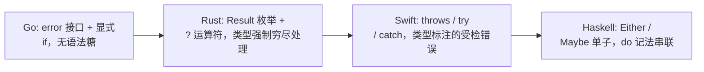
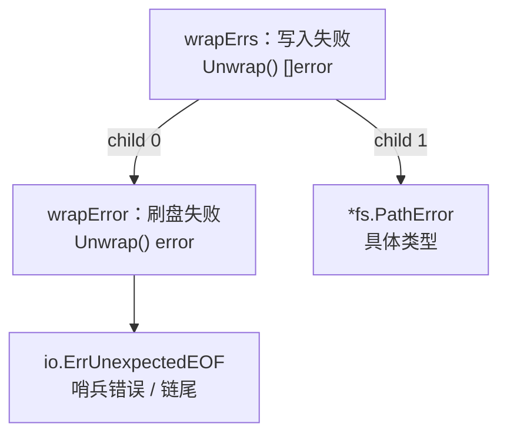
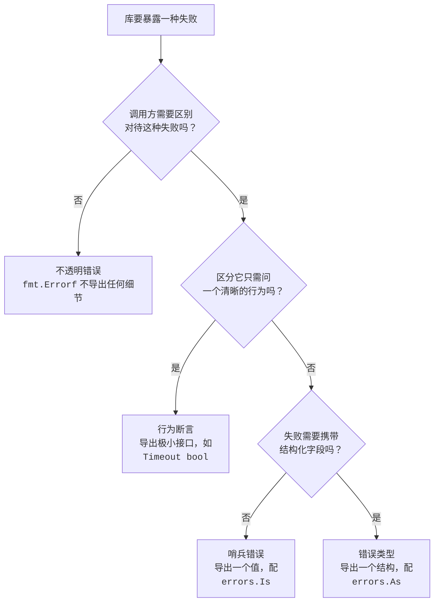

# 7 错误处理

错误是什么？它从哪里来？到哪里去？当我们出现错误的时候，应该为其做些什么？这些问题并不简单，但是一旦回答不了这些问题我们便不能惧怕错误。错误一词在不同变成语言中存在着不同的理解和诠释。在Go语言里
面，错误被视为普普通通的值。正是因为值的特殊性，从而Go语言允许程序员针对不同场景下的错误进行不同层次的高层抽象，但是又进一步要求程序员得到的错误立即进行处理。这一设计决定一方面给程序员极大的自由，但是另外一方面又不断的困扰着程序员，使他们拿到一个错误的时候不知所措。

## 7.1 问题的演化

在6.3里面我们已经把那道分水岭画了出来：如何处理错误，是语言设计的一处抉择。异常派(C++, Java, Python)用`try/catch`把错误从路径里面抽出，主干干净，代价是错误路径变得隐式，可能从任意点抛出；
值派(Go,Rust，以及C的返回码传统)把错误当成普通返回值显示传递，啰嗦，每一条错误路径都是白纸黑字，无处可藏。Go选择了值派，只为真正异常保留了轻量的`panic/recover`。这一节要江的是选择落地以后，
错误作为值这一主张本身又经历了怎么样的演化：从一个只打印的字符串，长成一颗可以被程序逐层访问你到底是不是那个错误的数。

### 7.1.1 错误即是值

```go
type error interface {
    Error() string
}
```

任何实现`Error() string`的类型，都可以作为`error`传递。它不是一种特殊的语言构造，而是一种特殊的语言构造，而是一个再普通不过的接口值，能赋值，能比较，能放进切片，能作为字段，能跨channel传递。
这正是Rob Pike在`<<Errors are values>>`里面反复强调的一句话：错误是值，而值可以被编成。程序员不是被动地捕获一个从天而降的异常，而是主动地拿一个值去判断，包装，传播或者吞下。

这个主张在函数签名上有一处固定的体现：错误总是作为最后一个返回值显式交换给调用方。

```go
f, err := os.Open(name)
if err != nil {
    return err
}
defer f.Close()
// 使用f
```

满屏的`if err != nil`常被诟病。但是它恰好是值派的代价与收益的同一面：错误即然是值，就必须像别的值一样被显式接住，编译器不会替换你偷偷送到别处。这和6.3里面的Go的整体气质一脉相承，显式优与隐式。
把错误降格为一个一方法接口，换来的是最大的自由：标准库不需要预先规定一套登记体系，任何人都可以贴合自己场景的类型去定义`error`，从一个字符串常量，到一个携带行号，文件名，底层系统调用号的结构体。代价是这份自由把责任也一并交给了用户，怎样定义错误，怎样让调用方能可靠地辨认它，都得自己安排。这一节目余下的篇章，讲的就是Go社区与标准库为这份责任摸索出来的答案。

### 7.1.2 从字符串到可检查的错误

最朴素的错误就是一句话。`errors.New`与`fmt.Errorf`各造一个只携带字符串的错误值：

```go
err := errors.New("connection refused")
err := fmt.Errorf("read %s: %v", name, cause)
```

`errors.New`返回的是`*errorString`内部只有一个字段，`Error()`把它原样突出。对报告一次失败，打印给人看这一最低需求，这已够用。麻烦出在下一步：程序常常只想打印错误，还想根据错误是什么决定怎么
办。文件不存在就常见，连接被拒就重试，读到流末尾就正常收尾。这就要求调用方能可靠的出一句：这个错误是某个特定的错误？

标准库给出的第一种答案就是哨兵错误（sentinel error），用一个导出的变量充当某类失败唯一标识，最著名的就是`io.EOF`:

```go
package io
var EOF = errors.New("EOF")
// 调用方比较
for {
    n, err := r.Read(buf)
    // ... 处理buf[:n]
    if err == io.EOF {
        break
    }
    if err != nil {
        return err
    }
}
```

哨兵的好处是检查干脆，一次`==`即可。但是它脆弱。其一，`io.EOF`是一个变量而非常量，任何拿到他这个包的代码都可能修改它：

```go
import "io"
func init() {
    io.EOF = nil    //合法，且足以让别处 == 判断永远落空
}
```

在庞大的依赖图里面，谁也无法担保没有一处恶意或者失手赋值把这样的哨兵改掉，这甚至构成一类安全隐患(设想`rsa.ErrVerfication = nil`) 。规避之道是把哨兵做成不可变的常量错误，让字符串类型自己
实现`Error()`：

```go
type ioError string
func (e ioError) Error() string { return string(e) }
const EOF = ioError("EOF") // 常量，无法被改写
```

其二，也是更要命的一点。`==`只在错误未经过任何包装的时候才成立，一旦中间某层唯了补充上下文，把原始错误重新格式化一句话里面，`==`立刻实效：

```go
func readConfig(path string) error {
    if err := open(path); err != nil {
        return fmt.Errorf("read config %s: %v", path, err) // 用%v，原始错误被拍平成字符串
    }
    // ...
    return nil
}
```

此时上层若想知道根本不是`io.EOF`， `==`已经无能为力了，因为它返回的是一个全新的字符串错误，原来的io.EOF身份在格式化的那一刻就丢了。退而求其次的做法是去`Error()`的字符串里面做字串匹配，
`strings.Contains(err.Error(), "not found")`,这把错误建立在错误的认可可读文本上，文案一改，本地化一换就奔溃了，是最不该依赖的写法。

第二种答案时自定义错误类型，用类型断言来检查：

```go
type PathError struct {
    Op string
    Path string
    Err error
}

func (e *PathError) Error() string {
    return e.Op + " " + e.Path + ": " + e.Err.Error()
}

// 调用方法断言
if pe, ok := err.(*PathError); ok {
    log.Printf("操作 %s 失败于 %s", pe.Op, pe.Path)
}
```

自定义类型能携带结构化上下文，比一句字符串的信息丰富的多。但它和哨兵共享同一个致命弱点：类型断言`err.(*PathError)`同样只对未经包装的错误成立。只要中间层用`fmt.Errorf("...: %v", err)`
把它套进来一句话，断言就再也满足不了了。

于是错误即值的第一阶段就留下了一个清晰的紧张关系：调用方即想为错误补充传播路径上的上下文，又想在顶层仍然能可靠的辨认出根因。用`%v`包装会丢失身份，不包装又会丢失上下文，二者不可兼得。Go 1.13
的包装机制，正是为了化解这个紧张关系而来。

### 7.1.3 Go 1.13:包装， Unwrap与Is/As

Go 1.1（2019）给fmt.Errorf添加了一个动词`%w`, 并在errors包里面创立了三个配套函数。核心思想是：包装时不再内层错误拍平成字符串，而是把它原样保留为一条可被回溯的链条。

```go
// 用%w包装，内存错误被保留，而非格式化字符串
err := fmt.Errorf("read config %s: %w", path, io.EOF)
```

%w和%v的唯一区别是在于:带%w的Errorf返回的错误会额外实现一个`Unwrap() error`方法，吐出被包装的那个内存错误。%v制造的是一段无法回溯的文字，%w制造的是一个连着根节点。有了Unwrap，这条链条上
有没有某个错误就成了一次沿着链条行走，标准库封装进了`errors.Is`与`errors.As`:

```go
// Is: 链条上有没有等于target的错误(取代裸 ==)
if errors.Is(err, io.EOF) { ... }

// As: 链条上有没有某个类型的错误，找到就填进target(取代裸类型断言)
var pe *PathError
if errors.As(err, &pe) {
    log.Printf("失败与 %s", pe.Path)
}
```

errors.Is从err出发，反复`Unwrap`，沿途与target比较，任意一环相等即命中；还允许错误类型自定义一个`Is(error) bool`方法，声明等价于某个哨兵。`errors.As`同理沿链走，但比较的是类型是否可赋值
给target指向的变量，命中即填值。两者把7.1.2里面那个包装就丢身份的死结彻底解开：中间层尽管用%w层层叠加上下文，顶层依旧能用`Is/As`穿过所有包装认出的根因。自此，调用方检查错误的正确姿势从`==`\
与类型断言，整体迁移到了`Is`与`As`。这一机制的细节，以及后来增加的范型版`errors.AsType[E error](err)(E, bool)`（免去穿指针，直接匹配返回值，留到7.2详谈，这里只需要记住一个转折：错误
从此是一颗可被追问的树，而不在是一句话。

### 7.1.4 Go 1.20: errors.Join与多重包装

到Go 1.20（2023）,这棵树丛单链长成了真正的多叉。实现里一次操作可能撞上多个错误，关闭若干资源的时候每个`Close`都可能失败，一次检验里面多个规则同时不满足。此前只能把他们拼接成一个字符串，拼接
完成便无法分开检查。`errors.Join`把多个错误聚集成了一个，且各自保留各自的身份。

```go
err := errors.Join(err1, err2, err3) // nil会被丢弃；全nil则返回nil
```

Join返回错误实现是`UnWrap() []error`,一次吐出来一组而非一个。与之对称，`fmt.Errorf`也允许一句话里面出现多个`%w`，同样得到一个`Unwrap []error`的多重包装错误。errors.Is与errors.As
早已按照这两种`Unwrap`形态做了深度优先遍历，因此多叉树同样适用：

```go
err := fmt.Errorf("两路都失败: %w; %w", io.EOF, os.ErrNotExit)
errors.Is(err, os.ErrNotExist)  // true:遍历会走到第二个分支
```

至此，错误即是值长出了完成形态：一个值，一条Unwrap链或者Unwrap数，一对沿着行走的`Is/As`。值得一提的是，这一路演化没有动过`error`接口本身的那个方法，全部能力都建立在了错误值可以再实现一个
Unwrap这一可选的的约定上。接口不变，约定渐增，这正是把错误做成普通值所换来的扩展余地。

### 7.1.5 被否定的语法：check/handle与撤回的try

值派最常被攻击的是，始终是那满屏的`if err != nil`。Go团队也不是没想过给它瘦身，但是每次尝试最终都被否决了，这些否决本省比任何宣传都能说明Go的去向。

2018年的Go 2错误处理草案提出过一对`check/handle`关键字：`check`自动检查紧随其后的表达式的错误并在出错时候跳转，`handle`块统一兜底。它引入了一个新的，隐式的控制流跳转，与Go控制流应该
一眼看清的气质相抵，争议巨大，未被采纳。

2019年，团队把方案收窄成一个不需要新关键字的内建函数try。设想中`x := try(f()`在f()返回非nil错误时，让当前函数直接带着该错误返回：

```go
// try 提案设想的写法(最终未进入语言)
func read(name string)([]byte, error) {
    f := try(os.Open(name)) // 出错则当前函数直接return ..., err
    defer f.Close()
    return io.ReadAll(f)
}
```

提案引发了Go历史上规模最大的讨论之一，反对意见集中在两点：其一，try是一个会让函数提前返回的函数，把一处控制流跳转藏进了看似普通的表达式里面，破坏了返回点显式可见；其二，它与调试，与defer中改
写错误返回值的惯用法配合别扭。提案在童年被官方撤回(withdrawn),理由写的很直白：社区分歧过大，且它解决的问题不值得引入这种隐式性。

把几次否决连起来看，会得到一条清楚的设计底线：Go宁愿忍受着`if err != nil`的冗长，也不肯用隐式的控制流跳转去换取简短。简短不是不重要，但在Go的排序里面，它排在显式之后。错误处理的语法之争尚未
结束，这部分的来龙去脉与最新动向，7.5会接着讲。

### 7.1.6 值派内部：Go站在最简的一端

把镜头拉远，值派内部其实也有疏密之分。同样是错误即值，别家给了它多少语法糖，多强的类型约束，差别不小。把它们排在一起，Go的位置就清楚了。



Rust用枚举`Result<T, E>`把成功与失败编进了类型，调用方若不处理，编译器就报错，错误处理是强制穷尽的；`?`运算符则是它的语法糖，`if f = File::Open(name)?;` 在出错的时候当前函数提前返回，
效果正是被Go否决的那个try。Swift走受检异常的路子，函数用`throws`在签名里面声明可能抛错，调用处以try标注，用`do/catch`兜住，错误是值(遵循Error协议),但是传播靠的是一套异常语法。Haskell更
纯粹，用`Either e a`或者`Maybe a`这样的代数数据类型表达可能失败的计算，再借助单子的`>>=`与do记法把一串可能是比啊的步骤串起来，任意一步失败整条段路。

四者都把错误当值，分别在于语言替你做了多少。Rust用类型系统逼你处理，用`?`替你传播；Swift用`throws`标注，用`try/catch`传播；Haskell用单子替你串联与短路。Go是其中机制最少的一端：没有`?`,
没有throws，没有单子，错误就是返回值。检查就是if,传播就是`return err`。这份刻意的克制，与11.9里面Go主暴露顺序一致原子，不给弱序档位的取向如出一辙，宁可让用户多写几行显式代码，也不愿再语言
里面堆机制。这套取舍没有决定的优劣，它换来的是任何人读任何一段Go代码。都能从`if err != nil`一眼看出错误再哪里被检查，又流向何方。带着这条主线，下面三节就分别落到本章开头提出的三个问题上：
错误值如何检查，上下文如何附加，处理语义如何安排。

## 7.2 错误值检查

错误一旦在调用链条上传播，处理它的代码与产生它的代码往往隔着许多层。这就带来了一个朴素却棘手的问题：拿到一个层层传上来的error，调用方如何判断它到底是不是某个特定的错误，又如何从中取出来当初
那个携带了上下文的具体错误值？这一节回答的就是这个问题，以及Go为此在errors包里面立下的那套约定。

最朴素的错误就是一句话。`errors.New`把一个字符串包成error，内部只是errorString这一极简的实现：

```go
package errors

type errorString struct { s string }
func(e *errorString) Error() string { return e.s }

func New(text string) error { return &errorString{text} }
```

实践中常把它和fmt.Sprintf拼接起来用，凑出一句带变量的错误消息，可一旦错误被压成字符串，它的可处理性便几乎归零：调用方只能拿这句话和别的字符串比较，无从知道它的来源，也无从取回原始值的错误值。
Go 1.13在errors包里面补上了`Unwrap`，`Is`，`As`，以及go1.26新增的泛型`AsType`，要解决的正是这个错误一旦上浮便不可追问的困境。他们的共同前提，是先把错误串成一条可以回溯的链条。

### 7.2.1 错误传播链:从单层包装到错误树

要让上层能追问到下层，错误就不能在传播实践丢掉来历。`fmt.Errorf`用`%w`动词做到这一点：它在生成新错误消息的同时，把被包装的原始错误保存下来。以便新的错误记得自己是从哪里来的。单个`%w`产出的是
一个实现了`Unwrap() error`的`wrapError`，多个`%w`则产出实现了`Unwrap() []error`的wrapErrs:

```go
package fmt

// 裁剪后的Errorf:只保留按照%w个数选择包装类型这一设计相关分支
func Errorf(format string, a ...any) error {
    p := newPointer()
    p.wrapErrs = true       // 允许 %w 把对应的实际参数 p.wrappedErrs
    p.doPrintf(format, a)   // 格式化; %w 退化成 %v拼接，并记录其位置
    s := string(p.buf)
    switch len(p.wrappedErrs) {
    case 0:
        return errors.New(s)        // 没有 %w，就是一条普通的错误
    case 1:
        return &wrapError{msg: s, err: ...} // 单个 %w: 链上的一个节点
    default:
        return &wrapErrs{msg: s, errs:...} // 多个%w: 一个节点指向多个子错误
    }
}

type wrapError struct { msg string; err error }
func (e *wrapError) Error() string { return e.msg }
func (e *wrapError) Unwrap() error { return e.err } // 单链

type wrapErrs struct { msg string; errs []error }
func (e *wrapErrs) Error() string { return e.msg }
func (e *wrapErrs) Unwrap() []error { return e.errs } // 分叉
```

`%w`与 `%v`的差别正在于此。%v只把错误格式化成字符串拼进消息，来机就此消失； %w在拼接字符串之外额外保留了对原始错误的引用把它拼接到链上。这条引用也是一种API承诺：一旦用%w暴露内存错误，调用方
就可能依赖`errors.Is/As`去匹配，于是内层错误便成了你对外部契约的一部分。若只想在消息里面提一句不愿暴露内部错误类型，应当用%v。

`Unwrap() []error`是Go 1.20引入的第二种拆包形态。标准库的`errors.Join`正是用它若干并列的错误合成一个：

```go
err := errors.Join(errClose, errFlush)  // err.Unwrap()返回 []error{errClose, errFlush}
```

于是错误不再是一条线，而可能是一棵树：`Unwrap() error`的节点有一个子节点，`Unwrap() []error`的节点有多个子节点，叶子则是不在实现任何`Unwrap`的原始错误（哨兵或者某个具体类型）。检查一个
错误，就是在这棵树上做一遍遍历。



上图中的`errors.Is(e3, io.ErrUnexpectedEOF)`会沿着child 0一路Unwrap到链尾命中；`errors.As(e3, &pe)`(pe为`*fs.PathError`)则在child 1这一支按类型匹配到。二者走的都是同一颗树，
只是命中的判断不同。

### 7.2/2 Unwrap：拆卡一层

`Unwrap`是这一套机制的地基，它只做了一件事情：若错误实现了`Unwrap() error`，就调用它取出内层；否则返回nil。它有意识只认`Unwrap() error`着一种形态，不处理`Unwrap() []error`，遍历整
颗树的职责留给了Is/As:

```go
func Unwrap(err error) error {
    u, ok := err.(interface{ Unwrap() error })
    if !ok {
        return nil
    }
    return u.Unwrap()
}
```

### 7.2.3 Is: 链感知的哨兵比较

判断这是不是某个特定错误，传统写法是`err == io.ErrUnexpectedEOF`。一旦错误被包装过，`==`就失效了，因为底层是个`wrapError`，并不等于链尾的哨兵。`errors.Is`把这次比较变成在整棵树上的查
找：从err自身开始逐层下探，任一节点于`target`相等便算命中。

实现上，导致的Is只做参数校验，真正的遍历在递归的is里面。它在某个节点上依次尝试两种判据，再按照节点拆包形态决定下一步往哪里走，遇到`Unwrap []error`便对某个子节点递归（深度优先）:

```go
func is(err, target error, targetComparable bool) bool {
    for {
        // 判据一：判断相等(target可比较)
        if targetComparable && err == target {
            return true
        }
        // 判断二：err自定义了Is方法，交给它判
        if x, ok := err.(interface{ Is(error) bool}); ok && x.Is(target) {
            return true
        }
        // 按照拆包形态如何继续下探
        switch x := err.(type) {
        case interface { Unwrap() error } :
            if err = x.Unwrap(); err == nil {
                return false
            }
        case interface{ Unwrap() []error } :
            for _, e := range x.Unwrap() {
                if is(e, target, targetComparable) {
                    return true
                }
            }
            return false
        default:
            return false // 到了叶子节点仍未命中
        }
    }
}
```

第二条判断依据是Is的精巧之处：错误类型可以自定义`Is(error) bool`，声明自己等级于某个哨兵。`syscall.Errno`便用它让一个系统调用错误码匹配`fs.ErrExist`这类抽象哨兵。于是从：

```go
if err == io.ErrUnexpectedEOF { /*... */}
```

改用

```go
if errors.Is(err, io.ErrUnexpectedEOF) { /* */}
```

后者既穿透了包装层，又给了错误类型自定义等价关系的余地，而前者只认严格相等。

### 7.2.4 As与泛型AsType:按类型取回错误值

`Is`回答是不是，`As`回答是哪个具体类型，把它会给我。它同样在树上遍历，但是命中的判据换成当前错误的动态类型可以赋值给目标类型，命中后通过反射把该错误写进调用方提供的指针：

```go
func as(err error, target any, targetVal reflectlite.Value, targetType reflectlite.Type) bool {
    for {
        reflectlite.TypeOf(err).AssignableTo(targetType) {
            targetVal.Elem().Set(reflectlite.ValueOf(err))
            return true
        }
        if x, ok := err.(interface{ As(any) bool }); ok && x.As(target) {
            return true // 错误自定义了As, 自己负责赋值
        }
        switch x := err.(type) {
        case interface{ Unwrap() err}:
            if err = x.Unwrap(); err == nil {
                return false
            }
        }
        case interface { Unwrap() []error} :
            for _, e := range x.Unwrap() {
                if e != nil && as(e, target, targetVal, targetType) {
                    return true
                }
            }
            return false
        default:
            return false
    }
}
```

由此，从脆弱的类型断言：

```go
if e, ok := err.(*fs.PathError); ok { /* 用e.Path */}
```

改写为穿透包装层：

```go
var e *fs.PathError
if errors.As(err, &e) { /* 用e.Path */ }
```

As的签名有两处长期为人诟病的别扭：`target`是`any`，类型安全靠运行时panic兜底；取值要先声明变量，再传地址，再读回来，绕了一圈。Go 1.26用泛型把这条线捋直了，新增了`AsType[E error]`:

```go
func AsType[E error](err error) (E bool) // 返回匹配到的错误与是否命中
```

于是上面的例子可写成一行，类型在编译器就钉死，不需要中间变量，也不再有传错执行类型这一类只能在运行时崩出来的错误：

```go
if e, ok := errors.AsType[*fs.PathError](err); ok { /*用e.Path */}
```

AsType与As公用一套树遍历，差别仅在出口： As把结果写进来指针并要求target是非空指针，AsType直接返回值，并以类型参数E取代运行时类型检查。官方文档因此建议新代码用`AsType`, As保留给目标类型在
编译期未知的少数场景。

### 7.2.5 为何是值+类型在链上，而非异常类层级

把`Is/As`放进语言史里面看，会更明白这套设计在回避什么。Java,C++,Python走的是另外一条路：错误是异常对象，按照所属的类去catch,子类异常被父类的catche捕获，靠的是一颗继承树。这套机制优雅，
但是它把错误是什么和错误的类型层级绑定死了：要表达这个错误也算那一类，往往得新开一个字类；跨库错误难以相互归类，因为各自的继承彼此独立。

Go选择把错误当作普通的值与类型，在一条由`Unwrap`显式串起的链上做检查，由此换来三点：

- 哨兵与具体类型可以共处一链。同一个链上。`Is`按照值比较哨兵，`As/AsType`按类型取回具体的错误，两种判断互不干扰。异常体系里面两件事都得挤进类型这一维度。
- 等价关系可由错误自己定义。`Is(error) bool`与`As(any) bool`让一个错误声明自己等级于某个哨兵，或者可被当作另外一个类型，无需修改即成关系。`syscall.Errno.Is`即如此。
- 包装是组合而非继承。%w与join把错误像积木一样叠起来，链的形状由数据决定，而非编译期就固定的类层级决定。代价是检查从一次catch分派变成了一次树遍历，慢一些，也要求调用方主动写`Is/As`，而非
  依赖语言的捕获机制兜底

表达力的获得同样由代价：Go把异常体系免费提供给按照类型分派挪到了库与约定调用里面，换来的是错误值的可组合与可追问。

### 7.2.6 惯用法与陷阱

几条经验，多数是对前面机制的直接推论：

- 包装时带上下文。`fmt.Errorf("读取配置 %s: %w", path, err)`让链尾的根因配上每一层的来龙去脉，排错时一条链错误信息就讲清楚了整条路径。
- `%w`暴露API，`%v`隐藏。用`%w`即承诺内层错误可被`Is/As`匹配，它成了你对外契约；若内层错误属于实现细节，不愿被调用方依赖，就用%v把它降级为一句文字。
- 不要过度包装。每一层都`%w`一遍会让链冗长，消息重复。只在这一层确实添加了上下文时候包装。
- 哨兵错误vs类型错误。只需要判断是不是某个固定错误用哨兵(`var ErrNotFound = errors.New(...)`, 配Is)；需要从错误里面取出字段（路径/状态码）则用具体类型（配备`As/AsType`）。先想清楚
  调用方要什么，再决定导出哪种。
- 自定义`Is/As`要浅。这两个方法只应比较err与target自身，不要再里面再调用Unwrap,遍历整棵树是errors包的职责，重复遍历会让负责度失控。

### 7.2.7 小结

`errors`包用一套很小的约定撑起了错误检查：`%w/Join`把错误串成可回溯的链与树，`Unwrap`拆开一层，Is再树上做链感知的哨兵比较以取代脆弱的==,As与go1.26的泛型AsType按类型取回具体错误取代脆弱
的类型断言。它们合起来，把错误一旦上浮便不可追问变成了沿着链可查，按值可比，按类型可取。而这一切建立在错误是普通的值与类型，靠组合而非继承叠起来这一根本选择之上。

## 7.3 错误格式与上下文

一个好的错误，不止是出错了，而是能告诉人：在做什么的时候，因为什么，出了什么错，问题的演化与值检查给了我们传递与检视错误的机制，这一节谈机制上的工程实践，错误的文本应该怎么写，上下文如何沿调用
链一层一层累积，以及当人们写的问题不够用的时候，栈轨迹与结构化日志如何按需求补上。贯穿其间的，是Go在错误信息上的一个总体倾向：人写的语义上下文，优于机器采的栈轨迹。

### 7.3.1 Error() string的约定

error接口只要求一个方法：

```go
type error interface {
    Error() string
}
```

围绕这一唯一的方法，Go社区形成了一套不成文却处处可见的风格约定：错误字符串首字母小写，结尾不加标点。约定背后的原因很实际。错误极少独立出现，他们总是被层层包装，首尾相连，拼接成一条更长的字符串。
设想三层调用个字补上一句上下文，最终用户看到的是：

```go
read config: open /etc/app.conf: permission denied
```

这是三段错误用：拼接而成的一条因果链。若每一段都按照橘子的写法首字母大写，末尾加句号，拼接起来便成了`Read Config: Open /etc/app.conf:Permission denied.`,一串大写字母于句号散落到句子
中间，读起来支离破碎。小写，无标点的片段，才能顺畅嵌入任意位置，串成一条连贯的链。这条约定细小，却是Go错误信息能层层拼接而不失可读的前提。

需要澄清的一处常见的说法：检查这条约定并不是`go vet`。历史上它由golint负责，golint归档后，这项检查由`staticcheck`等第三方工具承担。go vet不管字符串的大小写，但是它确实有一个于错误相关
的检查，针对`log/slog`的结构化日志调用。

### 7.3.2 在每一处边界补上上下文

错误从底层向上传播时，每经过一个有意义的边界，都该补上一句我当时在干什么。这正是`%w`包装的首要用途，也是Go错误处理的核心实践。下面是一段典型的配置加载代码。它在两个不同的失败点各自标注了当时
的意图：

```go
func loadConfig(path string)(*Config, error) {
    data, err := os.ReadFile(path)
    if err != nil {
        // 标注在加载哪个配置文件，并用%w保留底层error供判定
        return nil, fmt.Errorf("loading confign %q: %w", path, err)
    }

    var cfg Config
    if err := json.Unmarshal(data, &cfg); err != nil {
        // 解析失败的另一类边界，标注的语义不同
        return nil, fmt.Errorf("parse config %q: %w", paht, err)
    }
    return &cfg, nil
}
```

文件不存在时，调用者最终拿到的是`load config "a.confg": open a.confg: no such file or directory`:一条从高层意图到底层原因的完整链。`%w`在拼接出这句可读文字的同时，把底层的
`fs.ErrNotExist`保留在错误树里面，调用者既能把整句打印给用户，也能用`errors.Is(err, fs.ErrNotExist)`判定具体原因。文字给人看，结构给程序看，两者并不冲突。

这种逐层标注，本质上是用人工书写换取语义。异常语言里面，错误一路向上抛，沿途的上下文由运行时自动采集成一条栈轨迹；Go把这件事情交还给程序员：每一层主动写一句话，最终拼接成的不是一串函数名
与行号，而是一条人类可读的，描述程序在做什么时出错的意义链，代价要勤快，每个边界记得包装，漏掉一层，链上就断一节；收益是错误信息往往比上一条机器栈轨迹更说明问题，因为它讲的是业务意图，而非实现
细节。

一个值得记住的纪律：包装的文件描述本层在做什么，而不是复述下层已经说过的话。`fmt.Errorf("load config: %q: %w", path, err)`里面，loading config是本层的意图，`%w`后面交给下层去讲
它自己的失败，两层各说一段，不重不漏。

### 7.3.3 标准库的error不带栈

逐层标注虽好，定位疑难问题时候，人们有时候仍要一条机器栈轨迹，知道错误究竟从哪一行冒出来的。标准库的errors.New与fmt.Errorf默认都不采集栈。

```go
func New(text string) error {
    return &errorString{text}
}

type errorString struct {
    s string
}

func (e *errorString) Error() string { return e.s }
```

一个errorString只有一个字符串字段，别无它物。这是有益的取舍，而非疏漏。采集轨迹需要`runtime.Callers`回溯调用栈,再把程序计数器翻译成函数名与行号，这在错误高频产生的路径上（例如error表示
未找到已到末尾这类预期的控制流）是不小的开销。Go的判断是：绝大多数错误用不上栈，把栈做成默认会让所有人为少数场景买单。于是标准选择最小的error，把栈留给需要的人按需要增加。这正是Go标准库一贯
的姿态：核心极简，扩展按需。

### 7.3.4 把栈与诊断信息加进来

需要栈的场景，社区早有成熟方案。Dave Cheney的`github.com/pkg/errors`提供`WithStack`与`Wrap`，在包装错误的同时记下当前调用栈，并约定`%+v`打印出来带栈的完整诊断：

```go
import "github.com/pkg/errors"

func loadConfig(path string) (*Config, error) {
    data, err := os.ReadFile(path)
    if err != nil {
        return nil, errors.Wrap(err, "load config") // 记此处的调用栈
    }
    // ...
}
// 上层打印：fmt.Printf("%+v\n", err)
// 普通%v仍是一行："load config: open a a.confg: ...",
// %+v 则额外逐帧列出函数名与文件号
```

`pkg/errors`验证了一件事：包装，栈轨迹，可定制的打印格式，可以叠在error接口之上而不必改动语言。它的很多理念后来流入标准库。`golang/x/xerrors`是Go 1.13错误特征正式落地前的试验田，`%w`
包装，`Is/As/Unwrap`的雏型都在那里打磨，最终其中核心被吸收进errors与fmt，而把栈轨迹留在了标准库之外，交由第三方按需提供。

要让自定义错误类型支持`%+v`这类丰富输出，靠的是`fmt.Formatter`接口：

```go
type formatter interface {
    Format(f State, verb rune)
}
```

实现了Format的类型，可以完全接管自己被fmt打印的行为：通过`State`拿到输出目标(`State`同时是`io.Writer`)和格式标志，再根据`verb`(v,s等)与标志(f.Flag('+')是否设置+）决定打印简略的一行
还是带栈的多行，一个携带栈的多行。一个携带栈的错误类型致这样裁剪：

```go
// 速写：一个带栈的错误，普通打印一行，%+v打印栈
type withStack struct {
    err error
    stack []uintptr // 构造时由runtime.Callers采集
}

func (w *withStack) Error() string { return w.err.Error() }
func (w *withStack) Unwrap() error { return w.err } // 仍可被Is/As穿透

func (w *withStack) Format(s fmt.State, verb rune) {
    switch verb {
    case 'v':
        if s.Flag('+') {
            fmt.Fprintf(s, "%+v", w.err)
            for _, pc := range w.stack {
                fn := runtime.FuncForPC(pc)
                file, line := fn.FileLine(pc)
                fmt.Fprintf(s, "\n\t%s\n\t\t%s:%d", fn.Name(), file, line)
            }
            return
        }
        fallthrough
    case 's':
        fmt.Fprint(s, w.err.Error())    // %v / %s：只打印一行
    }
}
```

这样，同一个错误值，平时打印是简洁的一行。排障时`%+v`就能展开带栈的诊断。Format让打印多详细成为输出时才决定的事情，而不必再删生错误的时候固定下来。

### 7.3.5 结构化日志：错误作为字段

文本拼接的链有一个天花板：它是给人读的散文，不便机器检索与聚合。当错误进入日志，要被监控系统按照字段过滤，统计，告警时，一行字符串就显的笨拙。Go 1.21引入的`log/slog`把日志从格式化字符串转向
到键值对的结构化记录，错误于是能作为一个带键的字段被记录，而非塞进一句话：

```go
import "log/slog"

func handle(path string) {
    cfg, err := loadConfig(path)
    if err != nil {
        // 错误是一个名为“err”的字段，path是另外一个字段
        slog.Error("config load failed", slog.String("path", path), slog.Any("err", err),)
        return
    }
    _ = cfg
}
```

以JSON Handler输出时，这条记录形如：
`{"level":"ERROR","msg":"config load failed", "path":"a.conf","err":"load config \"a.conf\": ..."}`。msg是稳定的，可聚类的事件名，path与err是可被检索过滤的字段。逐层标注
积累出的那条语义链，此刻成为err字段的值，两套实践再这里衔接：人写的上下文负责讲清楚发生了什么，结构化字段负责让机器查的到，统计得出。这正是这类错误处理与客观性的交汇点。

`slog`的键值接口有一处易错：它接受交替的key, value变长参数，写漏一个值或者把非字符串放在键的位置，编译器不会报错，运行期才出问题。前面提到的`go vet`的`slog`检查正是由此而生，它会在静态分析时
暴出键值不配置的调用，录入缺了最后一个值，或者键位放了个整数。本节用`slog.String`，`slog.Any`显式构造Attr，即避开了这个坑，也让字段类型一目了然。

### 7.3.6 设计取舍与谱系

把这一节总结成一句话：Go在错误格式上倾向于人写的语义上下文，而把机器栈轨迹做成可选项。

- 标准库默认不带栈，不及逐层用`%w`标注。常见错误因此高度可读，讲的是业务意图：代价是程序员要勤于包装，且默认拿不到栈。
- 需要栈时，`fmt.Formatter`加`runtime.Callers`即可把带栈的诊断叠加上去，`pkg/errors`把这套做法工具化，其理念经过`x/xerrors`实验后进入标准库。深度诊断按需要扩展，不让多数人为少数场景
  买单。
- 需要机器可查时，`log/slog`把错误降低为一个结构化字段，与监控系统对接。

放进族谱看，这与异常语言的路线恰成对照。Java,Python用自动采集栈轨迹换取零成本的上下文，代价是栈轨迹冗长，充斥实现细节，且无法表达业务语义；Rust与？同样默认不带栈，社区靠anyhow,thiserror等
库补充上下文与可选的回溯，与Go的`pkg/errors`思路高度相似。一个朴素的`Error() string`接口，配上社区约定，`%w`包装,`fmt.Formatter`与`log/slog`，撑起了从一句话错误到带栈结构诊断的整个
族谱，核心极其简单，按需要扩充，是Go标准库反复出现的样子。

## 7.4 错误语义

7.2与7.3站在调用方一侧，讲清楚了拿到一个error之后如何按沿链检查，如何叠加上下文。这一节把视角调到一侧，站在库作者一侧问一个先于检查的问题：当一个包要把失败暴露给外界时，它应当把错误做成什么
形式？是导出一个可比较的值，还是导出一个带字段的类型，抑或什么都不导出。

这并非纯粹的风格之争。错误的形式一旦发布，就成了包的公开契约的一部分，和函数签名一样难以更改。调用方会照着这个形式写下分支逻辑，而这些逻辑反过来把调用方与库耦合在了一起。不同的形式，承诺给契约
的东西不同，因而日后能改动的自由度也不同。本节把社区里几种做法摆在一起，按向API契约承若了什么这条线索逐一称量他们的代价，最后给出一个可操作的取舍次序。

### 7.4.1 哨兵错误：向契约承诺一个值

最直接的做法是导出一额预先约定好的错误值，让调用方拿它做相等比较。标准库里面这样的例子俯拾皆是：

```go
package io

// EOF是Read在没有更多输入时候返回的错误
var EOF = errors.New("EOF")
```

```go
package sql

// ErrNoRows 在 QueryRow没有命中任何行时候由Row.Scan返回
var ErrNoRows = errors.New("sql: no rows in result set")
```

调用方据此分支：

```go
row := db.QueryRow("select ...")
if err := row.Scan(&x); errors.Is(err, sql.ErrNoRows) {
    // 查无此行，走业务上的不存在分支
}
```

这类预制的错误称为哨兵错误（sentinel error)。它简单到近乎透明，是表达成功之外的一种确定结局的最省力手段，`io.EOF`之所以不算真正的错误而像是一个信号。正是因为它表达的是正常读到流的末端。

简单的代价在向契约承诺一个值这句话里面。而且承诺的东西比初看时要多。`io.EOF`的文档写的直白：

> Read必须返回EOF本身，而不能返回一个包装了EOF的错误，因为调用会用 == 来检测它。

这一句话道出了哨兵隐形成本。这个值与契约焊得太死，以至于库自己都不能再用7.3的%w去包装它，否则`==`比较久失败了。`errors.Is`缓和了这一点，让沿链比较称为可能，但它要求库与调用方都升级到知晓
错误链的写法，且哨兵作为导出变量始终是可被外部重新赋值的可变状态。

更深一层的问题。Dave Cheney在《Constant errors》中点破：哨兵是不可代换的。两个内容完全相同的`errors.New("EOF")`并不相等，因此每个哨兵这个唯一的实例本身成了契约。这把两个不相关的包绑定
在了一起，调用方写`errors.Is(err, io.EOF)`,就必须在源码里面写`import "io"`。哨兵适用在结构种类变少，语义稳定，不需要携带任何上下文的场合；一旦失败就需要带上参数（哪个文件，哪个字段），它
就力不从心了。

### 7.4.2 错误类型：向契约承诺一个结构

当失败需要携带数据时候，自然的做法就是定义一个实现了error接口的具体类型，把数据放进字段。

```go
// PathError 记录一次失败的文件操作，以及导致失败的路径与底层错误
type PathError struct {
    Op  string  // 操作名
    Path string // 涉及路径
    Err error // 底层错误
}

func (e *PathError) Error() string {
    return e.Op + " " + e.Path + ": " + e.Err.Error()
}
```

调用方用`errors.As`沿链取出这个类型，再读它的字段：

```go
var perr *fs.PathError
if errors.As(err, &perr) {
    log.Printf("操作 %s 在路径 %s 上失败", peer.Op, peer.Path)
}
```

错误类型比哨兵能传递的信息多得多，这是它的价值。代价是耦合了更深的一层：哨兵只承诺一个值，类型则把整个结构承诺给了契约。As的目标必须是这个具体类型，于是调用方代码里写死了`*fs.PathError`，连
通它的字段名称一起。库日后想命名字段，改变它的字段语义，乃至换一个实现类型，都会惊动每一个做过断言的调用方。导出的类型越大，字段越多，能改动而不破环兼容的余地就越小。

这里有一个常被忽视的设计纪律：被导出供`As`断言的类型，其导出字段就是API。给一个错误类型添加字段是安全的，改名或者删字段则是破坏性变更。因此值把暴露的字段压到最小，只保留调用方确实需要分支的那
些。

### 7.4.3 不透明错误：什么都不承诺

走到光谱的另一端，只是返回error接口本身，不导出任何哨兵，任何类型，调用方除了成功或者失败之外无从对错误做结构化判断：

```go
func (c *Config) Load(path string) error {
    f, err := os.Open(path)
    if err != nil {
        return fmt.Errorf("加载配置 %s: %w", path, err)
    }
    defer f.Close()
    // ...
    return nil
}
```

Cheney称之为不透明的错误（opaque error），并把它列为多数场合下的首选。它的好处恰恰是哨兵与类型的代价的反面：调用方能做的只有`if err != nil`然后向上传递,于是它什么也没承落契约，库内部如何实
现失败，用什么类型，带什么字段，全是私事，日后可以随意重构不惊动任何人。耦合降到了最低。

代价同样清楚：调用方失去了对错误分门别类的能力。这个代价总不是值得付出。有些失败调用方确实需要区别对待，超时该重试，查无此行该走默认值。把这些场景一律压缩成不透明的错误，等于把本该由库表达的语义
推给调用方，去靠匹配错误字符串猜测，那是更糟糕的耦合。问题于是变成：能不能既让调用方分支，又不把一个值或者一个类型钉进契约？

### 7.4.4 断言行为，而非类型

答案是断言行为，而非具体类型。让错误类型实现一个小到只描述它能回答某个问题的接口，调用方去断言这个小接口，而不是断言某个具体的类型.标准库net给了这一手法的范本：

```go
package net

// Error是网络错误的通用接口
type Error interface {
    error
    Timeout() bool // 这个错误是否由超时引起？
}
```

调用方甚至无须`import "net"`去引入这个命令接口。只要声明声明一个结构相同的匿名接口即可：

```go
// 只关心这个错误能不能告诉它是超时
if ne, ok := err.(interface{ Timeout() bool }); ok && ne.Timeout() {
    // 是超时，可以重试
}
```

这一行断言没有出现任何具体类型，也没有出现任何包名。它问的是你能回答`Timeout()`吗，而非你是不是`*net.OpError`。任何愿意实现`Timeout() bool`的错误都满足它。无论来自哪个包，叫什么名字。
承落给契约的，从一个值（哨兵）或者结构（类型），收缩成一个极小的接口。

值得留意的一侧如何让这个接口在错误链上工作。net.OpError是一个会被包装底层错误的类型，它的Timeout()并不自己判断，而是把问题转发给被包装的错误：

```go
// 速写： OpError把是否超时转发给它包装的底层错误
func (e *OpError) Timeout() bool {
    if ne, ok := e.Err.(interface{ Timeout() bool }); ok {
        return ne.Timeout()
    }
    return false
}
```

于是是否超时这个行为能穿过OpError这一层包装传到外层，调用方在链顶做一次断言即可。（真实的`net.OpError.Timeout`还为`*os.SyscallError`多留了一跳特判，此处省略主干。）要让行为穿越任意
深度的包装，需要链上每一个会包装他人的错误类型都自觉的这样转发，这正是上一节说的库作者承担内务的具体内容：解耦的便利便落在了调用方一侧，维持它的功夫落在了库的一侧。这里与7.2里面的
`errors.Is/As`沿链查找是同一种思路，区别在于`Is/As`的遍历由标准库统一完成，而行为的转发要靠每个中间类型各自实现。两对对照，能看出标准库为何最终把`Unwrap`收编为一等约定：把沿链这件事情
从各包的自觉，变成语言层面的统一机制。

这正是4.2.7中小接口原则在错误处理上的落点。接口越小，满足它的类型越多，断言它调用方与提供它的库之间耦合越松。Cheney把这条原则总结为一句话：断言错误行为，而不是它的类型。库保留了几乎全部的实现
自由，调用方又拿到了它需要的那一点分支能力，两端在一个极窄的接口上会合。

行为断言并不是免费的午餐，它也有自己失效的方式，而且net包内部就留着一个活的反例。net.Error早年还有第二个方法`Temporary() bool`，本意这个错误是不是暂时的，值得重试。它从Go 1.18起被定为
废弃，文档给出的理由是Temporary errors are not well-defined:什么样错误算暂时，始终没有一个各方一致的定义，调用方据此写出的重试逻辑因而并不可靠。教训是：值得断言的行为，必须是定义清晰，
各方共识明确，而非一个语义含糊的标签。小接口的力量来自它问的那个问题足够锐利，问一个模糊的问题，行为断言的解耦优势也就无从谈起。

### 7.4.5 别家的形式

把视野放到Go之外，会看到错误的形式其实是个语言在同一个张力上作出不同选择，而这张力就是表达力与耦合的权衡。

以异常为主的语言（Java,Python,C++）把错误做成了类型层级。`catch (FileNotFoundException e)`本质上是7.4.2中类型断言，只是用继承关系来组织：捕获一个基类就等于捕获其下所有子类。表达力
很强，可携带丰富字段，也能按照粗细不同力度捕获；代价是整棵树异常层都进入了契约，且控制流被隐式地从函数签名里面抽走，调用方很难从签名看出一个函数会抛出来什么。Go没有刻意走这条路，7.1已描述错误
即值的取舍。

Rust走的另一极： `Result<T, E>`把错误类型E写进了类型签名，强调调用方在编译期处理。社区用thiserror为库定义结构化的错误枚举，用anyhow把错误装箱成不透明的`Box<dyn Error>`(相当于Go的
不透明的错误)。可见类型与不透明这两种形式并非Go独有，而是任何错误即值的语言都会面对的选择，区别只在Go用接口与运行时断言来表达。Rust用枚举与编译期穷尽来表达。把Go的四种形式放到这张更大的图
上，行为断言是其中最具Go特色的一种：它依赖结构化类型系统下（凑齐方法即满足结构）的特性，在静态名义类型语言里面反而不易复刻。

### 7.4.6 如何取舍

把四种形式按向契约承诺了什么排开，取舍的次序就清楚了：

| 形式         | 承诺契约的     | 耦合 | 调用方能做什么                    |
| ------------ | -------------- | ---- | --------------------------------- |
| 不透明的错误 | 无             | 最低 | 仅`err != nil`                    |
| 行为断言     | 一个极小的接口 | 低   | 断言`interface{ Timeout() bool }` |
| 哨兵错误     | 一个值         | 中   | `errors.Is(err, ErrX)`            |
| 错误类型     | 一个结构       | 高   | `errors.As`取出并读字段           |

一个可操作的默认次序是：先做不透明的，库布暴露任何内部细节，等到却又调用方需要分支时再说。当某种失败确实需要被区别对待时，优先行为断言，定义一个尽可能小的接口让调用方去问。只有当行为不足以表达，
譬如失败必须携带结构化的字段提供调用方读取，才退而导出哨兵或者类型，并清洗地接受：从这一刻起，这个值或者这个结构就是你的API，它的演化将受Go 1兼容性的约束。

把这条次序化成一张判定流程，落到库作者每次设计错误时候实际要问自己的几个问题：



这条次序的内在逻辑，是让承诺给契约东西尽量少。库少承落一分，日后重构的自由变多一分；调用方依赖面越窄，库的内部变动越不容易波及它。这与全书反复出现的问题同源：好的边界不在于暴露得多，而在于暴露卡到
好处，多一分是负担，少一分是失能。错误的形式，正是这条边界在失败路径上的具体形态。

最后交代一段演进，免得读者把上面的次序当成一成不变的定论。Go 1.13把 Unwrap,Is,As纳入标准库，错误链接为语言层面的约定，这件事悄悄改变了几种形式的低相对代价，在此之前，哨兵一旦被中间层包装就会
丢失，==比较失效，这是当年Cheney力主不透明错误的重要背景；`errors.Is`出现后，哨兵哨与类型都能穿过包装被识别，它们的实用性回升了一截。但承落给契约的东西因此变少，哨兵仍然是一个值，类型仍然是一
个结构，`errors.Is/As`改善的是带上下文与可检查能否兼容，而非耦合本身。因此本节的次序依旧成立；先少承诺，需要时候再多承诺，没多一分都要清楚它换来了什么。至于把`if err != nil`写的更短的语法尝
试，那是另一个层面的问题。

## 7.5 错误处理的未来

前面几节里面我们见过error接口的朴素，%w包装与错误链的检视。读者读到这里，心里多半积着一个没有说出口的疑问：`if err != nil`这三行模版，年复一年的铺满每个Go程序，难道就没有办法收掉吗？这个疑问
并不孤单。从2018年的go2草案到2025年的一纸结论，Go团队为它前后推敲了七年，提出过`check/handle`，`try`，`?`等多套语法，又把它们一一收回。本节把这条没有走通的语法之路，与另外一条悄然走通的
库演进之路，并排摆出来，并交代Go团队最终给出的判断：在可见的将来，错误处理不会迎来专门的语法。

理解这个结局，笔记主任和一套被否决的语法都重要。它不是搁置，而是一次有剧可以的不做，背后是Go对显式优于简洁的一次郑重重申。

### 7.5.1 被否决的语法尝试

`check/handle`： 2018年的go2草案

错误处理语法化的第一次正式尝试，是2018年随Go 2蓝图公布的`check/handle`草案。它引入两个关键字:`check`是一个表达式，对返回`(T, error)`的调用求值，错误为nil时候取出T,否则把控制权交给
最近的handle块；handle是一个语句，声明当前函数里面检查失败的善后逻辑，一个典型的文件拷贝在草案写写成这样：

```go
func CopyFile(src, dst string) error {
    handle err {
        return fmt.Errorf("copy %s %s: %v", src, dst, err)
    }

    r := check os.Open(src) // 失败则跳到上面的handle
    defer r.Close()

    w := check os.Create(dst)
    handle err { // handle可叠加，后声明的先生效
        w.Close()
        os.Remove(dst)
    }

    check io.Copy(w, r)
    check w.Close()
    return nil
}
```

它的野心在handle链：多个handle按照声明逆序生效，让人联想到defer的栈语义，能把出错时会滚的清理逻辑沿调用顺序层层铺开。代价也正是在于此。读者要读懂某一行check失败后会发生什么，得在脑子里
维护一个handle栈，与defer栈彼此独立又彼此纠缠。社区普遍反馈它为省下if而引入一套新的，需要单独学习的控制流，复杂度未必比他消除的更低。草案最终陪判定过于复杂而未进入提案阶段。

try(): 2019年那个撤回的内建函数

吸取`check/handle`太重的教训，Robert Griesemer在2019年6月提出了走向另一极的方案，提案32437: 一个名为try的内建函数。它的签名可以这样理解：接收一个返回`(T1, ..., Tn, error)`的
表达式，错误为nil是返回前n个值，否则用这个错误从所在函数提前返回。于是`copyFile`的开头一段缩成：

```go
// try之前：四行模版换装错误后向上抛
r, err := os.Open(src)
if err != nil {
    return fmt.Errorf("copy %s %s: %v", src, dst, err)
}

// try之后：一行，错误为nil取值，柔否则retnru
func CopyFile(src, dst string) error {
    r := try(os.Open(src)) // err != nil 时， CopyFile立即 return err
    defer r.Close()
    w  := try(os.Create(dst))
    defer w.Close()
    try(io.Copy(w, r))
    return
}
```

try不引入新关键字，不引入新控制结构，只是一个内建函数，语法面上看上去及其克制。错误的装饰则交给defer配合具名返回值去做。提案一出，社区的讨论即上升到Go历史上罕见的规模，反对的核心只有一句：
try把return藏进了一个看起来像普通函数调用的表达式里面。

这正是Go一贯忌讳的，隐藏的控制流。`x := try(f())`这一行可能让函数就此返回，而他读起来和`x := len(f())`没有区别。在一门看代码就能看出控制流走向奉为信条的语言里面。这是难以接受的退化。
提案还带来一连串此生问题：try难以在测试里面(期望t.Fatal而非return)，对错误的掩饰被迫绕道defer,调试时断点也难以落在那条隐式的返回上。同年，提案被作者主动撤回，理由正是社区在控制流可读性
上的强烈分歧。

更轻的if-err与？提案

try撤回之后，社区还未死心，转而探索更轻的形态。最具代表性的是2014年的?运算符提案，它把Rust的?几乎照搬过来。

```go
r := os.Open(src)? // 等价于 if err != nil { return ..., err }
```

后缀一个？,错误非空就携带返回。它比try更轻，连函数调用的外壳都省了，却也把隐藏控制流的问题推到了极致：一个标点就能让函数返回。还有诸如以||兜底(`f() || return err`)等变体，思路大同小异，
都在少写几个字符与让返回显形之间反复拉扯。他们都未能聚拢足够的支持。

### 7.5.2 决定不在追求专门语法

2025年6月3日， Griesemer代表Go团队发文，给这条路画上句号：在可见的将来，Go不在追求错误处理语法变更，并将关闭现有以及新到的，以错误处理为主旨的提案，不再逐一深究。这不是一次拖延，而是一次
有论据的结论。文中给出的理由值得逐条体会：

- 十五年，数百份提案，始终没有共识。联Go团队内部对该走哪条路都不能取得一致。一项语言级改动，若连设计者都说服不了彼此，便没有落地的资格。
- 语言改动是强制的，库改动是可选的。这一条最关键。泛型落地后，不想用的人可以照旧不用；但是一旦给错误处理加了新语法，几乎所有人都被迫去读，去学，去在两种写法之间做选择。Go的设计者准则之一不提供
  做同一件事的多种方式，新语法恰恰会打破它。
- 更好的错误处理来自上下文，而非更短的语法。团队反复强调，真正有价值的改进是给错误补充上下文信息（错在哪里，为何错），而不是把`if err != nil`压成一行。后者省略的是打字，前者身略的是排障时间。
- 实现与维护的成本高昂。新语法要贯穿编译器，文档，gofmt, go vet，IDE等链条工具，而Go团队规模不大，优先级有限。
- 显式的`if err != nil`更利于调试。一条独立的语句，可下断电，可插入日志，可单步，这些都是隐式返回所没有的。

文章给出的替代方向，没有一条是语法的：用辅助函数补充错误上下文，往标准库添加像cmp.Or这样的小工具，以及借助IDE的代码不全与折叠样板功能，在显示层面而非语法层面缓解视觉噪音。

### 7.5.3 真正落地的，是库而非语言

把镜头从没有走通专项走通了的演进，会看到一条截然不同，却始终热闹的主线。错误处理把这些年所有真正落地的改进，无一例外发生在库一级，对语言文法毫发无伤：

- Go 1.13(2019): %w包装与错误链。fmt.Errorf的%w动词让一个错误包住两一个错误，配合`errors.Is`, `errors.As`,`errors.Unwrap`形成可检视的错误链，这是`pkg/errors`多年来实践被吸收进
  标准库的成果，全部是`errors`与`fmt`两个包的事，编译器一行未动。
- Go 1.20(2023): errors.Join与多重%w。Join把若干并列的错误合并成一个，通过`Unwrap() []error`暴露给`Is/As`检视；同一个版本里面`fmt.Errorf`也允许一次多写几个`%w`。错误链由此一条线
  扩展到一棵树。

```go
err := errors.Join(errClose, errFlush) // 两个独立错误合并成一个
if errors.Is(err, errFlush) { /* 仍可逐一检视 */ }
```

- Go 1.21(2023):log/slog。结构化日志进入标准库，错误从此能作为带键的结构化字段（slog.Any("err", err)）记录，与上下文一同输出，呼应了团队错处处理重在上下文的判断。它同样是一个新包，而非新
  语法。

- Go 1.26(2025): `errors.AsType`泛型版。签名`func AsType[E error](err error) (E, bool)`借泛型取代了As那个需要传指针的别捏接口：

```go
if pe, ok := errors.AsType[*fs.PathError](err); ok {
    fmt.Println("失败路径:", pe.Path)
}
```

值得玩味的是，它恰好印证了2025决定里面那条逻辑：泛型这种可选的语言能力一旦具备，错误处理便能在库一级别顺势改善，而无需任何错误处理专属语法。

这条对照给出的结论很直白：语言层面屡攻不下，库层面却节节推进。原因不难理解，库改动是加法，久代码原样可用，新工具按需取用；语法改动是乘法，一旦引入便乘到每一份源码，每一个读者头上。Go在错误处理
上真实策略，是把所有能放进库的改进都放进库，把语言文法守的纹丝不动。

语法之路虽止，开放的余地仍在。只是都落在语言之外。2025决定里点名的几个方向值得留意：其一是工具链层面的样板折叠，让IDE在显示的时候把成段的`if err != nil`折起或者淡化，源码不变而观感变；其二
是错误上下文的标准化，社区仍在讨论`errors.Join`之上更结构化的诊断信息（如错误携带的字段，调用栈，可机读的分类），这是把`pkg/errors`的堆思路继续库化的延长线。这些都不触碰文法，却可能在未来几年
里面继续改善错误处理的实际体验。换言之，故事没有结束，只是确定不会再语法这一章里面续写。

### 7.5.4 稳定的哲学：显式由于隐式

退一步看这七年，会发现Go团建并非守旧，而是一次次把显式放在了简洁之前，而且每一次都讲清了为什么。`check/handle`败在了用复杂换简洁，try与？败在了它们用隐式控制流换简洁。被反复申辩的那条底线始终
是：读一段Go代码，控制流应当一目了然，错误不该在某个不起眼的表达式里面悄悄改变函数走向。

把Go放回语言谱系里看，对照尤其清楚，把错误处理交给语法，大致有两条路。一条是异常，C++, Java, Python走的路：错误沿调用栈隐式上抛，正常路径写的干净，代价是控制流在throw与catch之间跳跃，难以从
局部看清楚。Go从一开始就拒绝了异常，另一条是值的语法糖，Rust的？是其代表，错误仍是值（Result）,只是用一个后缀标点省去手写分发。？正是try想要的东西，而Rust选择了它，因为Rust本就接收表达式可以
隐式改变控制流（？,match都是表达式）。Go看着同一个设计，选择了不要，这并非没看见，而是看见了仍然不取。两种语言在同一个十字路口走向相反，背后是对控制流是否应当始终显形这件事不同的信仰。把错误当作
普通返回值，用普通控制流处理。是Go子诞生起就立下的错误即值的立场。2025年的决定，不过是把这个立场又一次明明白白的写下来。

性能和简洁从不白来。Go满屏 `if err != nil`换来的，是任何人翻开任何一段Go代码，都不能依赖语言魔法地看清楚错误流向何处。这笔交易未必人人乐意，但是它被反复权衡，被公开辩护的一次选择清醒。错误处理
的未来，大概率就是它现在的样子：语法不变，库继续增长。
