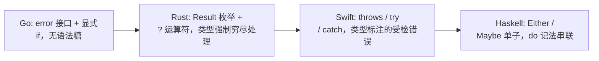
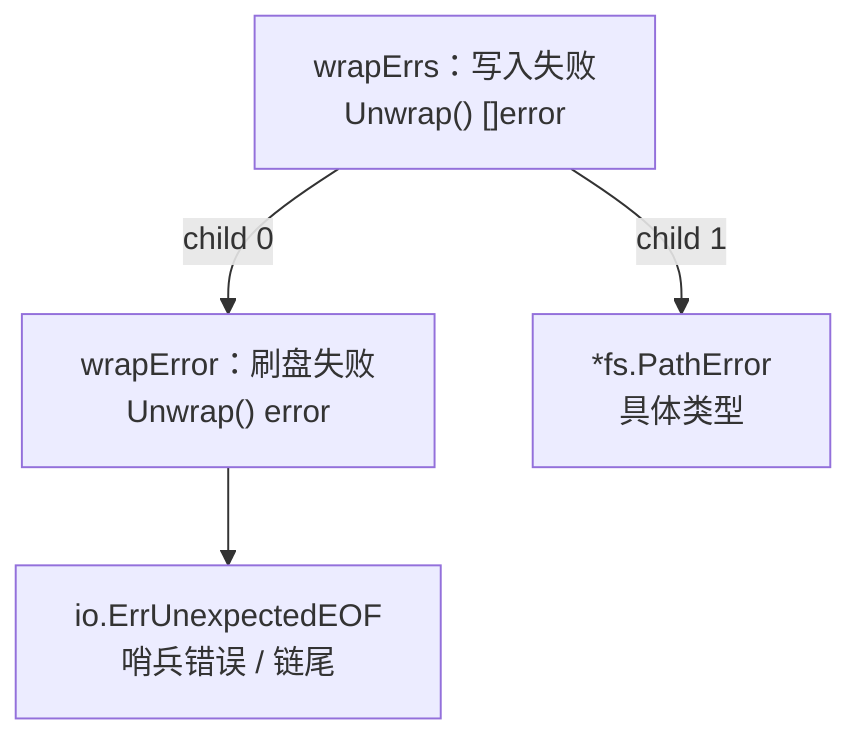

# 7 错误处理

错误是什么？它从哪里来？到哪里去？当我们出现错误的时候，应该为其做些什么？这些问题并不简单，但是一旦回答不了这些问题我们便不能惧怕错误。错误一词在不同变成语言中存在着不同的理解和诠释。在Go语言里
面，错误被视为普普通通的值。正是因为值的特殊性，从而Go语言允许程序员针对不同场景下的错误进行不同层次的高层抽象，但是又进一步要求程序员得到的错误立即进行处理。这一设计决定一方面给程序员极大的自由，但是另外一方面又不断的困扰着程序员，使他们拿到一个错误的时候不知所措。

## 7.1 问题的演化

在6.3里面我们已经把那道分水岭画了出来：如何处理错误，是语言设计的一处抉择。异常派(C++, Java, Python)用`try/catch`把错误从路径里面抽出，主干干净，代价是错误路径变得隐式，可能从任意点抛出；
值派(Go,Rust，以及C的返回码传统)把错误当成普通返回值显示传递，啰嗦，每一条错误路径都是白纸黑字，无处可藏。Go选择了值派，只为真正异常保留了轻量的`panic/recover`。这一节要江的是选择落地以后，
错误作为值这一主张本身又经历了怎么样的演化：从一个只打印的字符串，长成一颗可以被程序逐层访问你到底是不是那个错误的数。

### 7.1.1 错误即是值

```go
type error interface {
    Error() string
}
```

任何实现`Error() string`的类型，都可以作为`error`传递。它不是一种特殊的语言构造，而是一种特殊的语言构造，而是一个再普通不过的接口值，能赋值，能比较，能放进切片，能作为字段，能跨channel传递。
这正是Rob Pike在`<<Errors are values>>`里面反复强调的一句话：错误是值，而值可以被编成。程序员不是被动地捕获一个从天而降的异常，而是主动地拿一个值去判断，包装，传播或者吞下。

这个主张在函数签名上有一处固定的体现：错误总是作为最后一个返回值显式交换给调用方。

```go
f, err := os.Open(name)
if err != nil {
    return err
}
defer f.Close()
// 使用f
```

满屏的`if err != nil`常被诟病。但是它恰好是值派的代价与收益的同一面：错误即然是值，就必须像别的值一样被显式接住，编译器不会替换你偷偷送到别处。这和6.3里面的Go的整体气质一脉相承，显式优与隐式。
把错误降格为一个一方法接口，换来的是最大的自由：标准库不需要预先规定一套登记体系，任何人都可以贴合自己场景的类型去定义`error`，从一个字符串常量，到一个携带行号，文件名，底层系统调用号的结构体。代价是这份自由把责任也一并交给了用户，怎样定义错误，怎样让调用方能可靠地辨认它，都得自己安排。这一节目余下的篇章，讲的就是Go社区与标准库为这份责任摸索出来的答案。

### 7.1.2 从字符串到可检查的错误

最朴素的错误就是一句话。`errors.New`与`fmt.Errorf`各造一个只携带字符串的错误值：

```go
err := errors.New("connection refused")
err := fmt.Errorf("read %s: %v", name, cause)
```

`errors.New`返回的是`*errorString`内部只有一个字段，`Error()`把它原样突出。对报告一次失败，打印给人看这一最低需求，这已够用。麻烦出在下一步：程序常常只想打印错误，还想根据错误是什么决定怎么
办。文件不存在就常见，连接被拒就重试，读到流末尾就正常收尾。这就要求调用方能可靠的出一句：这个错误是某个特定的错误？

标准库给出的第一种答案就是哨兵错误（sentinel error），用一个导出的变量充当某类失败唯一标识，最著名的就是`io.EOF`:

```go
package io
var EOF = errors.New("EOF")
// 调用方比较
for {
    n, err := r.Read(buf)
    // ... 处理buf[:n]
    if err == io.EOF {
        break
    }
    if err != nil {
        return err
    }
}
```

哨兵的好处是检查干脆，一次`==`即可。但是它脆弱。其一，`io.EOF`是一个变量而非常量，任何拿到他这个包的代码都可能修改它：

```go
import "io"
func init() {
    io.EOF = nil    //合法，且足以让别处 == 判断永远落空
}
```

在庞大的依赖图里面，谁也无法担保没有一处恶意或者失手赋值把这样的哨兵改掉，这甚至构成一类安全隐患(设想`rsa.ErrVerfication = nil`) 。规避之道是把哨兵做成不可变的常量错误，让字符串类型自己
实现`Error()`：

```go
type ioError string
func (e ioError) Error() string { return string(e) }
const EOF = ioError("EOF") // 常量，无法被改写
```

其二，也是更要命的一点。`==`只在错误未经过任何包装的时候才成立，一旦中间某层唯了补充上下文，把原始错误重新格式化一句话里面，`==`立刻实效：

```go
func readConfig(path string) error {
    if err := open(path); err != nil {
        return fmt.Errorf("read config %s: %v", path, err) // 用%v，原始错误被拍平成字符串
    }
    // ...
    return nil
}
```

此时上层若想知道根本不是`io.EOF`， `==`已经无能为力了，因为它返回的是一个全新的字符串错误，原来的io.EOF身份在格式化的那一刻就丢了。退而求其次的做法是去`Error()`的字符串里面做字串匹配，
`strings.Contains(err.Error(), "not found")`,这把错误建立在错误的认可可读文本上，文案一改，本地化一换就奔溃了，是最不该依赖的写法。

第二种答案时自定义错误类型，用类型断言来检查：

```go
type PathError struct {
    Op string
    Path string
    Err error
}

func (e *PathError) Error() string {
    return e.Op + " " + e.Path + ": " + e.Err.Error()
}

// 调用方法断言
if pe, ok := err.(*PathError); ok {
    log.Printf("操作 %s 失败于 %s", pe.Op, pe.Path)
}
```

自定义类型能携带结构化上下文，比一句字符串的信息丰富的多。但它和哨兵共享同一个致命弱点：类型断言`err.(*PathError)`同样只对未经包装的错误成立。只要中间层用`fmt.Errorf("...: %v", err)`
把它套进来一句话，断言就再也满足不了了。

于是错误即值的第一阶段就留下了一个清晰的紧张关系：调用方即想为错误补充传播路径上的上下文，又想在顶层仍然能可靠的辨认出根因。用`%v`包装会丢失身份，不包装又会丢失上下文，二者不可兼得。Go 1.13
的包装机制，正是为了化解这个紧张关系而来。

### 7.1.3 Go 1.13:包装， Unwrap与Is/As

Go 1.1（2019）给fmt.Errorf添加了一个动词`%w`, 并在errors包里面创立了三个配套函数。核心思想是：包装时不再内层错误拍平成字符串，而是把它原样保留为一条可被回溯的链条。

```go
// 用%w包装，内存错误被保留，而非格式化字符串
err := fmt.Errorf("read config %s: %w", path, io.EOF)
```

%w和%v的唯一区别是在于:带%w的Errorf返回的错误会额外实现一个`Unwrap() error`方法，吐出被包装的那个内存错误。%v制造的是一段无法回溯的文字，%w制造的是一个连着根节点。有了Unwrap，这条链条上
有没有某个错误就成了一次沿着链条行走，标准库封装进了`errors.Is`与`errors.As`:

```go
// Is: 链条上有没有等于target的错误(取代裸 ==)
if errors.Is(err, io.EOF) { ... }

// As: 链条上有没有某个类型的错误，找到就填进target(取代裸类型断言)
var pe *PathError
if errors.As(err, &pe) {
    log.Printf("失败与 %s", pe.Path)
}
```

errors.Is从err出发，反复`Unwrap`，沿途与target比较，任意一环相等即命中；还允许错误类型自定义一个`Is(error) bool`方法，声明等价于某个哨兵。`errors.As`同理沿链走，但比较的是类型是否可赋值
给target指向的变量，命中即填值。两者把7.1.2里面那个包装就丢身份的死结彻底解开：中间层尽管用%w层层叠加上下文，顶层依旧能用`Is/As`穿过所有包装认出的根因。自此，调用方检查错误的正确姿势从`==`\
与类型断言，整体迁移到了`Is`与`As`。这一机制的细节，以及后来增加的范型版`errors.AsType[E error](err)(E, bool)`（免去穿指针，直接匹配返回值，留到7.2详谈，这里只需要记住一个转折：错误
从此是一颗可被追问的树，而不在是一句话。

### 7.1.4 Go 1.20: errors.Join与多重包装

到Go 1.20（2023）,这棵树丛单链长成了真正的多叉。实现里一次操作可能撞上多个错误，关闭若干资源的时候每个`Close`都可能失败，一次检验里面多个规则同时不满足。此前只能把他们拼接成一个字符串，拼接
完成便无法分开检查。`errors.Join`把多个错误聚集成了一个，且各自保留各自的身份。

```go
err := errors.Join(err1, err2, err3) // nil会被丢弃；全nil则返回nil
```

Join返回错误实现是`UnWrap() []error`,一次吐出来一组而非一个。与之对称，`fmt.Errorf`也允许一句话里面出现多个`%w`，同样得到一个`Unwrap []error`的多重包装错误。errors.Is与errors.As
早已按照这两种`Unwrap`形态做了深度优先遍历，因此多叉树同样适用：

```go
err := fmt.Errorf("两路都失败: %w; %w", io.EOF, os.ErrNotExit)
errors.Is(err, os.ErrNotExist)  // true:遍历会走到第二个分支
```

至此，错误即是值长出了完成形态：一个值，一条Unwrap链或者Unwrap数，一对沿着行走的`Is/As`。值得一提的是，这一路演化没有动过`error`接口本身的那个方法，全部能力都建立在了错误值可以再实现一个
Unwrap这一可选的的约定上。接口不变，约定渐增，这正是把错误做成普通值所换来的扩展余地。

### 7.1.5 被否定的语法：check/handle与撤回的try

值派最常被攻击的是，始终是那满屏的`if err != nil`。Go团队也不是没想过给它瘦身，但是每次尝试最终都被否决了，这些否决本省比任何宣传都能说明Go的去向。

2018年的Go 2错误处理草案提出过一对`check/handle`关键字：`check`自动检查紧随其后的表达式的错误并在出错时候跳转，`handle`块统一兜底。它引入了一个新的，隐式的控制流跳转，与Go控制流应该
一眼看清的气质相抵，争议巨大，未被采纳。

2019年，团队把方案收窄成一个不需要新关键字的内建函数try。设想中`x := try(f()`在f()返回非nil错误时，让当前函数直接带着该错误返回：

```go
// try 提案设想的写法(最终未进入语言)
func read(name string)([]byte, error) {
    f := try(os.Open(name)) // 出错则当前函数直接return ..., err
    defer f.Close()
    return io.ReadAll(f)
}
```

提案引发了Go历史上规模最大的讨论之一，反对意见集中在两点：其一，try是一个会让函数提前返回的函数，把一处控制流跳转藏进了看似普通的表达式里面，破坏了返回点显式可见；其二，它与调试，与defer中改
写错误返回值的惯用法配合别扭。提案在童年被官方撤回(withdrawn),理由写的很直白：社区分歧过大，且它解决的问题不值得引入这种隐式性。

把几次否决连起来看，会得到一条清楚的设计底线：Go宁愿忍受着`if err != nil`的冗长，也不肯用隐式的控制流跳转去换取简短。简短不是不重要，但在Go的排序里面，它排在显式之后。错误处理的语法之争尚未
结束，这部分的来龙去脉与最新动向，7.5会接着讲。

### 7.1.6 值派内部：Go站在最简的一端

把镜头拉远，值派内部其实也有疏密之分。同样是错误即值，别家给了它多少语法糖，多强的类型约束，差别不小。把它们排在一起，Go的位置就清楚了。



Rust用枚举`Result<T, E>`把成功与失败编进了类型，调用方若不处理，编译器就报错，错误处理是强制穷尽的；`?`运算符则是它的语法糖，`if f = File::Open(name)?;` 在出错的时候当前函数提前返回，
效果正是被Go否决的那个try。Swift走受检异常的路子，函数用`throws`在签名里面声明可能抛错，调用处以try标注，用`do/catch`兜住，错误是值(遵循Error协议),但是传播靠的是一套异常语法。Haskell更
纯粹，用`Either e a`或者`Maybe a`这样的代数数据类型表达可能失败的计算，再借助单子的`>>=`与do记法把一串可能是比啊的步骤串起来，任意一步失败整条段路。

四者都把错误当值，分别在于语言替你做了多少。Rust用类型系统逼你处理，用`?`替你传播；Swift用`throws`标注，用`try/catch`传播；Haskell用单子替你串联与短路。Go是其中机制最少的一端：没有`?`,
没有throws，没有单子，错误就是返回值。检查就是if,传播就是`return err`。这份刻意的克制，与11.9里面Go主暴露顺序一致原子，不给弱序档位的取向如出一辙，宁可让用户多写几行显式代码，也不愿再语言
里面堆机制。这套取舍没有决定的优劣，它换来的是任何人读任何一段Go代码。都能从`if err != nil`一眼看出错误再哪里被检查，又流向何方。带着这条主线，下面三节就分别落到本章开头提出的三个问题上：
错误值如何检查，上下文如何附加，处理语义如何安排。

## 7.2 错误值检查

错误一旦在调用链条上传播，处理它的代码与产生它的代码往往隔着许多层。这就带来了一个朴素却棘手的问题：拿到一个层层传上来的error，调用方如何判断它到底是不是某个特定的错误，又如何从中取出来当初
那个携带了上下文的具体错误值？这一节回答的就是这个问题，以及Go为此在errors包里面立下的那套约定。

最朴素的错误就是一句话。`errors.New`把一个字符串包成error，内部只是errorString这一极简的实现：

```go
package errors

type errorString struct { s string }
func(e *errorString) Error() string { return e.s }

func New(text string) error { return &errorString{text} }
```

实践中常把它和fmt.Sprintf拼接起来用，凑出一句带变量的错误消息，可一旦错误被压成字符串，它的可处理性便几乎归零：调用方只能拿这句话和别的字符串比较，无从知道它的来源，也无从取回原始值的错误值。
Go 1.13在errors包里面补上了`Unwrap`，`Is`，`As`，以及go1.26新增的泛型`AsType`，要解决的正是这个错误一旦上浮便不可追问的困境。他们的共同前提，是先把错误串成一条可以回溯的链条。

### 7.2.1 错误传播链:从单层包装到错误树

要让上层能追问到下层，错误就不能在传播实践丢掉来历。`fmt.Errorf`用`%w`动词做到这一点：它在生成新错误消息的同时，把被包装的原始错误保存下来。以便新的错误记得自己是从哪里来的。单个`%w`产出的是
一个实现了`Unwrap() error`的`wrapError`，多个`%w`则产出实现了`Unwrap() []error`的wrapErrs:

```go
package fmt

// 裁剪后的Errorf:只保留按照%w个数选择包装类型这一设计相关分支
func Errorf(format string, a ...any) error {
    p := newPointer()
    p.wrapErrs = true       // 允许 %w 把对应的实际参数 p.wrappedErrs
    p.doPrintf(format, a)   // 格式化; %w 退化成 %v拼接，并记录其位置
    s := string(p.buf)
    switch len(p.wrappedErrs) {
    case 0:
        return errors.New(s)        // 没有 %w，就是一条普通的错误
    case 1:
        return &wrapError{msg: s, err: ...} // 单个 %w: 链上的一个节点
    default:
        return &wrapErrs{msg: s, errs:...} // 多个%w: 一个节点指向多个子错误
    }
}

type wrapError struct { msg string; err error }
func (e *wrapError) Error() string { return e.msg }
func (e *wrapError) Unwrap() error { return e.err } // 单链

type wrapErrs struct { msg string; errs []error }
func (e *wrapErrs) Error() string { return e.msg }
func (e *wrapErrs) Unwrap() []error { return e.errs } // 分叉
```

`%w`与 `%v`的差别正在于此。%v只把错误格式化成字符串拼进消息，来机就此消失； %w在拼接字符串之外额外保留了对原始错误的引用把它拼接到链上。这条引用也是一种API承诺：一旦用%w暴露内存错误，调用方
就可能依赖`errors.Is/As`去匹配，于是内层错误便成了你对外部契约的一部分。若只想在消息里面提一句不愿暴露内部错误类型，应当用%v。

`Unwrap() []error`是Go 1.20引入的第二种拆包形态。标准库的`errors.Join`正是用它若干并列的错误合成一个：

```go
err := errors.Join(errClose, errFlush)  // err.Unwrap()返回 []error{errClose, errFlush}
```

于是错误不再是一条线，而可能是一棵树：`Unwrap() error`的节点有一个子节点，`Unwrap() []error`的节点有多个子节点，叶子则是不在实现任何`Unwrap`的原始错误（哨兵或者某个具体类型）。检查一个
错误，就是在这棵树上做一遍遍历。



上图中的`errors.Is(e3, io.ErrUnexpectedEOF)`会沿着child 0一路Unwrap到链尾命中；`errors.As(e3, &pe)`(pe为`*fs.PathError`)则在child 1这一支按类型匹配到。二者走的都是同一颗树，
只是命中的判断不同。

### 7.2/2 Unwrap：拆卡一层

`Unwrap`是这一套机制的地基，它只做了一件事情：若错误实现了`Unwrap() error`，就调用它取出内层；否则返回nil。它有意识只认`Unwrap() error`着一种形态，不处理`Unwrap() []error`，遍历整
颗树的职责留给了Is/As:

```go
func Unwrap(err error) error {
    u, ok := err.(interface{ Unwrap() error })
    if !ok {
        return nil
    }
    return u.Unwrap()
}
```

### 7.2.3 Is: 链感知的哨兵比较

判断这是不是某个特定错误，传统写法是`err == io.ErrUnexpectedEOF`。一旦错误被包装过，`==`就失效了，因为底层是个`wrapError`，并不等于链尾的哨兵。`errors.Is`把这次比较变成在整棵树上的查
找：从err自身开始逐层下探，任一节点于`target`相等便算命中。

实现上，导致的Is只做参数校验，真正的遍历在递归的is里面。它在某个节点上依次尝试两种判据，再按照节点拆包形态决定下一步往哪里走，遇到`Unwrap []error`便对某个子节点递归（深度优先）:

```go
func is(err, target error, targetComparable bool) bool {
    for {
        // 判据一：判断相等(target可比较)
        if targetComparable && err == target {
            return true
        }
        // 判断二：err自定义了Is方法，交给它判
        if x, ok := err.(interface{ Is(error) bool}); ok && x.Is(target) {
            return true
        }
        // 按照拆包形态如何继续下探
        switch x := err.(type) {
        case interface { Unwrap() error } :
            if err = x.Unwrap(); err == nil {
                return false
            }
        case interface{ Unwrap() []error } :
            for _, e := range x.Unwrap() {
                if is(e, target, targetComparable) {
                    return true
                }
            }
            return false
        default:
            return false // 到了叶子节点仍未命中
        }
    }
}
```
