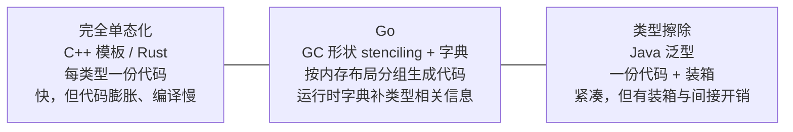

# 8 泛型

泛型编程的基本想法围绕如何对具体，高效的算法进行抽象，并在结合考虑不同的数据表示的过程中形成多种多样且通用的泛型算法。

## 8.1 泛型设计的演进

泛型是Go等待最久，争论最烈，也最能体现其设计哲学的一项特性。从2009年开源到2022年Go的1.18才落地，这十三年的迟疑与最终取舍，本身就是一堂语言设计课。这一节回答三个问题：Go为何久久不加泛型，最终
怎样加的，它在底层又是如何实现的。后者尤其关键，因为Go的实现没有搬照任何一家成例，而是走一条独特的中间道路，这条道路才是它对那个十三年难题的真正回答。设计本身一路如何演变（合约，类型集，多轮语法
提案）。留在8.4细说。本节只取其骨架。

### 8.1.1 久拖不决：泛型两难

缺了泛型，写一段对多种类型的行为相同的代码会怎么样？最直接的办法是为每个类型各抄一份：

```go
func MaxInt(a, b int) int { if a > b { return a }; return b }
func MaxFloat64(a, b float64) float64 { if a > b { return a }; return b }
func MaxUintptr(a, b uintptr) uintptr { if a > b { return a }; return b }
// ...每多一个类型，就多抄一份逻辑相同的代码
```

逻辑一次不差，只有类型不同。第二条路是用`interface{}`把类型差异抹掉，让一份代码服务所有类型：

```go
func Max(a, b interface{}) interface{} {
    // 编译器不知道 a, b能否比较,只能在运行时断言
    if a.(int) > b.(int) { // 写死了int, 换类型就崩；且每次调用都装箱,断言
        return a
    }
    return b
}
```

这条路丢掉了静态类型安全（比较操作要到运行时才知道对不对）,还附带装箱与类型断言的开销。第三条路是代码生成：写一份模版，用工具按照类型批量产出具体版本，社区里面geney是当年的代表：

```go
import "github.com/cheekbits/genny/generic"

// 用genny生成具体类型版本：
// cat max.go | genny gen "T=int,float64,uintptr" > max_gen.go
type T generic.Type

func MaxT(a, b T) T { if a > b { return a }; return b }
```

代码生成恢复了静态类型与性能，代价是构建流程里多一道生成步骤，改一处要重新生成，且工具本身不参与类型检查。三条路各有取舍，没有一条令人满意，这正是Go程序员长期的真实处境。

久拖的根由，Russ Cox早在2009年就点破，即泛型两难（the generic dilemma）：在慢的程序员，慢的编译器，慢的运行时三者之间，任何一种泛型实现似乎只能三选其二。

不加泛型，省了编译器与运行时的代价，却把负担给了程序员。C++模版选了快运行时，牺牲编译速度与代码体积，牺牲运行时的开箱开销。Go极度看中编译速度与运行时简洁，迟迟没找到三者都不太差的方案，
于是宁可不做，也不愿草率引入一个会侵蚀这些价值的设计。这种想清楚再做的克制，是Go的一贯性格。

### 8.1.2 落地的语法：约束即接口

Go 1.18最终落地的语法只在已有的概念上做了一处加法，方括号声明的类型参数，约束写成一个接口：

```go
func Max[T cmp.Ordered](a, b T) T { // T 是类型参数，cmp.Ordered是它的约束
    if a > b {
        return a
    }
    return b
}
_ = Max[int](3, 5)// 显式实例化
_ = Max(3.5, 5.0) // 类型推导，等价于 Max[float64]
```

关键的概念创新就是把接口从方法集推广为类型集合(type set):一个约束接口描述的不再只是实现了哪些方法，而是哪些类型满足它。于是`comparable`（可比较的类型），`~int`（底层类型为int的类型），
`int|string`（类型的并集合）都能作为约束写进接口。用既有的接口概念取承载泛型约束，避免再引入第二种语言，这正是几经周折后方案的精髓。约束，类型集，以及从2018年合约提到这套语法的多轮演进。

### 8.1.3 GC形状stenciling加字典

实现才是Go破解两难的地方。两个极端各有代价。一端是完全单态化(full monomorphization),C++模板与Rust都走这条路：编译器为每个具体类型实参各自生成一份专门代码,`Max[int]`与`Max[float64]`
是两份独立的机器码。好处是运行时零开销，可深度优化，代价是代码膨胀，编译变慢，以及（尤其以C++模板为甚）输了名的难懂的错误信息。另一端是完全类型擦除(type earasure)，Java泛型的做法：所有实例
共用一份代码，值一律装箱成`Object`。好处是代码紧凑，编译快，代价是装箱与间接访问的运行时开销。Go不愿意付任何一段的代价，于是落在了中间。



Go的办法叫Go形状（Gc shape）stenciling 加字典(directory)。名字拗口，但拆开看只有两半：stencil是按照形状去重的代码模板，dictionary是补回类型差异的运行时小抄。先说前一半。它不为每个具体类
型都生成一份代码，而是按照GC形状分组：内存布局相同，指针位置相同的一组类型共用一份代码（一个stencil,模板印版）。之所以叫GC形状而非单独内存布局，是因为垃圾回收要据此判断一块内存里哪些字是指针，指针位置一致时同形状的硬性条件，这也点出了Go的实现一开始就为它的垃圾回收纠缠到了一起。一个类型的形状，编译器取它的底层类型（underlying type）来代表。这意味着`Max[int]`与`Max[float64]`
形状不同（一个8字节整数，一个8字节浮点，标量类型不合并），各得一份stencil;而所有以指针实参实例化，约束又只是普通接口的调用会坍缩到同一个形状。在编译器里面这一步叫`Shapify`，它对指针实参直接取
一个统一的`*byte`作形状：

```go
// 形状归并的核心规则（取自cmd/compile/internal/noder的Shapify，已裁剪)
// 指针实参 + 约束是普通接口 => 以类型的底层类型（underlying type) 做形状
func Shapify(targ *types.Type, basic bool) *types.Type {
    under := targ.Unserlying()
    if basic && targ.IsPtr() && !targ.Elem().NotInHeap() {
        under = types.NewPtr(types.Types[types.TUINT8]) // 所有指针坍缩为 *byte
    }
    // ...以under为键，在shape包里查的(或新建)唯一的形状类型
}
```

于是凡是以指针实例化，约束又是any这类普通接口的泛型函数，无论指针指向`Node`还是`os.File`，都共用一份机器码，这正是混合方案省下代码体积的要害：指针式泛型容器里面最常见的实参，把他们一网打尽，
单态化的膨胀就被压住了一半。需要说明的是，先行实现只坍缩指针，相同尺寸的标量（如int或者int64）尚未合并，源码里面的TODO仍然把更激进的形状并列为未来的工作。形状越粗，省的代码越多，但下面要讲
的字段与间接开销也很重，这是一个仍在调整的旋钮。

同一份stencil要服务多个具体类型，它缺的那部分类型相关信息丛哪里来？答案是调用时由一个运行时字典作为隐藏参数传递进去。每个被实例化的泛型函数都对应一个编译期生成的字典，按需要携带着一份实例真正
用到的东西：

```go
// 某个泛型实例的运行时字典携带什么（概念怎么写，非源码结构体）
type dictionary struct {
    // 类型参数与派生对象的类型描述符：用于new，类型断言，把值塞进interface{}
    type_T *_type   // 类型参数T实参描述符,如*Node
    derived []*_type    // 函数体里面出现的派生类型，如[]T,map[T]V的描述符。它的核心作用是：让一份共享的泛型机器代码，在运行时仍然能正确处理由 T、V 组合出来的复杂类型

    // 子字典：函数体若调用别的泛型函数，被调用者的字典在此预先备好
    subdicts []unsafe.Pointer

    // itab: 把类型实参转换成某个约束接口时所需的接口表
    itabs []*itab

    // 类型参数的方法表达式：约束若声明了方法，按实参数解析到具体实现
    methods []unsafer.Pointer
}
```

这几类条目并非凭空罗列，他们对编译器内部`readerDict`真实持有几组数据（数据描述符，子字典，itab,方法表达式）。逻辑是：凡是单凭形状无法确定，必须知道具体类型才能做的事，形状代码就不自己算，
而去代码里面取。要`new(T)`就查`typ_T`，要把T装进`interface{}`就查它的描述符，要调用约束里面的方法就查`methods`，要在调用另外一个泛型函数就把对应`subdicts`传下去。

这条把类型相关的东西作为显式作为隐藏参数传递的思路。与4.2谈到的Haskell类型类的字典传递一脉相承。Haskell编译一个受`Ord a`约束的函数时，会把`Ord`的方法实现打包成一个字典，作为额外参数传入；
Go的运行时字典正是这套机制在命令式语言里面的回响。两端的代价也一样：经字典的一次间接访问。手写一个受具体接口约束，直接调用其方法的函数，方法调用时一次普通的接口分派；而形状的版本若要调用约束
方法或者构造T,得先读字典，再间接跳转。因此泛型代码有时未必比手写的具体类型代码快。这是Go团队后续版本持续打磨的方向，也是混合方案为省代码所付出那一笔利息。

把这条机制落到Max上走一遍，整张图就连起来了。Max的约束是`cmp.Ordered`,它能接受的实参只有可比较的大小的标量（整数，浮点，字符串）,所以Max这个例子里面没有指针塌缩可言，每个具体类型各得一分
stencil,`>`直接编译成形状对应的机器指令，不经过字典：

```go
_ = Max[int] // 形状 int => stencil_A, > 编译成整数比较指令，字典只携带 int 描述符
_ = Max[int64] // 形状int64 => stencil_B(标量互不合并),字典携带 int64 描述符
_ = Max[string] // 形状string => stencil_C, > 编译成字符串比较，字典携带 string描述符
```

指针塌缩的好处要换一个约束才看得见。考虑一个any的约束的工具函数，它对元素只搬运，不比较：

```go
func Last[T any](s []T) T { return s[len(s)-1] }
_ = Last[*Node] // 形状 *byte => stencil_P,字典携带 *Node的描述符
_ = Last[*File] // 形状 *byte => 复用 stencil_P!只换字典携带 *File 的描述符
```

Last的约束时普通接口any,元素具体指向什么类型不影响取末位的这段逻辑，于是`Shapify`把所有指针实参塌缩成`*byte`,`Last[*Node]`与`Last[*File]`共用同一份机器码。可以把这份形状代码想成下面
这样，原本要知道T的地方改成向字典要：

```go
// stencil_P 服务所有指针实参（概念演示，并非真实代码）
func Last_ptr(dict *dictionary, s sliceHeader) unsafe.Pointer {
    // 取末尾只是指针算术，与T的具体类型无关，形状代码自己就能做；
    // 唯有当要把结果装进 interface{}, 或者new(T)时，才去 dict.typ_T取描述符
    return elemAt(s, s.len -1 )
}
```

`Last[*Node]`与`Last[*File]`区别只在传入的自带不同。这就是混合方案的全部诀窍：代码按照形状去重，类型差异进字典。Max展示标量各占一份，`>`内联不检查字典的一面：Last栈是指针塌缩共享一份，
靠字典补类型描述符的一面。两面结合起来，才是GC形状stenciling的完整图景。

形式地看，设程序里面出现n个不同的具体类型实参，归并后得到s个形状（s <= n,指针越多越小于n），完全单态化的代码量正比于n，类型擦除正比于1,而Go介于其间，正比于s。代价侧则相反：单单化的每次调用
都是直连，无额外间接；擦除于Go都要付间接访问，Go这笔简洁只在必须知道具体类型的操作上发生（构造T,装箱，调用约束方法），比擦除事事装箱要省。换言之Go用一个可调的s,再代码体积S(s)与间接开销之间
换取一个折中点，而把旋钮（形状归并多激进）留给未来。

### 8.1.4 跨语言对照

把实现策略排开看，泛型的版图就清晰了。C++模板与Rust走完全单态化：运行时零开销，能高度特化，代码是代码膨胀，编译慢，以及难懂的错误信息（C++模板尤甚，Rust以trait bound把约束前置，错误信息
友善许多）.Java走类型擦除：泛型只存在于编译期，运行时被擦成`Object`加装箱，因此Java没有运行时的泛型类型信息（写不出`List<int>`,只能`List<Integer>`。C#做了具体化（reified）泛型：
运行时保留了类型参数，值类型不装箱，引用类型共享代码。由CLR再加载时按需特化，比Java跟进一步。Haskell用类型加字典传递，Go的字典法真实这条线在命令式语言里面的回响。

Go在这种版图上的位置是中间偏务实：即不像模板那样为零开销与特化付出膨胀，也不像擦除那样彻底放弃类型信息，而是按照GC形状分组共享代码，用字典补充差异，在代码体积，编译速度与运行时性能三者间都
还过得去的折中。它最接近的精神同道其实是C#（都保留了类型信息，都对引用指针共享代码），但是Go共享粒度交给了GC形状这一更贴近运行时与垃圾回收的概念。

### 8.1.5 取舍与未来

Go泛型可以省略了许多别家有的东西：没有模板元编程，没有特化（specialization）,没有高阶类型（higher-hinded types），没有运算符重载，方法不能带额外的类型参数。这些省略都是有意的，团队反馈
强调先加最小可用的泛型，再看实践需要什么，避免重蹈一口气一大推复杂尾大不掉的覆辙。

后续演进延续这一节奏。Go 1.21位标准库补上了`slices`,`maps`,`cmp`等泛型工具包，让泛型从语言特性变为日常可用的库；Go 1.24补齐了泛型别名。而字典间接带来的性能开销，以及更激进的形状归并，
仍在逐步打磨。

实现层面仍然有未尽之处可供留意。其一是形状归并粒度，前文`Shapify`的`TODO`已列出方向：把相同尺寸，相同对标的标量坍缩为同一个形状，递归地对符合类型的成员做形状化，丢弃结构体的字段名与标签。
这些优化进一步把s压向1,省下更多的代码，但需要先精确追踪类型参数到底怎么使用，否则坍缩过头会让本可以内连的操作退化为字典。其二是去虚化（devirtualization）与内联：当编译器能在调用点看穿具体
实例时候，理应把经字典的间接调用还原为直连，把这笔利息退回去。这两件事情都指向同一个目标，让形状化代码在保住小体积的同时，逼近手写具体类型代码的速度。泛型这十三年的故事，是Go设计哲学的缩影：
对复杂度极度警惕，宁可慢一步也要想清楚，最终用一个并不炫技，却各方面都站得住的方案落地。约束，类型集合与历次语法提案来龙去脉，是这个故事的另一半，下一节8.4接着讲。

## 8.2 基于合约的泛型

8.1用一句话带过了先有合约，后转向接口即约束这段演进。这一节把那句话展开：合约究竟长什么样，它有多强的表达力，又为何最终被放弃。这段被否决的设计不是历史废料，它解释了今天`[T Ordered]`语法的
由来。也示范了Go设计中一个反复出现的动作，先做出一个表达力很强的偏向复杂的方案，在回头追问这件事情能不能用已有的概念表达，闭着复杂度去赚取自己存在的资格。

本节展示的所有`contract`语法都已经废弃，仅出现在2018年到2020年的go2draft草案里面，任何一个Go编译器都从未接受它们。下文凡事合约写法，都按照其在草案中原貌呈现，并明确标注已废弃，以免与今天可用
的语法混淆。

### 8.2.1 约束想解决什么

泛型函数迟早要回答一个问题：类型参数T能做哪些操作？写一个求最大值的`Max`，函数体里面能用到比较运算符`<`，可`T`若被实例化成一个不支持比较类型（比如某个struct或者slice）。这段代码就不成立。
于是泛型机制必须提供一种手段，让作者声明T必须支持哪些操作，并让编译器据此在实例化处做检查。这就是约束(constraint)。

约束不是可有可无的修饰。没有它，泛型只剩下两条退路：要么像C++早起模板那样完全不约束，类型错误推迟到实例化时才以一长串难懂的报错暴露出来；要么像`interface{}`那样放弃静态信息，靠运行时断言兜底，
把类型安全和性能一并丢弃。约束的价值，正是把T得能做什么这件事情提前声明讲清楚，让错误在调用点就被拦截下，也让编译器有依据生成正确的代码。问题只剩下一个：用什么语法把这组要求写下来。

### 8.2.2 合约： 一段不会执行的代码

2018年go2draft给出第一版答案，是引入一个新关键字`contract`。合约形如一个函数：它带一组类型参数，函数体里面罗列的这些类型必须满足的条件。以为`Max`为例，最朴素的设想是直接在体内写出要用到
的运算符（这是草案探讨过的更早一版的写法）:

```go
contract Ordered(t T) {
    t < t
}
func Max(type T Ordered)(a, b T) T {
    if a < b {
        return b
    }
    return a
}
```

合约体里面`t < t`不是要执行的语句，它的意思是凡是满足`Ordered`的类型T都必须支持`<`。请留意类型参数的声明方式，草案用的是圆括号：`func Max(type T Ordered)(a, b T)T`，类型参数列表前缀
一个type关键字。这与今天的方括号`[T Ordered]`是两套不同的语法，括号从圆到方的这次变更，本身就是后文要交代的演进的一部分。

把运算符写进函数体看似自然，却很快遇到麻烦：`+(T, T) T`这样的算符要求写起来既重复又含糊，还会和分号自动插入规则缠绕。草案因此转向一种更明确的写法。类型列表（type list）：直接枚举出哪些具体
类型属于这个合约。这才是go2draft中合约的规范形态：

```go
// 已废弃： 2018草案的规范形态，用类型列表枚举允许的底层类型
contract Ordered(T) {
    T int, int8, int16, int32, int64,
        uint, uint8, uint16, uint32, uint64, uintptr,
        float32, float64,
        string
}
func Max(type T Ordered)(a, b T)T {
    if a < b {
        return b
    }
    return a
}
```

Orderder列出这些类型恰好都支持`<`,于是编译器只要确认T被实例化成列表中的某一个，就知道`a < b`合法。方法要求则另写一行。类型名后跟方法签名：

```go
// 已废弃: 要求T必须实现String() string
contract Stringer(T) {
    T String() string
}
```

合约还能组合：把另外一个合约的名字嵌入体内，等价于把被嵌入合约的条件就地展开。

```go
// 已废弃:嵌入Stringer，再追加一个Print方法要求
contract PrintStringer(X) {
    Stringer(X)
    X Print()
}
```

最能体现合约表达力的，是它能约束多个类型参数之间的关系。一个合约可以带`(P1, P2)`两个类型参数，在体内写出跨参数的方法签名，要求P1上有一个接收P1，返回P2的方法，同时界定P2的底层类型：

```go
// 已废弃：约束 P1, P2两个类型参数以及相互关系
contract C(P1, P2) {
    P1 m1(x P1)
    P2 m2(x P1) P2
    P2 int, float64
}

func F(type P1, P2 C) (x P1, y P2) P2 { /* ... */ }
```

m2(x P1) P2 这一行同时牵动两个类型参数
