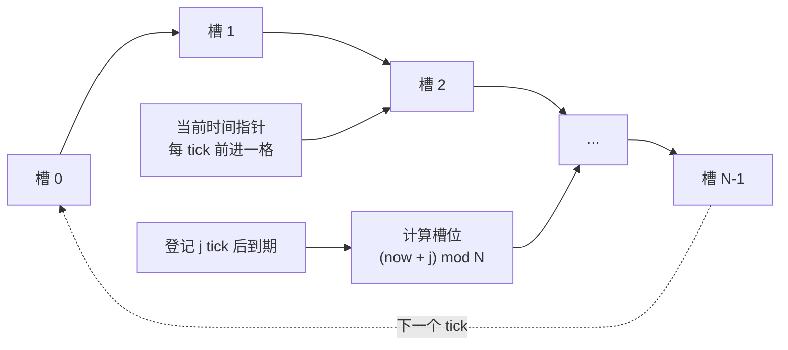
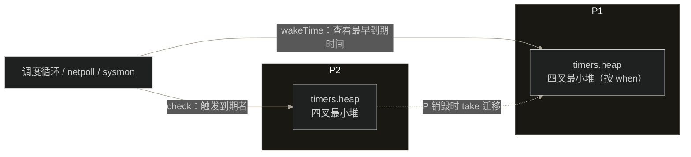
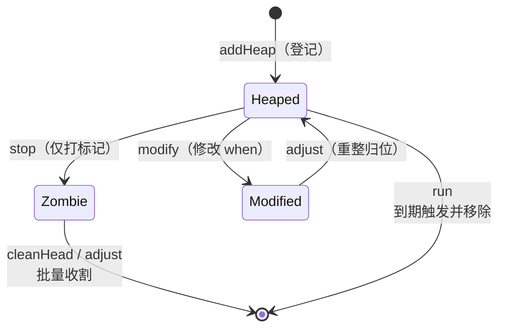

## 9.10 计时器

`time.Sleep`，`time.After`, `time.Timer`,`time.Ticker`，乃至网络读写的SetDeadline，背后都是同一套计时器机制。它要回答一个看似简单，实则微妙的数据结构问题：成千上万个计时器同时存在，如
何高效地知道下一个该在什么时候叫醒谁，又不为此空耗一个线程。这一节从这个抽象问题讲起，看清各种解法的取舍，再落到Go的选择与它的演进。

### 9.10.1 计时器的数据结构问题

一套计时器要支持三种操作：START（登记一个超时），STOP（到期前取消）,到期检查/EXPIRY（始终推进,触发所有到点的）。难点在于时钟可能每秒要被检查上千上万次，无论是否有计时器到期，所以每次tick的
代价必须低,同时START/STOP也要快。集中朴素方案的复杂度对比，正是Varghese与Lauchk1987年那篇经典论文出发点：

| 方案     | START    | STOP     | 每tick检查 | 取出到期     |
| -------- | -------- | -------- | ---------- | ------------ |
| 无序链表 | O(1)     | O(1)     | O(n)扫描   | O(n)         |
| 有序链表 | O(n)     | O(1)     | O(1)看表头 | O(1)         |
| 最小堆   | O(log n) | O(log n) | O(1)       | 每个O(log n) |

这里有一个常被混淆的精确之处：堆的取最小是O(1),但是每次触发一个到期计时器要付O(log n)的删除与下沉。所以每tick便宜只是说检查便宜，真正排空k个到期时O(klogn)。三种朴素方案各有所长，却没有
一种在START,STOP与到期检查上同时取胜，时间轮正是为打破这个僵局而生。

### 9.10.2 时间轮：用空间换时间

Varghese与Launck给出的答案是时间轮（timing wheel），思路向钟表的指针。

- 简单时间轮：一个有N个槽的环形数组，一个槽一个时间单位，外加一个当前时间指针。登记一个j个tick后到期的计时器（j < N），就O(1)地插入第(now + j) mod N个槽；每tick指针前进一格,触发该槽。
  START,STOP,每tick维护都是O(1),但是只对不超过轮长N的超时成立。这个有界范围，正是另外两个变体存在的理由。
- 哈希时间轮：超时范围很大时，把超时哈希进入一个较小的轮（槽内按还要转几圈排序），在均匀分布下达到O(1)平均复杂度。
- 分层时间轮：多个不同粒度的轮，像时钟的时，分，秒针；长超时记在最粗的轮上，到期时级联（cascade）下沉到更细的轮精确触发。它以有界内内存覆盖极大范围，代价是跨层时的级联开销。



时间轮把代价从每次操作转移到了轮的尺寸与级联上，是一笔典型的空间换时间，对超时范围有界，且在多数会在触发前被取消的场景极为划算。Go没有这条路，原因要到9.10.8才说清。

### 9.10.3 Go的选择：每个P一个四叉堆

Go给每个P一个最小堆，且是四叉堆（4-ary,timerHeapN = 4）。四叉堆比二叉堆层数更少（log4n）,下沉一层要比较的孩子从2个变成4个，但是层数减少带来的缓存友好通常更划算。这不是凭直觉，而是2013年一次
有基准支撑的优化（a lot of timeers present实时性能更好）。堆以数组承载，下标i的父节点在（i-1）/ 4,孩子在4i+4。



每个P的计时器集合收在一个timers类型里面，挂在pp.timers。裁剪掉与竞态检测的细节，只看与设计相关的字段：

```go
// timers：每个P一份计时器集合（速写）
type timers struct {
    head []timerWhen // 按 when排序的四叉最小堆；timerWhen缓存了when,省下一次解引用

    len atomic.Uint32   // len(heap)的原子副本，供调度器无锁判空
    zombies atomic.Int32 // 已标记删除，尚未从堆上清理的计时器数(惰性删除)

    // wakeTime用这两个下界下一次该醒在何时，无需加锁遍历堆
    minWhenHeap atomic.Int64    // heap[0].when,即堆中最早到期时间
    minWhenModified atomic.Int64 // 被改早(timerModified)但尚未在堆中归位者when下界
}
```

heap的元素timerWhen把when与`*timer`一并存下，比较时不必每次解应用计时器，这是为缓存局部性做小优化。minWhenHead与minWhenModified这对原子量是关键：它们让调度器在不抢计时器锁的前提下，一眼
读出最近到期时间（见9.10.5）;zobies服务于惰性删除。

单个计时器自身则是一个timer，状态压进了几个位：

```go
// timer:单个计时器（速写）
type timer sturct {
    when int64 // 到期时间（绝对nanotime)
    period int64 // > 0 表示周期触发（Ticker)，每when+perpoid再响一次
    f func(arg any, seq uintptr, delay int64) // 到期调用，须不阻塞
    arg any // 回调参数：time 包里面是channel或者函数;netpoll里面另有含义

    ts *timers // 它当前所在的P的timers
    state uint8 // 状态位： timerHeaped / timerModified / timerZobile
}
```

state只有三个位，却编码了计时器于堆之间的全部关系：timerHeaped表示它在某个P的堆里面；timerModified表示when改了但是堆里面的位置还没归位，留待下次重整；timerZobile表示它被停掉了，但还是
赖在堆里面没被移走。Go 1.14之前曾用一个有十种取值状态机来协调并发，1.23之后简化为这三位一把t.mu锁，并把一份状态快照astate原子地发布出去，让快路径无锁判断。

### 9.10.4 登记，停止于惰性删除

登记一个计时器（START）就是把它加进当前P的堆。time.NewTimer经过startTimer落到运行时的t.maybeAdd，最终调用ts.AddHeap：append到数组尾，再sifUp上浮到正确位置，并在它成为新堆时更新
minWhenHeap:

```go
// 把计时器加入当前P的四叉堆（速写）
func (ts *timers) addHeap(t *timer) {
    if netpollInited.Load() == 0 {
        netpollGenericInit() // 计时器依赖网络轮询唤醒，确保它已经启动
    }
    t.ts = ts
    ts.heap = append(ts.head,timerWhen{t,t.when})
    ts.sifUp(len(ts.head) - 1) // O(log n)上浮
    if t == ts.heap[0].timer {
        ts.updateMinWhenHeap() // 成了新的最早到期者，更新下界
    }
}
```

停止（STOP）的难处在于：计时器可能再别的P的堆里，而当前goroutine不持有那个P。逐个取抢锁，从别人的堆里面删除元素，代价高且易争用。Go的做法是惰性删除：t.stop只在计时器上打一个timerZombile标
记，给所在timers的zombiles计数加一，把真正的移除留给那个P后续重整堆时顺手完成：

```go
// 停止计时器：只打标记，不立即删除（速写）
fucnc (t *timer) stop() bool {
    t.lock()
    if t.state&timerHeaped != 0 {
        t.state |= timerModifed
        if t.state&timerZombile == 0 {
            t.state |= timerZombile
            t.ts.zombiles.Add(1) // 僵尸+1，留待 cleanHead / adjust清理
        }
    }
    pending := t.when > 0
    t.when = 0
    t.unlock()
    return pending
}
```

僵尸不会无限堆积。计时器堆在两处被收割：cleanHead在堆顶就是僵尸时候把它弹出，adjust在重整时一并清掉沿途的僵尸。何时触发收割是有讲究的：只有当前P自己的堆，且僵尸数超过堆长的四分之一（`zombies> 
len / 4`）时，check才强制做一次处理。这条阈值时有来历的：早期版本中，像context.WithTimeout这样频繁建立又取消的代码，会让大量已经停止的计数器滞留在堆里面，白占用内存，1/4阈值正是为压住这种
泄漏而加（见9.10.6的演进）。把清理限定在本地P,则是为了不去抢别的锁，降低争用。



### 9.10.5 内联的到期检查：没有专职线程

最值得玩味一点是：到期检查不需要一个专门轮询的线程，它是顺路完成的。两个函数串起这件事。wakeTime不加锁，只读那对原子下界，算出最近到期时间，用来限定调度器于网络轮询器改阻塞多久：

```go
// 下一次该醒在何处；不加锁，只读原子下界(速写)
func (ts *timers) wakeTime() int64 {
    nextWhen := ts.minWHenModified.Load()
    when := ts.minWhenHead.Load()
    if when == 0 || (nextWhen != 0 && nextWhen < when) {
        when = nextWhen
    }
    return when
}
```

check则在调度循环（schedule -> findRunnable）,工作窃取，sysmon（9.8）等处被调用。它先用wakeTime看一眼最近到期时间，没到点又无需清理僵尸就立刻返回（这是绝大多数调用的归宿，几乎零开销）；
到点了才加锁，adjust重整堆，在循环run触发所有到点的计时器：

```go
// 触发所有到点的计时器：
func (ts *timers) check(now int64, ...) (rnow, pollUntil int64, ran bool) {
    next := ts.wakeTime()
    if next == 0 {
        return now, 0, false // 没有计时器
    }
    if now == 0 {
        now = nanotime()
    }

    // 僵尸超过堆长 1/4, 且是本地P，才强制清理
    force := ts == &getg().m.p.ptr().timers && int(ts.zombies.Load()) > int(ts.len.Load()) / 4
    if now < next && !force {
        return now, next, false // 没到点又无需清理：快路径返回
    }
    ts.lock()
    if len(ts.heap) > 0 {
        ts.adjust(now, false) // 重整堆，顺手清僵尸
        for len(ts.heap) > 0 {
            if tw := ts.run(now, ...); tw != 0 {
                pollUntil = tw
                break
            }
            ran = true
        }
    }
    ts.unlock()
    return now, pollUntil, ran
}
```

到期触发因此分散在调度器的既有唤醒点上，而非独占一个goroutine。一个尤其漂亮的细节在工作窃取里：当一个P无活可干，进入findRunnable的stealWork取别的P偷goroutine时，会顺手被偷的P调用一次
p2.timers.check,替它触发到点的计时器。换言之，闲着的P帮忙清理别人的计时器堆，把本该由忙碌P承担的到期开销均摊。当连一个可运行的P都没时，checkTimersNoP还会在无P的状态下扫描一遍所有P的
wakeTime，据此决定网络轮询该阻塞多久。

```go
func stealWork(now int64) (gp *g, ..., pollUntil int64, ...) {
    for i := 0; i < stealTries; i++ {
        stealTimersOrRunNextG := i == stealTries-1 // 仅仅最后一轮顺带查询计时器
        for enum := ...; !enum.done(); enum.next() {
            p2 := allp[enum.position()]
            if stealTimersOrrunNextG && timerpMask.read(enum.position()) {
                tnow, w, ran := p2.timers.check(now, nil) // 替p2触发到点者
                now = tnow
                if w != 0 && (pollUntil == 0 || w < pollUntil) {
                    pollUntil = w
                }
                _ = ran
            }
            // ... 接着尝试runqsteal偷goroutine
        }
    }
    return
}
```

网络读写的截止时间复用同一个套机制，不另起炉灶。pollDesc(9.9)里面嵌入了读，写两个timer，外加各自的deadline与一个seq序号：

```go
type pollDesc struct {
    rseq uintptr // 防止陈旧的读计时器误触发
    rt timer // 读截止时间计时器
    rd int64 // 读截止时间（未来nanotime, -1表示已过期）
    wseq uintptr // 防止陈旧的写计时器
    wt timer // 写截止时间计时器
    wd int64 // 写截止时间
}
```

conn.SetDeadline本质就是改写rd/wd，并据此modify那两个内嵌计时器；seq用来识别并压制因deadline被重新设而失效的陈旧触发。截止时间到了，计时器的回调便去把该阻塞该fd上的goroutine唤醒。一套堆，
即服务time包，也服务全部网络I/O超时。

### 9.10.6 一条被重写多次的演进线

计时器是Go运行时里面被重写次数最多的部分之一，主线是越来越融入调度器，约来约分散。这段历史也是厘清若干流传讹误的好机会。

- 四叉堆本身早在Go1.2（2013）就引入，是一次独立的性能优化，它先于后来的分片，并非分片一起出现（一个常见误解）。
- Go 1.10把单一全局堆改成了固定64个桶的数组（timerSLen = 64），按照P编号取模分配。注意：它不是按照GOMAXPROCS缩放，也不是真正的每个P一堆（另外一个常见误传）。
