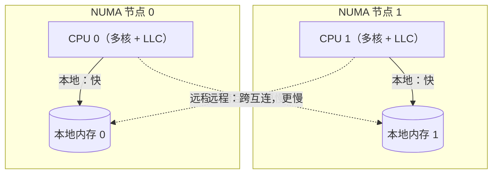

## 9.11 NUMA感知与调度器的未来

前面各节描述的调度器有一个从未明说的假设：任何M访问内存的速度都一样快，任何两个P之间搬运一个G的代价都相同。在笔记本和单路服务器上，这个假设几乎成立。可一旦把程序放大大型
多路服务器上，它就开始失真，而且核数越多，失真约大。本节谈这道裂缝：它从何而来，Go调度器为何至今对它视而不见，一份曾经被认真设计却没有落地地NUMA感知方案，以及今天的用户
该如何绕过去。

### 9.11.1 NUMA: 内存不再是一块平地

早年的对称多处理器里面，所有CPU经一条共享总线访问同一块内存，访存延迟与哪个核发起的无关。这种一块平地的内核模型简单，却随着核树增长而失效：共享总线成了瓶颈，每多一个核就多一分争用。NUMA
(non-uniform memory access,非均匀访存)是工业界给出的答案。把机器拆成若干节点（node），每个节点是一个socket加上直连在它身上的一片本地内存，节点之间用片间互联（Intel的UPI，AMD的Infinity
Fabric）连成一张网。CPU访问本地节点的内存走最短路径，访问别的节点内存则要扩越互联，多一跳甚至多几跳。



代价是实打实的。本地与远程的访存延迟通常相差一到两倍，跨节点带宽也低于本地带宽，具体数字随着平台而变，可在Linux上用numactl --hardware读出节点拓扑与节点的相对距离矩阵。比延迟更隐蔽的是缓存一致
性的开销：当一个核心要写一行被别的节点缓存着的数据时候，一执行协议（MESI一族）要先让远端那份副本失效，这条失效的信息也得要跨互联往返。于是NUMA上伪共享（false sharing,12.2）比SMP上更疼：
同一行缓存被两个节点的核反复争夺，每次写都要付一次跨节点的一致性往返。

把这件事情写成一个粗略的成本模型，更能看清它对调度的意义。设一个G在其生命周期里面发起n次访存，其中比例\(r \in [0,1]\)落在远程节点，本地与远程的单词延迟分别为tl与tr,(典型地\(t_r \approx 1.5t_l \approx 2t_l\)),则它的访存总成本约为：

\(T(r)
= n\left[(1-r)t_l + rt_r\right]
= nt_l\left[1+r\left(\frac{t_r}{t_l}-1\right)\right]\)

理想NUMA局部性是r -> 0,成本逼近ntl;最坏是数据与执行核分属两端， r -> 1,成本翻到ntr。调度器的每一次跨节点迁移，做的正是把某个G的r从接近0推向更大的值。对访存密度(n大)的负载，这笔帐可观；对
I/O密集，n本就小的负载，则几乎可以忽略不计。这个简单的式子，已经预告下文那份NUMA方案收益高度依赖工作负载的结论。

一句话，一台NUMA机器更像一个内部就带着距离的小型分布式系统。对运行其上的运行时来说，数据在哪个节点，执行它的核心在哪个节点不在是无关紧要的细节，而是直接写进延迟账单的一笔。

### 9.11.2 局部性：Go运行时有它，却是无意得来的

读到这里读者或者会问：既然NUMA影响那么大，Go运行时是怎么活下来的？答案是它确实享受着相当一部分局部性，只不过这局部性是别的设计顺手带来的，而非冲着NUMA去的。

最重要的一处是每个P一份mcache（9.3，12.2）。一个G在某个P上分配的小对象，来自这个P的本地缓存；只要这个G后续仍在同一个P（多半是同一个核心）上运行，仍然碰到它自己分配的对象，访存就大概率
落在本地节点。工作窃取（9.2）优先跑本地运行队列，本地空了才去偷的策略，同样隐含地倾向于让一个G连续在同一个P上推进。再加上Linux内核CFS调度器默认带的CPU亲和性，它不会无缘无故把一个线程从一个核心
弹到另外一个核心，于是G呆在原P，原P呆在原核，原核守着本地内存这条链条再多书时候自然成立。

但大概率不是保证。这套局部性再三个地方会断：

- 工作窃取是拓扑无关的。偷G时候，调度器所在所有P里面按一个随机顺序挨个试，挑中谁就偷谁，完全不看目标P在哪个节点。一旦把一个G从它的数据所在节点的核偷到另一个节点的核上，这个G接下来每次访问老数据
  都付出远程的代价，而他新分配的对象又落到了新节点，局部性就此撕裂。
- 内存不分配绑定节点。mcache见底向mcentral,mheap补货（12.2）,拿到的也来自全局堆，不保证落在当前P所在的节点。堆arena也没有按照节点切分。
- M,P与节点没有绑定关系。P只是逻辑处理器，M试哪个OS线程，跑在哪个核心上，属于哪个节点，运行时一概不记。

把这三点喝起来，结论很直接：Go的调度器是NUMA无感（NUMA-oblivious）的。运行时源码里面找不到一处节点，socket或者互联距离的概念，工作窃取的目标选择是一个与拓扑无关的伪随机枚举：

```go
// 工作窃取的目标顺序：与NUMA拓扑完全无关（runtime.proc.go,速写）
//
// randomOrder用与GOMAXPROCS互质的步长在所有P上作物重复的伪随机枚举：
// 若X与count互质，则（i+x)%count恰好遍历0...count-1一次。
func stealWork(now int64) (gp *g,...) {
    pp := getg().m.p.ptr()
    const stealTries = 4
    for i := 0; i < stealTries; i++ {
        // 从一个随机位置起，按互质步长枚举全部P,allp里面相邻的两个P
        // 可能分属不同NUMA节点，这里改不知道也不在乎。
        for enum := stealOrder.start(cheaprand()); !enum.done(); enum.next(){
            p2 := allp[enum.position()]
            if pp == -2 || idleMask.read(enum.position()){
                continue
            }
            if gp := runqsteal(pp, p2, /*stealRunNextG= */); gp != nil {
                return gp // 偷到就走，无论p2在近端还是远端
            }
        }
    }
    // ...
}
```

这是一个清醒的取舍，而非疏漏。下一节就讲，更正确的那条路，其实有人完整设计过。

### 9.11.3 一份完成却没有落地的方案

针对NUMA，Dmitry Vyukov在2014年提交过一份NUMA感知调度的设计（golang/go#14406的前身提案）。它的骨架沿用至今的MPG（9.3）没有推倒重来，而是在其上叠一层节点拓扑：

- P按照NUMA节点分组。运行时在启动时探测拓扑，把P划归个节点，让同节点的P成为一个显式的集合。
- 窃取与唤醒先就近。一个P空闲找活时，现在本节点的兄弟P里偷；本节点确实没有可偷的，才升级到跨节点窃取。唤醒一个休眠的M/P时，同样优先唤醒本节点的，让相关的G尽量聚在一个节点里面跑。
- 堆按照节点本地化。内存分配尽量从当前P所在节点的本地内存出页，让arena与节点对齐，使在哪个节点上分配，就在哪个节点上访问成为常态而非巧合。

思路并不神秘，真正难的是落地。它要在调度的快路径上引入节点这个新维度，牵动运行队列的组织，前去与唤醒的策略，乃至内存分配器的出页逻辑（12）,全局复杂度的上升是限制且永久的：此后每一处调度或者
分配改动，都要多想一层拓扑。而收益高度依赖工作负载，访存密集，数据清晰节点亲和性的程序受益明显，可大量Go服务是I/O密集，G寿命短，数据本身在节点间流动的，对它们这层机制近乎值增成本不见回报。
权衡之下，官方判断这笔投入在当时不划算，方案至今没有提上日程，也没有合并。

这件事情值得和垃圾回收里的ROC（Request Oriented Collector, 13）并置来看。两者都是理论上更优，设计也已经相当成熟，最终却选择不做的方案。它们公公勾勒出Go团队一以贯之的工程取向：一个更优的
设计，若已全局复杂度的显著，持久上升为代价，而收益又不普惠，那么暂时不采纳本身就是一个负责任的决定。这条原则在本书会反复出现，它不是保守，而是把简单当作一种要长期偿还的资产经营。

### 9.11.3 Go今天靠什么，用户今天怎么办

既然运行时不管NUMA,那这件事情就被推到了它的上下两层：操作系统与用户。

运行时实际依仗的，是这样几样不必操作的机制。其一是OS调度器的CPU亲和性：Linux CFS默认不会随意迁移线程，M多半能手在原核附近，前述的隐式局部性才得以维持。其二是透明大页（THP）：运行时在Linux
上对堆内存调用madvise(MADV_HUGEPAGE)(runtime/mem_linux.go)，让内核尽量用大页支持堆，减少TLB miss,这虽然不是冲着NUMA去的，却顺带降低了访存固定开销。其三就是上一节说的每P结构的隐式
局部性。三者叠加，让Go在没有任何NUMA代码的情况下，仍能再多路机器上跑出可用的性能。

需要更强NUMA局部性的用户，今天实现的做法是在进程外解决，而不是等运行时：

- 整进程绑定。用numactl ==cpunodebind=0 --membind=0 ./server把整个进程订在一个节点上，CPU与内存都不出节点。代价是只用了机器的一部分，适合单进程吃不满整机的场景。
- 每节点一进程+分片。在每个NUMA节点上各起一个进程，各自绑定到本节点，并把GOMAXPROCS设置该节点的核数，再在应用层按节点把数据与请求分片（sharding）。这等于在进程层面手工实现了P按节点分组，是
  吃满大机器有保住局部性的常见架构。
- 线程级pinning。taskset之类工具可把进程限定在某组核上。但要留意：Go不暴露把某个goroutine钉在某个OS线程的稳定接口，runtime.LockOSThread只绑定G与M，不绑定M与核。所以纯goroutine级的
  精细pinning在Go里面并不顺手，往往退回到某节点一进程的粗粒度。

换句话说，Go把NUMA的责任明确交给了部署者：运行时给出一台假装均匀的机器，再由部署者用numactl和分片在它外面重新画出节点的边界。

### 9.11.5 未尽的课题

调度器在GM演进到GMP（9.3）之后，骨架长期稳定，足见的当初设计的功力。但核数仍在增长，单机上百核，多节点已步稀罕，超大规模并行下的几处压力点始终是活跃的关注对象：全局结构（全局队列，sched.lock）
的争用，工作窃取的扩张性，以及本节的NUMA局部性。

NUMA感知会不会回归核心？没有定论。倾向于它回归的理由是核数与节点数还在涨，隐式局部性能兜住的工作负载比例在缩小；倾向于继续搁置的理由是云上每个节点一容器的部署已经把问题在编排层解决了，且容器
感知的GOMAXPROCS（Go 1.25）让按cgroup配额跑更顺，反而削弱了运行时自己拓扑的紧迫性。更可能的演进，仍是一系列不改动骨架的渐进打磨，正如runnext(1.5),异步抢占（1.14）,容器感知的GOMAXPROCS
(1.25)那样，在MPG框架持续改良，而不是又一次质变。NUMA感知若要真回来，多半也会以可选，就近，不破坏快路径的克制形态回来了，而非当年那份大而全的方案。
