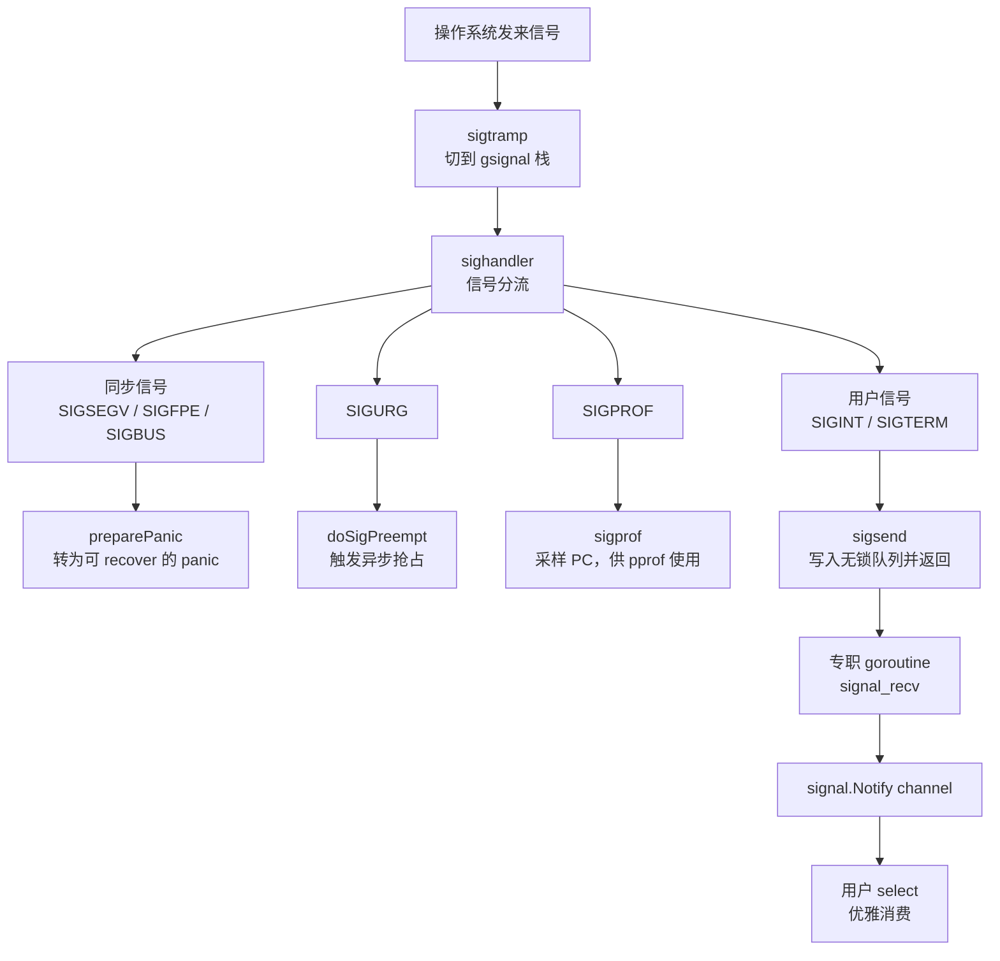

## 9.6 信号处理机制

操作系统信号是异步的，底层的：它可能在任意时刻打断任意线程，而处理器（signal handler）里面能做的事情又及其受限。Go想要的，却往往用singnal.Notify把一个channel接上`SIGINT`，在收到时候优雅
收尾。运行时要做的，正是在这两者直线搭一座桥：把凶险的一异步信号，转换成可被goroutine安然消费的事件。这座桥的每一处设计，都受信号上下文里面能做什么这一硬约束支配。读懂了这条约束，本节其余的机制
就都只是它的推论。

### 9.6.1 异步信号安全：处理器里面几乎什么都不能做

信号处理器运行在一个被打断的，不确定的上下文里面。被打断的线程可能正持有malloc的锁，正处于某个数据结构的中间状态，甚至正在分配器内部改写元数据。一旦处理器里面再去调用malloc或获取同一把锁，
便会自我死锁，或者读到半成品状态而崩溃。POSIX因此规定，信号处理器里只能异步调用信号安全（async-signal-safe）的函数，这是一份很短的白名单见(signal-safety(7)):write,`_exit`,sigaction
这类不碰锁，不碰分配器的系统调用在列，而malloc，printf，绝大多数ptheread加锁，乃至大部分C标准库都不在其列。

这条约束逼出了所有支持信号的运行时共同遵循的一条铁律：

> 在处理器里只做不得不做的最少事，把真正的处理推迟到一个安全的地方去做。

这正是经典首发自管道技巧（self-pipe trick,W.R.Stevens在APUE中给出了范式）的来由：处理器什么都不干，只往一个事先建立好的管道写一个字节；主事件循环（select / poll）在管道另外一头监听，
于是收到信号就被降格成一次普通的管道可读事件，后续处理便回到了不受限的常规上下文里。Linux后来用signalfd(2)把这一手法收编进内核，让信号能直接以文件描述符的形式被epoll消费。

Go走的同一思路的变体，只是把那根管道换成了运行时内部的一个无锁队列（9.6.4）。理由也很Go:自管道每次投递都要一次write系统调用，而Go的信号处理与调度器，垃圾回收深度耦合，用一个进程内的原子状态
机来写一个bit，唤醒一个等待者，比反复进出内核更省，也更可控。本节接下来几个小节，便是沿着这条铁律，看Go如何把它落实到处理器，备用栈，队列与专职goroutine这几样零件上。

### 9.6.2 gsignal: 处理器自带的一段安全栈

铁律的第一处落实，是给处理器一段专门的栈。信号可能再用户goroutine的栈快用尽时降临，若处理器还在这段紧绷的栈上运行，极易触发栈溢出；更麻烦的是，Go的栈是可增长的（14.6）,而栈增长本身要分配，要加
锁，正是处理器碰不得的操作。解法是POSIX的`sigaltstack(2)`:为线程预先登记一段备用信号栈，内核在分发信号时候自动切到这段栈上执行处理器。

Go为每个M配一个名为gsignal的特殊goroutine，它的栈就是这个M的备用信号栈。gsignal在mcommoninit阶段经mpreinit创建，是除了g0(9.3)之外每个M最先拥有的g,它不参数调度，没有用户代码意义上的goid
,存在唯一的目的就是承载信号处理。

```go
// 每个M初始化时为它创建gsignal（速写,见os_*.go的mpreinit
func mpreinit(mp *m) {
    mp.gsignal = malg(32 * 1024) // 备用信号栈，Darwin/AIX 要求 >= 8K
    mp.gsingal.m = mp   // gsignal 永远绑定它所属的M
}
```

M进入mstart后，minit会调用minitSignalStack，通过signalstack把gsignal.stack登记为本线程的备用信号栈。这里有一处为cgo准备的细心：若该线程已被非Go的C代码设过备用信号栈（非Go线程回调
进Go的进行），运行时不回粗暴覆盖，而是把现成的那段栈接管为gsignal的栈，并在unminit时照样还回去。把在那段栈上处理信号这件事情每个M各管一份，正是让信号处理与goroutine调度互不干扰的前提。

### 9.6.3 处理器只是入队，goroutine再分发

栈备好了，下一步时安装处理器并在信号到来时候分流。Go在initsig阶段为它关心的每个信号安装同一入口。值得注意，内核回调的并不是sighandler本身，而是一段汇编蹦床sigtramp:信号到来时，内核以
C的调用约定跳进sigtramp,由它保存上下文，切换到Go运行时世界，再调用sigtrampgp，后者把当前g切换到本M的gsignal,最后才进入真正的sighandler。这一层蹦床的存在，是因内核并不知道Go的
`g/m/p`抽象，必须有人把执行环境翻译过来。

```go
// 信号到来以后入口翻译（速写，见signal_unix.go)
func sigtrampgp(sig uint32, info *siginfo, ctx unsafe.Pointer) {
    if signfwdgo(sig, info, ctx) {
        return // 该信号不归Go管：转发给Go之前已存在的handler（cgo场景）
    }
    gp := sigFetchG(&sigctxt{info, ctx})
    setg(gp.m.gsignal)      // 切换到本M的备用信号所对应的g
    // ...必要时按sigaltstack的实际值矫正栈边界(非Go代码改过的情形)
    sighandler(sig, info, ctx, gp)
    setg(gp)    // 处理完恢复被打断的g
}
```

sigfwdgo是与本地库共存的关键：并非所有信号都该由Go处理，若某个信号原本由用户的C库注册过处理器，Go会把它转发回去，而不据为己有。这一点再9.6.5还会回到。

真正的分流再sighandler里面。它迅速判明信号种类以后，按三类去向处理。



第一类，同步信号。SIGSEGV(空指针解引用),`SIGFPE`（除零）,SIGBUS这些都是当前线程自己的非法操作就地引发，与被打断的代码有直接因果关系。运行时不让进程默默崩溃，而是把它们转换为Go的panic:
`preparePanic`改写被打断的栈与PC，伪装成出错那一点调用了sigpanic，待处理器返回，控制流回到用户g时，便从sigpanic处抛出一个可悲recover捕获的运行时错误。判定靠sigtable里的`_SignPanic`
标志，仅当信号确实来自内核（而非用户kill),被打断的又确实是用户g时才这么做，否则只能throw:

```go
// sighandler的三阶段分流(裁剪自signal_unix.go)
func sighandler(sig uint32, info *siginfo, ctxt unsafe.Pointer, gp *g) {
    c := &signctxt{info, ctxt}

    if sig == _SIGPROF { // 运行时自用：性能采集
        sigprof(c.sigpc(), c.sigsp(), c.siglr(), gp, getg().m)
        return
    }

    if sig == sigPreempt && debug.asyncpreemptoff == 0 {
        doSigPreempt(gp, c) // 运行时自用：异步抢占（见9.7)随后继续
    }

    flags := sigtable[sig].flags
    if !c.sigFromuser() && flags&SigPanic != 0 {
        // 同步信号：把现场伪造成调用了sigpanic，转为可recover的panic
        gp.sig, gp.sigpc, gp.sigcoe1 = sig, c.sigpc(), c.fault()
        c.preparePanic(sig, gp)
        return
    }

    if c.sigFromUser() || flags&_SigNotify != 0 {
        if sigsend(sig) { // 用户信号：放进无锁队列，立即返回
            return
        }
    }

    // 剩下的就是_SigKill / _SigThrow: 杀死带栈崩溃
    if flags &_SigKill != 0 {
        dieFromSignal(sig)
    }
    // ... throw,打印栈并退出
}
```

第二类，运行时自用的信号，就地处理。SIGPROF时pprof的定时采样源（16工具与可观测性）,处理器在被打断处抓一份PC交给`sigprof`记账即返回；SIGURG是异步抢占的载体（9.7）,处理器调用doSigPreempt
在被打断的g上注入一次抢占请求便返回。注意抢占信号即便命中，处理器也不独吞，注意抢占信号即便命中，处理器也不独吞，而是继续往下走完分流，因为一个SIGURG可能与别的信号合并到达。

第三类，需要交给用户的信号，才走那座桥。SIGINT,SIGTERM,SIGHUP这些带\_SigNotify标志，或者确由kill发来的信号，处理器只调用sigsend把它塞进无锁队列就立即返回，绝不在处理器里面碰channel，碰
锁，碰分配。真正的投递交给队列另一头的专职goroutine。

这三类的判定，全部编码在sigtable的标志位里，每个信号一行：

```go
const (
    _SigNotify = 1 << iota      // 允许signal.Notify收到它（哪怕来自内核)
    _SigKill                    // Notify 不接则静默退出
    _SigThrow                   // Notify 不接则带栈崩溃
    _SigPanic                   // 来自内核时转为panic（SIGSEGV/SIGFPE/SIGBUS）
    _SigDefault                 // 未显式请求则不监控
    // _SigGoExit / SigSetStack / _SigUnblock / _SigIgn ...
)
// 例：SIGSEGV 标 _SigPanic,SIGINT 标 _SigNotify+_SigKill,SIGQUIT 标 _SigNotify+_SigThrow
```

### 9.6.4 sigsend:无锁队列与专职接收goroutine

桥的两端，是sigsend（生产者，跑在处理器里面）与signal_recv（消费者，跑在专职的goroutine里面），中间是一个进程内全局的sig结构。因为生产端身处异步信号安全的牢笼，这个队列必须是无锁且不分配的，
整张表用原子的CAS驱动：

```go
// 信号队列：处理器与接收goroutine之间的无锁通道（速写,见signqueue.go)
var sig struct {
    note note           // 接收方睡眠/唤醒用
    mask [(_NSIG + 31) / 32 ]uint32 // 已入队，待接收方取走信号位图
    wanted [(_NSIG + 31) / 32 ]uint32 // 用户经Notify声明关心的信号
    ignored [(_NSIG + 31) / 32 ]uint32 // 被Ignore的信号
    recv [(_NSIG + 31) / 32 ]uint32 // 接收方的本地副本
    state atomic.Uint32     // sigIdle / sigSending / sigReceiving
    delivering atomic.Uint32    // 正在sigsend中处理器计数
    inuse bool
}
```

sigsend做的事情很克制：把信号对应的bit用CAS置为sig.mask,再用一个三态状态决定要不要唤醒对方。state这三个状态是整套同步的核心，它让写一个bit与唤醒一个睡眠者这两件事不必各自加锁就能正确配合：

```go
func sigsend(s uint32) bool {
    bit := uint32(1) << (s & 31)
    if w := atomic.Load(&sig.wanted[s/32]); w&bit == 0 {
        return false // 没人关心这个信号，直接放行
    }
    // 把bit置进队列;若已在队列里面，省去重复唤醒
    for {
        mask := sig.mask[s/32]
        if mask&bit != 0 {
            return true
        }
        if atomic.Cas(&sig.mask[s/32], mask, mask|bit) {
            break
        }
    }

    // 仅当接收方正睡眠(sigReceiving)时候才notewakeup,避免无谓系统调用
    for {
        switch sig.state.Load() {
        case sigIdle:
            if sig.state.CompareAndSwap(sigIdle, sigSending) {
                return true // 接收方唤醒，它稍后自会来看
            }
        case sigSending:
            return true     // 已有待处理通知
        case sigReceiving:
            if sig.state.CompareAndSwap(sigReceiving, sigIdle) {
                notewakeup(&sig.note) // 唤醒睡眠的接收方
                return true
            }
        }
    }
}
```

队列另外一端，signal_recv跑早一个普通的，不受异步信号安全约束的goroutine里面，可以自由地睡眠与被唤醒。它先把sig.mask整体换进自己的本地副本recv，逐位取出返回。本地空了就把状态切换到
sigReceiving并睡到sig.note上，等下一次sigsend唤醒。这一进一出，恰好对称：

```go
func signal_recv() uint32 {
    for {
        for i := uint32(0); i < _NSIG; i++ { // 先把本地副本里的信号逐个交出
            if sig.recv[i/32]&(1<<(i&31)) != 0 {
                sig.recv[i/32] &^= 1 << (i & 31)
                return i
            }
        }
        for { // 本地空了：睡眠等 sigsend唤醒
            switch sig.state.Load() {
            case sigIdle:
                if sig.state.CompareAndSwap(sigIdle, sigReceiving) {
                    notesleepg(&sig.note, -1) // 在普通goroutine上下文里面安全睡眠
                    noteclear(&sig.note)
                }

            case sigSending:
                if sig.state.CompareAndSwap(sigSending, sigIdle) {

                }
            }
            break
        }
        for i := range sig.mask  { // 把出队列整体搬进本地副本
            sig.recv[i] = atomic.Xchg(&sig.mask[i], 0)
        }
    }
}
```

最后一段在用户态，由`os/signal`包接手。它在首次Notify时懒启动一个goroutine跑loop，循环调用signal_recv取信号，在process分发到用户注册的channel上：

```go
// os/signal: 把运行时取出的信号投递到用户channel（速写）
func loop() {
    for {
        process(syscall.Signal(signal_recv()))
    }
}

func process(sig os.Signal) {
    handers.Lock()
    defer handlers.Unlock()
    for c, h := range handlers.m { // 遍历所有 Notify注册的channel
        if h.want(signum(sig)) {
            select {
            case c <- sig: // 非阻塞投递，满了就丢，避免推住 loop
            default:
            }
        }
    }
}
```

到这里，那个异步，受限的上下文里面诞生的信号，已经变成了一次普普通通的channel接收，用户只需要`signal.Notify(ch, os.Interrupt)`在`<-ch`，就能用最熟悉的select优雅的处理它。注意process
的投递是非阻塞的：channel满了就丢弃，这是刻意的取舍，也不让分发循环被一个迟钝的消费者拖死。这也是为何signal.Notify的channel通常应带缓冲。

### 9.6.5 与其他运行时的取舍，以及一个世纪副作用

信号与托管运行时的关系一向微妙，根子在于：运行要用的信号，用户和本地库也想用信号，而一个进程里面同一个信号的处理器只有一份。JVM同样要接管SIGSEGV(用与空检查与安全点轮询的保护陷入)，SIGBUS等，
并为此信号提供信号链（signal chainning,libjsig）：把它接管之前已存在的处理器记下来，遇到不归自己管的情形再链式转发回去。Go的sigfwdgo（9.6.3）解决的是同一个问题，只是方向相反，它在Go安装
自己的处理器前先把旧的存进fsdSig，需要时转发。两套机制殊途同归，都是为了让运行时与本地库在同一个信号上和平共处。

正是因为信号是稀缺的共享资源，Go给异步抢占挑哪个信号时候格外讲究，运行时源码里面列出来一串启发式条件：要被调试器默认放行，不被libc在混合二进制里面内部占用，能够无害地虚假触发，还要在没有实时信号
的平台（如macOS）上可用。`SIGUSR1/SIGUSR2`因常被应用赋予真实含义而出局，SIGALRM因为无法分辨是不是真的定时器到点而出局。最终选中的是SIGURG:它的名义上报告socket的带外数据，而带外数据近乎
无人使用，且它连是哪个socket都不说明，本就几乎废弃，应用便用到它也必须容忍它虚假到来。挑一个无害到可以随便发的信号，是这套设计的点睛之笔。

这套选择带来一个常被忽视的实际副作用。自Go1.14引入异步抢占（9.7）之后，一个忙碌的程序会频繁收到SIGURG,而信号会中断阻塞中的慢速系统调用，使其以EINTR返回。POSIX的`SA_RESTART`标志能让
一部分被中断的系统调用自动重启。Go安装处理器时也确实带上了它，但并非所有系统调用都可重启（如poll,某些read）。这是为了可抢占性付出的一处看得见的代价，也提醒我们：信号机制里面的每一个选择，
都会沿着系统调用一路波及到用户可观察的行为。性能与能力的提升从不白来，它总是在别处留下需要照看的角落。

### 9.6.6 小节

把本节串起来：异步信号安全这一条硬件约束（9.6.1）,逼出了处理器里只做最少数的特律；铁律落到零件上，就是每个M自带的`gsignal`备用栈（9.6.2），`sighandler`的三类分流（9.6.3），以及把用户信号
降格为channel时间的无锁队列与专职goroutine(9.6.4)。这套两端式与9.7的异步抢占如出一辙：在受限的信号上下文里面只注入最小的一步，把真正的工作推回安全地带完成。理解这一点，下一节的一步抢占
便只是同一手法在调度上的又一次施展。
