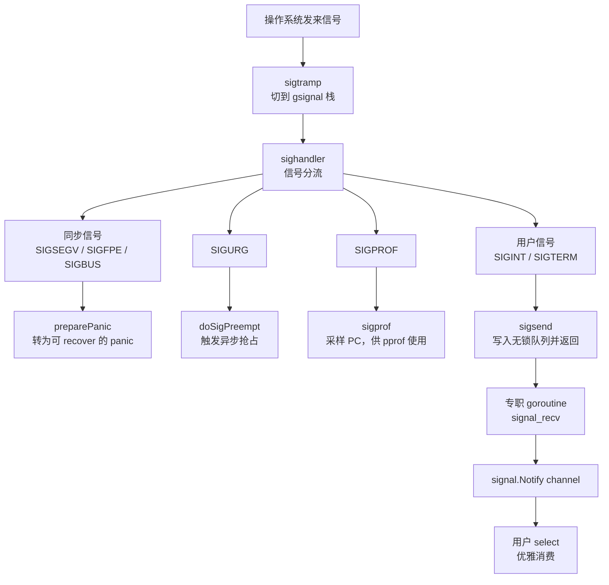

## 9.6 信号处理机制

操作系统信号是异步的，底层的：它可能在任意时刻打断任意线程，而处理器（signal handler）里面能做的事情又及其受限。Go想要的，却往往用singnal.Notify把一个channel接上`SIGINT`，在收到时候优雅
收尾。运行时要做的，正是在这两者直线搭一座桥：把凶险的一异步信号，转换成可被goroutine安然消费的事件。这座桥的每一处设计，都受信号上下文里面能做什么这一硬约束支配。读懂了这条约束，本节其余的机制
就都只是它的推论。

### 9.6.1 异步信号安全：处理器里面几乎什么都不能做

信号处理器运行在一个被打断的，不确定的上下文里面。被打断的线程可能正持有malloc的锁，正处于某个数据结构的中间状态，甚至正在分配器内部改写元数据。一旦处理器里面再去调用malloc或获取同一把锁，
便会自我死锁，或者读到半成品状态而崩溃。POSIX因此规定，信号处理器里只能异步调用信号安全（async-signal-safe）的函数，这是一份很短的白名单见(signal-safety(7)):write,`_exit`,sigaction
这类不碰锁，不碰分配器的系统调用在列，而malloc，printf，绝大多数ptheread加锁，乃至大部分C标准库都不在其列。

这条约束逼出了所有支持信号的运行时共同遵循的一条铁律：

> 在处理器里只做不得不做的最少事，把真正的处理推迟到一个安全的地方去做。

这正是经典首发自管道技巧（self-pipe trick,W.R.Stevens在APUE中给出了范式）的来由：处理器什么都不干，只往一个事先建立好的管道写一个字节；主事件循环（select / poll）在管道另外一头监听，
于是收到信号就被降格成一次普通的管道可读事件，后续处理便回到了不受限的常规上下文里。Linux后来用signalfd(2)把这一手法收编进内核，让信号能直接以文件描述符的形式被epoll消费。

Go走的同一思路的变体，只是把那根管道换成了运行时内部的一个无锁队列（9.6.4）。理由也很Go:自管道每次投递都要一次write系统调用，而Go的信号处理与调度器，垃圾回收深度耦合，用一个进程内的原子状态
机来写一个bit，唤醒一个等待者，比反复进出内核更省，也更可控。本节接下来几个小节，便是沿着这条铁律，看Go如何把它落实到处理器，备用栈，队列与专职goroutine这几样零件上。

### 9.6.2 gsignal: 处理器自带的一段安全栈

铁律的第一处落实，是给处理器一段专门的栈。信号可能再用户goroutine的栈快用尽时降临，若处理器还在这段紧绷的栈上运行，极易触发栈溢出；更麻烦的是，Go的栈是可增长的（14.6）,而栈增长本身要分配，要加
锁，正是处理器碰不得的操作。解法是POSIX的`sigaltstack(2)`:为线程预先登记一段备用信号栈，内核在分发信号时候自动切到这段栈上执行处理器。

Go为每个M配一个名为gsignal的特殊goroutine，它的栈就是这个M的备用信号栈。gsignal在mcommoninit阶段经mpreinit创建，是除了g0(9.3)之外每个M最先拥有的g,它不参数调度，没有用户代码意义上的goid
,存在唯一的目的就是承载信号处理。

```go
// 每个M初始化时为它创建gsignal（速写,见os_*.go的mpreinit
func mpreinit(mp *m) {
    mp.gsignal = malg(32 * 1024) // 备用信号栈，Darwin/AIX 要求 >= 8K
    mp.gsingal.m = mp   // gsignal 永远绑定它所属的M
}
```

M进入mstart后，minit会调用minitSignalStack，通过signalstack把gsignal.stack登记为本线程的备用信号栈。这里有一处为cgo准备的细心：若该线程已被非Go的C代码设过备用信号栈（非Go线程回调
进Go的进行），运行时不回粗暴覆盖，而是把现成的那段栈接管为gsignal的栈，并在unminit时照样还回去。把在那段栈上处理信号这件事情每个M各管一份，正是让信号处理与goroutine调度互不干扰的前提。

### 9.6.3 处理器只是入队，goroutine再分发

栈备好了，下一步时安装处理器并在信号到来时候分流。Go在initsig阶段为它关心的每个信号安装同一入口。值得注意，内核回调的并不是sighandler本身，而是一段汇编蹦床sigtramp:信号到来时，内核以
C的调用约定跳进sigtramp,由它保存上下文，切换到Go运行时世界，再调用sigtrampgp，后者把当前g切换到本M的gsignal,最后才进入真正的sighandler。这一层蹦床的存在，是因内核并不知道Go的
`g/m/p`抽象，必须有人把执行环境翻译过来。

```go
// 信号到来以后入口翻译（速写，见signal_unix.go)
func sigtrampgp(sig uint32, info *siginfo, ctx unsafe.Pointer) {
    if signfwdgo(sig, info, ctx) {
        return // 该信号不归Go管：转发给Go之前已存在的handler（cgo场景）
    }
    gp := sigFetchG(&sigctxt{info, ctx})
    setg(gp.m.gsignal)      // 切换到本M的备用信号所对应的g
    // ...必要时按sigaltstack的实际值矫正栈边界(非Go代码改过的情形)
    sighandler(sig, info, ctx, gp)
    setg(gp)    // 处理完恢复被打断的g
}
```

sigfwdgo是与本地库共存的关键：并非所有信号都该由Go处理，若某个信号原本由用户的C库注册过处理器，Go会把它转发回去，而不据为己有。这一点再9.6.5还会回到。

真正的分流再sighandler里面。它迅速判明信号种类以后，按三类去向处理。



第一类，同步信号。SIGSEGV(空指针解引用),`SIGFPE`（除零）,SIGBUS这些都是当前线程自己的非法操作就地引发，与被打断的代码有直接因果关系。运行时不让进程默默崩溃，而是把它们转换为Go的panic:
`preparePanic`改写被打断的栈与PC，伪装成出错那一点调用了sigpanic，待处理器返回，控制流回到用户g时，便从sigpanic处抛出一个可悲recover捕获的运行时错误。判定靠sigtable里的`_SignPanic`
标志，仅当信号确实来自内核（而非用户kill),被打断的又确实是用户g时才这么做，否则只能throw:
