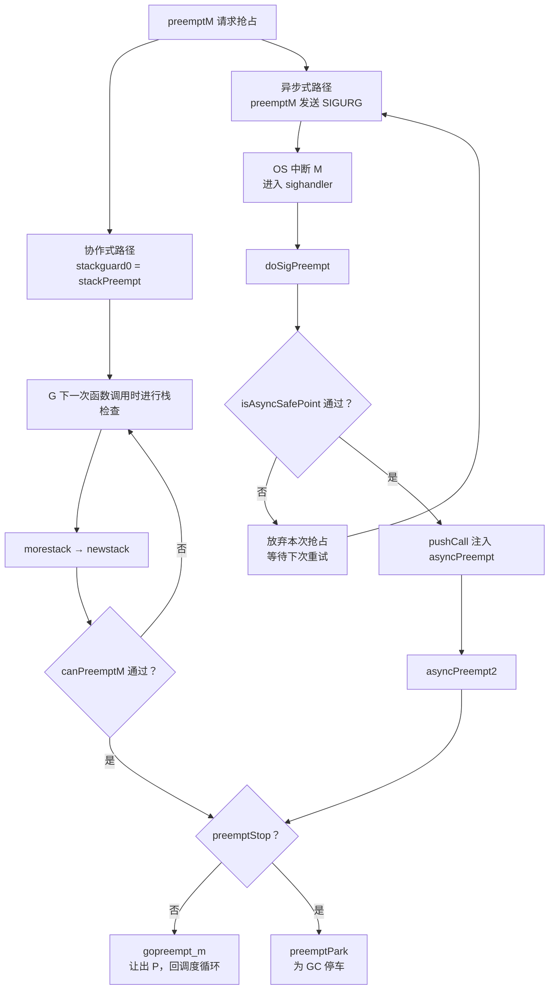

## 9.7 协作与抢占

我们在9.5调序循环里面遗留了要给问题：如果某个G执行时间过长，其他G如何还能被调度？答案绕不过调度理论中的一对老概念，协作式与抢占式。协作式调度依靠被调用方主动弃权，抢占调度依靠调度器把调用方被动中断。

Go运行时没有操作系统内核那种硬件中断能力，基于工作窃取的调度器（9.2）本质上是先来先服务的协作式调度。它如何在不牺牲这一前提的情况下，仍能强行打断一个不肯让权的G，是本节要讲清楚的设计。这题线索从
一个理论问题出发：运行时凭什么不能在任意一条指令处停下一个Goroutine。

### 9.7.1 安全点： 为何不能想停就停

抢占的难点不在中断，而在中断之后还要能正确地恢复，并让垃圾回收看懂这个G的栈。Go是精确（precise）垃圾回收的语言，GC必须知道一个被停住的G,它的每一个栈槽与寄存器里面究竟装的是指针还是普通函数
（13.4）。这份刻意哪些位置是指针的信息，称为栈映射（stack map）与寄存器映射，由编译器在确定的位置才生成。换言之，程序并非在每一条机器指令处都具备完整的指针信息，能让GC安全扫描的位置都是离散的。

这样的位置就是安全点（safe-point）：线程执行到此，运行时能够完整地辨认其全部对象引用。不在安全点就停下一个G，比如恰好停在写屏障列的中段，或者停在一条把指针临时拆成整数运算的指令之间，扫描
就会漏掉或者误判指针，破坏GC的正确性。安全点可以安全停车的地方限定为一组离散点，这是抢占一切机制的地基。

实现安全点有两条路。一条是轮询式（polling），编译器在安全点插入一小段代码检查，G自己反复询问有没有人让我停，看到请求便配合停下。它简单，可移植，代价是检查指令常驻开销，以及一个根本盲区：若
一段代码长时间不经过任何安全点（比如一个不含函数的紧凑循环），轮询永远不会被执行，请求就石沉大海。另一条是抢占式（preemptive），由外部线程强行中断目标，再设法把它挪到一个安全点上，代价是中断时
机不可控，正卡在不安全的指令上时必须有办法识别并放弃。

为何一个迟迟不到安全点的线程回拖累全局？因为许多运行时操作要求全局停顿（stop-the-workd，STW），典型如GC的某些阶段。STW要等到所有G都停在安全点才能开始，于是总耗时由最慢的那个线程决定。这个
量有个名字，到达安全点的时间（time-to-safepoint,TTSP）。一个TTSP失控线程，比如陷再死循环里面，会把整次STW的拖延拖到不可接受。降低TTSP的尾部，正是抢占机制要解决的工程目标。

### 9.7.2 协作式抢占：搭栈增长检查的便车

Go最早的抢占是纯协作式的，且复用了一处现成的安全点：函数序言里栈增长检查（14执行栈管理）。每个非nosplit函数在入口都会比较栈指针SP与`g.stackguard0`，SP越界就会触发morestack，转入newstack
去扩张栈。这处检索检查恰好是一个同步安全点：此刻G的栈是完整可扫描的。

抢占搭了它便车。把stackguard0设置成一个比任何真实SP都大的哨兵值stackPreempt，下一次函数调用的栈检查必然失败，于是落入了newstack,由它分辨这并非真要扩栈，而是一次抢占请求：

```go
// 抢占哨兵：置入g.stackguard0，使下一次栈检查必然失败而进入newstack
// 它比任何真实SP都大（0xfffffade)
const stackPreempt = (1<<(8*goarch.PtrSize) - 1) & -1314
func newstack() {
    gp := getg().m.curg
    // 是抢占请求，而非真要扩栈
    preempt := gp.stackguard0 == stackPreempt

    if preempt {
        if !canPreemptM(gp.m) {
            // 运行时正处于不可抢占的状态：撤销请求，继续运行
            gp.stackguard0 = gp.stack.lo + stackGuard
            gogo(&gp.sched)
        }
        if gp.preemptStop {
            preemptPark(gp) // 转入GC的停车，不返回
        }
        gopreempt_m(gp) // 行为等同主动调用Gosched,让出P
    }
    // ... 否则才是正真的栈扩张
}
```

`canPreemptM`把抢占限制在安全的运行时状态下，它要求M没有持锁，没有在分配内存，没有关闭抢占，且其P正在运行：

```go
func canPreemptM(mp *m) bool {
    return mp.locks == 0 && mp.mallocking == 0 && mp.preemptoff == "" &&
    mp.p.ptr().status == _Prunning && mp.curg != nil &&
    readgstatus(mp.curg)&^_Gscan != _Ssyscall
}
```

这套设计的优雅在于零额外成本：他没有新增任何指令，抢占检查本就是栈溢出检查，运行时白白多了一个大断点。`gopreempt_m`最终走的是与`runtime.Gosched`（用户主动让权）相同的`goschedImpl`,把G
放回全局队列，重新进入调度循环。从现场记录的角度看，这种发生在函数序言的协作式抢占也做省事：此处栈帧规整，指针信息齐备，保存PC与SP即可干净的离开。

代价是它继承了轮询式的根本盲区。考虑这段经典程序：

```go
func main() {
    runtime.GOMAXPROCS(1)
    go func() {
        for {

        }// 不含任何函数调用，永不经过栈检查
    }()
    time.Sleep(time.Millisecond)
    println("OK") // Go 1.14之前永不打印
}
```

唯一的P被这个空循环占住，循环体里面没有任何函数调用，栈检查这个安全点便永远不会被执行到，stackPreempt设了也白设。主Goroutine拿不回P，程序卡死。这正是9.7.1所说轮询的盲区，落到Go身上。

### 9.7.3 异步抢占：信号，注入与保守扫描

Go团队很早便知道这个盲区。Go 1.2加入序言抢占标记后，问题被搁置，知道用户报告累计（#10958）。Austin Clements在1.5前后尝试由编译器在循环边插入循环抢占，David Chase随后将其优化为只剩下一条
TESTB指令，无分支无寄存器压力，即便如此，密集循环上仍然有平均7.8%的损耗。在热循环里面为一件几乎不发生的事常驻指令，性价比终究不划算。

转机是1.14落地的异步抢占（proposal `#24543`）。思路与操作系统如出一辙：由外部线程发送一个信号强行中断目标M,在信号处理中把它挪到安全点。难点也正是9.7.1预告的那个：信号会在任意一条指令上，未必
是安全点。

这里有一个常被误传的细节，值得说清楚。`#24543`的标题虽然是非协作式抢占，但最终采用的方案是在每条指令处都生成精确的寄存器映射，那样元数据会膨胀到不可接受。真正落地的是一个折中：信号注入一个
`asyncPreempt`栈帧时，它对极其父帧采取保守扫描（conservative scanning）,即把帧内所有看起来像推指针的字都当作活指针对待，宁可错误，不漏标。代价是抢占点上的少量浮动垃圾，换来的是无需为每条
指令准备精确映射。理解这条保守内层帧的修正，是读取Go异步抢占的关键。

即然要保守扫描，停车点就不能是任意指针。`isAsyncSafePoint`是这道闸门，它在信号到达时候判断当前PC是否安全，拒绝一切会让保守扫描出错的位置：

```go
// 判断gp停在PC处能否被异步抢占（速写:保留判断逻辑，省去边角）
func isAsyncSafePoint(gp *g, pc, sp, lr uintptr)(bool, uintptr) {
    mp := gp.m
    if mp.curg != gp { return false, 0 } // 只抢占用户G
    if mp.p == 0 || !canPreemptM(mp) { return false, 0  } // 同协作式的安全条件
    if sp-gp.stack.lo < asyncPreemptStack { return false, 0 } // 栈要注入

    f := findfunc(pc)
    if !f.valid() { return false, 0 } // 非Go代码
    up, _ := pcdatavalue2(f, abi.PCDATA_UnsafePoint, pc)
    if up == abi.unsafePointUnsafe {
        return false, 0 // 编译器标注的非安全点：写屏障，原子序列，nosplit
    }
    // 最内层（含内联）函数名属于运行时自身，一律不抢占
    name := /* 最内层srcFunc 名 */ ""
    if hasPrefix(name, "runtime.") || hasPrefix(name, "internal/runtime/") ||
    hasPrefix(name, "reflect.") {
        return false, 0
    }
    return true, pc
}
```

被拒的情形涵盖了所有停下来会出错的地方：写屏障与原子序列中断，`nosplit`函数内部，汇编代码，以及运行时自身的代码（调度器，defer,内部原子操作等，他们的栈上常有无类型的数据）。换言之，异步抢占只敢
打用户代码里面规整的那部分。

发送信号选的是SIGURG。这个选择有讲究：它平时只用于调试器传递信号，容许被虚假触发而不至于误事（不像SIGALARM那样收到就得当真）,也不与用户常用的`SIGUSR1/2`撞车，还能照顾没有实时信号的平台（如
macOS）。整条注入链路就是这样接起来的，关键在于信号处理函数可以被中断线程的执行上下文。

```go
const sigPreempt = _SIGURG

// 信号到达：若G想被抢占且当前是安全点，则改写其恢复PC,注入一次asyncPreempt调用
func doSigPreempt(gp *g, ctxt *sigctxt) {
    if wantAsyncPreempt(gp) {
        if ok, newpc := isAsyncSafePoint(gp, ctxt.sigpc(), ctxt.sigsp(), ctxt.siglr()); ok {
            ctxt.pushCall(abi.FuncPCABI0(asyncPreempt), newpc) // 把恢复地址改成asyncPreempt
        }
    }
    gp.m.preemptGen.Add(1) // 确认已处理这次抢占
}
```

pushCall把原PC压栈，再把PC指向asnycPreempt，于是信号处理一返回，被中断的G不会回到原地，而是凭空执行了一次asyncPreempt调用。asyncPreempt用汇编写成，职责是把所用用户寄存器溢出搭配栈上保存（
这也是保守扫描父帧的由来）,调用asyncPreempt2，返回前再恢复原样，让被抢占的G浑然不知：

```go
// go: nosplit
// go: nowritebarrierrec
func asyncPreempt2() {
    mcall(func(gp *g)) {
        gp.asyncSafePoint = true
        if gp.preemptStop {
            preemptPark(gp) // 为GC停车
        } else {
            gopreempt_m(gp) // 让权，回到调度循环
        }
    })
    getg().asyncSafePoint = false
}
```

终点与协作式殊途同归：要么`gopreempt_m`让出P,要么preemptPark为GC停车。

### 9.7.4 两条路一起武装：preemptone与sysmon

协作式与异步式并非二选一，一次抢占请求会把两条路一起武装。`preemptone`是请求抢占某个P上G的同一入口，它既设协作式的哨兵，又发异步式的信号，哪条被G触发就走哪一条：

```go
func preemptone(pp *p) bool {
    mp := pp.m.ptr()
    gp := mp.curg
    // ... 校验mp，gp有效且不在syscall
    gp.preempt = true
    gp.stackguard0 = stackPreempt   // 协作式：下次栈检查触发
    if preemptMSupported && debug.asyncpreemptoff == 0 {
        pp.preempt = true
        preemptM(mp) // 异步式：发SIGURG
    }
    return true
}
```

谁来调用preemptone?主要是系统监控sysmon(9.6)里的retake。它周期性的巡查所有P，做两件不同的抢占：

- 抢P:G阻塞再系统调用上时，把P从M解绑（handoffp）,交给别的M去跑其他G。这无需打断谁，G本来就停着，恢复时自己会重新找P绑定。判断是系统调用已超过一个sysmon tick(20us)。
- 抢M:G再用户代码跑太久（超过时间片`forcePreemptNS`，即10ms）时，调preemptone去打断它，这才用到上面两条路。

这条10ms的时间片，连同20us的syscall阈值，是Go给TTSP设定的上界：再顽固的循环，最迟也会在一个时间片后被SIGURG拽下来。垃圾回收要进入STW时走也是同一套preemptone，只是把gp.preemptStop置位，
让落点导向preemptPark而非让权。

把这两条路并成一张图，一次请求，两道绊线的结构便清楚了：



紧凑循环只会被异步那条绊线绊倒，含调用的代码通常先撞上协作那条，开销更低。两条并行，覆盖面才完整。

### 9.7.5 别家怎么做：轮询与异步的设计轴

把Go放进族谱看，会发现它撞上的盲区是这一类语言的共性。HotSpot JVM长期用轮询式安全点：线程在方法返回，循环回边等处轮询一个保护页，要停顿时把改页设置为不可读，触发陷阱老集合所有线程。它同样有
Go那样的盲区，只不过出现在计数循环(counted loop)上，JIT为优化省去了循环内的安全点循环，一个长期技术循环便能让TTSP失控。JVM的修复路线与Go的取向不同却同源：JDK10引入了循环条带化（loop
strip mining），把大循环切成外层带轮询，内层不带的两层，即保留优化又限制住TTSP；JEP 312进一步用线程局部握手（thread handshakes)让VM能单独对某个线程发起回调，而不必整体STW。

`.NET`走的是另外一条路，线程劫持（hijacking）：运行时挂起目标线程，把它的返回地址临时改写一段运行时桩代码，线程一返回就落到运行时手里，与Go用信号改写恢复PC注入`asyncPreempt`异曲同工，
都是篡改控制流，把线程引入到安全点。

这些方案铺开，就是一条清晰的设计轴：轮询 vs 异步。轮询（早期Go序言检查，JVM安全点）实现简单，可移植，但是受制于必须执行到轮询点盲区；异步（Go 1.14信号,`.net`劫持，JEP 312握手）能打断
任意点，代价是要严格甄别停车时机，并处理保守扫描或者上下文的复杂度。Go 1.14的选择是两者并用：协作式当廉价的常规路径，异步式兜底盲区。调度器激活（scheduler activations）那类
内核与用户态协作通知阻塞的机制与此正交，它解决的是M阻塞时的并行度，而非单个G的TTSP。

### 9.7.6 演进与前沿：把STW越缩越短

回看这条线：从Go 1.0前根本无法抢占，到1.2的序言标记（#10958揭示其盲区），到1.5试探循环回边抢占（性能受损而未全面采用）,最终在1.14由proposal `#24543`用信号加保守层帧扫描收口。驱动力
始终不是调度公平本身，而是运行时机制（尤其GC）对可控TTSP的刚需。抢占之所以存在，是为了让GC能及时停止每一个G。

前言仍然沿着同一个方向上推进：把STW压缩的更短，乃至取消。HotSpot的ZGC（JEP 3.6）实现了并发栈处理，让线程在GC并发阶段而非STW中被扫描与修正，把停顿压倒亚毫秒并几乎与堆大小无关。这与Go持续
削减STW的努力（13垃圾回收）目标一致：安全点与抢占是何时能停的机制，而前言要回答的是能不能停。

调试时候要排除异步抢占的干扰（例如它产生少量浮动垃圾，或排除信号相关问题）,可用`GODEBUG=asyncpreemptoff=1`关闭异步抢占，退回纯协作式行为，上下文经典死循环程序届时会卡死，正可作为机制是否发生
效的判据。
