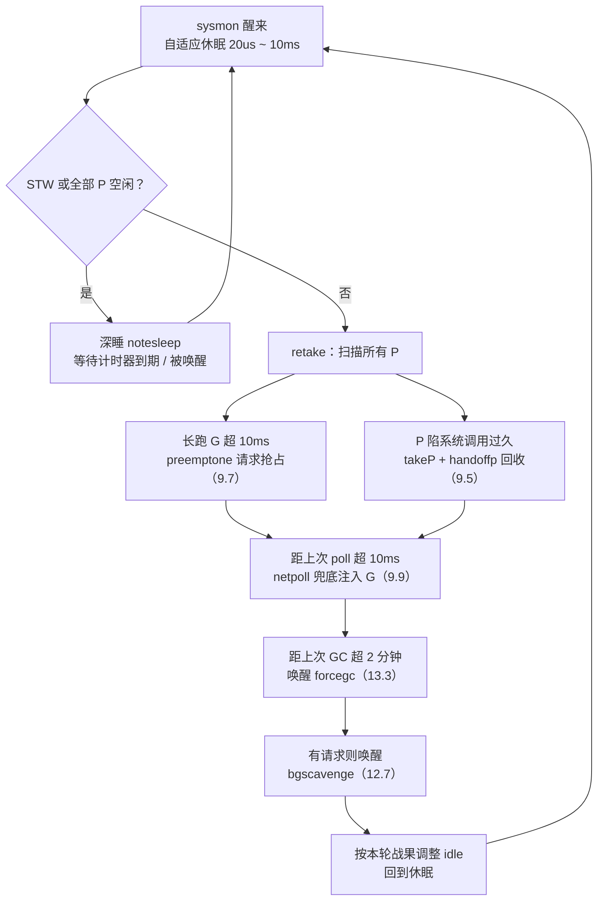

## 9.8 系统监控

调度器的常规路径已在9.4循环调度讲清楚：一个M绑定一个P，从队列里面取出Goroutine，运行，再取下一个。这条路径有一个前提，它本身得有机会跑起来。可一旦所有P都陷入长时间的系统调用，或者某个Goroutine
死循环占着P不放，常规调度便卡住了。没有谁来回抢P，也没有谁来poll网络。换句话说，协作式的，跑在P上的逻辑，管不了P本身都不动了这种局面。

Go的答案是在调度之外另设一条命脉。运行时启动时，main用newm拉起一个特殊的M，专门运行sysmon:

```go
func main() {
    // ...
    if haveSysmon {
        systemstack(func() {
            newm(sysmon, nil -1) // 一个不绑定P的特殊M
        })
    }
}
```

这个M的特殊之处在于它不持有P，也不进入常规调度。它靠运行时自带的通知机制（linux上是futex）睡眠与唤醒，不依赖调度器，因此即便所有P都被卡住，它照样醒来巡视一圈。这正是watchdog（看门狗）的设计：
把监督着放进被监控系统之外，它才看得见系统的停摆。

### 9.8.1 心跳：自适应的休眠节律

sysmon是一个永不退出的循环，每一轮醒来巡查各项职责，做完继续睡。它的难处在于睡多久。睡太久，抢占与网络轮询的相应就迟钝；睡太频，又在系统空闲白白烧CPU。sysmon用一套自适应退避调和这对矛盾：忙
时勤勉，空闲疏懒。

```go
// go:nowritbarrierrec
func sysmon() {
    lock(&sched.lock)
    sched.nmsys++ // 计入不参与死锁判定的系统M
    scheddead() // 启动时候就先作死锁检查，见 9.8.5
    unlock(&sched.lock)

    idle := 0 // 连续多少轮没能叫醒某人（抢占/注入G均落空）
    delay := uint32(0)
    for {
        if idle == 0 { // 起步睡20 us
            delay = 20
        } else if idle > 50 { // 空闲超过 1ms后，睡眠就翻倍
            delay *= 2
        }
        if delay > 10*1000 { // 封顶10ms
            delay = 10*1000
        }
        usleep(delay)
        // ... 巡查各项职责(见下文)...
    }
}
```

休眠从20us起步。只要每一轮有活干（抢占成功，或者往队列里面注入了G），idle归零，sysmon就维持在最小间隔，保持灵敏。若连续50余轮无所事事，它判定系统进入空闲，便让休眠时间成倍增长，直到10ms
封顶。区间`[20us, 10ms]`的两端各有讲究：下届要小到足以及时抢占（抢占阈值正是10ms,见9.8.2），上界要大到空闲时候几乎不耗电。

退避之上还有一层深睡。当正在STW,或者所有P都空闲（sched.npidle == gomaxprocs）时，没什么可监督的，sysmon索性notesleep睡到下一个计时器到期或者被显式唤醒为止，彻底让出CPU。唤醒若来自系统
系统调用返回，意味着来自系统返回，意味着应用又开始干活，于是把idle与delay复位回最灵敏的状态，赌一把刚从系统调用抢回P，很可能马上还要再抢。

### 9.8.2 retake:抢占与回收

醒来以后的头等大事是retake,它扫一遍所有P，对两类赖着不走的情形动手。这是syson作为抢占调度兜底的核心，把9.7协作式抢占管不到的死角补上。

第一类是长时间独占P的Goroutine。某个P再同一个schedtick上停留超过forcePreemtNS（10ms），说明它运行的Goroutine一直没让出，sysmon便对它发出抢占请求：

```go
const forcePreemptNS = 10 * 1000 * 1000 // 10ms，一个G再被抢占前可独占的时间片

func retake(now int64) uint32 {
    // ...遍历 allp ...
    if int64(pd.schedtick) != schedt {
        pd.schedtick = uint32(schedt) // schedtick 变了：说明发生调度，重新计时
        pd.schedwhen = now
    } else if pd.schedwhen+forcePreemptNS <= now {
        preemptone(pp) // 同一schedtick上停留10ms:请求抢占
        sysretake = true
    }
}
```

preemptone(见9.7)只是请求，真正的让出靠目标Goroutine自己配合，Go 1.14起则由信号抢占触发异步抢占。但该P正卡在系统调用里面，preemptone鞭长莫及，因为执行流根本不在Go代码里面，无人响应抢占。这
就引出第二类。

第二类是陷在系统调用里面的P。一个M进入系统调用以后，它持有的P处运行态却无人推进，若长期如此，这个P上排队的Goroutine与可窃取的任务就被白白冻结。sysmon把这块P夺回来，交给别的M去跑：

```go
// retake中处理陷于系统调用的P（裁剪）
thread, ok := setBlockOnExitSyscall(pp) // 拦住该线程，使其暂时无法退出系统调用
if !ok {
    goto done // 已经不在系统调用中，或者状态变了
}
// 队列空，且系统里面尚有自旋或者空闲的M兜底时，暂时不夺取
if runqempty(pp) && sched.nmspinning.Load()+sched.npidle.Load() > 0 &&
    pd.syscallwhen+10*1000*1000 > now {
        thread.resume()
        goto done
    }
thread.takeP() // 摘走P
thread.resume()
handoffp(pp) // 把P交给另外一个M
```

handoffp（见9.5线程管理）会为这块P找一个新M，或在确定无活可干时让它进入空闲。这里有处微妙的并发顾虑：动手前要先`incidlelocked(-1)`,假装多了一个运行中的M,否则被夺取的那个M一旦系统调用返回，
发现无事可做又无其他运行的M,会误报死锁。回收并非来者不拒：若P的本地队列为空，切系统里面尚有自旋或者空闲的M可以兜底，sysmon宁可放它一马，避免无谓的线程切换。

retake当轮有所斩获，便把idle归零，让sysmon保持灵敏；颗粒无收则idle++，向深睡靠拢。这一计数正是9.8.1那套退避的输入。

### 9.8.3 网络轮询的兜底

常规情况下，网络就绪时间由调度循环在找活时候顺手netpoll收取（见9.9网络轮询器）。可如果所有P都忙于计算，长时间没人去poll，已经就绪的网络Goroutine就会饿着。sysmon是这条路径的兜底：

```go
// 超过10ms没有poll过网络，就由sysmon兜底poll一次
lastpoll := sched.lastpoll.Load()
if netpollinited() && lastpoll != 0 && lastpoll+10*1000*1000 < now {
    sched.lastpoll.CompareAndSwap(lastpoll, now)
    list, delta := netpoll(0) // 非阻塞，返回就绪的G列表
    if !list.empty() {
        incidlelocked(-1)
        injectglist(&list) // 把就绪的G注入全局队列
        incidlelocked(1)
        netpollAdjustWaiters(delta)
    }
}
```

阈值同样是10ms:距上一次轮询超过这个间隔,sysmon便非阻塞地poll一次，把就绪的Goroutine注入队列。这保证了即便整个程序陷在计算密集型的循环里面，网络I/O的响应演出也有一个上限，不至于无限拖延。

### 9.8.4 强制GC与归还内存

两项与内存相关的职责也搭在sysmon这趟班车上。其一是强制GC。即便程序分配缓慢，迟迟够不到按照堆触发GC的阈值，运行时也不愿让上一轮GC后垃圾无限期滞留。sysmon每一次检查距上次GC是否已超过
forcegcperiod(默认2分钟)，是则唤醒那个常驻的forcegc Goroutine去发起一轮回收（触发逻辑见13.3）：

```go
if t := (gcTrigger{kind: gcTriggerTime, now: now}); t.test() && forcegc.idle.Load() {
    lock(&forcegc.lock)
    forcegc.idle.Store(false)
    var list gList
    list.push(forcegc.g)
    injectglist(&list) // 唤醒 forcegc goroutine，由它发起GC
    unlock(&forcegc.lock)
}
```

注意sysmon自己并不执行GC，它只是把`forcegc.g`注入队列，由常规调度去运行。原因正是本节开头的那条铁律：sysmon不持有P,不能有写屏障(`//go:nowritebarrierrec`),跑不了需要写屏障配合的GC代码。
它扮演的是只是定时闹钟。

其二是想操作系统归还空闲内存（scavenge,见12.7页面分配器）。这里有一处值得讲的演进。早期版本里头，sysmon会在循环体内直接清理一段时间未用的堆页。后来运行时把这项工作拆分给一个专门的后套
Goroutine gbscavenge，按内存压力自行调步，sysmon退到只在收到请求时候把它唤醒：

```go
if scavenger.sysmonWake.Load() != 0 {
    scavenger.wake() // 仅仅唤醒专职的bgscavenge goroutine
}
```

这条从内联执行到只管唤醒的迁移，是Go运行时反复出现的一个模式：把耗时且需要精细调步的活从sysmon这条公共命脉上剥离，交给独立Goroutine，sysmon只保留踢一脚的轻量职责。它让sysmon这趟班车始终跑的
快，不被任何单项任务拖慢。同期还出现了一项sysmonUpdateGPMAXPROCS，每秒至多一次，按容器的CPU配额动态调整GOMAXPROCS，同样知识探一下，调一下的轻活。

### 9.8.5 死锁检测

checked回答一个尖锐的问题：如果所有Goroutine都阻塞了，谁也无法推进，程序就报：`fatal error: all goroutine are asleep - deadlock!`而非静静挂死。它清点系统运行与阻塞的M，以及待处理的
计时器与网络等待，若发现无人可以被唤醒，便判定死锁。

值得澄清一个常见的误解：死锁检测并非sysmon每轮轮询的职责。checkdead主要在M停泊进入空闲等状态迁移点被调用，由最后一个睡下去的人顺手清点全场。sysmon只在启动时调用一次checkdead，作为整套机制
的一环参与其中（见16.1运行时死锁检查）。把它列在sysmon这一节，是因为sysmon这个系统M恰好要在nmsys里面登记自己，声明我不算进死锁判定的活口，否则它自身的存在就会让checkdead永远判不出死锁。

### 9.8.6 一张职责图与设计的归结



放进工业界的谱系看，在系统之外另设一根监督线程并非Go独创。HotSpot JVM有一条WatcherThread，周期性地驱动各类定时任务（采样，统计，超时回调）,与sysmon的心跳最为神似；而它的VMThread则专司
安全点与STW协调，更接近Go里发起STW的哪部分逻辑，而非sysmon。Linux内核也有两套看门狗:soft-lockup(watchdog/N，借助高精度计时器探测某个CPU是否长时间不响应调度)与hung-task（khungtaskd，
探测长期处于D状态的任务）。

sysmon与这些内核看门狗有一个关键分野：内核的lockup与hung-task看门狗只检测，只告警（打印栈，按配置panic）,它们诊断问题，却不修复问题。sysmon即监测又动手：它发现长跑的G久抢占，发现冻结的P
久回收转交，发现网络饿着就poll。这使它不只是一个被动的健康探测，而是一个主动兜底调度器，一个比典型监督线程更全面的变体。

这便是sysmon在整套调度设计里的位置。常规调度走的是协作式，低开销的快路径：让Goroutine在函数调用，channel操作等自然的让出点交给P，几乎不花额外代价。可纯协作式有它够不到的死角，死循环，阻塞的
系统调用，被忽略的网络，不在增长的堆。sysmon用一根独立的，不被任何P绑定的命脉，把这些死角逐一兜住，给协作式的廉价补上一层抢占式的保底，性能的好处从不白来：快路径之所以能做到这样轻，正因为sysmon
在慢路径上替它守住下限。
