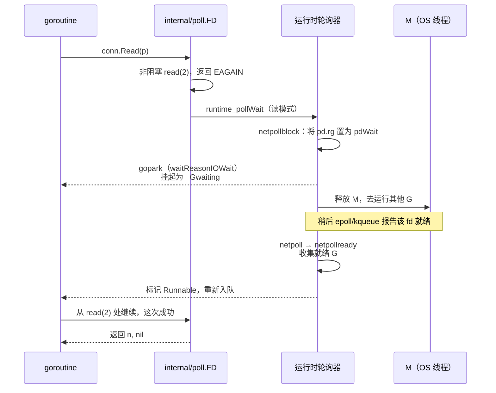
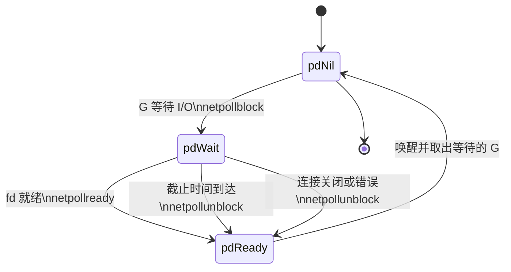

## 9.9 网络轮询器

> 源码事实核对自 src/runtime/netpoll.go以及各平台实现（netpoll_epoll.go, netpoll_kqueue.go等）与 src/internal/poll/fd_unix.go。

Go的网络代码看起来是阻塞式的：`conn.Read`会卡在哪里等数据。可如果它真可卡住了所在的操作系统线程,那么一万个等待网络的goroutine就占用一万个线程，9.1苦心经营的M:N模型瞬间崩溃。让阻塞式写法仍然
能规模化的，是网络轮询器（netpoller）。它背后是一段关于如何用少数线程照看海量连接的漫长历史，本节先把这段历史与它背后的设计轴讲清楚，再看Go如何把成熟的时间机制藏进运行时，让开发这些同步代码，
跑事件驱动I/O。

### 9.9.1 C10K与就绪通知的演化

2000年前后，Dan Kegel提出著名的C10K问题：一台服务器能否同时处理一万个并发连接？他的论点是当时的硬件其实够用，瓶颈在软件的I/O策略。最朴素的一连接一线程模型撑不住：每个线程预留以兆字节计的栈，
一万个线程就是数GB；加上内核在成千上万个线程间切换的开销，调度器很快不堪重负。出路是基于就绪的多路复用：让少数线程照看大量fd，只在某一个fd就绪时候才去动它。

就绪通知本身也经历了演化。把代价写成大O最能看清楚这条主线。设并发连接数为n,某一刻就绪的连接数为k（通常k < n）；

- `select/poll`:每次调用O(n)。调用方每次都要把整个fd集合交给内核，内核线程扫一遍标出就绪者，返回后调用方再扫描一遍找出它们。集合本身在用户态和内核态反复拷贝，连接一多，这种全量扫描与拷贝
  就成了瓶颈。
- epoll(Linux,Libenzi,开发版内核2.5.44/2022,稳定版2.6.0/2003)：兴趣集合通过epoll_ctl再内核里面登记一次并常驻，epoll_wait只返回就绪的那些fd,单次调用的代价是O（k）.

FreeBSD的kqueue（Lemon, USENIX FREENIX 2001）是同代的另一支，且更加通用：不止管socket,还能监听文件，进程，信号，计时器，把多类事件源统一在kevent一个接口下。Windows走的则是另一条
路线IOCP。这里还有一对要紧的区别。

- 水平触发（level-triggered）：只要fd上还有数据可读就持续报告，应用读多少行都可以。
- 边沿触发（edge-triggered）：只在由不就绪变为就绪的跳变时报告一次，应用必须把数据一口气读到EAGAIN，否则下次就绪通知不会再来，残留数据会被漏掉。

边沿触发减少了重复唤醒，代价是把读干净的责任压到应用身上。记住这对区别，下文会看到Go的一个反直觉选择正落在这里。

### 9.9.2 就绪还是完成：Reactor与Proactor

把上面这些排开，会看到一条根本的设计轴：

- 就绪模型（`select/poll`， epoll，kqueue）：内核说这个fd就绪了，由调用方作非阻塞`I/O`。
- 完成模型（Windows IOCP，Linux io_uring）：调用方说把这段`I/O`做了，完成时通知我，内核接管整个操作，调用方事先交出缓冲区，事后收割完成事件。

这正对软件设计里面的Reactor(Schmidt,PLoPD 1995)与Proactor两种模式：前者在同步时间解复用器(如epoll)之上分发就绪事件，由应用做I/O：后者在操作完成时候才分发结果。Linux的io_uring (Axboe
内核5.1/2019)时完成模型的现代代表，用一对共享内存的环形队列（提交队列SQ与完成队列CQ）批量提交，批量收割，把系统调用次数压到极低。

| 维度     | 就绪模型（Reactor）    | 完成模型（Proactor |
| -------- | ---------------------- | ------------------ |
| 内核告知 | 可以做I/O了            | I/O已经做完了      |
| 缓冲区   | 就绪后才交出，临时即可 | 提交时交出，需钉住 |
| 代表     | epoll, kqueue          | IOCP,io_uring      |
| 谁来拷贝 | 应用（一次非阻塞读写） | 内核               |

Go目前并不使用io_uring:它的Linux轮询器仍走epoll（见9.9.5），理由留到9.7.7的前一节。

### 9.9.3 Go的做法：把阻塞翻译成挂起

诀窍在于：对于用户呈现阻塞语义，对底层却用非阻塞I/O加事件通知。当一个goroutine在socket上读取而数据尚未到达时，运行时并不让线程干等，而是把fd设置为非阻塞，注册到事件通知机制，然后挂起
goroutine,把M解放出去运行别的G;等待事件机制通知机制报告该fd就绪，再把这个goroutine唤醒，让它从原地继续读。



落到运行时里面，`internal/poll.FD`时`net/os`是`net/os`与运行时轮询器之间的桥。`FD.Read`的核心是一个循环：先发非阻塞系统调用，遇到EAGAIN就去等就绪，醒来再continue重试：

```go
// internal/poll/fd_unix.go: FD.Read的设计骨架(裁剪)
func (fd *FD) Read(p []byte) (int, error) {
    // ...加读锁,准备pollDesc...
    for {
        n, err := ignoringEINTRIO(syscall.Read, fd.Sysfd, p)
        if err != nil {
            n = 0
            // 非阻塞读写数据，且该 fd由轮询器托管:去等就绪，醒来重试
            if err == syscall.EAGAIN && fd.pd.pollable() {
                if err == fd.pd.waitRead(fd.isFile); err != nil {
                    continue
                }
            }
        }
        return n,fd.eofError(n, err)
    }
}
```

waitRead经一层runtime_pollWait进入运行时netpollblock。这里有一处值得看清的设计：park之前先把信号量pd.rg从pdNil抢到pdwait，再在持锁复查错误状态后真正gopark,等待原因记为
waitReasonIOWait。这套先抢占，复查，再挂起的次序是为了不丢失与park并发到达的就绪通知：

```go
// runtime/netpoll.go: netpollblock的设计骨架(裁剪)
func netpollblock(pd *pollDesc, mode int32, waitio bool) bool {
    gpp := &pd.rg
    if mode == 'w' {
        gpp = &pd.wg
    }
    for {
        if gpp.CompareAndSwap(pdReady, pdNil) {
            return true // 通知已到，无需挂起
        }
        if gpp.CompareAndSwap(pdNil, pdWait) {
            break // 占位成功，准备挂起
        }
        // 否则状态被并发改动，重试
    }

    // 复查错误才真正让出,把G变为_Gwaiting, M随即被释放
    if waitio || netpollcheckerr(pd, mode) == pollNoError {
        gopark(netpollblockcommit, unsafe.Pointer(gpp), waitReasonIOWait, traceBlockNet, 5)
    }
    // ...醒来后清理信号量，返回是否真的就绪
}
```

fd就绪时，平台netpoll把内核事件翻译成读/写模式，调用netpollready把对应的等待着摘出来，串进一个gList返回给调度器重新注入运行队列(9.3,9.4)。于是，成千上万个阻塞再网络上的goroutine，实际
只消耗极少的线程，等待的成本落在了内核的事件表上。开发者写的同步代码，跑的是时间驱动的I/O。

### 9.9.4 pollDesc:每个fd的就绪状态机

把读写两端等待状态承载起来，是pollDesc：每个被轮询的fd对应一个，从专用的pollcache(一条fixalloc风格的自由表)里分配，不在GC堆上。它的设计相关字段是两组对称的读写状态：

```go
// runtime/netpoll.go: pollDesc的设计相关字段（裁剪）
type pollDesc struct {
    fd uintptr      // 关联的文件描述符，声明周期内恒定

    // rg,wg是两个信号量,分别park读者与写者goroutine
    // 取值：pdReady(就绪通知待领取)/pdWait(准备挂起)/G指针（已挂起）/pdNil
    rg atomic.Uintptr
    wg atomic.Uintptr

    lock mutex  // 保护以下字段
    rt timer    // 读截止计时器
    rd int64    // 读截止时间(未来某个nanotime,过期为-1)
    wt timer    // 写截止计时器
    wd int64    // 写截止时间
}
```

`rg/wg`是整套机制的枢纽，它们既是谁在等的记录（存G指针），也是是否已就绪的标志（pdReady）,还是park前占位(pdWait)。四个状态在读者，I/O通知，超时，关闭四方之间靠原子操作流转：



`rt/wt`这对计时器服务于截止时间。`setReadDeadline`把rd设到未来某刻并装好rt;到点时计时器回调走netpollunblock把等待者以超时错误唤醒。这正是SetDeadline（9.10）与轮询器的接缝：超时不是
另一套机制，而是复用同一个pollDesc上内嵌的读写计时器。
