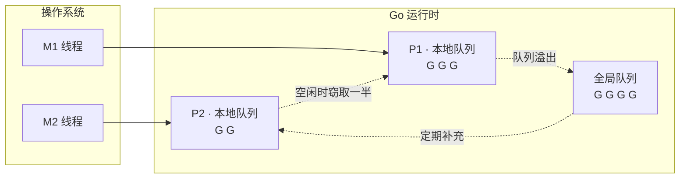
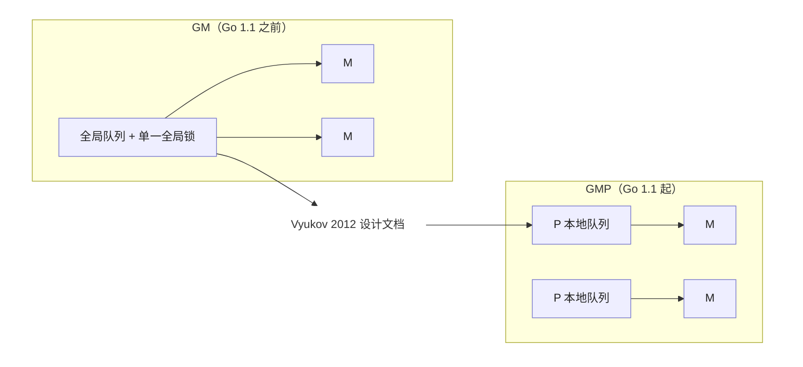

# 9 goroutine调度器

> 不要通过共享内存来通信，而是通过通信来共享内存
> Don't communicate by sharing memory, share memory by communicating

并发是Go最鲜明的标识，也是它最容易被误用的地方。这句广为流传的箴言点名了Go的取向：把同步的重担从程序员手中转移到由语言运行时的通道之上，让数据的所有权随之流动，而非散落在被锁守护的共享状态里面。
本部分自底向上展开这一图景：先剖析goroutine调度器如何在少量系统线程上复用海量协程，在深入通道与select的实现，看CSP模型如何落到具体的发送，接收与多路选择，最后回到sync包提供的传统同步原语
与常见的并发模式。唯有同时理解这两条路径，才能在真实工程里面判断如何该用通信，何时仍需共享。

Go语言调度器是笔者眼中整个运行时最迷人的组件了。对于Go自身而言，它的设计和实现直接牵动整个Go运行时的其他组件，是与用户态代码直接打交道的部分；对于Go用户而言，调度器将极其复杂的运行时机制藏在了
一个简单的关键字`go`之下。为了提高性能，调度器必须有效的利用计算的并行性与局部性原理；为了保障用户的简洁，调度器必须高效的对调度用户态不可见的网络轮循器，开机回收器进行调度；为了保证代码执行的正
确性，还必须严格的实现用户代码内存顺序等等。总而言之，调度器的设计直接决定了Go运行时源码的表现形式。

## 9.1 调度问题与GMP模型

写下`go func()`,一个goroutine就开始运行了。这行代码背后，是Go运行时最精巧的一台机器：调度器。它要回答一个并不简单的问题：成千上万个goroutine，如何在为数不多的几个CPU核心上轮转，即跑得快，
又让用户觉察不到它的存在。本节先把它要解决的问题，整体骨架，以及它在并发运行时这个大家庭里面的位置交代清楚，后面几节在深入每个部件。

### 9.1.1 三种线程模型，与一段历史

把并发任务映射到CPU执行资源上，历史上有三种模型，它们的取舍决定了一切。

- 1:1（内核线程）：每个用户线程对应一个操作系统线程。真并行，阻塞系统调用由内核透明处理，实现简单；代价是每次创建于切换都要陷入内核，每个线程都要预留以兆字节的栈。Linux的NPTL,现代Windows,
  Java的平台线程都走这条路。
- N:1(纯用户线程，即早期的绿色线程)：多个用户线程挤到一个操作系统线程上。切换极其廉价，栈极小；但是用不上多核，而且一次阻塞的系统调用会卡住全部线程，这是它的死穴。
- M:N(混合/两级):把M个用户线程多路复用到N个内核线程上。即廉价又能并行，代价是需要用户态与内核态两个调度器协作，这正是复杂的根源。

历史上这里有一个有意思的弯。1990年代，M:N一度被寄予厚望，最有影响的方案是Anderson等人的调度器激活（scheduler activations,SOSP 1991）：让内核在阻塞，就绪等时刻通知用户态调度器，使两个调度
器协同。但工业界最重大多退回到了1:1。Drepper与Molnar为Linux设计NPTL时（2005）把理由写的很直白：M:N需要两个调度器，若不协同则性能受损，而让它们可通所需引入内核基础设施的成本与维护代价都太
高，"不符合Linux内核理念"。于是Linux选了1:1。



Go偏偏又走回了M:N。它之所以能避开当年的坑，靠的是三件事，而这三件事都握在运行时自己手里：goroutine的栈很小且可增长（起步几KB），创建与切换都廉价；运行时掌握着所有会阻塞的点，能在阻塞前把执行
权让出：网络I/O由内置的网络轮询器接管，阻塞的goroutine会被挂起而不占用线程。当年杀死N:1的阻塞系统调用难题，Go是在运行时内部解决的，而不是去求内核提供激活机制。

### 9.1.2 GMP模型一览

下面这张可交互的示意图把GMP跑起来：每个P持有一条本地运行队列，M绑定P执行队首的G,当某个P的本地队列与全局队列都空时，它会从别的P偷走一半的工作。可以暂停，单步，或者手动`go func()`观察队列与窃取
的变化。

Go调度器围绕三个抽象展开，合成GMP.

- G（goroutine）：一段并发执行的用户代码，连同它的栈与执行现场。
- M (machine): 一个操作系统线程，真正在CPU上执行指令的实体。
- P (processor)：一个逻辑处理器，代表执行Go代码所需要的资源与许可。P的数量由GOMAXPROCS决定，默认等于可用的CPU核。

三者的关系一句话概括：M必须先拿到一个P,才能运行G。P的个数因此设定了同时执行Go代码的并行上限。每个P自带一条本地运行队列存放就绪的G,另有一个所有P共享的全局运行队列兜底。一次调度，简化来说就是一个
绑定了P的M。从队列里面取出一个G来运行，G让出或者被强占后再取一个；本地队列空了，就去别的地方找活儿，这边引出了工作窃取。

goroutine是有栈协程（stackful coroutine）：它有自己的栈，可以从任意嵌套的函数调用中挂起，也可以被抢占。这与下面要对比的无栈线路是一条根本的分界线。Go的栈早起用分段栈实现，自Go 1.3改为可增长的连续栈。

### 9.1.3 同一个问题的不同答案

“如何廉价地跑海量并发单元”是这一代运行时共同面对的问题，Go的GMP值时答案之一。横向看看别家的选择，更能看清GMP的定位。

- Erlang/EMAM:轻量进程各自独立堆，互不共享可变状态；调用器按规约计数（reduction,约等于调用次数）抢占，每个核一个调度器，各有运行队列，辅以进程迁移做负载均衡。它把隔离做到了极致。
- Java虚拟线程/Project Loom(JEP 444，Java 21,2023定稿)：虚拟线程时续体加调度器，挂载到平台"载体线程"上运行，阻塞时卸载，调度器时一个FIFO工作窃取的`ForkJoinPool`,并行度默认等于可用
  核心数。这本质就是M:N,正是当年Drepper为Linux否决，如今又在JVM里面返场的模型。
- `Rust async / .NET async`:走的是无栈（stackless）路线。 async fn被编译成状态机（Future），挂起状态存进一个枚举而非独立的栈，由运行时驱动。

这里点出来一条关键的设计轴：有栈 vs 无栈。Go的goroutine是有栈的，代价是每个都要一条（可增长的）栈，好处是能从任意深度挂起，并能被抢占。`Rust/.NET`的async是无栈的，省去了独立栈，挂起点
再编译期间固定，但是也因此只能协作式调度，一个不含`.await`的循环无法被运行时打断。Go选择有栈，换来的正是9.7那种连死循环都能抢占的能力。

### 9.1.4 P是怎么来的：从GM到GMP

P并非一开始就有。Go 1.1之前调度器只有G和M,所有就绪的G挂在一个全局队列上，由一把全局锁保护。2012年，Dmitry vyukov再`<<Scalable Go Scheduler Design Doc>>`中指出了这套GM调度器的四个
症结：

1. 单一全局锁于集中式状态，所有与goroutine相关的操作都要争这把锁；
2. M之间频繁交接G,破环局部性，增加切换开销；
3. 每个M都带着内存缓存（mcache）等资源，即便阻塞再系统调用，并不运行Go代码时也占着，既浪费内存又损坏局部性；
4. 系统调用导致线程频繁阻塞与唤醒。



引入P正是对症下药：本地队列让多数人入队出队不在争全局锁；把mcache一类资源移动到P上，份数就固定为`GOMACPROCS`，局部性也改善；M与P的解绑再绑定，让线程陷入系统调用时能把P交给M继续干活。这套GMP
调度器随Go 1.1（2013年5月）落地。一个值得一提的细节；Go 1.1的发布说明其实并没有正面描述这次调度器重写，只在性能一节提了一句“运行时与网络库紧的耦合减少了网络操作的上下文切换”，那其实是内置网络
轮询器落地的旁证。重大的内部变革，有时候就这样安静地发生。

`GOMAXPROCS`就是P的个数。它在Go 1.5起默认等于`runtime.NumCPU()`(此前末尾为1)；自Go 1.25起，运行时在带CPU限额的容器里面会把默认值取为min(CPU限额，核数)（限额为小数时向上取整）,并周期性
地动态调整，避免在被限额的容器里面取整机核数而过度并行。

### 9.1.5 一点调度理论

为什么没有完美的调度器？因为真实调度器是在线（online）的：它在不知道未来goroutine何时到来，何时阻塞的情况下当场决策。一个拥有全部未来信息的离线调度器总能做的更好，二者差距用竞争比
（competitive ratio,在线代码与离线最优代价之比的最坏值）来刻画。这给了我们一个赶紧的说法：运行时可以做到可证明地不错，但不可能最优。

那么工作窃取这种在线选择“不错”到什么程度？Blumofe与Leiserson(JACM 1999)证明，对一个总工作$T_1$,关键路径长度为$T_\infty$的计算，随机化工作窃取在P个处理器上的期望时间为
$\mathbb{E}[T_P] = \frac{T_1}{P} + O(T_\infty)$。$\frac{T_1}{P}$是理想的线性加速，$O(T_\infty)$是无法再并行的串行尾巴。这条界限是Go，GHC,Erlang，Loom不约而同地选择“每核一队列 +随机工作窃取“的理论底气，其完整的陈述，证明思路与适用边界，留到9.2详谈。

## 9.2 工作窃取式调度

9.1留下了一个小问题：每个P各有一条本地队列，活儿难免分不均，有的P忙不过来，有的P无所事事。如何在不引入中心瓶颈的前提下负载均摊，是并发调度的核心问题。Go的答案，是一个有着三十年理论积累，并
在整个工业界反复出现的设计：工作窃取（work stealing）。

本节会比别处走的更深一点：先讲清楚Go怎么做，再追到它背后的调度理论（为什么它可证明的好），然后横向看它在Cilk,Java,Rust等系统里面的不同化身，最后停在仍然开放的问题上。

### 9.2.1 共享还是窃取

把任务在处理器间挪动，历史上有两种规范。工作共享（work sharing）：谁生出新任务，就主动把一部分推给空闲的处理器。工作窃取(working stealing):空闲的处理器自己动手，去别人那里把任务偷过来。
差别在迁移的效率。工作共享只要有新任务就可能触发迁移；工作窃取只在某个处理器真的没活干才迁移，当所有处理器都忙，窃取者找不到下手的机会，迁移自然停止。负载越重，工作窃取反而越安静，这是它
相对工作共享的根本优势，也有严格的通信量界面支撑。

### 9.2.2 Go的找活顺序

一个绑定了P的M运行完手头的G后，并不直接去窃取，而是按一条由近到远，由廉价到昂贵的顺序搜索（运行时的findRunable）：

```go
// findRunable: M 找一个可运行的G（伪代码）
func findRunnable() *g {
    if pp.schedtick%61 == 0 !sched.runq.empty() { // 1. 每61次先看全局，保证公平
        if gp := globrunqget(); gp != nil { return gp }
    }
    if gp := rungget(pp); gp != nil { return gp } // 2. 本地队列(含 runnext)
    if gp := globrunqget(); gp != nil { return gp } // 3. 全局队列
    if gp := netpoll(); gp != nil { return gp } // 4. 网络轮询器
    if gp := stealWork(); gp != nil { return gp } // 5. 从其他P窃取一半
    stopm()     // 6. 实在蜜语，自旋或者修庙
}
```

三个让窃取高效的细节。本地队列有界：每个P是一个定长256的环形缓冲，绝大多数入队出队无锁；放满的时候把一半搬到全局队列（runqputslow）兜底。窃取目标随机且打散：若所有空闲P都从一起点按照固定顺序
去偷，会一窝蜂挤向同一目标。Go让每个窃取者以随机起点加上一个与P总数互质的随机步长，走出覆盖全部P的伪随机排列，互质量保证不重不漏，随机化避免羊群效应。自旋线程：允许少量M处于自旋态(上限
GOMAXPROCS,计于`sched.nmspinning`）主动找活儿而不立即休眠，新就绪的G能被迅速接住，免去频繁的线程休眠唤醒。

### 9.2.3 一点必要的模型

要讲清楚工作窃取好在哪，先要有一把尺子。把一段并行计算抽象成一张有向无环图（DAG)，每个节点是一条单位时间的指令，边是依赖关系。两个量刻画它：

- 总工作量 $T_1$：节点总数，即单处理器上运行时间；
- 关键路径长度(span)$T_\infty$:最长依赖的长度，即无穷多处理器下的运行时间。

二者之比 $\frac{T_1}{T_\infty}$ 称为并行度，它是可能获得的加速比上限。任何调度器在 $P$ 个处理器上的运行时间 $T_P$ 都不可能低于

$$
T_P \geq \max\left(\frac{T_1}{P},\ T_\infty\right)
$$

一个好的调度器，应当让 $T_P$ 尽量贴近这个下界。

### 9.2.4 为什么工作窃取可证明的好

贪心调度的上界。Graham(1969)证明，任何不让处理器无故空闲的贪心调度都不会差到哪里去：

$$
T_P
\leq
\frac{T_1-T_\infty}{P}+T_\infty
\leq
\frac{T_1}{P}+T_\infty
$$

暂时看不懂

## 9.3 MPG模型与并发调度单元

调度器要回答第一个问题不是怎么调度，而是调度什么。Go把这个被调度的对象叫做goroutine,并用一套M,P,G三元组承载它。在动手分析调度算法(9.4起)之前，本节先把这三个调度单元安顿好：goroutine
再计算机科学谱系里面究竟是什么，他的运行现场如何解码，为何调度本身要在一个特殊的g0上进行，一个goroutine的一生会经历哪些状态，以及承载它们的工作线程M如何被暂停与复始。读懂这几样东西，后面
的调度算法就只是在这些单元之间搬运G。

为避免回落逐字段翻译源码的窠臼，下文给出的结构体都是裁剪后的速写：只保留与设计相关的字段，并在注释里面说明它为何存在。完整定义对照`runtime/runtime2.go`与`runtime/proc.go`。

### 9.3.1 goroutine是什么：有栈协程

goroutine常备一句轻量级线程带过，这句话不错，却遮住了他真正的身世。把它放回计算机科学的谱系里，goroutine是一个有栈协程（stackful coroutine）。

协程的概念可以上溯到Conway 1963年提出的coroutine一词的设想：两段子程序互相喂对方的调用者，能在中途交出控制权，又能从交出处原样恢复，而非相普通函数那样必须执行到底才返回。Moura与
Lerusalimschy在2009年为协程做了一份清晰的分类，两条正交的轴至今仍是谈论协程的基本坐标：

- 对称（symmertric）与非对称(asymmertric)：对称协程之间地位平等，靠一个统一的transfer原语彼此跳转；非对称协程则有明确的调用者与被调用者，被调用者只让出（yield）回它的调用者。Go的用户
  看不到yield，但运行时内部goroutine与调度循环之间正是对称让出关系。
- 有栈（stackful）与无栈（stackless）：有栈协程拥有自己独立的调用栈，因此可以在任意深度的嵌套调用中挂起，挂起点不必是协程入口函数本身；无栈协程则没有独立栈，只能在顶层函数里面挂起，深层
  调用就得把整条调用协程状态机。

goroutine落在非对称有栈这一格。有栈这一点尤其关键，它意味着一个goroutine可以在任意函数，任意调用深度被挂起（无论是主动`<-ch`阻塞，还是被调度器抢占），挂起时整条Go调用栈连同其上的局部变量
原封不动地保留，复始时候从断点继续。用更理论的话说，一次挂起就是对当前执行的一次一次性定界延续（one-shot delimited continuation）捕获，而这份延续的无力状态，就是下一节要讲的gobuf：一组
保存下来的寄存器（SP,PC等）,足以让直行从断点恢复。

有栈换来的好处，是绕开了Nystrom 2015年所称的函数染色问题（the function-coloring problem）。再无栈协程的语言里面（典型如基于`async/await`的实现），一个函数若想在内部挂起，自己必须声明
为`async`，于是会挂起成函数的一种颜色，会沿着链上传染：调用`async`函数的函数往往也得是`async`,普通函数与`async`函数不能自由互换，标准库常要为两种颜色各备一份。有栈协程没有这道裂痕：任何
普通函数都能在任意深处挂起，无需特殊标注，调用方也无需知道。Go里面没有`async`关键字，没有异步函数与同步函数之分，正是有栈设计的直接红利。

### 9.3.2 三个调度单元: G,M,P

理解调度器，绕不开三个概念：

- G: goroutine,我们用go关键字创建的执行体，调度的基本对象；
- M: machine,即一个OS工作线程（worker thread），真正占用CPU执行指令实体；
- P: processor,一种人为抽象出来的，执行Go代码所需要局部资源。一个M只有关联上一个P，才能执行Go代码。

P的存在初看费解：既然M已是线程，为何还要在M于G之间插一层P？答案是要到工作窃取(9.5)才完整，这里先记住一句话：P是执行Go代码的许可证+一批本地资源，它的个数（`GOMAXPROCS`）决定了并行执行
用户代码的上界，而把本地运行队列，内存缓存等资源挂在P而非M上，是为了让这些资源许可证在线程转手，即支持工作窃取，又把锁挡灾快路径之外。

G: 执行体它的运行现场

G是goroutine，自然要靠自己的执行栈，以及一份断点快照用于挂起后恢复：

```go
// g: 一个goroutine的执行体（速写)
type g struct {
    stack       stack   // 栈内存区间[stack.io,stack.h]
    stackguard0 uintptr // 栈溢出检查的警戒线;置为 stackPreempt 即编程抢占信号
    sched       gobuf   // 运行现场：挂起时候即保存，复始时恢复的寄存器快照
    atomicstatus    uint32  // goroutine的状态(见9.3.4),须以原子的方式读写
    goid        uint64  // goroutine编号
    m           *m      // 当前运行g的M(为运行时候为nil)
    param       unsafe.Pointer  // 被唤醒时唤醒方传入的参数
    preempt     bool    // 抢占信号，stackguard0 = stackPreempt的一副本
    waitreason  waitReason // 处于 _Gwaiting时，记录因何阻塞（便于诊断）
}
```

其中sched这个gobuf就是9.3.1所说的延续物理状态：

```go
// gobuf: goroutine的运行现场，足以从断点恢复执行（速写）
type gobuf struct {
    sp uintptr  // 栈指针
    pc uintptr  // 程序计数器：下一条要执行的指令
    g guintptr  // 所属goroutine
    ctxt    unsafe.Pointer  // 闭包上下文（被当作GC根特殊处理）
    bp  uintptr // 帧指针（在启用 framepointer的架构上)
}
```

goroutine没有什么黑魔法：创建时候把要执行的函数入口存入`gobuf.pc`,参数拷贝到执行，挂起的时候把当前SP/PC等寄存器存回`gobuf`,复始时再把它们灌回真实寄存器，执行便从断点上接着走。
`atomicstatus`须原子访问，是因为它会被别的M（乃至GC，系统监控）并发读写。这正是9.3.4状态机存储载体。

M: OS线程实体

M对应一个真实的OS线程。它最紧要的几个字段，都围绕着一个线程要和执行Go代码需要随声带什么：

```go
// m: 一个OS工作线程（速写，原始结构有五十余字段)
type m struct {
    g0      *g      // 专用于执行调度，运行时代码的goroutine（见9.3.3）
    curg    *g      // 当前正在执行的用户goroutine
    p       *puintptr       // 当前关联的P(无P则不能执行Go代码)
    mcache  *mcache // 本线程的内存分配缓存（实际随P转手，见12.2）
    gsignal *g  // 专门用户处理信号的goroutine(见9.7)
    tls     [tlsSlots]uintptr   // 线程本地存储，存放当前g等
    spinning bool       // 是否处于自旋寻找工作的状态（见9.3.6）
    alllink *m      // 串入全局allm链表
}
```

每个M都持有两个特殊的goroutine:g0与gsignal，它们不执行用户代码，分别承担调度与信号处理，curg才是当前跑的用户goroutine。p是那张执行许可证：M失去P（如长时间陷入系统调用）便不能在执行Go代码。

P：执行Go代码的本地资源

P是处理器的抽象，而非处理器本身。它存在的全部意义，是把执行Go代码所需要的局部资源就近放在一起，从而让快路径无锁，并支撑工作窃取：

```go
// p: 执行Go代码所需要的本地资源（速写）
type p struct {
    id int32
    status uint32   // _Pidle / _Prunning / _Psyscall / _Pgcstop ...
    m muintptr  // 关联M(nil表示空闲)
    mcache *mcache // 每个P一份的内存分配缓存（无锁快路径，见12.2）

    // 本地可运行的队列：一个无锁环形缓冲+一个优先槽
    runqhead uint32
    runqtail uint32
    runq    [256]guintptr   // 本地 runnable G的环形队列，可无锁存取
    runnext guintptr    // 下一个就运行它的优先G:保护刚被唤醒的局部性

    gFree struct { // 本地P缓存的，已退出的dead G（连栈一起
        gList
        n int32
    }
}
```

P的核心是那条本地运行队列。`runq`是一个容量256的环形缓冲，持有P的M从队头取，放回队尾，因无人争用而能无锁存取；窃取（9.5）则发生在别的P来偷它的一半时。runnext时一个单槽优先位：当一个
goroutine唤醒另外一个（如cahnnel收发）,被唤醒者会放进runnext而非队尾，让它写一个就跑，以保持生产者与消费者之间的缓存局部性。gFree缓存已退出的G连同其栈，使下一次go能复用而免去重新分配，
正是9.3.4里——Gdead状态的归宿。把这些资源挂到P上，随着P在M间转手，是每个P无锁缓存这一招式在调度器里面体现，它与内存分配器的mcache，`sync.Pool`的每个P分片同出一脉。

### 9.3.3 为什么调度器跑在g0上

调度器本身也是代码，也要在某个栈上执行。如果让它直接跑在用户goroutine的栈上，会有麻烦：用户栈很小（初始2KB）且可能正待搬迁扩容，而调度，栈拷贝这类运行时操作恰恰不能在一个自己随时会被挪动
的栈上安全进行。Go的解法时给每个M配一个专用的g0:它的栈较大，固定不挪，运行时的调度循环，栈管理等关键操作都在g0上。

于是M在跑用户代码与跑调度代码之间反复换栈。两个运行时原语承担这次切换：

- mcall(fn):从当前用户goroutine切换到g0,在g0栈上执行fn,且fn不再返回g。 gopark, goschedImpl这类让出后由调度器接管的操作都经过g0。
- systemstack(fn): 临时切到g0栈执行fn,执行完切回原goroutine继续。需要更大栈或者不可被强占的运行时片段（如栈增长，部分GC工作）走它。

这样，执行用户代码与决定写一个执行谁被干净地分到两个栈上：用户goroutine只管跑业务，一旦要让出或者被调度，控制权进过mcall落到g0,由g0上的schedule()挑选下一个G并经execute -> gogo跳回去执行。
本节后面提到的状态切换，绝大多数都发生在这次切换到g0之后。

### 9.3.4 goroutine的生命周期状态机

一个goroutine的一生，是atomicstatus字段在若干状态转移。这些状态定义在`runtime/runtime2.go`，状态切换统一经由`casgstatus`（compare-and-swap g status）完成，以保证并发安全，主要
状态有这样几个：

- `_Gidle`: 刚分配，尚未初始化；
- `_Grunnable`:
