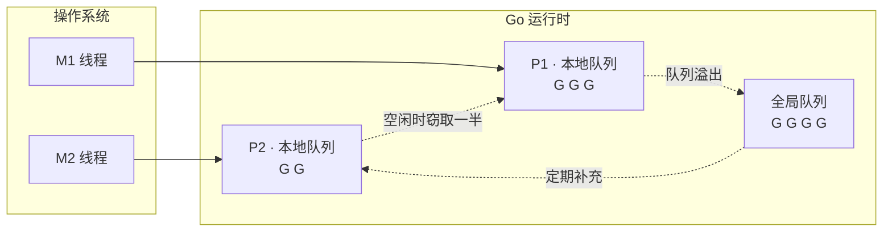
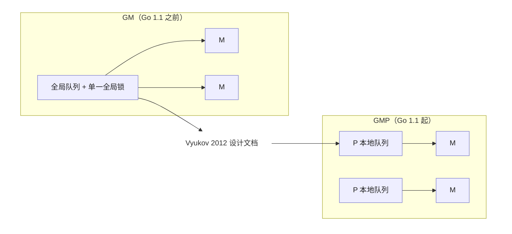
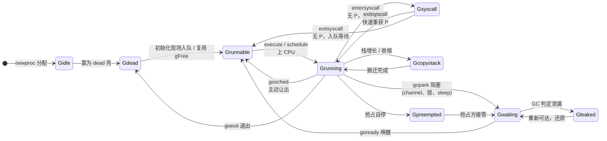
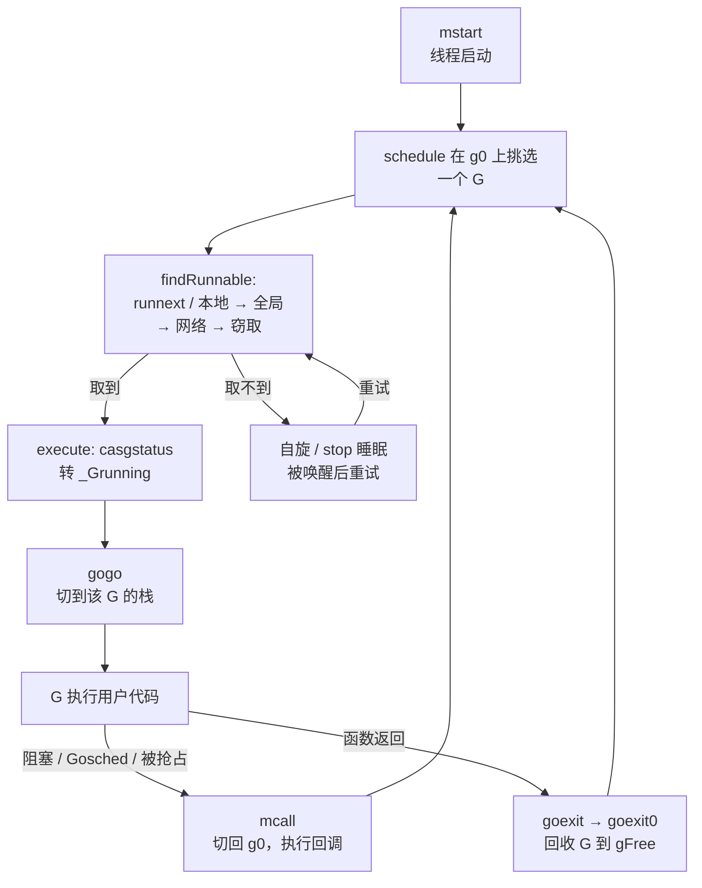
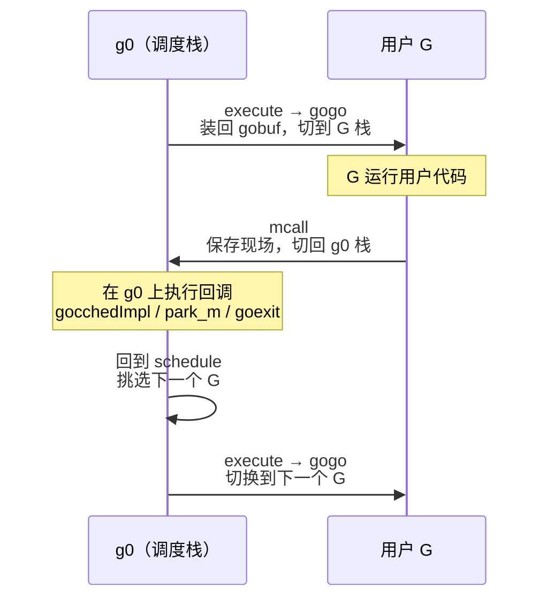
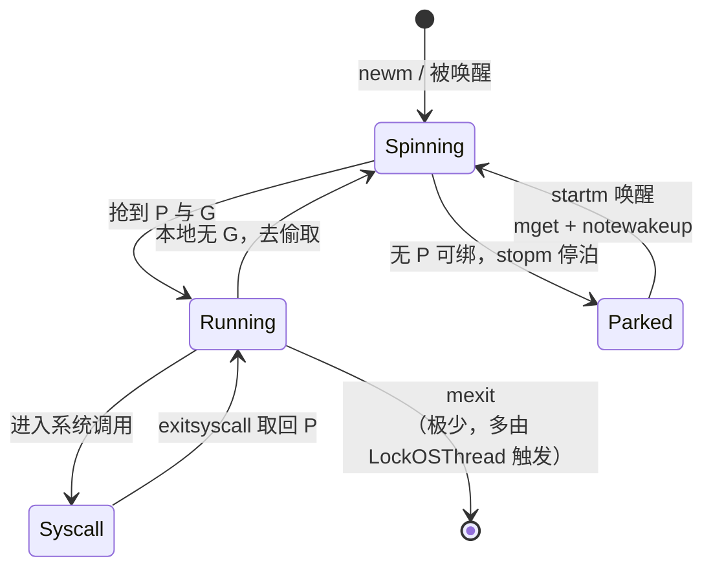
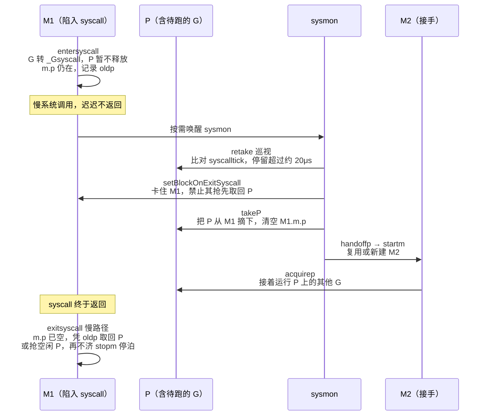

# 9 goroutine调度器

> 不要通过共享内存来通信，而是通过通信来共享内存
> Don't communicate by sharing memory, share memory by communicating

并发是Go最鲜明的标识，也是它最容易被误用的地方。这句广为流传的箴言点名了Go的取向：把同步的重担从程序员手中转移到由语言运行时的通道之上，让数据的所有权随之流动，而非散落在被锁守护的共享状态里面。
本部分自底向上展开这一图景：先剖析goroutine调度器如何在少量系统线程上复用海量协程，在深入通道与select的实现，看CSP模型如何落到具体的发送，接收与多路选择，最后回到sync包提供的传统同步原语
与常见的并发模式。唯有同时理解这两条路径，才能在真实工程里面判断如何该用通信，何时仍需共享。

Go语言调度器是笔者眼中整个运行时最迷人的组件了。对于Go自身而言，它的设计和实现直接牵动整个Go运行时的其他组件，是与用户态代码直接打交道的部分；对于Go用户而言，调度器将极其复杂的运行时机制藏在了
一个简单的关键字`go`之下。为了提高性能，调度器必须有效的利用计算的并行性与局部性原理；为了保障用户的简洁，调度器必须高效的对调度用户态不可见的网络轮循器，开机回收器进行调度；为了保证代码执行的正
确性，还必须严格的实现用户代码内存顺序等等。总而言之，调度器的设计直接决定了Go运行时源码的表现形式。

## 9.1 调度问题与GMP模型

写下`go func()`,一个goroutine就开始运行了。这行代码背后，是Go运行时最精巧的一台机器：调度器。它要回答一个并不简单的问题：成千上万个goroutine，如何在为数不多的几个CPU核心上轮转，即跑得快，
又让用户觉察不到它的存在。本节先把它要解决的问题，整体骨架，以及它在并发运行时这个大家庭里面的位置交代清楚，后面几节在深入每个部件。

### 9.1.1 三种线程模型，与一段历史

把并发任务映射到CPU执行资源上，历史上有三种模型，它们的取舍决定了一切。

- 1:1（内核线程）：每个用户线程对应一个操作系统线程。真并行，阻塞系统调用由内核透明处理，实现简单；代价是每次创建于切换都要陷入内核，每个线程都要预留以兆字节的栈。Linux的NPTL,现代Windows,
  Java的平台线程都走这条路。
- N:1(纯用户线程，即早期的绿色线程)：多个用户线程挤到一个操作系统线程上。切换极其廉价，栈极小；但是用不上多核，而且一次阻塞的系统调用会卡住全部线程，这是它的死穴。
- M:N(混合/两级):把M个用户线程多路复用到N个内核线程上。即廉价又能并行，代价是需要用户态与内核态两个调度器协作，这正是复杂的根源。

历史上这里有一个有意思的弯。1990年代，M:N一度被寄予厚望，最有影响的方案是Anderson等人的调度器激活（scheduler activations,SOSP 1991）：让内核在阻塞，就绪等时刻通知用户态调度器，使两个调度
器协同。但工业界最重大多退回到了1:1。Drepper与Molnar为Linux设计NPTL时（2005）把理由写的很直白：M:N需要两个调度器，若不协同则性能受损，而让它们可通所需引入内核基础设施的成本与维护代价都太
高，"不符合Linux内核理念"。于是Linux选了1:1。



Go偏偏又走回了M:N。它之所以能避开当年的坑，靠的是三件事，而这三件事都握在运行时自己手里：goroutine的栈很小且可增长（起步几KB），创建与切换都廉价；运行时掌握着所有会阻塞的点，能在阻塞前把执行
权让出：网络I/O由内置的网络轮询器接管，阻塞的goroutine会被挂起而不占用线程。当年杀死N:1的阻塞系统调用难题，Go是在运行时内部解决的，而不是去求内核提供激活机制。

### 9.1.2 GMP模型一览

下面这张可交互的示意图把GMP跑起来：每个P持有一条本地运行队列，M绑定P执行队首的G,当某个P的本地队列与全局队列都空时，它会从别的P偷走一半的工作。可以暂停，单步，或者手动`go func()`观察队列与窃取
的变化。

Go调度器围绕三个抽象展开，合成GMP.

- G（goroutine）：一段并发执行的用户代码，连同它的栈与执行现场。
- M (machine): 一个操作系统线程，真正在CPU上执行指令的实体。
- P (processor)：一个逻辑处理器，代表执行Go代码所需要的资源与许可。P的数量由GOMAXPROCS决定，默认等于可用的CPU核。

三者的关系一句话概括：M必须先拿到一个P,才能运行G。P的个数因此设定了同时执行Go代码的并行上限。每个P自带一条本地运行队列存放就绪的G,另有一个所有P共享的全局运行队列兜底。一次调度，简化来说就是一个
绑定了P的M。从队列里面取出一个G来运行，G让出或者被强占后再取一个；本地队列空了，就去别的地方找活儿，这边引出了工作窃取。

goroutine是有栈协程（stackful coroutine）：它有自己的栈，可以从任意嵌套的函数调用中挂起，也可以被抢占。这与下面要对比的无栈线路是一条根本的分界线。Go的栈早起用分段栈实现，自Go 1.3改为可增长的连续栈。

### 9.1.3 同一个问题的不同答案

“如何廉价地跑海量并发单元”是这一代运行时共同面对的问题，Go的GMP值时答案之一。横向看看别家的选择，更能看清GMP的定位。

- Erlang/EMAM:轻量进程各自独立堆，互不共享可变状态；调用器按规约计数（reduction,约等于调用次数）抢占，每个核一个调度器，各有运行队列，辅以进程迁移做负载均衡。它把隔离做到了极致。
- Java虚拟线程/Project Loom(JEP 444，Java 21,2023定稿)：虚拟线程时续体加调度器，挂载到平台"载体线程"上运行，阻塞时卸载，调度器时一个FIFO工作窃取的`ForkJoinPool`,并行度默认等于可用
  核心数。这本质就是M:N,正是当年Drepper为Linux否决，如今又在JVM里面返场的模型。
- `Rust async / .NET async`:走的是无栈（stackless）路线。 async fn被编译成状态机（Future），挂起状态存进一个枚举而非独立的栈，由运行时驱动。

这里点出来一条关键的设计轴：有栈 vs 无栈。Go的goroutine是有栈的，代价是每个都要一条（可增长的）栈，好处是能从任意深度挂起，并能被抢占。`Rust/.NET`的async是无栈的，省去了独立栈，挂起点
再编译期间固定，但是也因此只能协作式调度，一个不含`.await`的循环无法被运行时打断。Go选择有栈，换来的正是9.7那种连死循环都能抢占的能力。

### 9.1.4 P是怎么来的：从GM到GMP

P并非一开始就有。Go 1.1之前调度器只有G和M,所有就绪的G挂在一个全局队列上，由一把全局锁保护。2012年，Dmitry vyukov再`<<Scalable Go Scheduler Design Doc>>`中指出了这套GM调度器的四个
症结：

1. 单一全局锁于集中式状态，所有与goroutine相关的操作都要争这把锁；
2. M之间频繁交接G,破环局部性，增加切换开销；
3. 每个M都带着内存缓存（mcache）等资源，即便阻塞再系统调用，并不运行Go代码时也占着，既浪费内存又损坏局部性；
4. 系统调用导致线程频繁阻塞与唤醒。



引入P正是对症下药：本地队列让多数人入队出队不在争全局锁；把mcache一类资源移动到P上，份数就固定为`GOMACPROCS`，局部性也改善；M与P的解绑再绑定，让线程陷入系统调用时能把P交给M继续干活。这套GMP
调度器随Go 1.1（2013年5月）落地。一个值得一提的细节；Go 1.1的发布说明其实并没有正面描述这次调度器重写，只在性能一节提了一句“运行时与网络库紧的耦合减少了网络操作的上下文切换”，那其实是内置网络
轮询器落地的旁证。重大的内部变革，有时候就这样安静地发生。

`GOMAXPROCS`就是P的个数。它在Go 1.5起默认等于`runtime.NumCPU()`(此前末尾为1)；自Go 1.25起，运行时在带CPU限额的容器里面会把默认值取为min(CPU限额，核数)（限额为小数时向上取整）,并周期性
地动态调整，避免在被限额的容器里面取整机核数而过度并行。

### 9.1.5 一点调度理论

为什么没有完美的调度器？因为真实调度器是在线（online）的：它在不知道未来goroutine何时到来，何时阻塞的情况下当场决策。一个拥有全部未来信息的离线调度器总能做的更好，二者差距用竞争比
（competitive ratio,在线代码与离线最优代价之比的最坏值）来刻画。这给了我们一个赶紧的说法：运行时可以做到可证明地不错，但不可能最优。

那么工作窃取这种在线选择“不错”到什么程度？Blumofe与Leiserson(JACM 1999)证明，对一个总工作$T_1$,关键路径长度为$T_\infty$的计算，随机化工作窃取在P个处理器上的期望时间为
$\mathbb{E}[T_P] = \frac{T_1}{P} + O(T_\infty)$。$\frac{T_1}{P}$是理想的线性加速，$O(T_\infty)$是无法再并行的串行尾巴。这条界限是Go，GHC,Erlang，Loom不约而同地选择“每核一队列 +随机工作窃取“的理论底气，其完整的陈述，证明思路与适用边界，留到9.2详谈。

## 9.2 工作窃取式调度

9.1留下了一个小问题：每个P各有一条本地队列，活儿难免分不均，有的P忙不过来，有的P无所事事。如何在不引入中心瓶颈的前提下负载均摊，是并发调度的核心问题。Go的答案，是一个有着三十年理论积累，并
在整个工业界反复出现的设计：工作窃取（work stealing）。

本节会比别处走的更深一点：先讲清楚Go怎么做，再追到它背后的调度理论（为什么它可证明的好），然后横向看它在Cilk,Java,Rust等系统里面的不同化身，最后停在仍然开放的问题上。

### 9.2.1 共享还是窃取

把任务在处理器间挪动，历史上有两种规范。工作共享（work sharing）：谁生出新任务，就主动把一部分推给空闲的处理器。工作窃取(working stealing):空闲的处理器自己动手，去别人那里把任务偷过来。
差别在迁移的效率。工作共享只要有新任务就可能触发迁移；工作窃取只在某个处理器真的没活干才迁移，当所有处理器都忙，窃取者找不到下手的机会，迁移自然停止。负载越重，工作窃取反而越安静，这是它
相对工作共享的根本优势，也有严格的通信量界面支撑。

### 9.2.2 Go的找活顺序

一个绑定了P的M运行完手头的G后，并不直接去窃取，而是按一条由近到远，由廉价到昂贵的顺序搜索（运行时的findRunable）：

```go
// findRunable: M 找一个可运行的G（伪代码）
func findRunnable() *g {
    if pp.schedtick%61 == 0 !sched.runq.empty() { // 1. 每61次先看全局，保证公平
        if gp := globrunqget(); gp != nil { return gp }
    }
    if gp := rungget(pp); gp != nil { return gp } // 2. 本地队列(含 runnext)
    if gp := globrunqget(); gp != nil { return gp } // 3. 全局队列
    if gp := netpoll(); gp != nil { return gp } // 4. 网络轮询器
    if gp := stealWork(); gp != nil { return gp } // 5. 从其他P窃取一半
    stopm()     // 6. 实在蜜语，自旋或者修庙
}
```

三个让窃取高效的细节。本地队列有界：每个P是一个定长256的环形缓冲，绝大多数入队出队无锁；放满的时候把一半搬到全局队列（runqputslow）兜底。窃取目标随机且打散：若所有空闲P都从一起点按照固定顺序
去偷，会一窝蜂挤向同一目标。Go让每个窃取者以随机起点加上一个与P总数互质的随机步长，走出覆盖全部P的伪随机排列，互质量保证不重不漏，随机化避免羊群效应。自旋线程：允许少量M处于自旋态(上限
GOMAXPROCS,计于`sched.nmspinning`）主动找活儿而不立即休眠，新就绪的G能被迅速接住，免去频繁的线程休眠唤醒。

### 9.2.3 一点必要的模型

要讲清楚工作窃取好在哪，先要有一把尺子。把一段并行计算抽象成一张有向无环图（DAG)，每个节点是一条单位时间的指令，边是依赖关系。两个量刻画它：

- 总工作量 $T_1$：节点总数，即单处理器上运行时间；
- 关键路径长度(span)$T_\infty$:最长依赖的长度，即无穷多处理器下的运行时间。

二者之比 $\frac{T_1}{T_\infty}$ 称为并行度，它是可能获得的加速比上限。任何调度器在 $P$ 个处理器上的运行时间 $T_P$ 都不可能低于

$$
T_P \geq \max\left(\frac{T_1}{P},\ T_\infty\right)
$$

一个好的调度器，应当让 $T_P$ 尽量贴近这个下界。

### 9.2.4 为什么工作窃取可证明的好

贪心调度的上界。Graham(1969)证明，任何不让处理器无故空闲的贪心调度都不会差到哪里去：

$$
T_P
\leq
\frac{T_1-T_\infty}{P}+T_\infty
\leq
\frac{T_1}{P}+T_\infty
$$

暂时看不懂

## 9.3 MPG模型与并发调度单元

调度器要回答第一个问题不是怎么调度，而是调度什么。Go把这个被调度的对象叫做goroutine,并用一套M,P,G三元组承载它。在动手分析调度算法(9.4起)之前，本节先把这三个调度单元安顿好：goroutine
再计算机科学谱系里面究竟是什么，他的运行现场如何解码，为何调度本身要在一个特殊的g0上进行，一个goroutine的一生会经历哪些状态，以及承载它们的工作线程M如何被暂停与复始。读懂这几样东西，后面
的调度算法就只是在这些单元之间搬运G。

为避免回落逐字段翻译源码的窠臼，下文给出的结构体都是裁剪后的速写：只保留与设计相关的字段，并在注释里面说明它为何存在。完整定义对照`runtime/runtime2.go`与`runtime/proc.go`。

### 9.3.1 goroutine是什么：有栈协程

goroutine常备一句轻量级线程带过，这句话不错，却遮住了他真正的身世。把它放回计算机科学的谱系里，goroutine是一个有栈协程（stackful coroutine）。

协程的概念可以上溯到Conway 1963年提出的coroutine一词的设想：两段子程序互相喂对方的调用者，能在中途交出控制权，又能从交出处原样恢复，而非相普通函数那样必须执行到底才返回。Moura与
Lerusalimschy在2009年为协程做了一份清晰的分类，两条正交的轴至今仍是谈论协程的基本坐标：

- 对称（symmertric）与非对称(asymmertric)：对称协程之间地位平等，靠一个统一的transfer原语彼此跳转；非对称协程则有明确的调用者与被调用者，被调用者只让出（yield）回它的调用者。Go的用户
  看不到yield，但运行时内部goroutine与调度循环之间正是对称让出关系。
- 有栈（stackful）与无栈（stackless）：有栈协程拥有自己独立的调用栈，因此可以在任意深度的嵌套调用中挂起，挂起点不必是协程入口函数本身；无栈协程则没有独立栈，只能在顶层函数里面挂起，深层
  调用就得把整条调用协程状态机。

goroutine落在非对称有栈这一格。有栈这一点尤其关键，它意味着一个goroutine可以在任意函数，任意调用深度被挂起（无论是主动`<-ch`阻塞，还是被调度器抢占），挂起时整条Go调用栈连同其上的局部变量
原封不动地保留，复始时候从断点继续。用更理论的话说，一次挂起就是对当前执行的一次一次性定界延续（one-shot delimited continuation）捕获，而这份延续的无力状态，就是下一节要讲的gobuf：一组
保存下来的寄存器（SP,PC等）,足以让直行从断点恢复。

有栈换来的好处，是绕开了Nystrom 2015年所称的函数染色问题（the function-coloring problem）。再无栈协程的语言里面（典型如基于`async/await`的实现），一个函数若想在内部挂起，自己必须声明
为`async`，于是会挂起成函数的一种颜色，会沿着链上传染：调用`async`函数的函数往往也得是`async`,普通函数与`async`函数不能自由互换，标准库常要为两种颜色各备一份。有栈协程没有这道裂痕：任何
普通函数都能在任意深处挂起，无需特殊标注，调用方也无需知道。Go里面没有`async`关键字，没有异步函数与同步函数之分，正是有栈设计的直接红利。

### 9.3.2 三个调度单元: G,M,P

理解调度器，绕不开三个概念：

- G: goroutine,我们用go关键字创建的执行体，调度的基本对象；
- M: machine,即一个OS工作线程（worker thread），真正占用CPU执行指令实体；
- P: processor,一种人为抽象出来的，执行Go代码所需要局部资源。一个M只有关联上一个P，才能执行Go代码。

P的存在初看费解：既然M已是线程，为何还要在M于G之间插一层P？答案是要到工作窃取(9.5)才完整，这里先记住一句话：P是执行Go代码的许可证+一批本地资源，它的个数（`GOMAXPROCS`）决定了并行执行
用户代码的上界，而把本地运行队列，内存缓存等资源挂在P而非M上，是为了让这些资源许可证在线程转手，即支持工作窃取，又把锁挡灾快路径之外。

G: 执行体它的运行现场

G是goroutine，自然要靠自己的执行栈，以及一份断点快照用于挂起后恢复：

```go
// g: 一个goroutine的执行体（速写)
type g struct {
    stack       stack   // 栈内存区间[stack.io,stack.h]
    stackguard0 uintptr // 栈溢出检查的警戒线;置为 stackPreempt 即编程抢占信号
    sched       gobuf   // 运行现场：挂起时候即保存，复始时恢复的寄存器快照
    atomicstatus    uint32  // goroutine的状态(见9.3.4),须以原子的方式读写
    goid        uint64  // goroutine编号
    m           *m      // 当前运行g的M(为运行时候为nil)
    param       unsafe.Pointer  // 被唤醒时唤醒方传入的参数
    preempt     bool    // 抢占信号，stackguard0 = stackPreempt的一副本
    waitreason  waitReason // 处于 _Gwaiting时，记录因何阻塞（便于诊断）
}
```

其中sched这个gobuf就是9.3.1所说的延续物理状态：

```go
// gobuf: goroutine的运行现场，足以从断点恢复执行（速写）
type gobuf struct {
    sp uintptr  // 栈指针
    pc uintptr  // 程序计数器：下一条要执行的指令
    g guintptr  // 所属goroutine
    ctxt    unsafe.Pointer  // 闭包上下文（被当作GC根特殊处理）
    bp  uintptr // 帧指针（在启用 framepointer的架构上)
}
```

goroutine没有什么黑魔法：创建时候把要执行的函数入口存入`gobuf.pc`,参数拷贝到执行，挂起的时候把当前SP/PC等寄存器存回`gobuf`,复始时再把它们灌回真实寄存器，执行便从断点上接着走。
`atomicstatus`须原子访问，是因为它会被别的M（乃至GC，系统监控）并发读写。这正是9.3.4状态机存储载体。

M: OS线程实体

M对应一个真实的OS线程。它最紧要的几个字段，都围绕着一个线程要和执行Go代码需要随声带什么：

```go
// m: 一个OS工作线程（速写，原始结构有五十余字段)
type m struct {
    g0      *g      // 专用于执行调度，运行时代码的goroutine（见9.3.3）
    curg    *g      // 当前正在执行的用户goroutine
    p       *puintptr       // 当前关联的P(无P则不能执行Go代码)
    mcache  *mcache // 本线程的内存分配缓存（实际随P转手，见12.2）
    gsignal *g  // 专门用户处理信号的goroutine(见9.7)
    tls     [tlsSlots]uintptr   // 线程本地存储，存放当前g等
    spinning bool       // 是否处于自旋寻找工作的状态（见9.3.6）
    alllink *m      // 串入全局allm链表
}
```

每个M都持有两个特殊的goroutine:g0与gsignal，它们不执行用户代码，分别承担调度与信号处理，curg才是当前跑的用户goroutine。p是那张执行许可证：M失去P（如长时间陷入系统调用）便不能在执行Go代码。

P：执行Go代码的本地资源

P是处理器的抽象，而非处理器本身。它存在的全部意义，是把执行Go代码所需要的局部资源就近放在一起，从而让快路径无锁，并支撑工作窃取：

```go
// p: 执行Go代码所需要的本地资源（速写）
type p struct {
    id int32
    status uint32   // _Pidle / _Prunning / _Psyscall / _Pgcstop ...
    m muintptr  // 关联M(nil表示空闲)
    mcache *mcache // 每个P一份的内存分配缓存（无锁快路径，见12.2）

    // 本地可运行的队列：一个无锁环形缓冲+一个优先槽
    runqhead uint32
    runqtail uint32
    runq    [256]guintptr   // 本地 runnable G的环形队列，可无锁存取
    runnext guintptr    // 下一个就运行它的优先G:保护刚被唤醒的局部性

    gFree struct { // 本地P缓存的，已退出的dead G（连栈一起
        gList
        n int32
    }
}
```

P的核心是那条本地运行队列。`runq`是一个容量256的环形缓冲，持有P的M从队头取，放回队尾，因无人争用而能无锁存取；窃取（9.5）则发生在别的P来偷它的一半时。runnext时一个单槽优先位：当一个
goroutine唤醒另外一个（如cahnnel收发）,被唤醒者会放进runnext而非队尾，让它写一个就跑，以保持生产者与消费者之间的缓存局部性。gFree缓存已退出的G连同其栈，使下一次go能复用而免去重新分配，
正是9.3.4里——Gdead状态的归宿。把这些资源挂到P上，随着P在M间转手，是每个P无锁缓存这一招式在调度器里面体现，它与内存分配器的mcache，`sync.Pool`的每个P分片同出一脉。

### 9.3.3 为什么调度器跑在g0上

调度器本身也是代码，也要在某个栈上执行。如果让它直接跑在用户goroutine的栈上，会有麻烦：用户栈很小（初始2KB）且可能正待搬迁扩容，而调度，栈拷贝这类运行时操作恰恰不能在一个自己随时会被挪动
的栈上安全进行。Go的解法时给每个M配一个专用的g0:它的栈较大，固定不挪，运行时的调度循环，栈管理等关键操作都在g0上。

于是M在跑用户代码与跑调度代码之间反复换栈。两个运行时原语承担这次切换：

- mcall(fn):从当前用户goroutine切换到g0,在g0栈上执行fn,且fn不再返回g。 gopark, goschedImpl这类让出后由调度器接管的操作都经过g0。
- systemstack(fn): 临时切到g0栈执行fn,执行完切回原goroutine继续。需要更大栈或者不可被强占的运行时片段（如栈增长，部分GC工作）走它。

这样，执行用户代码与决定写一个执行谁被干净地分到两个栈上：用户goroutine只管跑业务，一旦要让出或者被调度，控制权进过mcall落到g0,由g0上的schedule()挑选下一个G并经execute -> gogo跳回去执行。
本节后面提到的状态切换，绝大多数都发生在这次切换到g0之后。

### 9.3.4 goroutine的生命周期状态机

一个goroutine的一生，是atomicstatus字段在若干状态转移。这些状态定义在`runtime/runtime2.go`，状态切换统一经由`casgstatus`（compare-and-swap g status）完成，以保证并发安全，主要
状态有这样几个：

- `_Gidle`: 刚分配，尚未初始化；
- `_Grunnable`: 在某个队列里面，等待被调度，尚未执行；
- `_Grunning`: 正在某个M上执行用户代码，已绑定M与P;
- `_Gsyscall`: 正在执行系统调用，尚未执行用户代码；
- `_Gwaiting`: 阻塞运行时(如channel收发，`time.Sleep`，加锁)，不再运行队列上，需要显式唤醒
- `Gdead`: 未被使用，可能是刚推出，也可能是待复用的空壳，缓存在`p.gFree / sched.gFree`;
- `_Gcopystack`: 栈正在被搬迁，形似`_Gwaiting`， 但等待强占方负责把它转回`_Gwaitting`;
- `_Gpreempted`: 因强占而自行停下，形似`_Gwaiting`, 但等待强占负责把它转回`_Gwaitting`;

go1.26在此之上新增加了一个诊断状态`_Gleaked`（值10）。它不是声明周期的常规一环，而是GC给疑似的阻塞goroutine打的一个标记：GC扫描时候若发现某个`_Gwaiting`的goroutine已无法再被唤醒（
不可达），便经`casgstatus(gp, _Gwaiting, _Gleaked)`将其标记为泄漏(`runtime/mgc.go`)；若它后来又变回可达，再经过`casgstatus(gp0,_Gleaked,_Gwaiting)`还原。它是覆盖在阻塞之上
的一层诊断试图，运行时并不会就此回收该goroutine.

驱动这些迁移的，是一组我们会反复遇到的运行时函数：`newproc`创建新G，`execute`上CPU,`gopark`主动阻塞，`goready`唤醒，`entersyscall/exitsyscall`退出系统调用，`goexit`退出。把它们
标在边上，goroutine的一生如下：



新建一个goroutine的过程，正是这种图最初的几步：`newproc`先把G由`_Gidle`置为`_Gdead`并挂入`allg`（让GC知道但不扫描为初始化的栈），随后根据函数入口参数初始化执行与`gobuf`，再
`casgstatus`为`_Grunnable`入队，等待`execute`把它推上CPU。状态还有一个与GC协作的`_Gscan`位族（如`_Gscanrunning`）,用于在不打断goroutine的前提下扫描其栈，为保持图的可读
我们略去。细节见13垃圾回收。

### 9.3.5 横向对照：别家的并发执行体

把goroutine放回到同辈中看，9.3.1那套`有栈/无栈`的分类立刻显示出分量。下表对照集中语言的并发执行体，关键在于它们是否有独立栈，以及由此决定有没有函数热色问题：

| 系统                         | 有栈？       | 表示形态                                 | 起步开销                      |
| ---------------------------- | ------------ | ---------------------------------------- | ----------------------------- |
| Go goroutine                 | 是           | 独立栈+gobuf延续，连续栈按需增长         | 处始栈2KB                     |
| `Erlang/BEAM`进程            | 是           | 独立轻量进程，私有堆，调度于BEAM之上     | 数百字节量级                  |
| Java虚拟线程（Loom,JEP 444） | 是           | 延续挂到载体线程（carrier）执行          | 按需要增长，远小于平台栈      |
| Lua协程                      | 是（非对称） | 独立栈，`coroutine.resume/yield`显式让出 | 轻量,由解析器管理             |
| Kotlin协程                   | 否           | suspend编译为CPS状态机，无独立栈         | 极小(仅状态对象),但有函数染色 |

值得点出的是分类列。Go,Erlang,Java虚拟线程，Lua协程都是有栈的，因而没有函数染色问题：任意深度的调用都能挂起。Kotlin协程是无栈的，编译器把`suspend`函数翻成延续传递风格(CPS)的状态机，
代价是`suspend`这种颜色会沿着调用链传染，正是9.3.1所说的Go用有栈设计避开的那道裂痕。Lua协程尤其值得一提：Moura与Ierusalimschy 2009年那篇奠定协程分类的论文，本就源自Lua的协程设计，
goroutine的非对称有栈血统与它一脉相承，值时Go把显式的`resume/yield`藏进了运行时，让用户只看见go与channel。

### 9.3.6 工作线程的暂停与复始

最后回到承载G的工作线程M。调度器只要在两条相互拉扯的诉求间权衡：既要保持足够多的运行线程以吃满硬件并行度，又要暂止多余的线程以省下CPU能耗。用抽屉原理可以把这对张力说清楚：设进程中有n个M,
用户创建了p个G，则当p > n时，必有 p - n个G暂时无M可跑（需要更多线程，即复始/unpack）；当p < n时，必有n - p个M无G可跑。（应当休眠，即暂止/park）。

求这个权衡的最优解很难，难在两处。其一,多个M各持本地队列，彼此看不到对方的状态，这本质上是一个分布式系统：没有一个让所有线程同步的全局时钟，要在不加屏障的快路径上算出全局是否还有空闲工作。
这样的全局谓词，按共识理论是做不到的。其二，最优的暂止决策需要未来信息：理想情况下，若知道协一刻有新的G就绪，就不该让现在去暂停一个M。但G合适就绪是随机的（设想一个Web服务，请求到达即创建
G），无法预知。

Go的解法是引入工作线程的自旋(spinning)状态：一个本地队列，全局队列，网络轮询器中都找不到工作的M，不能立刻睡去，而是先短暂自旋寻找工作。其要点是：

1. 唤醒一个G时，先看是否已有自旋线程（`sched.nmspinning`），若不在有就额外复始新线程，让那个正在找活的线程接住即可；
2. 仅当存在空闲P，且没有任何自旋线程时候，就绪一个G才复始一个新线程；
3. 最后一个自旋线程找到工作，转为非自旋的时候，再复始一个新线程顶上；

这套规则消除了不合理的线程复始尖峰，又保住了CPU并行度的上限。可以把它想象成银行服务台：身手敏捷的顾客（自旋的M）随时 奔向任何空出来的窗口（待运行的G），只有当所有人就位，却仍有窗口空着时候，
才请一个新顾客进场。

实现的微妙之处全在自旋和非自旋的状态切换必须无缝衔接，否则就会在提交新G与线程转为非自旋之间撞出竞争，最终双方都以为对方会处理，结果谁都没处理，留下CPU利用不足的尾巴。为此两侧都要插入一道
`StoreLoad`风格的屏障：就绪一个G的时候，先把G入本地队列，再屏障，再检查`nmspinning`；线程转非自旋的时候，先减`nmspinning`，再屏障，再回扫所有本地队列确认确无遗漏的工作。两道屏障的
检查彼此交叉，保证不会有刚提交的G无人认领的窗口。值得一提的是，这套复始逻辑只对每个P的内地队列适用，想全局队列提交工作的时候不会出发线程复始.

至此，三个调度单元与承载它们的线程都已经就位：G是被调度的有栈线程，M是出力的线程，P是连接二者，携带本地资源的许可证。它们如何在每一次调度循环里协同运转，是9.4调度循环与9.5工作窃取的主题。

## 9.4 调度循环

前面几节备齐了材料:知道了G, M, P是什么(9.3)。知道了一个M怎么找活儿（9.2）。这一节把它们真正转起来，看调度循环如何在一个线程上一刻不停地挑选并运行goroutine，以及它如何在让当个goroutine跑
得久一点（吞吐与局部性）与别让任何goroutine饿死直接拿捏分寸。

下文的代码一律是裁剪后的速写，只保留与设计相关的骨架，去掉GC，tracing, profiling,锁定线程等旁支。完整定义可对照`runtime/proc.go`，下文涉及的版本均为go1.26。

### 9.4.1 一个用不返回的循环

Go的调度是协作式，运行到让出（run-to-yield）的：一个goroutine一旦被选中，就一直跑到它主动让出，阻塞，或者被抢占为止，而不像内核那样被时钟中断按固定时间片走。每个工作线程从mstart启动后，
最终进入调度循环`schedule`，此后在其中周而复始，指导线程退出。骨架剥到最简,就是一个两步循环：

```go
// 每个M的调度循环（速写）：运行在系统栈g0上，用不返回
func schedule() {
    // 找一个可运行的G(见9.2的完整顺序)；找不到就阻塞在findRunable内，直到有活儿
    gp, inheritTime, _ := findRunnable()

    // 切换到gp的栈开始执行。控制权要再回到这里，靠的是下面的mcall,而非函数返回
    execute(gp, inheritTime)
}
```

`findRunnable`用不返回nil:取不到活儿，它会让M转入自旋或者休眠，阻塞在内部知道被唤醒，因此`schedule`不必处理无事可做的分支。而`execute`也用不返回，它跳进用户G的栈，此后`schedule`这
一帧的栈空间就被复用额。控制权要回到调度逻辑，靠的是9.4.2的栈切换。



`schedule`与`findRunnable`这些调度跑在M的专用系统栈上g0上（9.3）,不在用户G的栈上。这些带来清晰的分工：`g0`负责调度，用户G负责干活。也因为如此，`schedule`从不真正返回，它选中一个G，跳
过去执行，控制权要回到调度逻辑，靠的是下一节的栈切换，而非函数返回。

### 9.4.2 两次切换：execute与mcall

调序循环里面有两个方向相反的栈切换，他们合起来构成9.3那种goroutine状态机的物理实现：状态机说会发生哪些迁移，这两个例程说迁移回符合发生。

从g0跳到用户G：schedule选出G后调用execute。它先把G切回到`_Grunning`，绑定当前M,再调用汇编例程`gogo`，由后者把G保存现场（9.3的gobuf：sp,pc,bp等）装回寄存器，控制权便落到用户G的栈上，
从它上次被切下处继续。

```go
// 在当前M上执行gp(速写)
func execute(gp *g, inheritTime bool) {
    mp := getg().m

    mp.curg = gp // M与G相互引用
    gp.m = mp
    casqstatus(gp, _Grunnable, _Grunning) // 状态机迁移
    gp.preempt = false
    gp.stackguard0 = gp.stack.lo + stackGuard
    if !inheritTime {
        mp.p.ptr().schedtick++  // 开新的时间片才计数;继承时间片不计 (见9.4.3)
    }
    gogo(&gp.sched) // 装回gobuf,跳到gp的栈，永不返回
}
```

gogo的精巧之处在于它有去无回：装回寄存器后直接JMP到G的pc，没有任何返回调度器的代码。第一次执行一个新G时，它的pc指向用户函数fn，而fn的返回地址在newproc1建栈的时候被置成了goexit(见9.4.4)。
于是fn一旦return,自然就落到了goexit，这正是控制权回到运行时的入口。

从用户G跳到g0：G要让出时（Gosched，阻塞在channel，被抢占，或者函数执行完毕）,最终都调用mcall。它把当前现场存进G的gobuf，切到g0栈，在g0上执行一个回调：

```go
// mcall(fn)(语意速写):保存当前G现场，切到g0，在g0上执行fn(gp)
// 1. 把调用方pc/sp存入gp.sched
// 2. 切换sp到m.g0栈
// 3. 调用fn(gp), fn必须永不返回(它最终会回到schdule)
```

回调因让出的原因各异：主动让出走`goschedImpl`,它把G重新挂回队列后续`schedule`;阻塞等待走`park_m`，把G置为`_Gwaitting`后再`schedule`；执行完毕走`goexit0`。无论哪条，回调干完都回到
`schedule`，循环就此闭合。这一来一回，正是goroutine再正在执行与其他状态之间迁移的物理实现。



### 9.4.3 公平：不让任何人饿死

协作式调度有一个内在的风险：若总让本地最顺手的G先跑，某些G可能永远排不上队。schedule为此布了几道公平的阀门，他们合起来才让协作调度再实践中不至于饿死任何人。

全局队列的周期性检查。findRunnable再动用本地队列之前，每隔61次调度就会先去全局队列中取一个G：

```go
// findRunnable中公平阀门(速写)
if pp.schedtick%61 == 0 && !sched.runq.empty() {
    lock(&sched.lock)
    go := globrunqget() // 从全局对了取一个，绕过本地队列
    unlock(&sched.lock)
    // ... 取到则直接返回
}
```

它解决一个具体的饥饿场景：两个互相唤醒对方的G会在本地队列里面你来我往，把本地队列沾满，使全局队列里面的G迟迟得不到执行。隔固定次数强制看一眼全局队列，就打破这种垄断。注意计数器用的是
schedtick，它只是在开启新的时间片时自增（见9.4.2的execute），继承时间的runnext不计入，因此61次量的是真正开新片的调度，而非每一次G切换。源码注释只解释了为保证公平，并未说明为何偏偏
是61，流传甚广的61是质数，可避免共振之说属于民间推测，本书只取61这个事实。

runnext的反饥饿约束。刚被唤醒，或刚被go派生的G会被放进P的runnext槽优先运行，并继承当前时间片的剩余时间(inheritTime，见9.4.2中runqget返回的第二个值)。这让通信即运行的一对goroutine能
作为一个单元被紧凑调度，利于缓存局部性。但是runnext也可能被滥用成两个G相互runnext对方，霸占CPU。运行时依赖sysmon（9.8）按时间片来抢占兜底。源码里面有一处耐人寻味的细节：当目标平台没有
sysmon（如wasm）,运行时会彻底禁用runnext:

```go
// runqput(速写):把gp放进本地队列;next为真则放进runnext槽
func runqput(pp *p, gp *g, next bool) {
    if !haveSysmon && next {
        // runnext与当前G共享同一时间片(inheritTime)
        // 没有sysmon抢占兜底时，一对相互runnext的G回饿死其他所有人
        // 故此时必须放弃runnext。
        next = false
    }
    // ... next为真 CAS进pp.runnext，否则入队列尾；队列满则溢出全局队列
}
```

这是一处很说明问题的设计：公平不是单点机制，而是多处协同的效果。runnext带来吞吐与局部性,代价是潜在的乒乓饥饿；这份代价由`sysmon`的抢占来对冲；一旦抢占这条腿就不在，带来吞吐的那条腿也必须收
回。

挑选的完整顺序仍然是9.2给出的那条，按命中频率从高的低，同步代价是从低到高排列：


只有全部落空，线程才转入自旋（短暂忙等，堵很快就有活儿）或经stopm休眠。这条先本地，再全局，末了窃取的顺序，本身就是吞吐与公平的折中：靠前的步骤廉价且有利于局部性，靠后的步骤保证活儿最终会被
某个空闲的M捡走。

### 9.4.4 goroutine的诞生和消亡

循环之外还有两端。

诞生。`go f()` 经编译器翻译作为队newproc的调用，它咋系统栈上完成建G的工作：

```go
// newproc（速写)： go f() 的落地
func newproc(fn *funcval) {
    gp := getg()
    pc := sys.GetCallerPC()
    systemstack(func() {
        newg := newproc1(fn, gp, pc, false, waitReasonZero) // 见下

        pp := getg().m.p.ptr()
        runqput(pp, newg, true) // next = true: 放进runnext，让新的G优先且就近执行
        if mainStarted {
            wakep()  // 若有空闲P且睡着的M,唤醒一个来增加并行度
        }
    })
}
```

newproc1是真正建G的地方，它体现了复用优先的思路： 先从P的空闲列表gFree取一个用过的G（连同它的栈）,取不到才推向新的分配；随后清零现场，把`sched.pc`指向用户函数，把fn的返回地址预设置为
goexit（这正是9.4.2里面gogo跳进去能自然落到goexit的原因）,最后把G置为`_Grounable`。`runqput(pp, newg, true)`让刚派生的G进入runnext，使用派生即运行的常见模式跑的紧凑；wakep则在
有富余并行度时叫醒一个M，把新G尽快变成正真的并行。

消亡。G的函数返回并不直接回到调用者，而是落到运行时预置的goexit,经`goexit1 -> mcall(goexit0)`切回到g0，由goexit0收尾：

```go
// goexit0(速写):在g0上回收一个跑完的G
func goexit0(gp *g) {
    casgstatus(gp, _Grunning, _Gdead) // 状态机迁移:运行中 -> 死亡
    // ...清理gp的字段：defer，panic，label，与M的绑定等
    dropg()     // 解绑M与G
    gfput(pp, gp)       // 把G（连同栈)挂回P的gFree供复用
    schedule()      // 回到调度循环,永不返回
}
```

G不被释放而是回收进gFree，避免了反复分配G结构体与初始栈。这是高频创建goroutine仍然廉价的原因之一：第二次起的`go f()`多半是从gFree摘一个旧的G,改一改入口，而非从零构造。诞生从gFree取，
消亡往gFree还，两端对称地共用同一个每P的空闲池，与分配器的每P缓存是同一种分层减争的招式。

### 9.4.5 设计的演进

今天这套循环不是一开始就长成这样的，它的几道阀门各自对应历史上的一处教训。把演进的脉络摆出来，前面那些看似随意的常数与约束就有了由来。


最早的调度器（Go 1.0以及之前）只有一个全局队列，配一把全局锁。所有M取G,放G都要争取这把锁，核数一多便成了瓶颈。Vyukov在2012年的设计文档里面正是从这个痛点起笔，提出每个P一个本地队列，辅以
工作窃取与自旋M的方案，随着Go 1.1落地。这一步奠定了9.2与本节的全部基础：本地队列让绝大多数取放无锁，窃取保证活儿不会困到某个P上，自旋M则在唤醒新线程的昂贵操作之前先忙一会儿，堵很快有活儿来。

本地队列解决了争用，却引出了公平问题，于是有了9.4.3的两道补丁：runnext槽位通信即运行的一对G争取局部性，61次的全局队列检查则堵住了互相唤醒的一对G垄断本地队列的漏洞。它们是在本地队列方案稳定
之后，针对其副作用逐步打上的。

最后一块拼图是抢占。早期的抢占是协作式的，只在函数序言的栈检查点上发生，一个没有函数调用的紧凑循环（如`for {}`）会一直占着P不让出，连STW都会被它无限制拖住。Go 1.14引入基于信号的异步抢占
（提案24543），运行时的目标线程发出信号，在安全点上强行夺回控制权，这才补充上协作式调度最后的窟窿，也正是9.3里的runnext敢于依赖的那条兜底。

### 9.4.6 放到调度理论里看

把schedule的几道阀门收集起来。Go的调度时运行到让出+协作让权+信号抢占兜底的一种混合。它落在调度设计的谱系中间地带。

纯协作式调度（早期的用户态线程，Node的事件在单个任务内部）,吞吐高，切换廉价，因为让权点由程序员自己掌控，无需保存完整的终端线程；代价是一个不让权的任务能拖垮全局，公平全靠程序自觉。纯时间片
抢占（内核线程）公平且不依赖任务配合，代价是切换昂贵，且抢占点不可控，不利于局部性。

Go取两者之间：默认靠协做让权（channel,Gosched,函数序言里面的抢占检查）与工作窃取(9.2)获取吞吐与局部性，再用sysmon驱动的，约10ms一次的异步抢占位公平兜底，确保没有让权点的纯计算G也被
切走。9.4.3里面没有sysmon就关掉runnext的细节，正是这套混合的内在逻辑外漏：抢占这条腿一旦缺席，依赖它兜底的协作优化也得跟着退场。

这与Erlang/BEAM的归约计数抢占异曲同工。BEAM给每个进程一份固定的预约演算（reduction budget）,每次函数调用等操作扣一次，预算耗尽即被换下。两者都在协作的廉价与抢占公平之间平衡，分野只在
抢占点放在哪里：Go把它放在函数调用的栈检查与异步信号上，BEAM放在归约计数上。BEAM的计数是确定的，与时间无关的，公平粒度更均匀；Go的信号抢占按照真实时间触发，实现更轻，对GC安全点的配合更自然
。没有完美的调度，schdule这几道阀门，就是Go在吞吐，延迟与实现复杂度之间给出一个具体而克制的答案。

## 9.5 线程管理

9.1立下了GMP的三层结构：G是用户态的执行单元，P是调度的许可证与本地资源，M才是真正的操作系统借来的那条腿。前几节谈G与P居多，这一节把目光落到M上，回答几个被一直搁置的问题：M到底是什么，它
从哪里来，为什么GOPAXPROCS限的是P而非线程常常多于它，一次阻塞的系统调用为何不会把别的G一同拖死，以及用户想把一个Goroutine钉死在某个线程上时（LockOSThred）,运行时为此要付出什么代价。

贯穿全节的一个判断是:线程是昂贵的资源。创建它要陷入内核，要分配栈，要登记信号掩码；销毁它同样不便宜。Go调度器的需要设计，从复用空闲M,到把系统调用中的P交接出去，再到给线程数量一道一万的保险
丝，都是围绕着尽量少创建，尽量多复用这一条主线展开的。

### 9.5.1 M即操作系统线程

M(machine)是一对操作系统线程的抽象。进程启动时，引导线程被包装成m0，它是全局变量，随进程一同存在，不经过堆分配；此后每一个M都对应一条由运行时显式创建的内核线程。M与G的关系是线程跑
Goroutine：M持有一个P后，从P的本地队列里面取G来执行。裁剪后的速写只与线程管理相关的字段：

```go
// m: 一条操作系统线程运行时抽象（速写）
type m struct {
    g0 *g   // 调度用的系统栈goroutine：跑调度器的代码，处理信号。
    curg *g // 当前正在次M上执行的用户goroutine
    p puintptr  // 当前持有的P;进入系统调用时候可能被剥离
    nextp puintptr  // 被唤醒后将要绑定的P(stopm醒来时用)
    oldp puintptr   // 进入系统调用前持有的P,留待exitsyscall快速取回

    park    note    // 线程在此信号量上睡眠/唤醒,复用M的核心机制
    schedlink muintptr // 串如空闲M链表/newHandoff链表

    lockedg guintptr // 与某个G互锁（lockOSThread),见9.5.6
    lockedExt int32 // 外部（用户）锁定计数
    lockedInt int32 // 内部(用户)锁定计数
    incgo bool  // 是否正执行cgo调用
    isextra bool    // 是否为cgo回调而生的extra-M，见9.5.5
}
```

新线程经由`newm -> newm1 -> newosproc`创建。在Linux上，newosproc最终落到一次clone(2)系统调用。所用的标志位说明了线程与进程的分野：

```go
// Linux上创建一条新内核线程所用的clone标志（runtime/os_linux.go)
cloneFlags = _CLONE_VM | // 共享地址空间
    _CLONE_FS | // 共享文件系统信息(cwd等)
    _CLONE_FILES | // 共享文件描述符
    _CLONE_SIGHAND | // 共享信号处理表
    _CLONE_SYSVSEM | // 共享SysV信号量undo列表
    _CLONE_THREAD   // 属于同一线程组(共享PID)
```

这些共享真实线程区别于进程之处：地址空间，文件描述符，信号处理一概共用，只有寄存器和栈个各自独立。即便如此，创建一条线程仍然不便宜：要陷入内核走一遭，要为g0准备系统栈，要设置系统掩码
(newosproc在clone前后用sigprocmask)关闭再恢复信号，使新线程从一个干净状态起步），新线程进入mstart后还要做一轮minit初始化。这一串开销，是后文宁可复用也不轻易新建的根由。newprocs
里面那段EAGAIN的重试与may need to increase max user processes的提示，也印证了线程是一种会被操作系统限额的稀缺资源。

### 9.5.2复用：在信号量上停泊的空闲M

即然创建昂贵，运行时就不会用完即弃。一个M跑完手头的活，暂时无P可绑定时，并不退出，而是停泊起来等待下一次差遣。这套停与起，由stopm与startm一对函数完成。

stopm把当前M放回全局空闲链表，完后让它在自己的park上睡去：

```go
func stopm() {
    gp := getg()
    // 前置条件：此刻M不持有锁，不持有P,不处于自旋
    lock(&sched.lock)
    mput(gp.m)  // 放入sched.midle 空闲M链表
    unlock(&sched.lock)
    mPark() // 在m.park这个note上睡眠，等待唤醒
    acquirep(gp.nextp.ptr())    // 醒来时唤醒者已把要绑定的P放进nextp
    gp.m.nextp = 0
}
```

`mPark`的核心是`notesleep(&gp.m.park)`,note是运行时内部的一次性事件原语,底层在各个平台上落到futex或信号量一类的内核休眠机制。换言之，停泊的M不占用CPU，它睡在内核里面，等一记
notewakeup把它叫醒。

唤醒走的是startm:当有P需要一条线程来驱动的时候（新G就绪，系统调用交接处P等），startm先用mget从空闲链表里面捞出来一个停泊的M，把目标P记入它的nextp,再notewakeup它的park;只有当空闲链表
为空时，才退出newm真正创建一条新线程。这条先复用，捞不到才新建的次序，是把线程创建挡在冷路径上的关键。



值得点出的是，正常路径上M几乎从不退出。mexit只在少数情况下被触发，最典型的就是9.5.6要讲的锁住线程的G退出却没有解锁。M的常态是停泊，唤醒，在停泊的循环，像一支随时待命的常备队，而非用一次
裁一次的临时工。

### 9.5.3 GOMAXPROCS限的是P，不是M

读者常有一个误解：GOMAXPROCS设为8，就只有8条线程。其实它限定的是P的数量，即同时执行Go代码并行度上限，而非M的数量。M的数量由有多少线程当下确有事情可做动态决定，完全可能超过GOMAXPROCS。

最常见的越界来自系统调用。当一个M陷入在阻塞的系统调用里面（9.5.4），它名下的P会被交给另外一条M去跑别的G，于是同一时刻便有陷在syscall里的M与接手P的M并存，线程数超过P数。`LockOSThread`,
cgo回调的extra-M也都会让M多于P。换个角度看，P是执行代码的许可证，全程总数受限；M只是借来跑代码的腿，一条腿被syscall绊住，就再接一条来跑P，绊住那条不沾许可证。

线程数不设上限是危险的：失控的系统调用或者cgo回调可能让运行无截至的创建线程，最终拖垮整个进程。Go为此设了一道保险丝，`sched.maxmcount`，默认10000:

```go
// 检验M的总数未超过上限，超过则fatal（runtime/proc.go)
func checkmcount() {
    // extra-M不计入此限制（它们服务与cgo回调，数量另算）
    count := mcount() - int32(extraMInUse.Load()) - int32(extraMLength.Load())
    if count > sched.maxmcount {
        print("runtime: program exceeds ": sched.maxmcount, "-thread limit\n")
        throw("thread exhaustion")
    }
}
```

一旦线程数撞上这条线，程序直接以`thread exhaustion`奔溃。它不是为正常程序设的，而是一道出事了早点炸，别把机器拖死的护栏。用户可经`debug.SetMaxThreads`调整它（对应`setmaxthreads`，
传-1即查询当前值）。注意checkmcount把extra-M排除在外：它们的存在与否取决于有多少线程要回调进Go，与Go代码自己造多少线程是两笔帐。

### 9.5.4 系统调用与P的交接

这是全节的关键。9.1许下一个承诺：一个Goroutine卡在阻塞的系统调用里面，不会连累同一个P上的其他Goroutine一同饿死。兑现它的，正是系统调用期间把P交接出去这套机制。

直觉是这样的：M即将进入一个可能长时间不返回的系统调用，期间没法跑Go代码，那么它名下的P就闲置了。与其让P跟着干等，不如把P解下来，交给另外一条M去驱动P上排队的其他G。系统调用返回以后，原M在
设法要回一个P继续。围绕这个直觉，运行时区分了快慢两条路。

进入系统调用走`entersyscall`（底层`reentersyscall`）。它把G置为`_Gsyscall`,记录下栈与PC已备GC回溯，并把当前P的指针计入m.oldp，同时拷贝一份`p.syscalltick`用户事后判断P是否被夺走。
关键之处在于：entersyscall既不释放P，也不更动P的状态。m.p仍指着原来的P，P也仍然是`_Prunning`，唯一改变的是G进入了`_Gsyscall`。运行时只是乐观地认为这次系统调用会很快返回，于是把P原封不动留在M身上，等返回时大概率能径直使用。oldp只是留下一个我进系统前用那个P的备忘，供玩意P被夺走的慢路径凭它尝试取回。

```go
func reentersyscall(pc, sp, bp uintptr) {
    gp := getg()
    gp.m.locks++        // 期间禁止抢占：g处于Gsyscall但sched信息可能不一致
    gp.throwsplit = true    // 期间禁止栈分裂
    gp.m.syscalltick = gp.m.p.ptr().syscalltick // 记录tick，事后根据此判断P是否被夺
    pp := gp.m.p.ptr()
    gp.m.oldp.set(pp)       // 仅备忘进系统调用前用的P；m.p不清，P状态不改
    save(ps, sp, bp)    // 为GC与回溯留下栈信息
    casgstatus(gp, _Grunning, _Gsyscall) // 此后随时可能丢掉P，不得在碰它
    // ... 仅按需唤醒sysmon（entersyscallWakeSyson),不release P
}
```

返回时走exitsyscall,它先乐观地把G切回到`_Grunning`,再看P还在不在（`pp := gp.m.p.ptr()`:

- 快路径：若m.p仍非空（这次系统调用太快，sysmon还没来得及把P夺走）,直接接着用，连一次锁都不必碰。P从未离身，自然没有重绑定的开销。
- 慢路径：若P已经被sysmon夺走（m.p == nil），就调用`exitsyscallTryGetP(oldp)`试着取回那枚oldp,取不回则取抢一个空闲P；再抢不到，便把G挂回全局队列，自己stopm停泊。

那么那个P究竟是谁，合适被夺走？答案是监控线程sysmon(9.8)。sysmon周期性巡视所有P，在retake里面对每个`_Prunning`的P对比它的`syscalltick`:若发现某个P名下的M已经陷入系统调用超过约一个
sysmon tick（至少20us）,就动手夺走它。这里用一个较新的机制`setBlockOnExitSyscall`：它先卡住那条线程，确保它不会在exitsyscall里面抢先把P取回，随后takeP把P从改M上摘下，再handoffp
把这个P交给另外一个M。这道门槛把交接的代码只花在真的阻塞了一会儿的系统调用上，短系统调用根本等不到sysmon出手就从快路径上返回。

> 这套P不变状态，sysmon强制夺取的设计是近年来的一次演进。早期实现里面P进入系统调用时候会被置为一个专门的`_Psyscall`状态。由返回的M或者sysmon通过对该状态做CAS来争夺归属。Go 1.26删除了
> `_Psyscall`(它在源码里面降级为`_Psyscall_unused`)，改由sysmon经`setBlockOnExitSyscall/takeP`主动，明确的夺取，不在依赖M自己发现P已不归它。语义未变，但状态机更简单，竞争窗口
> 更清晰。

```go
// handpffp: 把一枚P交给（或者新建）一条M去运行（runtime/proc.go,节选逻辑）
func handoffp(pp *p) {
    // P上还有本地或者全局可运行的G,立刻起一条M接手
    if !runqempty(pp) || !sched.runq.emptu() {
        startm(pp, false, false)
        return
    }

    // 有GC/trace工作，同样立刻起M
    // ...
    // 已有自旋或者空闲M在候命，无需再添,否则起一条自旋M
    if sched.nmspinning.Load()+sched.npidle.Load() == 0 &&
    sched.nmspinning.CompareAndSwap(0, 1) {
        startm(pp, true, false)
        return
    }
    // 实在无事可做，把P放回空闲池
    pidleput(pp, 0)
}
```

把整条链路画成时序图，一个syscall阻塞而其他G照跑就一目了然：



若把时间抽换成短系统调用，sysmon那几步根本不回发生变化，M1的m.p始终未被清空，exitsyscall一看P还在便直接接着用，整条快路径不碰锁。一块一慢两条路，把常见情形做到了几乎零开销，又保证了
罕见的长阻塞不回拖垮并行度。这就是9.1那句承诺的兑现机制。

> 需要区分的是另一类阻塞。网络I/O与定时器并不走这条占着M阻塞的路。而是交给网络轮询器netpoll(9.9):G被挂起，M与P立刻去跑别的G，待I/O就绪由netpoll把G重新置为可运行。正真会绊住M的，
> 是文件I/O，`fork/exec`一类无法异步化同步系统调用，以及cgo调用，这些才需要P交接来兜底。

### 9.5.5 cgo回调与extra-M

前面创建的M都由Go运行时主动clone而来，运行时清楚它们的来历与状态。可还有一种线程不是Go造的：当C代码在一条非Go创建的线程上回调进Go（cgo callback），这条线程没有g0,没有P，运行时对它
一无所知，却要在它上面执行Go代码。

运行时的应对是预备一批extra-M。它们由oneNewExtraM预先分配，挂在一条专门的extra链表上，每个extra-M自带一个处于`_Gdeadextra`状态的占位G，并被`lockedg/lockedm`互锁。外部线程回调
进来的时候，needm从这条链表借一个extra-M套在自己身上，借此获得跑Go代码所需要的g0与上下文；回调结束dropm再把extra-M归还。mstartm0在运行时启动早期就会newextram备好至少一个，保证回调
到来时链表不至于空着而死锁。

```go
// oneNewExtraM：为cgo回调预备一个extra-M（节选）
func oneNewExtraM() {
    mp := allocm(nil, nil, -1) // 不绑定P地分配一个M
    gp := malg(4096)    // 配一个占位goroutine
    casgstatus(gp, _Gidle, _Gdeadextra) // 对回溯与栈扫描隐身
    mp.isextra = true
    mp.lockedInt++  // extra-M天然与g互锁
    mp.lockedg.set(gp)
    gp.lockedm.set(mp)
    allgadd(gp)
    sched.ngsys.Add(1)  // 计入系统goroutine，不计入gcount
    addExtraM(mp)
}
```

extra-M不计入9.5.3的`maxmcount`，因为它们的多寡由外部回调并发度决定，不属于Go代码自己造的线程。当宿主进程通过pthread key复用同一条C线程反复回调时，cgoBindM还会把extra-M与该C线程
绑定，省去每次回调都借还的开销。这套机制是Go与C世界互通的必要粘合层，也是线程数会超过GOMAXPROCS的另一来源。

### 9.5.6 LockOSThread

到此，M都是可以自由互换的：那条M跑哪个G无关紧要。但有的场景要求一个Goroutine始终在同一个OS线程上执行，`runtime.LockOSThread`就是为此而设。需要来自两类：其一，某些C库（典型如OpenGL,
GLib等图形库）把状态存在线程局部存储（TLS里）,必须在固定线程上调用；其二，程序通过系统调用修改了线程内核状态（例如unshare配CLONE_NEWS把线程放进独立的Linux nameespace），此后这条线程
已被私有化，不再适合让别的Goroutine借用。

运行时私有的lockOSThread很简单，计数加一，在调用dolockOSthread把g与m互指：

```go
// go:nosplit
func lockOSThread() {
    getg().m.lockedInt++
    dolockOSThread()
}
// go:nosplit
func dolockOSThread() {
    gp := getg()
    gp.m.lockedg.set(gp) // m记住它锁定的g
    gp.lockedm.set(gp.m) // g记住了它锁定的m
}
```

用户态的公开LockOSThread多一步：它会按需懒启动一个模版线程（template thread）。这是锁住线程带来的隐患对策。一旦某条线程被用户私有化（改了namespace，信号掩码等），它的内核态就奇怪了，
再从它身上clone出新线程会把这份奇怪一并复制过去。模版线程是一条始终处于已知良好状态，不跑用户G，只负责安全地造新线程的备用线程。newm因此有一段判断：若发现自己正处于被锁定的M或者cgo线程上，
就不再自行clone，而是把创建新线程请求挂到newnHandoff链表，交由模版线程代劳。

那么仅仅设置`lockedg/lockedm`两个字段，凭什么就保证g只在这条m上跑呢？答案藏在调度循环（9.4）里。schdule一开头就检查当前M是否有锁定的g:

```go
func schedule() {
    gp := getg()
    // m.lockedg 在 LockOSThread后变为非零
    if gp.m.lockedg != 0 {
        stoplockedm() // 把P交出去，自己停泊
        execute(gp.m.lockedg.ptr(), false) // 醒来后直接执行那个锁定的g,用不返回
    }

    // 否则正常栈找G
}
```

反过来，当锁定的g因为某种原因不能立刻跑（比如它正在阻塞），stoplockedm会把这条M的P经handoffp交给别人，自己停泊等待，直到那个g重新可运行时在此被唤醒，acquirep拿回来一个P专门来伺候它。
代价由此显现：这条M被一个g独占，无法服务别的g;P在阻塞期间要回来交接；若锁定的g退出时候忘了UnlockOSThread，运行时索性让M随着g一起退出（mexit），这也正正常路径上M回退出的少数情形之一。
UnlockOSThread则只让计数减一，到零时清空那两个字段，并无特别处理。

正是这些副作用，LockOSThread称不上一项优秀的特性。他给调度器添加不少管理的麻烦，存在的理由仅仅是要为上个世纪用C写就，依赖线程局部状态的诸多遗产库提供支持。倘若生态足够丰富到无需再调用
那些库，这项特性大可不必存在。

### 9.5.7 谁来管理线程：一份谱系

把Go的做法放进谱系，更容易看清它的取舍。用户代码与内核线程如何应对，历史上有几种典型安排：

- 1:1（每个用户线程对应一条内核线程）：POSIX threads,Java早期的线程模型属此。简单直接，但线程穿件，切换，内存（每个线程时一个较大的栈）都按内核线程计价，并发量一上去就吃不消。
- N:1(多个用户线程挤到一条内核线程上)：早期的绿色通道（greenthreads）如此。切换廉价，却有着一个致命的缺陷：任何一个用户线程发起阻塞系统调用，整个捏合线程连同它上面的所有用户线程
  一并卡死，无法利用多核。
- 线程池：不解决映射模型，值摊创建成本，把线程攒起来复用。它回答不了一个任务阻塞了怎么半，阻塞的任务回一直占着池里的线程。

- M:N动态管理（Go的做法）：M个Goroutine复用到N条内核线程上，由运行时调度器在二者之间斡旋。它兼得N:1的廉价切换与1:1的多核与阻塞：用户态切换不进内核，省下1:1的开销；而靠本节的P交接
  与9.5.2的M复用，又躲开了N:1那个一直阻塞全卡死的死穴。代价是运行时复杂度的明显上升，本章前后各节正是这份复杂度展开。

这套思路并非Go独有。`Erlang/BEAM`早有调度器把轻量进程映射到少数OS线程；Google内部的纤程（fiber）实践亦同源。最值得一提的是Java:它长期是1:1的模型，2023年随着JDK 21正式交付的虚拟
线程（Project Loom,JEP 444），本质上正是Go这一侧的靠拢，把大量虚拟线程多路复用到少数载体线程上，并在虚拟线程发起阻塞时把它从载体线程上卸下，让载体线程跑别的虚拟线程。这与本节的P
交接，Goroutine在syscall时候让出M是同一种工程直觉。两条独立演化路线收敛到相近的设计，本身就说明：在既要海量并发，又要廉价切换，还要扛住阻塞这组约束下，M:N动态管理几乎是绕不开的答案。

性能的好处从不白来。Go把线程管理的全部复杂度收进了运行时：停泊与唤醒，P的交接，sysmon的巡视，extra-M与模板线程的种种特例。用户因此得以几乎不感知线程的存在，写下成千上万个Goroutine而不必
操心它们落到哪条线程上。这份让用户看不见线程的便利，背后是运行时替读者扛下的那一摞机制。

[9.6信号处理机制](./9.6信号处理机制.md)
