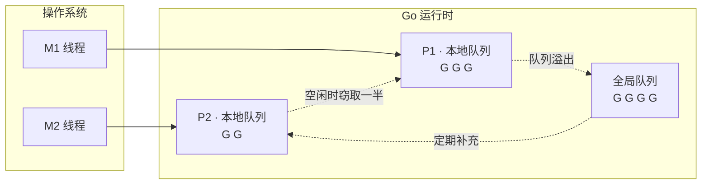
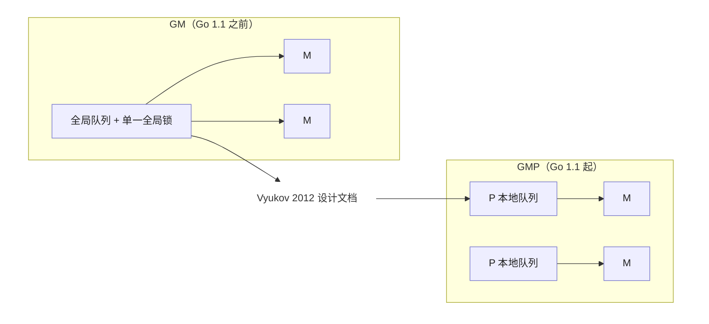

# 9 goroutine调度器

> 不要通过共享内存来通信，而是通过通信来共享内存
> Don't communicate by sharing memory, share memory by communicating

并发是Go最鲜明的标识，也是它最容易被误用的地方。这句广为流传的箴言点名了Go的取向：把同步的重担从程序员手中转移到由语言运行时的通道之上，让数据的所有权随之流动，而非散落在被锁守护的共享状态里面。
本部分自底向上展开这一图景：先剖析goroutine调度器如何在少量系统线程上复用海量协程，在深入通道与select的实现，看CSP模型如何落到具体的发送，接收与多路选择，最后回到sync包提供的传统同步原语
与常见的并发模式。唯有同时理解这两条路径，才能在真实工程里面判断如何该用通信，何时仍需共享。

Go语言调度器是笔者眼中整个运行时最迷人的组件了。对于Go自身而言，它的设计和实现直接牵动整个Go运行时的其他组件，是与用户态代码直接打交道的部分；对于Go用户而言，调度器将极其复杂的运行时机制藏在了
一个简单的关键字`go`之下。为了提高性能，调度器必须有效的利用计算的并行性与局部性原理；为了保障用户的简洁，调度器必须高效的对调度用户态不可见的网络轮循器，开机回收器进行调度；为了保证代码执行的正
确性，还必须严格的实现用户代码内存顺序等等。总而言之，调度器的设计直接决定了Go运行时源码的表现形式。

## 9.1 调度问题与GMP模型

写下`go func()`,一个goroutine就开始运行了。这行代码背后，是Go运行时最精巧的一台机器：调度器。它要回答一个并不简单的问题：成千上万个goroutine，如何在为数不多的几个CPU核心上轮转，即跑得快，
又让用户觉察不到它的存在。本节先把它要解决的问题，整体骨架，以及它在并发运行时这个大家庭里面的位置交代清楚，后面几节在深入每个部件。

### 9.1.1 三种线程模型，与一段历史

把并发任务映射到CPU执行资源上，历史上有三种模型，它们的取舍决定了一切。

- 1:1（内核线程）：每个用户线程对应一个操作系统线程。真并行，阻塞系统调用由内核透明处理，实现简单；代价是每次创建于切换都要陷入内核，每个线程都要预留以兆字节的栈。Linux的NPTL,现代Windows,
  Java的平台线程都走这条路。
- N:1(纯用户线程，即早期的绿色线程)：多个用户线程挤到一个操作系统线程上。切换极其廉价，栈极小；但是用不上多核，而且一次阻塞的系统调用会卡住全部线程，这是它的死穴。
- M:N(混合/两级):把M个用户线程多路复用到N个内核线程上。即廉价又能并行，代价是需要用户态与内核态两个调度器协作，这正是复杂的根源。

历史上这里有一个有意思的弯。1990年代，M:N一度被寄予厚望，最有影响的方案是Anderson等人的调度器激活（scheduler activations,SOSP 1991）：让内核在阻塞，就绪等时刻通知用户态调度器，使两个调度
器协同。但工业界最重大多退回到了1:1。Drepper与Molnar为Linux设计NPTL时（2005）把理由写的很直白：M:N需要两个调度器，若不协同则性能受损，而让它们可通所需引入内核基础设施的成本与维护代价都太
高，"不符合Linux内核理念"。于是Linux选了1:1。

Go偏偏又走回了M:N。它之所以能避开当年的坑，靠的是三件事，而这三件事都握在运行时自己手里：goroutine的栈很小且可增长（起步几KB），创建与切换都廉价；运行时掌握着所有会阻塞的点，能在阻塞前把执行
权让出：网络I/O由内置的网络轮询器接管，阻塞的goroutine会被挂起而不占用线程。当年杀死N:1的阻塞系统调用难题，Go是在运行时内部解决的，而不是去求内核提供激活机制。

### 9.1.2 GMP模型一览

下面这张可交互的示意图把GMP跑起来：每个P持有一条本地运行队列，M绑定P执行队首的G,当某个P的本地队列与全局队列都空时，它会从别的P偷走一半的工作。可以暂停，单步，或者手动`go func()`观察队列与窃取
的变化。

Go调度器围绕三个抽象展开，合成GMP.

- G（goroutine）：一段并发执行的用户代码，连同它的栈与执行现场。
- M (machine): 一个操作系统线程，真正在CPU上执行指令的实体。
- P (processor)：一个逻辑处理器，代表执行Go代码所需要的资源与许可。P的数量由GOMAXPROCS决定，默认等于可用的CPU核。

三者的关系一句话概括：M必须先拿到一个P,才能运行G。P的个数因此设定了同时执行Go代码的并行上限。每个P自带一条本地运行队列存放就绪的G,另有一个所有P共享的全局运行队列兜底。一次调度，简化来说就是一个
绑定了P的M。从队列里面取出一个G来运行，G让出或者被强占后再取一个；本地队列空了，就去别的地方找活儿，这边引出了工作窃取。

goroutine是有栈协程（stackful coroutine）：它有自己的栈，可以从任意嵌套的函数调用中挂起，也可以被抢占。这与下面要对比的无栈线路是一条根本的分界线。Go的栈早起用分段栈实现，自Go 1.3改为可增长的连续栈。

### 9.1.3 同一个问题的不同答案

“如何廉价地跑海量并发单元”是这一代运行时共同面对的问题，Go的GMP值时答案之一。横向看看别家的选择，更能看清GMP的定位。

- Erlang/EMAM:轻量进程各自独立堆，互不共享可变状态；调用器按规约计数（reduction,约等于调用次数）抢占，每个核一个调度器，各有运行队列，辅以进程迁移做负载均衡。它把隔离做到了极致。
- Java虚拟线程/Project Loom(JEP 444，Java 21,2023定稿)：虚拟线程时续体加调度器，挂载到平台"载体线程"上运行，阻塞时卸载，调度器时一个FIFO工作窃取的`ForkJoinPool`,并行度默认等于可用
  核心数。这本质就是M:N,正是当年Drepper为Linux否决，如今又在JVM里面返场的模型。
- `Rust async / .NET async`:走的是无栈（stackless）路线。 async fn被编译成状态机（Future），挂起状态存进一个枚举而非独立的栈，由运行时驱动。

这里点出来一条关键的设计轴：有栈 vs 无栈。Go的goroutine是有栈的，代价是每个都要一条（可增长的）栈，好处是能从任意深度挂起，并能被抢占。`Rust/.NET`的async是无栈的，省去了独立栈，挂起点
再编译期间固定，但是也因此只能协作式调度，一个不含`.await`的循环无法被运行时打断。Go选择有栈，换来的正是9.7那种连死循环都能抢占的能力。

### 9.1.4 P是怎么来的：从GM到GMP

P并非一开始就有。Go 1.1之前调度器只有G和M,所有就绪的G挂在一个全局队列上，由一把全局锁保护。2012年，Dmitry vyukov再`<<Scalable Go Scheduler Design Doc>>`中指出了这套GM调度器的四个
症结：

1. 单一全局锁于集中式状态，所有与goroutine相关的操作都要争这把锁；
2. M之间频繁交接G,破环局部性，增加切换开销；
3. 每个M都带着内存缓存（mcache）等资源，即便阻塞再系统调用，并不运行Go代码时也占着，既浪费内存又损坏局部性；
4. 系统调用导致线程频繁阻塞与唤醒。

